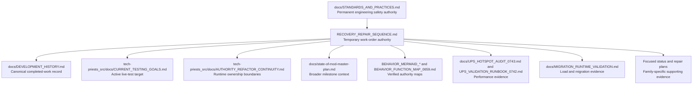

# Tech Priests Base-State Recovery and Unification Sequence

**Status:** Temporary top-level recovery authority  
**Authoritative branch:** `main`  
**Packaged baseline:** `0.1.672`  
**Active development lane:** `0.1.674-dev`  
**Established:** 2026-07-17  
**Engineering safety authority:** `docs/STANDARDS_AND_PRACTICES.md`  
**Canonical development history:** `docs/DEVELOPMENT_HISTORY.md`

## Purpose and Explicit Exception

This document is an explicit project-owner exception to the ordinary rule against creating standalone audit, repair-pass, or implementation-history documents.

The exception exists because the project must temporarily stop ordinary feature growth and recover a trustworthy base runtime before further expansion. The mod now contains broad and useful systems, but its execution graph includes overlapping legacy controllers, dispatcher wrappers, chronological hardeners, direct state writers, multiple priority systems, and major runtime families that have source implementation without recorded behavioral proof.

This document is therefore the **top-level work-order authority** for base-state recovery. It governs **what work happens next and in what order**. It does not weaken the safety requirements in `docs/STANDARDS_AND_PRACTICES.md`.

When this document and another milestone document prescribe different work order:

1. This recovery sequence governs development priority and sequence.
2. `docs/STANDARDS_AND_PRACTICES.md` continues to govern physical honesty, single-branch work, serializability, runtime ownership, validation, and release truthfulness.
3. `docs/DEVELOPMENT_HISTORY.md` remains the only canonical narrative record of completed work and evidence.
4. `tech-priests_src/docs/CURRENT_TESTING_GOALS.md` remains the active live-test checklist, but its targets must follow this sequence.

## Recovery Freeze

Until the recovery sequence is completed or explicitly amended by the project owner:

- Do not add unrelated gameplay features.
- Do not add a new scheduler, queue, reservation system, movement controller, cache authority, periodic controller, visual authority, diagnostic authority, or recovery loop unless it directly replaces or repairs an existing owner.
- Do not extend specialized entity coverage merely because a new family can be recognized.
- Do not create another outer hardener when the underlying authority can be corrected directly.
- Do not call a source-complete family runtime-verified.
- Do not call an experimental package a release candidate merely because it parses or publishes successfully.
- Do not advance the packaged baseline or declare the integration milestone complete while an earlier recovery stage remains open.

Permitted work is limited to:

- repairs required by this sequence;
- removal or demotion of conflicting legacy paths;
- source and runtime validation tooling needed to prove a stage;
- documentation and Mermaid updates that keep the authority graph truthful;
- narrowly necessary compatibility repairs exposed by testing.

## Recovery Objective

The recovery is complete only when Tech Priests has one understandable and evidenced runtime model:

```text
World event or budgeted service
        ↓
Shared work discovery
        ↓
Reservation and per-pair order
        ↓
Pure action-family selection
        ↓
One family executor
        ↓
One movement request for one physical leaf target
        ↓
Physical source removal / custody / destination revalidation
        ↓
One terminal cleanup and scheduler handoff
        ↓
Read-only status, visuals, audio, and diagnostics
```

The resulting runtime must demonstrate:

- truthful order acceptance and rejection;
- one owner for each action family;
- one current physical target and movement destination;
- atomic item accounting or explicit persistent custody;
- deterministic failure cleanup;
- owner-keyed event and service registration;
- bounded and measurable runtime cost;
- serializable save/load state;
- objective migration and behavioral evidence;
- one consistent artifact and release doctrine.

## Documentation Authority Graph



The master plan remains useful context, but this document temporarily supersedes its ordinary next-feature ordering. Focused maps and status ledgers remain supporting evidence; they do not replace this sequence or the canonical history.

## Evidence Vocabulary

Every recovery stage must distinguish these states exactly:

1. **Cataloged** — a defect, risk, or ownership ambiguity is documented.
2. **Source implemented** — code exists but has not necessarily parsed, loaded, or executed.
3. **Statically validated** — relevant Lua, JSON, Python, integration, governance, and focused checks passed at an exact commit.
4. **Runtime loaded** — Factorio loaded the exact source or package without API, event, installation, or serialization failure.
5. **Behaviorally validated** — defined scenarios passed with unedited logs and diagnostics.
6. **Packaged and load-tested** — the exact archive matching the verified commit passed final new-save and migration loads.
7. **Published** — an artifact was uploaded. Publication alone proves none of the earlier states.

Absence of evidence remains an open gate.

# Required Repair Sequence

## Stage 0 — Establish Repository and Architecture Truth

### Objective

Make every governing document, diagram, checker, artifact record, and current source head describe the same project state before behavioral repair proceeds.

### Required work

1. Reconcile the packaged baseline, development lane, experimental prereleases, committed ZIP files, release manifests, and publication receipts.
2. Explicitly classify every artifact as one of:
   - packaged baseline;
   - experimental package;
   - migration-test copy;
   - runtime-test candidate;
   - behavioral candidate;
   - release candidate;
   - verified release.
3. Regenerate the whole-source UPS audit against current `main` rather than relying on the earlier snapshot.
4. Generate a current installation inventory containing:
   - `control.lua` install order;
   - every `planning_constraints_0646` hardener;
   - broker service names, categories, intervals, budgets, and priorities;
   - event-registry routes and owner metadata;
   - direct `script.on_*` fallbacks;
   - global wrapper chains;
   - persistent storage roots;
   - runtime commands;
   - direct movement, task, mode, target, inventory, and entity-command writers.
5. Regenerate or amend the Mermaid architecture maps so they cover the 0680–0739 development families and the current Void movement work.
6. Record one successful full source-validation run and exact commit SHA.
7. Correct stale documentation paths and make this recovery sequence discoverable from top-level and packaged developer guidance.

### Documentation connections

- `README.md`
- `docs/STANDARDS_AND_PRACTICES.md`
- `docs/DEVELOPMENT_HISTORY.md`
- `docs/state-of-mod-master-plan.md`
- `tech-priests_src/docs/STANDARDS_AND_PRACTICES.md`
- `tech-priests_src/docs/CURRENT_TESTING_GOALS.md`
- `tech-priests_src/docs/AUTHORITY_REFACTOR_CONTINUITY.md`
- `docs/BEHAVIOR_MERMAID_MAP_0660.md`
- all `docs/BEHAVIOR_MERMAID_FUNCTION_DRILLDOWN_*` files
- `docs/UPS_HOTSPOT_AUDIT_0743.md`
- `.github/workflows/source-validation.yml`
- `tools/check_governance_prerequisites_0738.py`
- `tools/check_development_integration_0732.py`

### Exit gate

Stage 0 passes only when the current head, governing documents, generated authority inventory, Mermaid maps, validation workflow, and artifact classifications agree without contradiction.

---

## Stage 1 — Protect Physical State and Scheduler Truth

Stage 1 repairs defects capable of losing, duplicating, inventing, silently discarding, or permanently blocking work. These defects outrank performance and feature completeness.

### Stage 1A — Emergency production transaction integrity

#### Required repair

- Replace sequential unprotected ingredient consumption with a complete transaction plan.
- Prove all required ingredients exist before removing any of them.
- Record exact removed ingredients when custody or delayed completion exists.
- Roll back every removed ingredient when the craft cannot complete.
- Never collect assembling input as finished output.
- Track exact output remainder after partial insertion; never retry the original full amount.
- Route output through the canonical atomic storage authority.
- Remove non-recipe-backed synthetic production or explicitly isolate and prove any intentionally simulated emergency operation.
- Ensure replacement-executor failure does not suppress a safe fallback unless ownership was actually established.
- Complete matching orders through one queue lifecycle function with immediate promotion.

#### Primary code and documentation

- `tech-priests_src/scripts/core/emergency_production_executor_0514.lua`
- `tech-priests_src/scripts/core/storage_role_authority_0686.lua`
- `tech-priests_src/scripts/core/inventory_transfer_integrity_0687.lua`
- `docs/BEHAVIOR_MERMAID_FUNCTION_DRILLDOWN_0670_EMERGENCY_PRODUCTION.md`

#### Exit evidence

- atomic ingredient rollback scenarios;
- full and partial output destinations;
- facility input/output separation;
- target or facility destruction;
- save/load during ingredient and output custody;
- queue handoff proof;
- no item loss or duplication counters.

### Stage 1B — Order queue acceptance and lifecycle integrity

#### Required repair

- A full queue must return rejection, never `queued`.
- Preemption must obey the same capacity and conservation rules as ordinary pending insertion.
- Duplicate identity must include physical target or site where target distinction matters.
- Duplicate refresh must update permitted metadata deliberately rather than retain stale priority, target, callback, source, reason, and timeout.
- Invalid targets must terminate with the correct failed, cancelled, or obsolete result rather than false completion.
- Activation, callback, cancellation, completion, expiry, and failure must all use one terminal transition and immediate promotion path.
- Remove irregular double ticking between the independent queue service and dispatcher, or define one as a harmless idempotent feeder.
- Expose truthful accepted, rejected, duplicate-refreshed, preempted, promoted, failed, and dropped counters. The dropped count must remain zero.

#### Primary code and documentation

- `tech-priests_src/scripts/core/order_queue_0469.lua`
- `docs/BEHAVIOR_MERMAID_FUNCTION_DRILLDOWN_0669_ORDER_QUEUE.md`
- `docs/BEHAVIOR_MERMAID_FUNCTION_DRILLDOWN_0667_SINGLE_DISPATCHER.md`
- `docs/BEHAVIOR_MERMAID_FUNCTION_DRILLDOWN_0668_ACTION_STATE_ARBITER.md`

#### Exit evidence

- full queue;
- preemption at capacity;
- two targets requiring the same item;
- callback rejection;
- invalid target;
- cancellation and immediate promotion;
- save/load with current and pending orders;
- zero silently dropped orders.

### Stage 1C — Consecration lifecycle integrity

#### Required repair

- Verify movement acceptance through the canonical movement request and owner, not `pcall` success alone.
- Clear rite timers whenever target, item, or terminal failure changes.
- Release target claims during cooldown and every blocked terminal path.
- Treat refund failure as a conserved-custody emergency, not a best-effort ignored insert.
- Verify scheduler submission created current, pending, or active task state.
- Make blocked phases inactive unless genuine work is progressing.
- Complete orders through the canonical queue lifecycle.
- Compact repetitive history without hiding transitions.

#### Primary code and documentation

- `tech-priests_src/scripts/core/consecration_executor_0515.lua`
- `docs/BEHAVIOR_MERMAID_FUNCTION_DRILLDOWN_0671_CONSECRATION.md`

### Stage 1D — Direct acquisition terminal and deposit integrity

#### Required repair

- Remove unsafe raw deposit fallbacks that can touch arbitrary station work inventories.
- Replace silent `stone` metadata fallback with explicit invalid-task failure unless stone is physically and intentionally requested.
- Prove work clamps release on every terminal transition.
- Prove station-craft handoff is consumed or fails visibly.
- Verify target, request, lock, leaf truth, and executor target remain identical.

#### Primary code and documentation

- `tech-priests_src/scripts/core/direct_acquisition_executor_0513.lua`
- `tech-priests_src/scripts/core/direct_acquisition_physical_guard_0649.lua`
- `tech-priests_src/scripts/core/direct_acquisition_movement_lock_0650.lua`
- `tech-priests_src/scripts/core/movement_target_reconciler_0652.lua`
- `tech-priests_src/scripts/core/movement_intent_authority_0654.lua`
- `docs/BEHAVIOR_MERMAID_FUNCTION_DRILLDOWN_0662_DIRECT_MOVEMENT.md`
- `docs/BEHAVIOR_MERMAID_FUNCTION_DRILLDOWN_0663_DIRECT_EXECUTOR.md`

### Stage 1 exit gate

Stage 1 passes only when no cataloged path can silently lose, duplicate, synthesize, misdirect, or discard physical items or accepted orders, and all defined scenarios have runtime evidence.

---

## Stage 2 — Repair the Shared Runtime Spine

### Stage 2A — Owner-keyed event registry

#### Required repair

- Store registrations by stable owner and route identity.
- Support deterministic numeric priority and explicit first/last semantics.
- Remove one owner without clearing unrelated handlers.
- Compose Factorio filters safely. Either calculate a correct union and reinstall the dispatcher when routes change, or use one safe unfiltered dispatcher with internal owner predicates.
- Define whether one handler failure isolates that owner or aborts the full event. Critical lifecycle routes must fail visibly without silently preventing cleanup handlers.
- Detect duplicate owner registrations and configuration-change accumulation.
- Eliminate direct `script.on_*` fallback after the registry is available.

#### Primary code and documentation

- `tech-priests_src/scripts/core/runtime_event_registry.lua`
- `tech-priests_src/scripts/core/runtime_config_0626.lua`
- `tech-priests_src/scripts/core/event_driven_work_feeder_0608.lua`
- registry portions of the Mermaid maps and generated installation inventory.

### Stage 2B — Phased, fail-closed hardener installation

#### Required repair

Split installation into explicit phases:

1. early prerequisites and installer wrappers;
2. base authority installation;
3. post-install activation;
4. exact activation assertions;
5. feature-local degraded mode when a critical stage fails.

The outer loader must not ignore a critical installation failure. A failed family may be disabled safely while unrelated verified families continue, but gameplay must not proceed with half-installed ownership and no visible boundary.

#### Primary code and documentation

- `tech-priests_src/control.lua`
- `tech-priests_src/scripts/core/planning_constraints_0646.lua`
- `tech-priests_src/scripts/core/hardener_installation_audit_0723.lua`
- `tech-priests_src/scripts/core/development_lifecycle_checkpoint_0733.lua`
- `tools/check_development_integration_0732.py`

### Stage 2C — Strict broker result and fairness contract

#### Required repair

Every broker service must return structured truth equivalent to:

```lua
{
  processed = 0,
  acted = 0,
  blocked = 0,
  failed = 0,
  exhausted = false
}
```

- Numeric zero and `nil` must not count as action.
- Adaptive budgets must respond to real productive pressure, not repeated empty wakes.
- Every budgeted pair loop must use a persistent fairness cursor or deterministic bucket progression.
- Broker diagnostics must separate attempted, processed, acted, blocked, failed, and budget-exhausted work.

#### Primary code and documentation

- `tech-priests_src/scripts/core/runtime_tick_broker.lua`
- `tech-priests_src/scripts/core/pair_bucket_registry.lua`
- `docs/UPS_HOTSPOT_AUDIT_0743.md`
- `docs/UPS_VALIDATION_RUNBOOK_0742.md`

### Stage 2 exit gate

Stage 2 passes only when event, lifecycle, periodic-service, hardener, and broker ownership are exact, owner-keyed, idempotent, failure-visible, and proven through new-save plus configuration-change runtime evidence.

---

## Stage 3 — Consolidate Behavioral Authority

### Objective

Replace shared-field inference and wrapper races with one canonical per-pair action contract.

### Required work

1. Make action classification pure. Classification may read state but may not clear tasks, fail orders, request movement, or change visuals.
2. Move scheduler transitions into the order queue or a single transition authority.
3. Move status, visual, audio, and diagnostic behavior into read-only adapters.
4. Define explicit ownership for combat, construction, movement, logistics, idle/conversation, direct acquisition, production, repair, combat repair, and consecration.
5. Introduce or formalize a canonical action record containing at least:

```text
action_id
family
owner
phase
physical_target
movement_target
reservation
custody
priority
created_tick
updated_tick
terminal_state
```

6. Generate legacy `pair.mode`, `pair.target`, broad dispatcher text, and compatibility fields from the canonical record rather than allowing hundreds of modules to write them independently.
7. Demote or remove legacy physical controllers one family at a time after the canonical executor passes focused runtime tests.
8. Complete the current Void movement repair as part of movement-family consolidation, preserving authorization corridors while eliminating ground-leash interference and stale movement state.

### Primary code and documentation

- `tech-priests_src/scripts/core/action_state_arbiter_0488.lua`
- `tech-priests_src/scripts/core/single_dispatcher_0510.lua`
- `tech-priests_src/scripts/core/order_queue_0469.lua`
- `tech-priests_src/scripts/core/active_leaf_task_truth_0655.lua`
- `tech-priests_src/scripts/core/movement_controller.lua`
- `tech-priests_src/scripts/core/void_movement_authority_0630.lua`
- `tech-priests_src/scripts/generated/control_legacy_part_*.lua`
- `tech-priests_src/docs/AUTHORITY_REFACTOR_CONTINUITY.md`
- `docs/VOID_PRIEST_MOVEMENT_REPAIR_PLAN.md`
- dispatcher, arbiter, movement, construction, and executor Mermaid maps.

### Exit gate

Stage 3 passes only when every active pair has one current action owner, one physical leaf target, one matching movement destination, one executor, and one terminal transition, with legacy mirrors unable to seize authority between pulses.

---

## Stage 4 — Reduce Runtime Pressure and Diagnostic Self-Cost

### Required work

1. Rerun `tools/audit_ups_hotspots_0743.py` against the consolidated source.
2. Remove or demote redundant high-frequency legacy routes.
3. Replace broad scans with event-fed dirty indexes and shared work queues.
4. Keep full-surface scans as rare bounded recovery passes only.
5. Service active pair/category buckets rather than every pair.
6. Add fairness cursors to all budgeted loops.
7. Move expensive storage-serialization scans to configuration changes, explicit profiler mode, or a substantially lower cadence unless runtime evidence proves the current cadence harmless.
8. Prevent lifecycle rechecks from repeatedly executing full audits forever when a permanent failure is present; enter an explicit degraded diagnostic state instead.
9. Profile clean idle, active logistics, combat, construction, fluid planning, overlapping stations, and many-priest cases.
10. Record average, worst, call count, acted count, scan count, and pair count for every top route.

### Documentation connections

- `docs/UPS_HOTSPOT_AUDIT_0743.md`
- `docs/UPS_VALIDATION_RUNBOOK_0742.md`
- runtime broker and registry profiler diagnostics
- regenerated Mermaid scheduling maps
- `docs/DEVELOPMENT_HISTORY.md`

### Exit gate

Stage 4 passes only when the new audit shows a materially smaller authority and rewrite surface, clean idle cost is low, active work stays within defined budgets, and profiler evidence identifies no uncontrolled broad or duplicate route.

---

## Stage 5 — Execute Runtime, Migration, Save/Load, and Behavioral Evidence

### Required evidence order

1. Full source validation at one exact commit.
2. New-save Factorio load with at least one valid station/priest pair.
3. Upgrade from a disposable copy of a real `0.1.672` save.
4. Save and reload both scenarios.
5. Accepted migration evidence through `tools/check_migration_runtime_evidence_0737.py`.
6. Focused Stage 1 transaction and queue scenarios.
7. Shared-spine registration and configuration-change scenarios.
8. Per-family behavioral scenarios.
9. Overlap, interruption, contention, and storage-full scenarios.
10. Many-priest and UPS profiler scenarios.
11. Exact packaged archive new-save and migration load tests.

### Mandatory scenario families

- emergency production transaction rollback and partial output;
- full order queue, duplicate physical targets, preemption, cancellation, and promotion;
- consecration supply loss, target loss, refund, cooldown, and save/load;
- direct acquisition target identity, work clamp, deposit, craft handoff, and return;
- machine, item-family, energy, artillery, rocket-silo, roboport, and fluid-turret custody;
- fluid source, sink, contamination, port identity, route collision, and final connection;
- construction operational readiness rather than entity existence alone;
- repair and combat-repair regressions;
- Void movement short, long, obstructed, competing-owner, high-count, proxy-sync, save/load, and authorization-corridor cases;
- combat interruption during every custody-bearing task;
- overlapping stations, force and surface boundaries, and reservation contention;
- movement target, active leaf task, status text, visual line, and physical executor agreement.

### Documentation connections

- `tech-priests_src/docs/CURRENT_TESTING_GOALS.md`
- `docs/MIGRATION_RUNTIME_VALIDATION.md`
- family status ledgers and repair plans
- `docs/DEVELOPMENT_HISTORY.md`

### Exit gate

Stage 5 passes only when unedited logs, diagnostics, profiler output, and evidence records exist for the exact commit and no unresolved critical or high-severity defect remains hidden as a documentation note.

---

## Stage 6 — Establish One Artifact and Release Doctrine

### Artifact classes

| Class | Meaning | May publish? | May be called release candidate? |
|---|---|---:|---:|
| Packaged baseline | Last verified playable baseline | Yes | Historical only |
| Migration-test copy | Unpackaged version trigger for disposable migration testing | No | No |
| Experimental package | Parse/build artifact with incomplete runtime evidence | Yes, clearly labeled | No |
| Runtime-test candidate | Exact package intended for load, migration, and save/reload testing | Restricted | No |
| Behavioral candidate | Runtime-load-clean package undergoing full scenario matrix | Restricted | No |
| Release candidate | All earlier recovery and validation stages passed; final packaged tests pending or in progress | Yes | Yes |
| Verified release | Exact archive passed final packaged load, migration, and behavioral acceptance | Yes | Completed release |

### Required work

- Reconcile source metadata, package metadata, committed archives, manifests, workflows, release tags, and governing documents.
- Make governance checks inspect the recovery authority and current artifact truth.
- Prevent a publication workflow from silently bypassing required source checks for its declared artifact class.
- Ensure experimental publication remains honest without weakening the definition of release candidate.
- Record every artifact with exact source commit, SHA-256, runtime-validation state, behavioral-validation state, and supersession relationship.

### Exit gate

Stage 6 passes when one machine-enforced doctrine governs local packaging, CI artifacts, experimental publication, release candidates, and verified releases without contradictory documentation.

# Repair Ledger

| Order | Recovery slice | Primary risk removed | Required evidence before next slice |
|---:|---|---|---|
| 0 | Documentation, artifact, map, and installation truth | Work proceeding from stale architecture or contradictory milestone state | Reconciled docs, regenerated inventory/maps, successful source validation |
| 1A | Emergency production integrity | Item loss, duplication, synthetic output | Atomic transaction runtime scenarios |
| 1B | Order queue integrity | Silent order loss and stale scheduler state | Capacity, duplicate, preemption, lifecycle scenarios |
| 1C | Consecration integrity | Lost items, stuck claims, stale timers | Supply/refund/claim/save-load scenarios |
| 1D | Direct acquisition integrity | Wrong target, unsafe deposit, stranded handoff | Target/deposit/clamp/handoff scenarios |
| 2A | Event registry | Missing, duplicated, filtered-out, or globally cleared handlers | Owner/filter/order/config-change scenarios |
| 2B | Installer/hardener phases | Half-installed authorities continuing gameplay | Exact activation and degraded-mode evidence |
| 2C | Broker truth/fairness | False acted telemetry, starvation, runaway budgets | Structured-result and high-count scenarios |
| 3 | Canonical action authority | Competing dispatcher/legacy/wrapper state | One-owner/one-target overlap scenarios |
| 4 | UPS consolidation | Excessive periodic, scan, rewrite, and diagnostic cost | Fresh static audit plus clean-world profiler evidence |
| 5 | Runtime and behavioral evidence | Source confidence without Factorio proof | Accepted logs and complete scenario matrix |
| 6 | Release doctrine | Contradictory packages, tags, and governance | Machine-enforced artifact classification and final package tests |

# Required Documentation Update Contract for Every Repair Slice

Every completed repair slice must update all applicable records in the same development sequence:

1. **This document** — mark the slice source-implemented, statically validated, runtime-loaded, behaviorally validated, or complete without collapsing those states.
2. **`docs/DEVELOPMENT_HISTORY.md`** — append the canonical narrative, commit SHA, exact evidence state, and remaining gate.
3. **`tech-priests_src/docs/CURRENT_TESTING_GOALS.md`** — make the next unresolved runtime scenario the active target.
4. **Relevant Mermaid/function map** — update ownership, state writers, install order, failure paths, and debugging tree.
5. **Relevant focused status or repair plan** — update only when it remains the authoritative family-specific evidence ledger.
6. **Validation tooling** — add a focused check when the invariant can be objectively tested statically.
7. **Runtime evidence** — preserve unedited logs and generated evidence records for the exact tested commit.
8. **UPS audit/runbook** — update when the slice changes timing, scans, queues, wrappers, or diagnostics.

Do not create a new standalone implementation-history document for every slice. This recovery document is the single explicit exception and sequencing ledger; the development history remains the canonical narrative.

# Immediate Active Work

Gate 1 Source validation passed for exact SHA `fdf6039be809a80865e8ea96c551dc0d0797d181` in workflow run `29779229966` on 2026-07-20. This is static source evidence only.

The active work order is now:

1. Execute Gate 2 clean new-save and protected `0.1.672` upgrade loads, including configuration-change and save/reload evidence for one exact source SHA.
2. Repair every exact Factorio load, migration, serialization, duplication, custody, or terminal-state failure and rerun affected scenarios.
3. Continue into the behavioral, specialized-family, construction, standard-fluid, fluid-turret, movement, fairness, and profiler matrices.
4. Continue the movement and lifecycle authority audit when source work is the active lane, beginning with direct command and compatibility-state writers identified by the UPS and authority maps.
5. Preserve the 26-active / 35-retired graph unless a later deliberate consolidation reduces it again.

# Completion and Retirement

This document is temporary but authoritative while recovery is active.

It may be retired only after:

- Stages 0 through 6 pass;
- the final verified release state is recorded in `docs/DEVELOPMENT_HISTORY.md`;
- permanent lessons are folded into `docs/STANDARDS_AND_PRACTICES.md` and `tech-priests_src/docs/AUTHORITY_REFACTOR_CONTINUITY.md`;
- `tech-priests_src/docs/CURRENT_TESTING_GOALS.md` is moved to the next post-recovery milestone;
- the project owner explicitly authorizes return to ordinary feature development.

After retirement, this file remains as a stable recovery record and architectural reference, not as a competing development history.