# Tech-Priests Function-Level Mermaid Drilldown

Version: 0.1.661-map-pass-2  
Companion overview: `docs/BEHAVIOR_MERMAID_MAP_0660.md`  
Companion prose map: `docs/BEHAVIOR_FUNCTION_MAP_0659.md`

Purpose: begin mapping the actual functions inside the active behavior authorities, not just the broad behavior boxes. This is an iterative drill-down document. It should grow until every behavior module has a function map, side-effect map, entry condition, movement target writer, overhead writer, and exit condition.

This pass maps the currently most dangerous behavior stack:

1. `planning_constraints_0646.lua`
2. `active_leaf_task_truth_0655.lua`
3. `logistics_fetch_executor_0527.lua`
4. `construction_placement_authority_0656.lua`
5. `movement_vector_enforcer_0651.lua`

Later passes should add the older dispatcher, combat, station catalog, emergency production, consecration executor, movement controller, inventory steward, construction planner, direct acquisition executor, and remaining legacy modules.

---

## 1. Function Coverage Ledger

```mermaid
flowchart TD
    Root[Function Drilldown 0661]

    Root --> PC[planning_constraints_0646 mapped]
    Root --> ALTT[active_leaf_task_truth_0655 mapped]
    Root --> LF[logistics_fetch_executor_0527 mapped]
    Root --> CPA[construction_placement_authority_0656 mapped]
    Root --> MVE[movement_vector_enforcer_0651 mapped]

    Root -. pending .-> SD[single_dispatcher_0510]
    Root -. pending .-> MC[movement_controller]
    Root -. pending .-> CE[consecration_executor_0515]
    Root -. pending .-> EP[emergency_production_executor_0514]
    Root -. pending .-> DAE[direct_acquisition_executor_0513]
    Root -. pending .-> CP[construction_planner]
    Root -. pending .-> SP[construction_site_planner]
    Root -. pending .-> MIP[master_infrastructure_plan_0644]
    Root -. pending .-> GP[construction_bootstrap_ghost_planner_0645]
    Root -. pending .-> VILA[visual_intent_line_authority_0657]
    Root -. pending .-> LMSB[logistics_mineable_source_bridge_0657]
    Root -. pending .-> PAH[proxy_ammo_hardener_0649]
    Root -. pending .-> IS[Inventory steward family]
    Root -. pending .-> SC[station_catalog]
    Root -. pending .-> Combat[combat / defense modules]
```

Map status rule: a module is only marked mapped when the file has a function inventory and a Mermaid graph showing how `install`, `service_all`, `service_pair`, side-effect writers, and exit paths relate.

---

## 2. `planning_constraints_0646.lua` Function Map

### Function inventory

| Function | Type | Role | Major side effects |
|---|---:|---|---|
| `valid(e)` | local helper | Factorio entity validity check | none |
| `dist_sq(a,b)` | local helper | Squared position distance | none |
| `pair_map()` | local helper | Reads pair table | reads `storage.tech_priests.pairs_by_station` |
| `radius_for(pair)` | local helper | Computes station radius using global helpers or pair fields | calls `_G.refresh_pair_radius`, `_G.get_station_operating_radius` if present |
| `recipe_produces(recipe,item_name)` | local helper | Checks enabled recipe products/main product | reads prototypes/recipe data |
| `M.item_for_entity(entity_name)` | public helper | Maps placeable entity prototype to item | caches in `item_by_entity` |
| `M.item_unlocked(force,item_name)` | public helper | Determines whether item is produced by enabled force recipe | caches per tick in `unlock_cache` |
| `M.entity_unlocked(pair,entity_name)` | public helper | Converts entity to item then checks item unlock | calls `M.item_for_entity`, `M.item_unlocked` |
| `M.interior_position_allowed(pair,position,margin)` | public helper | Validates interior construction area | none |
| `M.defense_position_allowed(pair,position,tolerance)` | public helper | Validates defense perimeter band and station overlap | reads all station pairs |
| `install_hardener(module_name,label)` | local installer | Requires and installs late authority modules | calls module `install()` |
| `M.install()` | public installer | Exposes constraints and installs active authority stack | writes `_G.TechPriestsPlanningConstraints0646` |

### Install graph

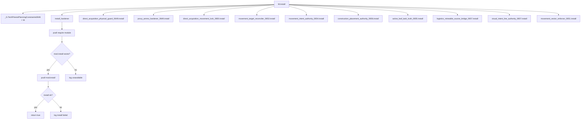

### Constraint helper graph

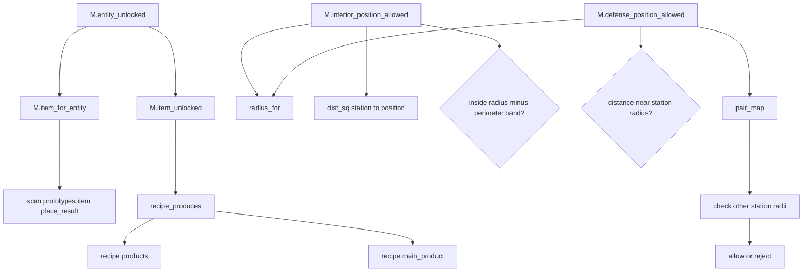

---

## 3. `active_leaf_task_truth_0655.lua` Function Map

### Function inventory

| Function | Type | Role | Major side effects |
|---|---:|---|---|
| `now`, `valid`, `safe`, `lower`, `dist_sq`, `same_pos`, `clean_item`, `entity_label` | local helpers | Time, validity, formatting, distance, labels | none |
| `pair_map`, `valid_pair`, `station_unit`, `priest_unit`, `pair_key` | local helpers | Pair access and keying | reads storage/entity IDs |
| `root()` | local storage root | Ensures module storage | writes `storage.tech_priests.active_leaf_task_truth_0655` |
| `stat(name,n)` | local metric | Increments stats | writes module stats |
| `record(action,pair,detail,force)` | local metric/log | Stores recent events and logs throttled events | writes recent/last_log |
| `movement_root()` | local movement root | Ensures movement controller request table | writes `storage.tech_priests.movement_controller_0419` |
| `item_from(v)` | local extractor | Pulls item names from task-like tables | none |
| `current_order(pair)` | local extractor | Reads active parent order | reads `pair.order_queue_0469`, `pair.active_order_0469` |
| `order_item(pair)` | local extractor | Item from parent order | none |
| `target_entity(cur)` | local extractor | Entity from task/entity-like value | none |
| `target_position(cur)` | local extractor | Position from target entity/table | none |
| `truth_from_entity(pair,family,phase,entity,item,label,opts)` | local builder | Builds canonical leaf truth record | none |
| `current_direct_task(pair)` | local extractor | Gets active direct acquisition task | may call `TechPriestsDirectAcquisitionExecutor0513.current_direct_task` |
| `direct_truth(pair)` | local truth source | Builds acquisition leaf truth | reads `direct_acquisition_target_lock_0650`, direct task fields |
| `consecration_truth(pair)` | local truth source | Builds consecration leaf truth | reads `pair.consecration_0515`, `pair.target` |
| `logistics_truth(pair)` | local truth source | Builds logistics fetch leaf truth | reads `pair.logistics_fetch_0527/0526` |
| `emergency_truth(pair)` | local truth source | Builds emergency leaf truth | reads `pair.emergency_craft` |
| `M.truth(pair)` | public selector | Selects first concrete truth | priority: direct, consecration, logistics, emergency |
| `request_matches(req,truth)` | local test | Checks request already targets truth | none |
| `publish(pair,truth,changed)` | local writer | Publishes leaf status/target | writes `active_leaf_task_0655`, `actual_task_status_0655`, `current_work_target_0655`, `pair.target` |
| `install_request(pair,truth,reason)` | local writer | Installs movement request for leaf truth | writes pair and movement controller request tables |
| `issue_command(pair,req,reason)` | local movement | Sends Factorio go-to command | calls `commandable.set_command` or `set_command` |
| `M.service_pair(pair,reason)` | public service | Applies truth to one pair | calls `M.truth`, `install_request`, `issue_command` |
| `destination_points_to_truth(destination,truth)` | local test | Determines whether movement request already targets leaf truth | none |
| `exempt(reason,opts)` | local test | Exempts combat/death/respawn/void/return movements | none |
| `wrap_request()` | local wrapper | Wraps `_G.tech_priests_request_movement_0418` | rewrites global movement request function |
| `wrap_route()` | local wrapper | Wraps movement controller route command | rewrites `TECH_PRIESTS_MOVEMENT_CONTROLLER_0418.route_command` |
| `M.leaf_status(pair)` | public display | Converts leaf task to overhead text/color | none |
| `patch_overhead()` | local wrapper | Patches overhead canonical status | rewrites `TECH_PRIESTS_OVERHEAD_STATUS_GOVERNOR_0471.canonical_status` |
| `M.service_all(reason)` | public service loop | Services all pairs | calls wrappers, overhead patch, `M.service_pair` |
| `M.install()` | public installer | Registers service with broker/nth tick | writes `_G.TechPriestsActiveLeafTaskTruth0655` |

### Truth selection graph

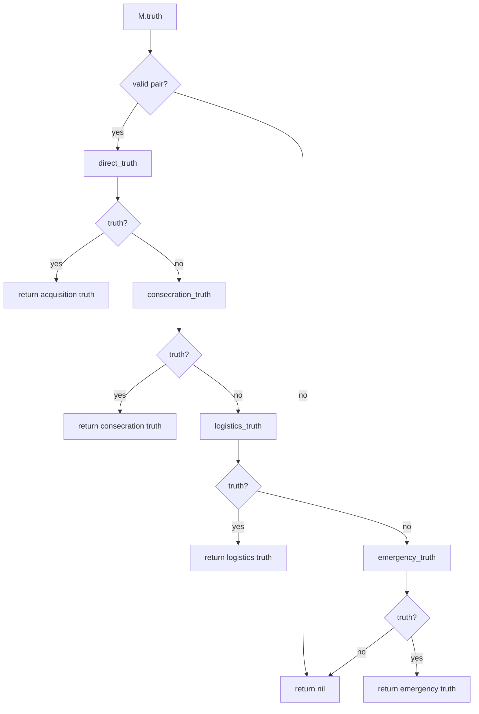

### Direct acquisition leaf graph

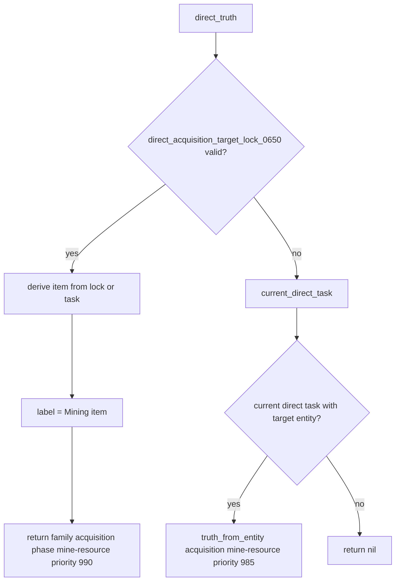

### Consecration leaf graph

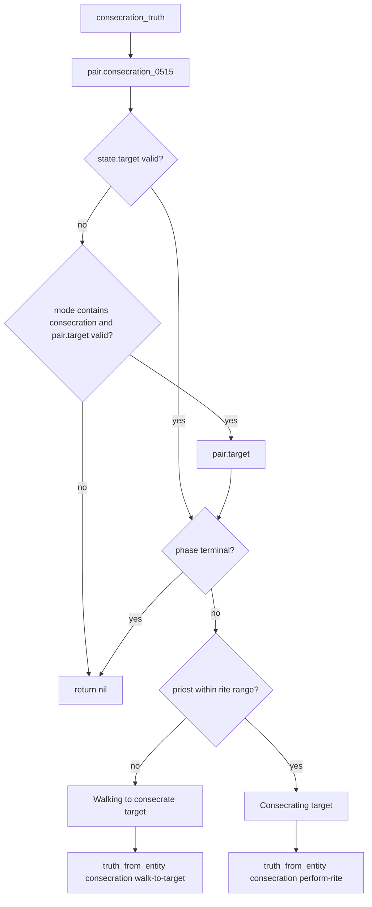

### Service and wrapper graph

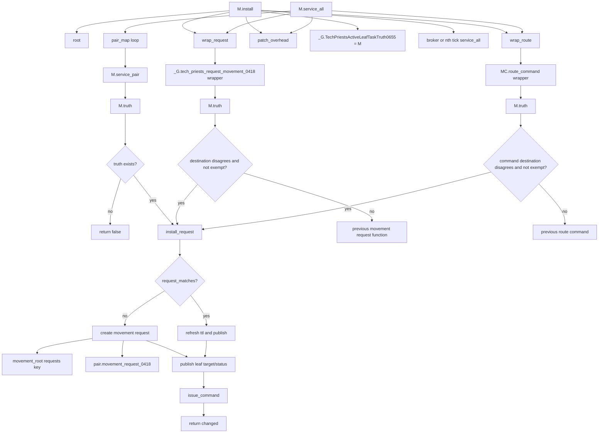

Side-effect warning: this module intentionally writes the current leaf truth into both visual status state and movement state. If it is wrong, everything downstream will confidently enforce the wrong target.

---

## 4. `logistics_fetch_executor_0527.lua` Function Map

### Function inventory

| Function | Type | Role | Major side effects |
|---|---:|---|---|
| `routed_find(surface,filters,category,negative_key,ttl)` | local scanner | Uses scan routing or raw surface search | may call `TechPriestsScanRouting0610.find_entities` |
| `M.root()` | public storage root | Ensures logistics root | writes `storage.tech_priests.logistics_fetch_executor_0527` |
| `stat`, `record` | local metrics | Tracks events | writes stats/recent and pair `logistics_fetch_*_last` |
| `normalize_item(v)` | local extractor | Normalizes task item references and aliases | none |
| `requested_count_from_order(o,item)` | local extractor | Reads target/missing count fields | none |
| `parse_blocker_need(pair,item)` | local parser | Parses blocker/status strings for `item (have/need)` | none |
| `active_request(pair)` | local selector | Finds current needed item | reads order queue, supply fields, scavenge fields, emergency fields, mode |
| `active_requested_item(pair)` | local helper | Returns item from active request | none |
| `station_count(pair,item)` | local count | Counts item in station | uses `_G.tech_priests_0358_station_item_count` or station chest |
| `source_inventory(source,inv_id)` | local inventory resolver | Gets specific or first valid inventory | reads many inventory IDs |
| `inventory_count(inv,item)` | local count | Counts item in source inventory | none |
| `deposit_to_station(pair,item,count)` | local deposit | Deposits into station | uses safe deposit helpers or station chest insert |
| `catalog_storage_source(pair,item)` | local source resolver | Finds known station catalog source | calls `station_catalog` / `_G.tech_priests_0327_*` |
| `loose_ground_source(pair,item)` | local source resolver | Finds loose item stack in range | uses `routed_find` |
| `nearby_storage_source(pair,item)` | local source resolver | Scans nearby inventories on many entity types | uses `routed_find`, `source_inventory`, `inventory_count` |
| `known_fetch_source(pair,item)` | local source resolver | Source priority chain | catalog, nearby storage, loose ground |
| `movement_root()` | local movement root | Ensures request storage | writes movement controller root |
| `publish_leaf(pair,src,item,phase)` | local leaf writer | Publishes logistics leaf task and target | writes `active_leaf_task_0655`, `actual_task_status_0655`, `current_work_target_0655`, `pair.target` |
| `request_move(pair,src,item)` | local movement writer | Requests movement to source | writes movement request, fetch state, leaf task, pair mode |
| `M.service_pair(pair,reason)` | public service | Performs fetch state machine for one pair | moves, removes items, deposits, clears stale state |
| `patch_dispatcher()` | local wrapper | Wraps `single_dispatcher_0510.service_pair` | makes fetch preempt dispatcher |
| `M.describe_pair(pair)` | public diagnostic | Builds pair fetch summary | none |
| `wrap_diagnostics()` | local wrapper | Appends fetch state to diagnostics dump | patches diagnostic function |
| `M.install()` | public installer | Installs wrappers and exposes module | writes `_G.TECH_PRIESTS_LOGISTICS_FETCH_EXECUTOR_0527` |

### Active request extraction graph

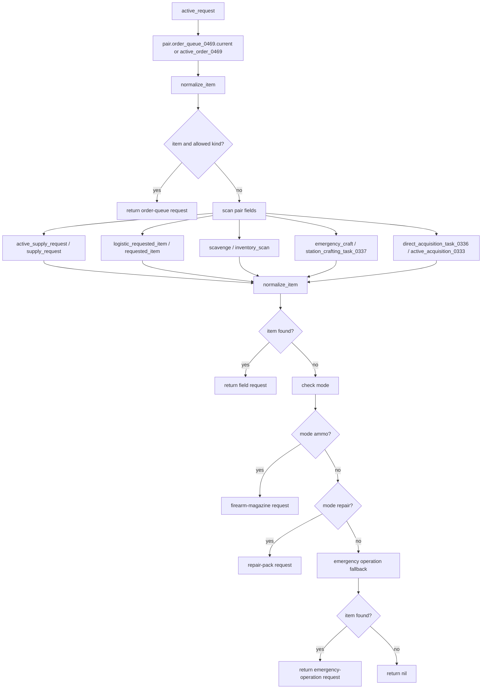

### Source selection graph

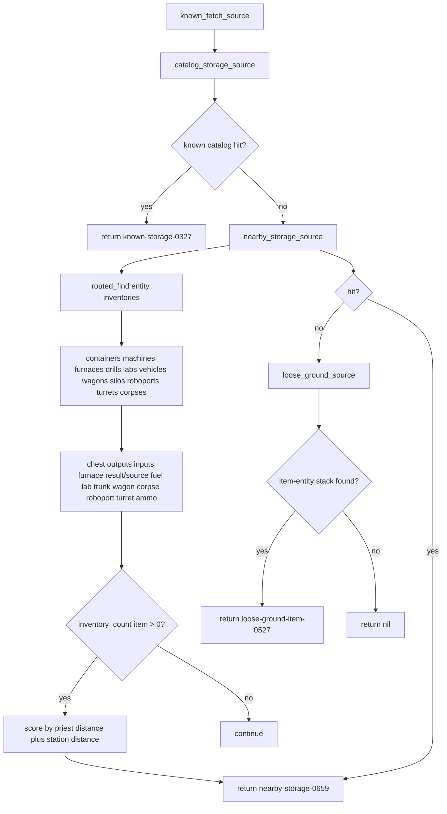

### Fetch service graph

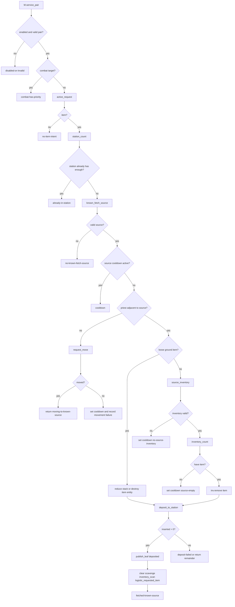

### Dispatcher wrapper graph

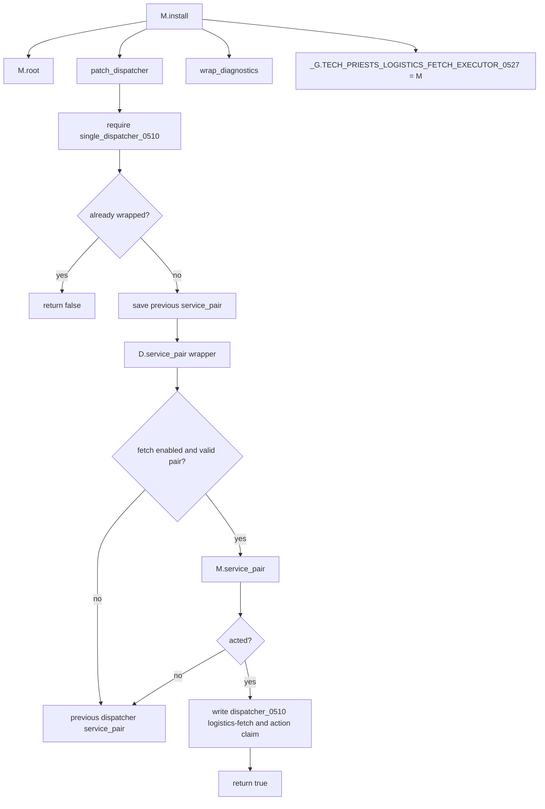

---

## 5. `construction_placement_authority_0656.lua` Function Map

### Function inventory

| Function | Type | Role | Major side effects |
|---|---:|---|---|
| `root`, `stat`, `record` | local storage/metrics | Module storage and events | writes module root/recent/logs |
| `construction_planner()` | local loader | Requires canonical construction planner | caches `Build` |
| `safe_inventory(entity,id)` | local helper | Gets inventory safely | none |
| `station_sources(pair)` | local inventory source builder | Enumerates station-bound inventories | calls `_G.tech_priests_0358_station_sources_for_pair`, inventory steward helpers |
| `inv_count`, `station_count` | local counters | Count items in station-bound inventories | none |
| `iter_contents(inv)` | local iterator | Lists inventory contents | none |
| `place_result_name(item_name)` | local prototype mapper | Maps item to placeable entity | reads prototypes |
| `any_placeable_stock(pair)` | local selector | Chooses best available placeable item | scans station inventories and emergency priorities |
| `planned_item_ready(pair)` | local selector | Chooses construction item from active task, ghost, master plan, or stock | reads `construction_task_0338`, `construction_bootstrap_ghost_0645`, `master_infrastructure_plan_0644` |
| `clear_competing_work(pair,item,entity,reason)` | local preemptor | Clears acquisition/scavenge/direct locks when build is ready | writes multiple pair task fields |
| `movement_root()` | local movement root | Ensures movement request storage | writes movement controller root |
| `publish_leaf(pair,task,destination,label,phase)` | local leaf writer | Publishes construction leaf task | writes `active_leaf_task_0655`, `actual_task_status_0655` |
| `install_request(pair,task,destination,label,phase)` | local movement writer | Makes construction movement authoritative | writes movement request and pair movement owner fields |
| `issue_command(pair,req)` | local movement | Sends go-to command | calls `commandable.set_command` or `set_command` |
| `construction_destination(pair,task)` | local state selector | Chooses station sync, build site, or placing phase | none |
| `M.service_pair(pair,reason)` | public service | Drives construction placement for one pair | calls construction planner, publishes movement/leaf, records placed state |
| `M.service_all(reason)` | public loop | Services all pairs | none beyond service_pair |
| `M.install()` | public installer | Registers broker/nth tick | writes `_G.TechPriestsConstructionPlacementAuthority0656` |

### Construction readiness graph

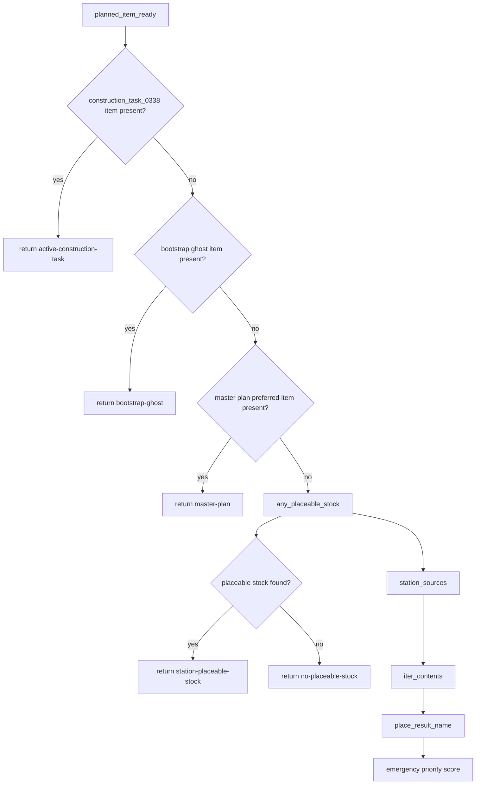

### Construction service graph

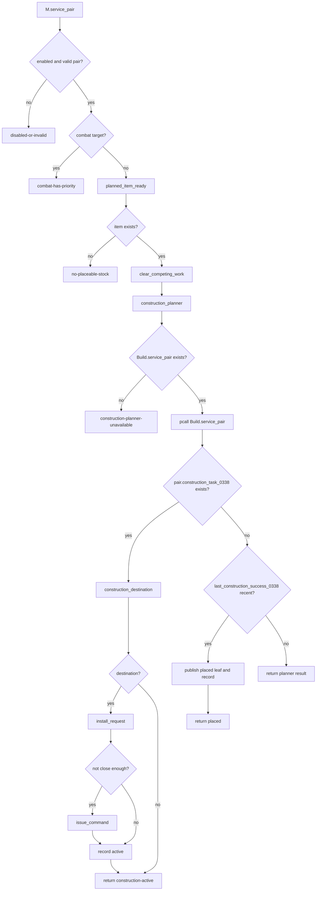

### Construction side-effect graph

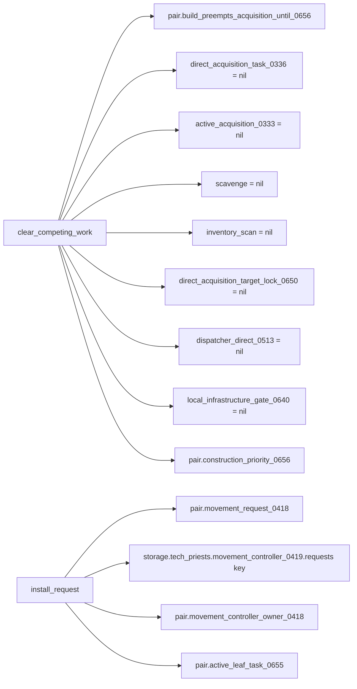

---

## 6. `movement_vector_enforcer_0651.lua` Function Map

### Function inventory

| Function | Type | Role | Major side effects |
|---|---:|---|---|
| `root`, `stat`, `record` | local storage/metrics | Store samples/recent events | writes module storage |
| `active_request(pair)` | local selector | Reads current valid movement request | reads pair request first, controller request second |
| `dot_progress(prev,cur,req)` | local math | Measures whether movement vector points toward target | none |
| `issue_go_to(pair,req)` | local movement | Reissues go-to command | calls Factorio command, updates movement state |
| `M.service_pair(pair,reason)` | public service | Samples one pair and corrects wrong-vector movement | writes samples and may reissue movement |
| `M.service_all(reason)` | public loop | Services all pairs | none beyond service_pair |
| `M.install()` | public installer | Registers broker/nth tick | writes `_G.TechPriestsMovementVectorEnforcer0651` |

### Vector service graph

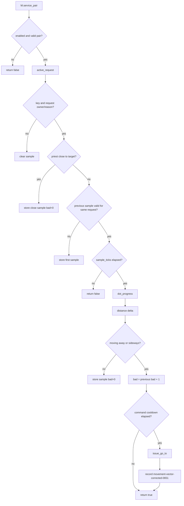

### Enforcement boundary

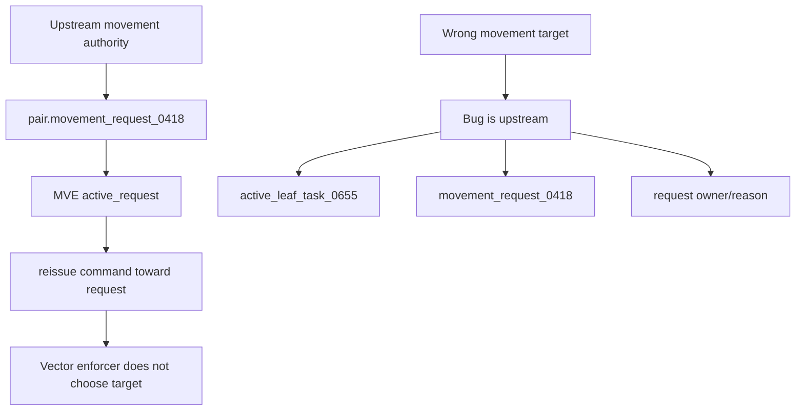

If vector enforcement sends the priest to the wrong place, do not patch this module first. Find who wrote the wrong request.

---

## 7. Cross-Module Hot Path: Inventory Fetch to Movement to Display

This is one of the current major behavior paths after 0.1.659.

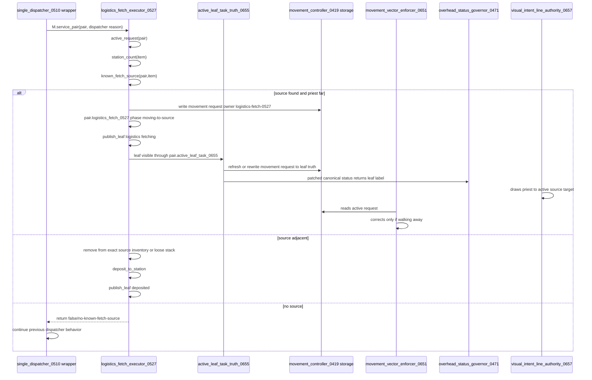

---

## 8. Cross-Module Hot Path: Construction Item to Physical Entity

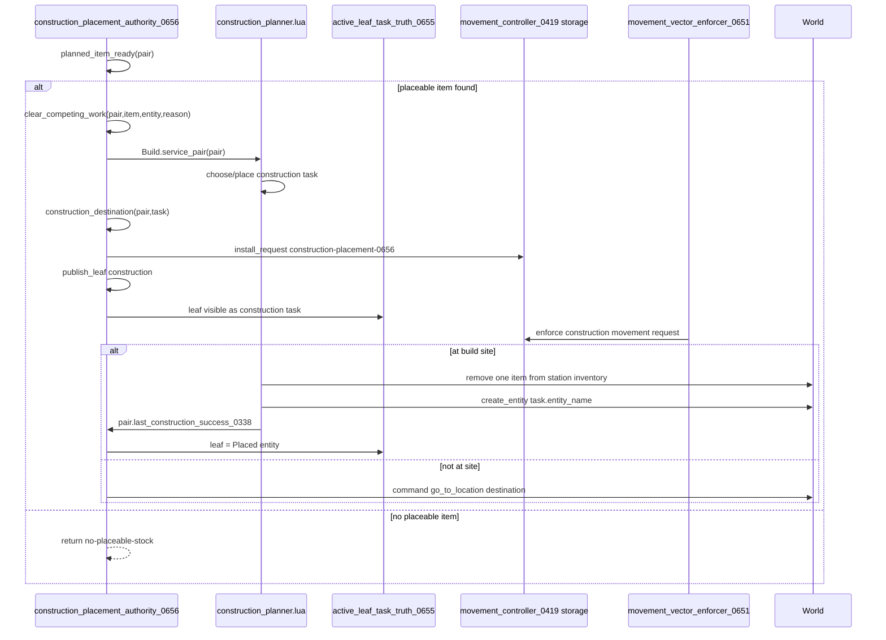

---

## 9. Function-to-State Write Matrix

| State field | Writers in this pass | Meaning | Audit risk |
|---|---|---|---|
| `pair.active_leaf_task_0655` | `active_leaf_task_truth_0655.publish`, `logistics_fetch_executor_0527.publish_leaf`, `construction_placement_authority_0656.publish_leaf` | Concrete displayed/acted leaf task | High: stale leaf text causes wrong visible behavior |
| `pair.actual_task_status_0655` | same as above | Overhead status source | Medium: display only, but player-facing |
| `pair.current_work_target_0655` | leaf truth/logistics writers | Entity target for current work | High: visual/movement target source |
| `pair.target` | leaf truth/logistics writers, construction clear/placement paths | Generic target pointer | Very high: legacy modules may also write this |
| `pair.movement_request_0418` | active leaf truth, logistics fetch, construction placement, movement authorities | Actual movement request | Critical: vector enforcer obeys this |
| `storage.tech_priests.movement_controller_0419.requests[key]` | active leaf truth, logistics fetch, construction placement | Movement request backing table | Critical: stale request causes wrong motion |
| `pair.logistics_fetch_0527` | logistics fetch executor | Fetch phase/source/item record | High: active leaf logistics truth reads this |
| `pair.construction_task_0338` | construction planner, read by construction authority | Current construction task | High: placement sequence depends on it |
| `pair.direct_acquisition_target_lock_0650` | direct acquisition movement lock, cleared by construction authority | Locked physical resource target | High: active leaf direct truth reads this |
| `pair.dispatcher_0510` | logistics fetch wrapper and dispatcher | Broad action trace | Medium: diagnostic/arbiter state |

---

## 10. Next Required Drilldown Passes

The following modules still need exact function-level Mermaid maps:

1. `single_dispatcher_0510.lua` exact branch order and wrappers.
2. `movement_controller.lua` request creation, clamps, command issue, and expiry.
3. `direct_acquisition_executor_0513.lua` actual mining/action loop.
4. `direct_acquisition_physical_guard_0649.lua` physical-target adoption and stale-target clearing.
5. `direct_acquisition_movement_lock_0650.lua` target lock and forced command fallback.
6. `movement_target_reconciler_0652.lua` stale request replacement.
7. `movement_intent_authority_0654.lua` direct target intent authority.
8. `construction_planner.lua` site selection, item removal, entity creation.
9. `construction_site_planner.lua` geometry and station radius constraints.
10. `master_infrastructure_plan_0644.lua` infrastructure sequence logic.
11. `construction_bootstrap_ghost_planner_0645.lua` one-ghost-at-a-time logic.
12. `logistics_mineable_source_bridge_0657.lua` inventoryless wreck fallback.
13. `visual_intent_line_authority_0657.lua` selected line override.
14. `proxy_ammo_hardener_0649.lua` station ammo to hidden proxy gun flow.
15. `consecration_executor_0515.lua` target selection, movement, rite execution.
16. `emergency_production_executor_0514.lua` recipe decomposition and ingredient leaf tasks.
17. Station catalog and inventory steward modules.
18. Combat/defense modules.
19. Remaining legacy diagnostics and slash command surfaces.

A module should not be considered behavior-safe until its graph identifies: entry condition, active owner, state writes, movement writes, overhead writes, exit success, exit failure, and higher-priority interruptions.
