# Tech-Priests Function-Level Mermaid Drilldown: Direct Acquisition Movement Stack

Version: 0.1.662-map-pass-3  
Previous drilldown: `docs/BEHAVIOR_MERMAID_FUNCTION_DRILLDOWN_0661.md`  
Companion overview: `docs/BEHAVIOR_MERMAID_MAP_0660.md`

Purpose: map the direct-acquisition movement repair stack function-by-function. This is the stack that tries to prevent the priest from saying it is acquiring a resource while walking to a station, stale arbiter point, or unrelated target.

Mapped in this pass:

1. `direct_acquisition_physical_guard_0649.lua`
2. `direct_acquisition_movement_lock_0650.lua`
3. `movement_target_reconciler_0652.lua`
4. `movement_intent_authority_0654.lua`

These modules sit between the direct acquisition executor and the movement/vector system.

---

## 1. Direct Acquisition Movement Stack Overview

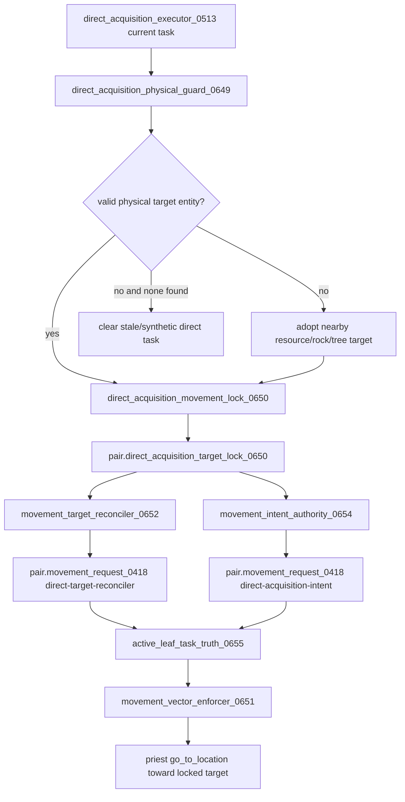

The stack has intentionally redundant layers because older systems were writing stale station/action-arbiter movement requests after the direct task had already picked a target. The correct cleanup later is not to remove layers blindly; it is to prove which layer still has unique work, then consolidate.

---

## 2. `direct_acquisition_physical_guard_0649.lua`

### Function inventory

| Function | Type | Role | Major side effects |
|---|---:|---|---|
| `root()` | local storage root | Ensures module storage | writes `storage.tech_priests.direct_acquisition_physical_guard_0649` |
| `stat(name,n)` | local metric | Increments stats | writes module stats |
| `record(action,pair,detail)` | local metric | Stores recent guard events | writes module recent |
| `item_exists(name)` | local prototype helper | Checks item prototype existence | reads `prototypes.item` |
| `current_direct_task(pair)` | local selector | Finds current direct task | calls `TechPriestsDirectAcquisitionExecutor0513.current_direct_task` or scans `emergency_craft`, `direct_acquisition_task_0336`, `active_acquisition_0333` |
| `output_item(task,cur)` | local extractor | Finds item/resource output for direct task | none |
| `target_entity(cur)` | local extractor | Gets entity/target/source from task | none |
| `target_position(cur)` | local extractor | Gets target position from entity or task position | none |
| `entity_matches_item(entity,item)` | local predicate | Determines whether target entity can produce the requested item | checks resource/tree/rock/name heuristics |
| `find_physical_target(pair,pos,item)` | local scanner | Searches near intended position for matching physical entity | calls `surface.find_entities_filtered` |
| `M.guard_pair(pair,reason)` | public guard | Enforces real target requirement | adopts entity or clears stale task |
| `wrap_direct_executor()` | local wrapper | Wraps direct executor service | blocks executor when no physical target exists and guard fails |
| `M.service_pair(pair,reason)` | public service | Calls guard | same side effects as guard |
| `M.service_all(reason)` | public loop | Services all pairs | none beyond guard |
| `M.install()` | public installer | Installs wrapper and tick service | writes `_G.TechPriestsDirectAcquisitionPhysicalGuard0649` |

### Physical target adoption graph

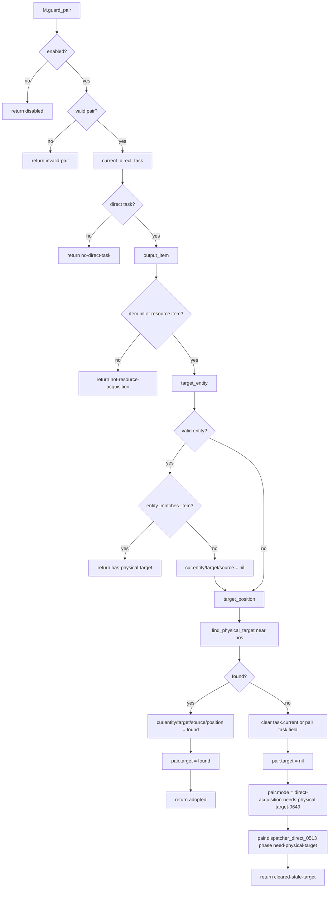

### Direct executor wrapper graph

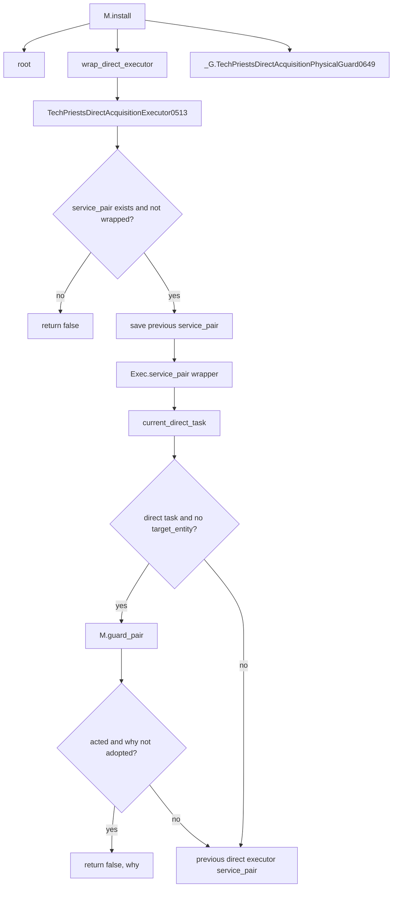

### Side-effect map

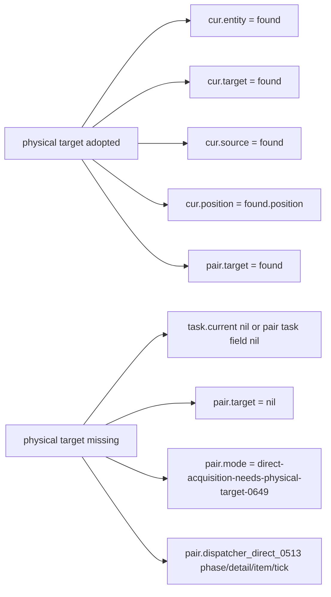

Risk: this module writes `pair.target` directly. It should usually be followed by 0650/0652/0654/0655 so movement and display agree with that target.

---

## 3. `direct_acquisition_movement_lock_0650.lua`

### Function inventory

| Function | Type | Role | Major side effects |
|---|---:|---|---|
| `root`, `stat`, `record` | local storage/metrics | Storage and event history | writes module storage |
| `get_exec()` | local loader | Gets direct acquisition executor | may require `direct_acquisition_executor_0513` |
| `current_direct_task(pair)` | local selector | Finds active direct task | calls executor or scans pair fields |
| `target_entity(cur)` | local extractor | Reads task entity/target/source | none |
| `target_position(cur)` | local extractor | Reads task position | none |
| `output_item(task,cur)` | local extractor | Gets requested/output item | none |
| `target_label(e,pos)` | local formatter | Label for logging | none |
| `lock_current_target(pair,task,cur,reason)` | local writer | Creates/refreshes target lock | writes `pair.direct_acquisition_target_lock_0650` |
| `clear_lock(pair,reason)` | local writer | Clears target lock | writes `pair.direct_acquisition_target_lock_0650 = nil` |
| `restore_locked_target(pair,task,cur,reason)` | local writer | Restores task entity fields to locked entity | writes task target fields, `pair.target`, `pair.mode`, dispatcher phase |
| `force_direct_command(pair,pos,reason)` | local movement fallback | Forces Factorio go-to command | writes pair movement state and `direct_acquisition_force_move_0650` |
| `wrap_movement_request()` | local wrapper | Adds forced fallback when movement request fails | wraps `_G.tech_priests_request_movement_0418` |
| `wrap_executor()` | local wrapper | Wraps direct executor service to restore/lock target | wraps executor `service_pair` |
| `M.service_pair(pair,reason)` | public service | Maintains lock and forced movement | restores target and commands if stale/far |
| `M.service_all(reason)` | public loop | Runs wrappers and services pairs | none beyond service |
| `M.install()` | public installer | Installs wrappers/tick service | writes `_G.TechPriestsDirectAcquisitionMovementLock0650` |

### Lock lifecycle graph

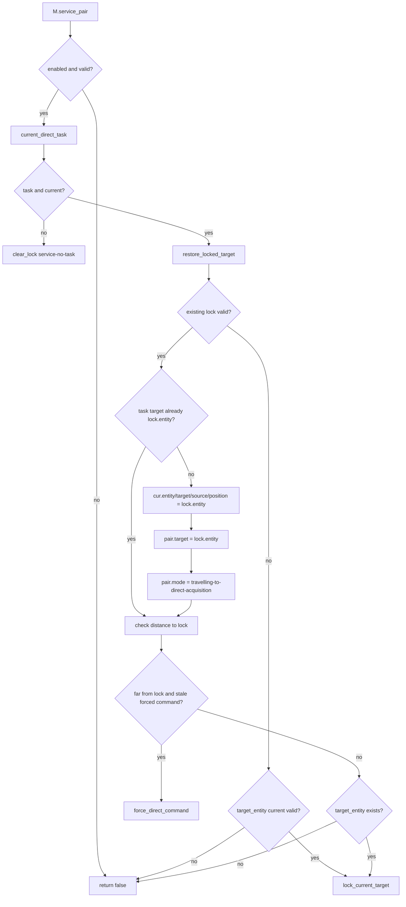

### Executor wrapper graph

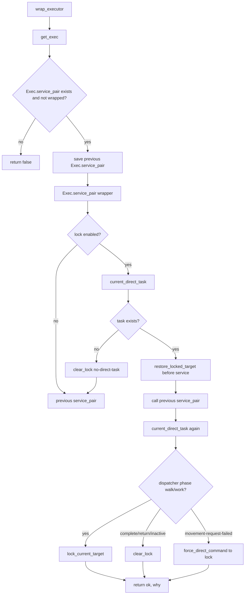

### Movement request fallback graph

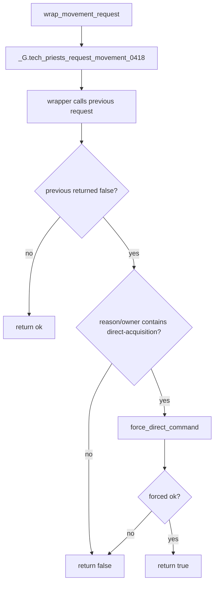

### Side-effect map

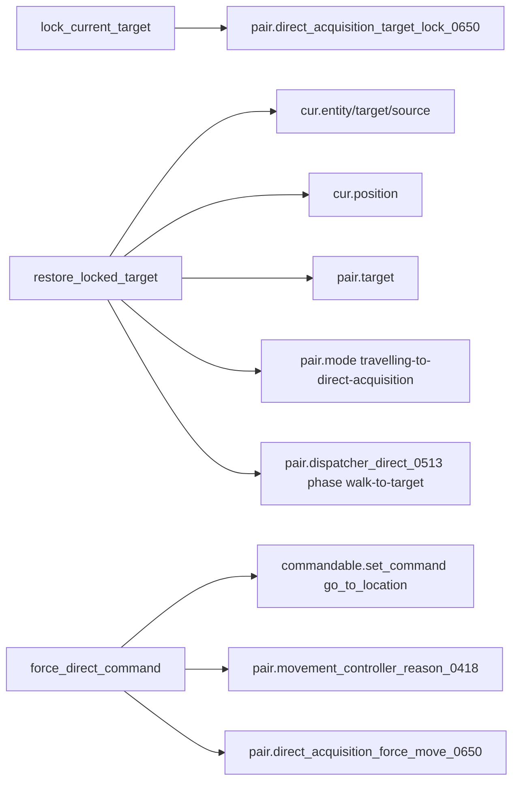

---

## 4. `movement_target_reconciler_0652.lua`

### Function inventory

| Function | Type | Role | Major side effects |
|---|---:|---|---|
| `root`, `stat`, `record` | local storage/metrics | Storage and logs | writes module root/recent |
| `movement_root()` | local movement root | Ensures movement request storage | writes `storage.tech_priests.movement_controller_0419` |
| `lock_active(pair)` | local selector | Determines whether direct target lock should still control movement | reads lock, dispatcher phase, pair mode, lock age |
| `request_owner(req)` | local helper | Gets lower-case request owner/reason | none |
| `request_is_direct(req)` | local predicate | Determines whether request already direct/reconciler owned | none |
| `request_points_to_lock(req,lock)` | local predicate | Checks request coordinates against lock position | none |
| `make_lock_request(pair,lock,reason)` | local writer | Creates direct-target movement request | writes pair request and movement controller request table |
| `force_go_to(pair,req,reason)` | local movement | Commands priest to request target | writes movement state/last command |
| `M.reconcile_pair(pair,reason)` | public service | Replaces stale movement request with lock request | writes `pair.target`, `pair.acquisition_target_0652`, request table |
| `wrap_movement_request()` | local wrapper | Redirects non-exempt non-direct movement away from stale target | wraps `_G.tech_priests_request_movement_0418` |
| `M.service_all(reason)` | public loop | Wraps request and reconciles all pairs | none beyond reconcile |
| `M.install()` | public installer | Registers service | writes `_G.TechPriestsMovementTargetReconciler0652` |

### Active lock selection graph

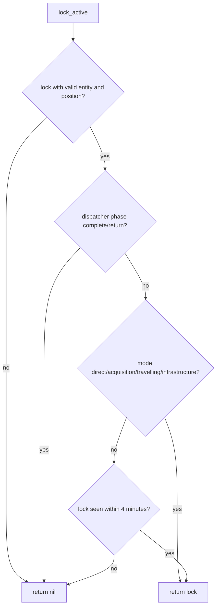

### Reconcile graph

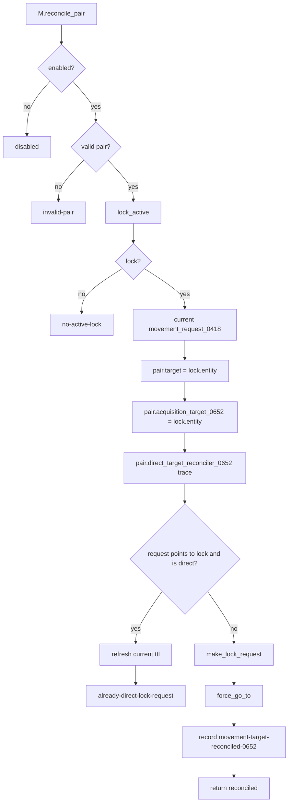

### Movement wrapper graph

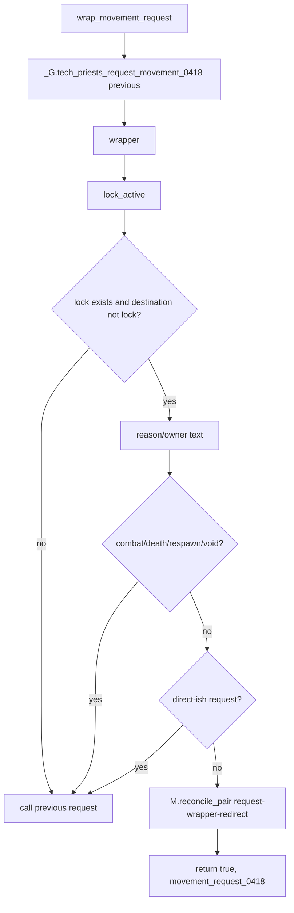

---

## 5. `movement_intent_authority_0654.lua`

### Function inventory

| Function | Type | Role | Major side effects |
|---|---:|---|---|
| `root`, `stat`, `record` | local storage/metrics | Module storage and logs | writes module root/recent |
| `movement_root()` | local movement root | Ensures movement request storage | writes movement controller root |
| `target_entity`, `target_position` | local extractors | Read entity/position from task | none |
| `current_direct_task(pair)` | local selector | Finds current direct acquisition task | calls direct executor or scans pair fields |
| `output_item(task,cur)` | local extractor | Gets target item | none |
| `lock_truth(pair)` | local selector | Chooses direct movement truth from lock or task | reads `direct_acquisition_target_lock_0650` and task state |
| `request_points_to_truth(req,truth)` | local predicate | Checks whether request is already direct and at truth | none |
| `make_request(pair,truth)` | local builder | Builds direct acquisition intent request | none |
| `install_request(pair,truth,reason)` | local writer | Writes direct intent movement request and target fields | writes request table, `pair.target`, `current_target`, `current_work_target_0654`, trace |
| `issue_command(pair,req,reason)` | local movement | Sends Factorio go-to command | writes last command fields |
| `M.service_pair(pair,reason)` | public service | Applies truth to one pair | calls `lock_truth`, `install_request`, `issue_command` |
| `request_exempt(reason,opts)` | local predicate | Exempts combat/death/respawn/void/return movement | none |
| `destination_points_to_truth(destination,truth)` | local predicate | Checks if command target already truth | none |
| `wrap_request()` | local wrapper | Redirects movement requests away from stale targets | wraps `_G.tech_priests_request_movement_0418` |
| `wrap_route()` | local wrapper | Redirects movement controller `route_command` | wraps `TECH_PRIESTS_MOVEMENT_CONTROLLER_0418.route_command` |
| `M.service_all(reason)` | public loop | Runs wrappers and services all pairs | none beyond service |
| `M.install()` | public installer | Registers service | writes `_G.TechPriestsMovementIntentAuthority0654` |

### Truth source graph

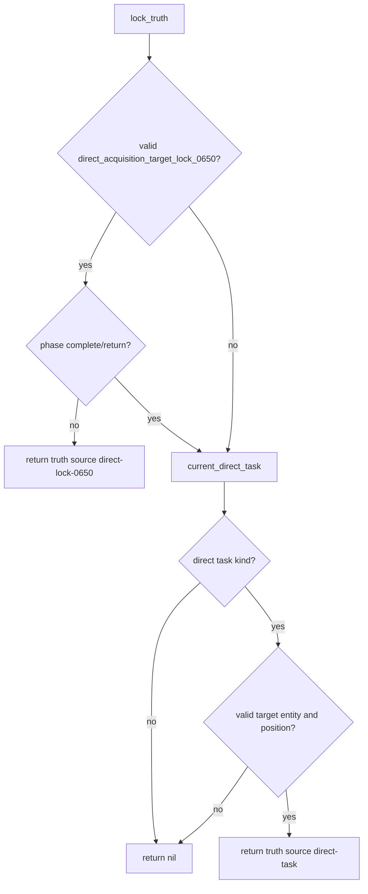

### Intent request graph

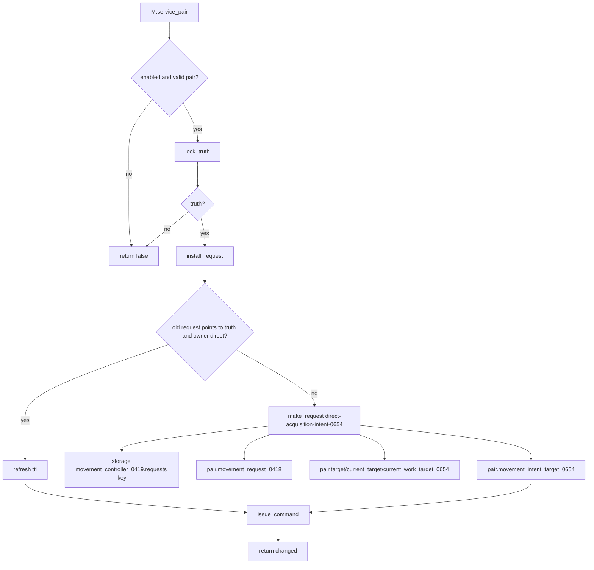

### Request and route wrapper graph

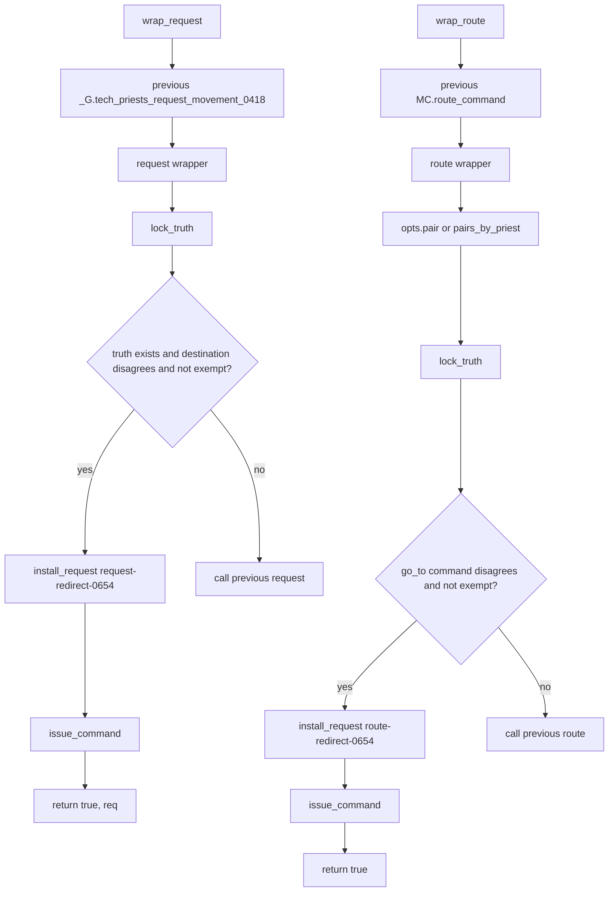

---

## 6. Combined Direct Movement State Write Matrix

| State field | Writer | Meaning | Risk |
|---|---|---|---|
| `cur.entity`, `cur.target`, `cur.source`, `cur.position` | 0649 adoption, 0650 restore | Current direct task's physical target | Critical: direct executor mines whatever is here |
| `pair.target` | 0649, 0650, 0652, 0654 | Generic active target | Critical: legacy visual/movement code may read it |
| `pair.mode` | 0649, 0650 | Direct acquisition mode marker | Medium-high: used by lock/reconciler heuristics |
| `pair.dispatcher_direct_0513` | 0649, 0650 | Direct executor phase/detail trace | High: lock activity depends on phase |
| `pair.direct_acquisition_target_lock_0650` | 0650 | Locked physical target entity/position/item | Critical: 0652/0654/0655 read it |
| `pair.movement_request_0418` | 0652, 0654 | Active movement target | Critical: vector enforcer obeys it |
| `storage.tech_priests.movement_controller_0419.requests[key]` | 0652, 0654 | Backing movement request table | Critical: stale table causes wrong movement |
| `pair.acquisition_target_0652` | 0652 | Reconciler trace target | Medium: diagnostic/target trace |
| `pair.movement_intent_target_0654` | 0654 | Intent trace target | Medium: diagnostic/intent trace |
| `pair.direct_acquisition_force_move_0650` | 0650 | Forced movement throttle/trace | Medium: can suppress repeated commands |

---

## 7. Direct Movement Debugging Decision Tree

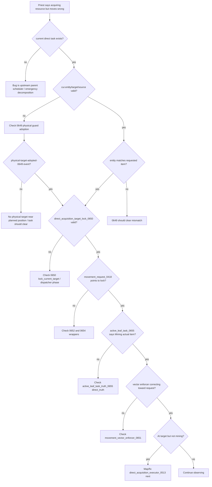

---

## 8. Remaining Direct-Acquisition Drilldown Needed

This pass maps the repair stack, not the base direct acquisition executor. The next direct-acquisition pass must map:

- `direct_acquisition_executor_0513.lua`
- how it chooses current tasks
- how it decides walking vs working
- how it mines/collects from the target
- how it deposits to station
- how it marks parent tasks complete
- how it names `output_item`, `item_name`, `wanted_item`, and `requested_item`

Until that executor is mapped, we have verified the target/movement repair layers but not the actual mining/action completion loop.
