# Tech-Priests Function-Level Mermaid Drilldown: Direct Acquisition Executor 0513

Version: 0.1.663-map-pass-4  
Previous drilldown: `docs/BEHAVIOR_MERMAID_FUNCTION_DRILLDOWN_0662_DIRECT_MOVEMENT.md`  
Companion overview: `docs/BEHAVIOR_MERMAID_MAP_0660.md`

Purpose: map the base direct-acquisition executor itself. The previous pass mapped the repair layers that force the direct target and movement request to agree. This pass maps the executor that actually decides whether the priest walks, works, damages/mines the target, deposits the output, returns for crafting, or completes.

Mapped module:

- `direct_acquisition_executor_0513.lua`

Important finding:

- This executor still contains `install_command()` for `/tp-direct-acquisition-0513`. This document maps it as existing behavior/control surface. Cleanup can remove it in a later code pass.

---

## 1. Module Purpose and High-Level Phase Machine

The file describes itself as a dispatcher-owned phase machine:

> choose/adopt target -> walk to target -> work over time -> deposit -> return or yield to station craft

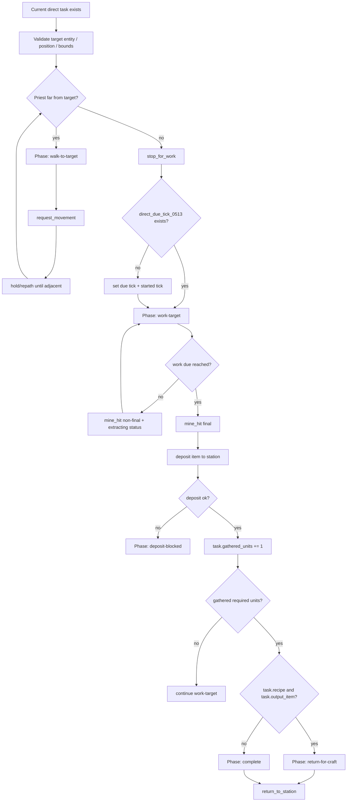

---

## 2. Function Inventory

| Function | Type | Role | Major side effects |
|---|---:|---|---|
| `now`, `valid`, `safe`, `lower`, `unit`, `station_unit`, `priest_unit`, `pair_map`, `valid_pair`, `dist_sq`, `dist` | local helpers | Time/entity/string/distance/pair helpers | none |
| `item_exists(name)` | local prototype helper | Checks item prototype existence | reads `prototypes.item` |
| `M.root()` | public storage root | Ensures direct acquisition executor state | writes `storage.tech_priests.direct_acquisition_executor_0513` |
| `stat(name,n)` | local metric | Increments counters | writes root stats |
| `record(action,pair,detail,force)` | local metric/log | Stores recent events and throttled log lines | writes root recent/last_log |
| `current_direct_task(pair)` / `M.current_direct_task` | public/local selector | Finds current direct task from `emergency_craft`, `direct_acquisition_task_0336`, `active_acquisition_0333` | none |
| `target_entity(cur)` | local extractor | Reads `cur.entity`, `cur.target`, or `cur.source` | none |
| `target_position(pair,cur)` | local extractor | Uses target entity, current position, or `pair.target` | none |
| `target_label(cur)` | local formatter | Builds diagnostic target label | none |
| `output_item(task,cur)` | local resolver | Determines item produced by current target/task | may infer resource from entity name/type |
| `required_units(task)` | local resolver | Determines how many units must be gathered | none |
| `clear_direct_due(task)` | local cleanup | Clears old direct timers | writes task direct timer fields |
| `set_phase(pair,phase,detail)` | local state writer | Updates direct dispatcher phase | writes `pair.dispatcher_action`, `pair.dispatcher_phase`, `pair.dispatcher_direct_0513` |
| `show(pair,text,target,opts)` | local visual/status helper | Emits status and optional scan line | calls `_G.tech_priests_draw_emergency_operation_status_0184`, `_G.draw_emergency_craft_scan_line` |
| `deposit(pair,item,count)` | local deposit | Deposits gathered item into station | uses `_G.tech_priests_safe_deposit_item` or station inventory fallback |
| `mine_visual(pair,cur,final)` | local visual helper | Draws mining line/smoke | calls scan/smoke globals or surface smoke |
| `mine_hit(pair,cur,final)` | local work helper | Applies mining/damage effect | reduces resource amount or damages entity |
| `stop_for_work(pair,reason)` | local movement clamp | Stops movement before work phase | clears movement request/lease; issues stop command |
| `request_movement(pair,pos,reason)` | local movement writer | Requests movement to direct target | writes mode/target/reason; calls movement request or ground route/fallback command |
| `return_to_station(pair,reason)` | local movement writer | Requests return movement to station | writes mode/target/phase; calls movement request or route/fallback command |
| `within_bounds(pair,pos)` | local boundary check | Uses movement bounds authority if present | calls `TechPriestsMovementBounds0511.target_within_bounds` |
| `M.service_pair(pair,reason)` | public executor | Main phase machine | validates, walks, works, deposits, returns, clears tasks |
| `M.service_all(reason)` | public loop | Services all pairs with current direct task | calls `M.service_pair` |
| `should_block_legacy(pair)` | local guard | Determines whether older direct controllers should be blocked | reads dispatcher/direct state |
| `wrap_acquisition_executor()` | local wrapper | Wraps older `acquisition_executor` service | replaces `Exec.service_pair` with 0513 service when enabled |
| `wrap_legacy_direct_functions()` | local wrapper | Blocks old global direct functions | wraps `_G.tech_priests_0273/0312/0315_service_direct_current` |
| `selected_pair(player)` | local command helper | Finds selected pair for command diagnostics | reads selection/pair maps |
| `install_command()` | local command installer | Installs `/tp-direct-acquisition-0513` | registers slash command; remaining cleanup target |
| `wrap_pair_dump()` | local diagnostics wrapper | Adds direct 0513 info to pair dump | patches diagnostic `pair_dump_lines` |
| `M.install()` | public installer | Installs wrappers/diagnostics/command and exposes module | writes `_G.TechPriestsDirectAcquisitionExecutor0513` |

---

## 3. Current Task Selection

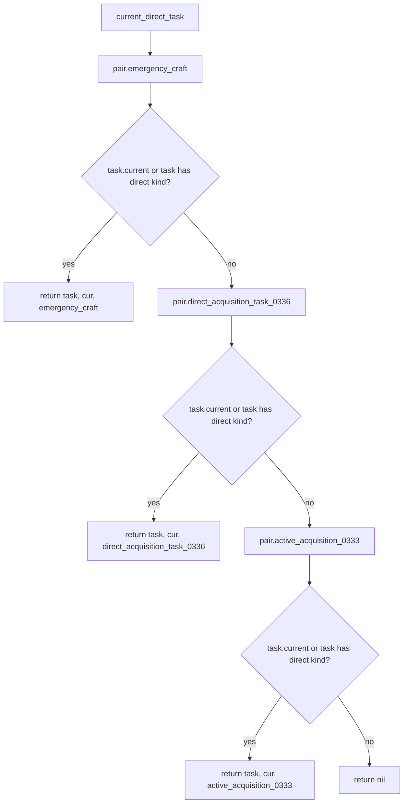

Direct kinds currently accepted:

- `direct-mine-0273`
- `direct-dirt-0273`
- `dirt`
- `direct-mine-0336`

---

## 4. Output Item Resolution

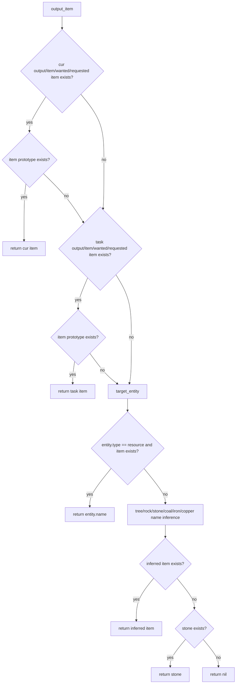

Risk: the stone fallback can hide bad task naming. If a direct task has no valid item and no useful entity inference, it may silently become stone.

---

## 5. Movement and Work Clamp Helpers

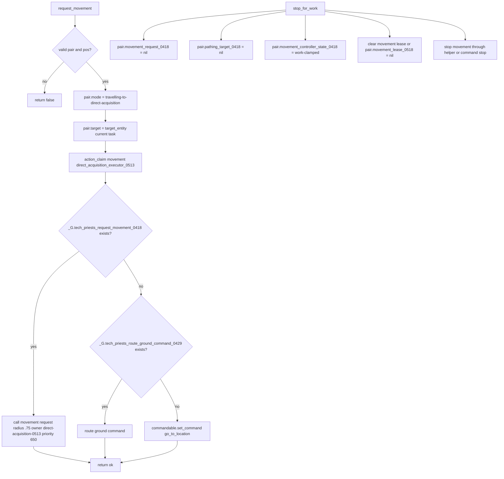

Movement repair modules added later intercept the `request_movement` call path by wrapping `_G.tech_priests_request_movement_0418` and movement controller routing.

---

## 6. Main `M.service_pair` Phase Machine

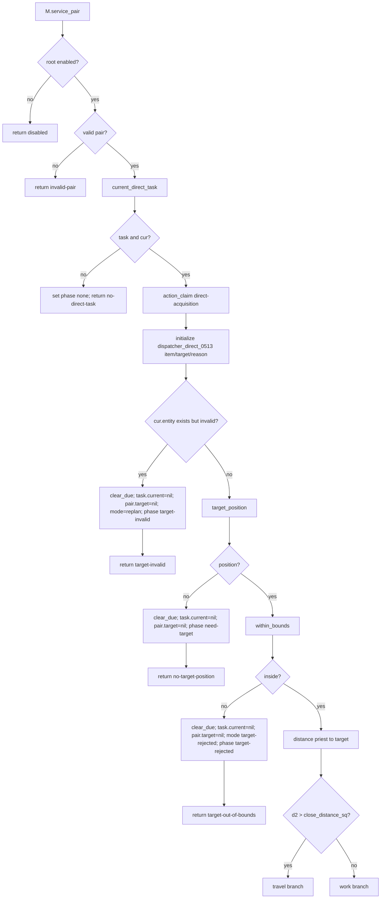

---

## 7. Travel Branch

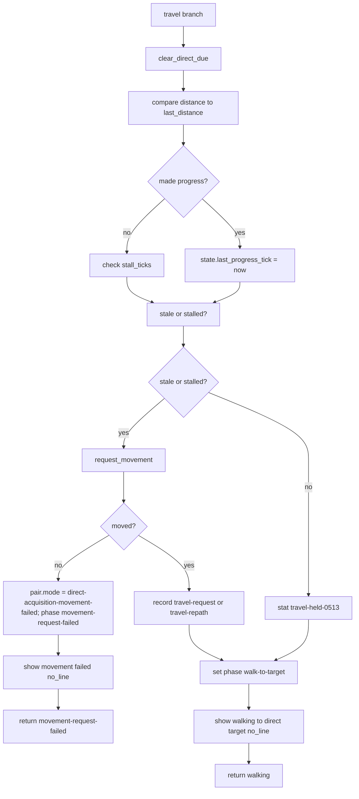

Important interaction: `show(..., no_line=true)` prevents the old scan/mining line while walking. Movement/intent line should instead be owned by `active_leaf_task_truth_0655` and `visual_intent_line_authority_0657`.

---

## 8. Work Branch

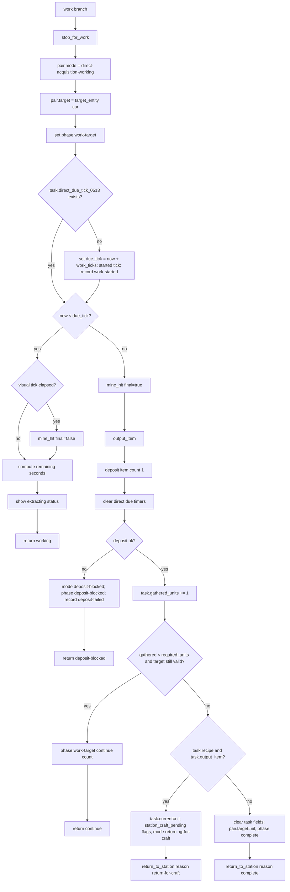

---

## 9. Mine/Damage and Deposit Detail

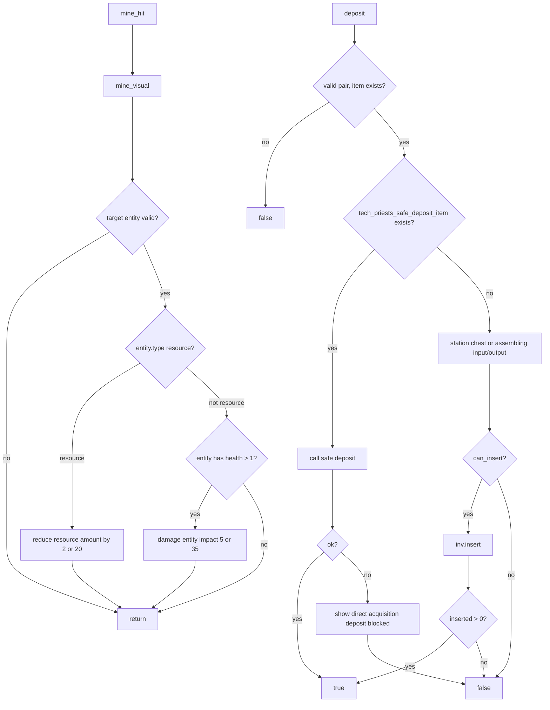

Audit warning: the fallback deposit path still tries station chest, assembling input, and assembling output. The safe deposit helper should normally exist and should be preferred. If safe deposit is missing, this fallback should be reviewed against the earlier inventory safety policy.

---

## 10. Return / Completion Flow

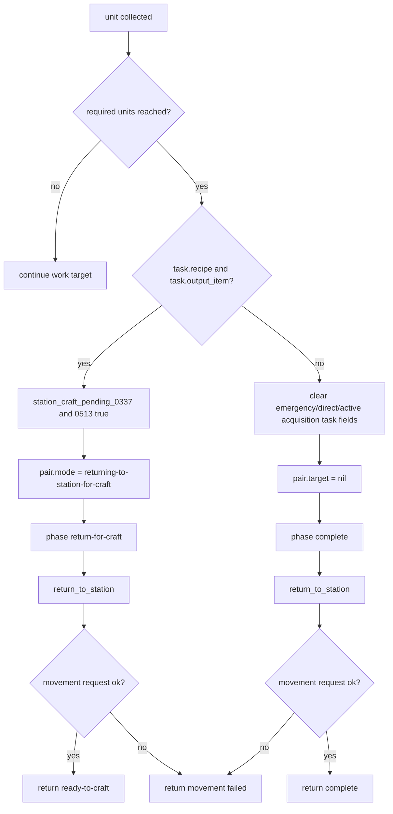

---

## 11. Service Loop and Legacy Blocking

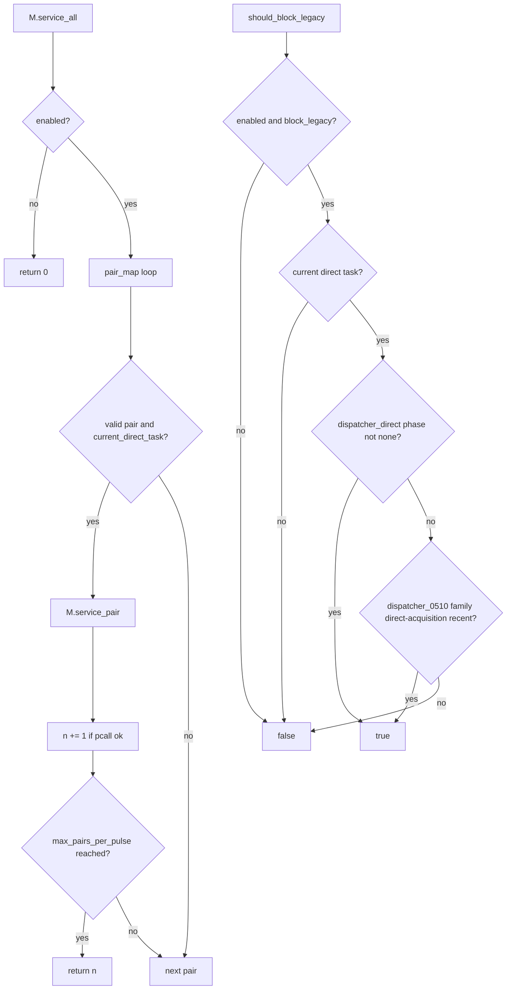

### Wrapper graph

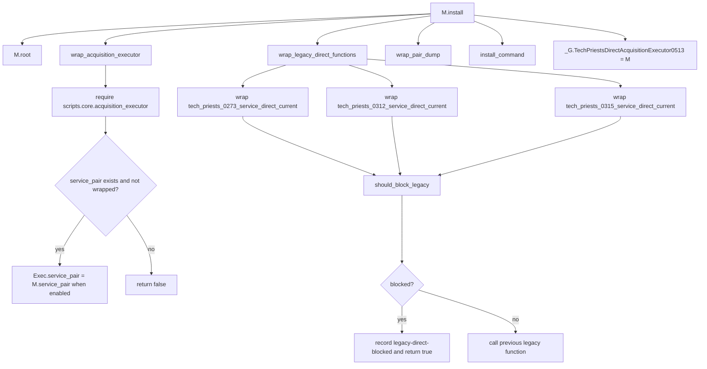

---

## 12. Remaining Slash Command Surface

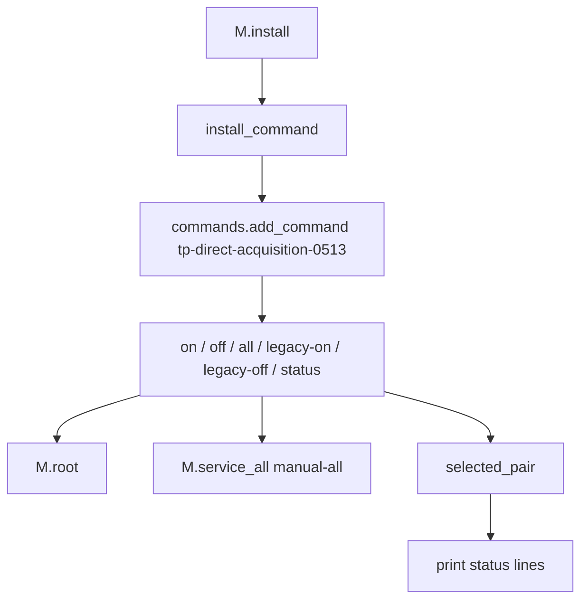

Cleanup note: this is a remaining slash command block. It belongs on the command cleanup list if commandless runtime is still the target architecture.

---

## 13. State Write Matrix

| State field | Writer | Meaning | Risk |
|---|---|---|---|
| `pair.dispatcher_action` | `set_phase` | Broad action marker | Medium |
| `pair.dispatcher_phase` | `set_phase` | Broad phase marker | Medium |
| `pair.dispatcher_direct_0513` | `set_phase`, `M.service_pair` | Direct acquisition phase trace | High; 0650/0652 read phase |
| `pair.mode` | travel/work/return/failure branches | Coarse pair mode | High; many legacy modules inspect mode |
| `pair.target` | request movement, return, work, invalid/complete cleanup | Generic target pointer | Critical; legacy modules and visuals may read it |
| `pair.movement_request_0418` | `stop_for_work` clears; request helper writes through movement system | Movement target | Critical; vector enforcer obeys it |
| `pair.pathing_target_0418` | `stop_for_work` clears | Old pathing target | Medium |
| `pair.movement_controller_state_0418` | `stop_for_work` | Work clamp marker | High while working |
| `pair.movement_controller_clamp_0418` | `stop_for_work` | Prevents movement during work | High; stale clamp would freeze priest |
| `task.direct_due_tick_0513` | work branch | Work completion timer | High; controls extraction duration |
| `task.gathered_units` | work completion branch | Progress toward required units | High |
| `task.station_craft_pending_0337/0513` | return-for-craft branch | Signals materials acquired for crafting | High |
| `pair.emergency_craft`, `pair.direct_acquisition_task_0336`, `pair.active_acquisition_0333` | complete branch | Clears direct task fields | High |

---

## 14. Failure / Exit Matrix

| Exit | Trigger | State change | Next expected behavior |
|---|---|---|---|
| `disabled` | root disabled | none | dispatcher/other systems continue |
| `invalid-pair` | invalid station/priest | none | cleanup/recovery should handle |
| `no-direct-task` | no current direct task | phase none | dispatcher chooses next work |
| `target-invalid` | cur.entity exists but invalid | task current nil, target nil, mode replan | upstream should replan direct task |
| `no-target-position` | no entity/position/pair target | task current nil, target nil, phase need-target | 0649/parent planner should provide physical target |
| `target-out-of-bounds` | bounds authority rejects target | task current nil, target nil, rejected mode | upstream should choose closer target |
| `movement-request-failed` | request_movement false | mode movement-failed, phase movement-request-failed | 0650 may force fallback movement |
| `walking` | target far and movement ok/held | phase walk-to-target | continue until adjacent |
| `working` | work timer not done | phase work-target | continue extraction |
| `continue` | one unit deposited but more required | phase work-target | continue extracting same target if valid |
| `deposit-blocked` | deposit failed | mode deposit-blocked | inventory/station deposit bug |
| `ready-to-craft` | gathered recipe materials | return-for-craft, station craft pending flags | station crafting executor should craft output |
| `complete` | gathered direct item without recipe | clears direct tasks, returns to station | dispatcher chooses next behavior |
| `return-movement-request-failed` | return_to_station failed | return movement failure phase | movement system/fallback must recover |

---

## 15. Direct Executor Debugging Decision Tree

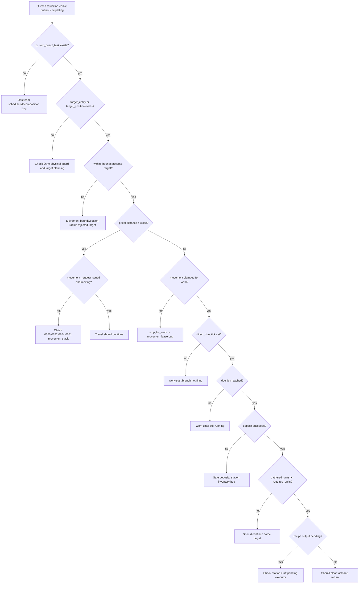

---

## 16. Direct Executor Cleanup Targets

1. Remove `/tp-direct-acquisition-0513` command block if commandless runtime remains the standard.
2. Review fallback `deposit()` path that can insert into station assembling input/output if safe deposit helper is missing.
3. Review `output_item()` stone fallback; bad direct task metadata should probably fail loudly instead of silently becoming stone.
4. Ensure `show()` parent text is fully superseded by `active_leaf_task_truth_0655` overhead where applicable.
5. Confirm `stop_for_work()` clamp is reliably released after work/complete/return transitions.
6. Confirm `task.current = nil` behavior is correct for all three task containers: `emergency_craft`, `direct_acquisition_task_0336`, and `active_acquisition_0333`.
7. Confirm return-for-craft handoff is consumed by the station crafting executor and does not strand `station_craft_pending_0337/0513`.
