# Tech-Priests Function-Level Mermaid Drilldown: Movement Controller

Version: 0.1.664-map-pass-5  
Previous drilldown: `docs/BEHAVIOR_MERMAID_FUNCTION_DRILLDOWN_0663_DIRECT_EXECUTOR.md`  
Companion overview: `docs/BEHAVIOR_MERMAID_MAP_0660.md`

Purpose: map the core ground movement controller. This file is the movement request store, command issuer, legacy command router, clamp manager, speed/snap sampler, combat-positioning adapter, and remaining movement diagnostic command surface.

Mapped module:

- `movement_controller.lua`

Important finding:

- This module was designed around the doctrine that one module owns ground-priest go-to-location commands, while other systems submit movement intent.
- It still contains `M.commands()` and registers `/tp-movement-0429`, so this remains a command cleanup target.
- Its retarget-hold logic can preserve an existing request unless a later authority writes directly into `pair.movement_request_0418` and the movement-controller request table. This is why the later 0652/0654/0655/0656 layers overwrite both places.

---

## 1. Movement Controller Doctrine

The header states the design doctrine:

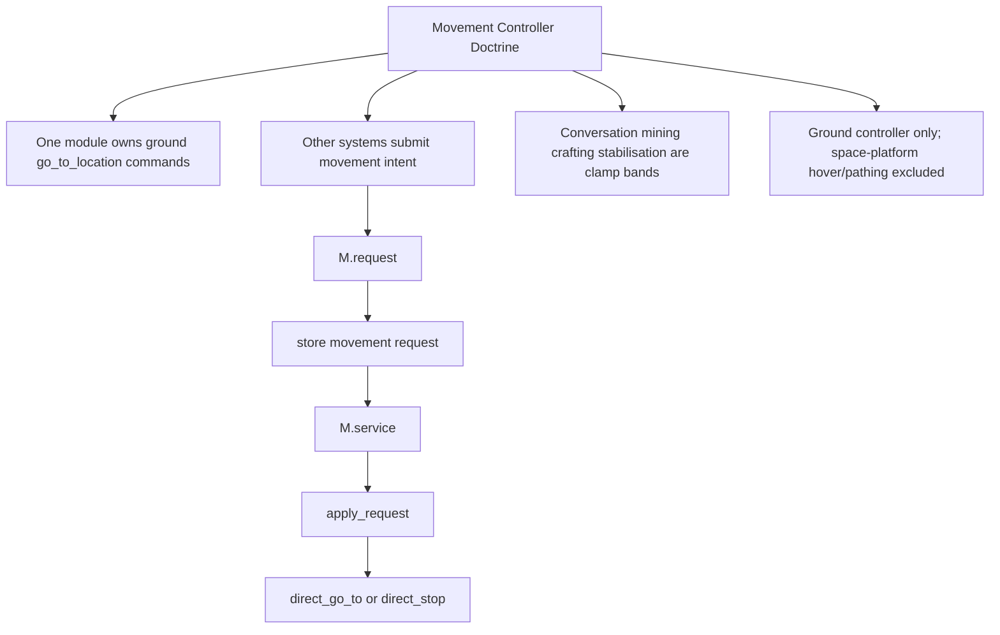

---

## 2. Function Inventory

| Function | Type | Role | Major side effects |
|---|---:|---|---|
| `now`, `valid`, `metric`, `dist_sq` | local helpers | Time/entity/metrics/distance | may call `_G.tech_priests_runtime_metric_0606` |
| `ensure_root()` | local storage root | Ensures movement controller storage | writes `storage.tech_priests.movement_controller_0419` |
| `pairs_by_station()` | local accessor | Reads station pair map | reads storage |
| `pair_by_request_key(key)` | local resolver | Converts request key to pair | reads pairs by station/priest |
| `note_active_request(root,key,pair)` | local marker | Marks active request and bucket priority | writes `root.active_request_ids`; may call bucket registry |
| `clear_active_request(root,key)` | local marker | Clears active request id | writes `root.active_request_ids` |
| `count_table(t)` | local helper | Counts table keys | none |
| `pair_key(pair)` | local key builder | station unit or priest unit fallback | none |
| `selected_pair(player)` | local command helper | Finds selected station/priest pair | reads selection and globals |
| `pair_for_priest(priest)` | local resolver | Finds pair by priest entity | reads storage/global finder |
| `is_space_pair(pair)` | local predicate | Detects platform/space pair | calls `_G.tech_priests_pair_on_space_platform_0204` |
| `direct_stop(priest)` | local command | Stops priest command/walking state | calls commandable/set_command and walking_state |
| `direct_go_to(priest,pos,radius,distraction)` | local command | Issues Factorio go_to_location | calls commandable/set_command |
| `current_work_position(pair)` | local extractor | Reads emergency craft current work target | none |
| `conversation_locked(pair)` | local clamp predicate | Checks idle conversation fields | none |
| `work_clamped(pair)` | local clamp predicate | Checks mining/craft locks and close direct work target | reads work/task fields |
| `clamp_reason(pair)` | local clamp selector | Computes active clamp reason | clears stale movement lockdown fields |
| `M.request(pair,destination,reason,opts)` | public request writer | Submits movement intent | writes `root.requests[key]`, `pair.movement_request_0418`, owner/reason fields |
| `M.request_status(pair,owner)` | public status | Returns status for active request | writes `pair.movement_controller_status_0418` |
| `M.combat_intent(pair,target,reason,opts)` | public combat movement adapter | Positions priest near combat target or stops in range | writes `pair.combat_target`, `pair.target`, combat intent trace, mode |
| `M.stop(pair,reason)` | public stop | Clears request and stops priest | writes movement request/state reason; calls direct_stop |
| `apply_request(pair,req)` | local service helper | Applies stored request to engine command or stop/loiter | writes last distance, state, clamp, last command |
| `M.service(event,budget)` | public service loop | Services active request ids only | prunes invalid/expired/empty requests; calls apply_request |
| `M.sample(event,budget)` | public sampler | Samples active request pairs for huge visual snap/high-speed audit | writes samples, last snap, clears stale request on huge jumps |
| `destination_from_entity_or_position(target)` | local adapter | Converts entity/position target | none |
| `M.route_command(priest,command,owner,opts)` | public command router | Converts legacy go_to/attack/stop commands into movement requests | writes movement/combat state through request/combat/stop |
| `M.patch_globals()` | public wrapper installer | Exposes globals and wraps legacy commands | writes multiple `_G.*` movement functions |
| `M.commands()` | public command installer | Registers `/tp-movement-0429` diagnostic | command surface remains |
| `M.report_lines()` | public diagnostics | Runtime report summary | none |
| `M.install()` | public installer | Patches globals, installs command, registers broker services | writes globals and services |

---

## 3. Storage Root and Active Request Registry

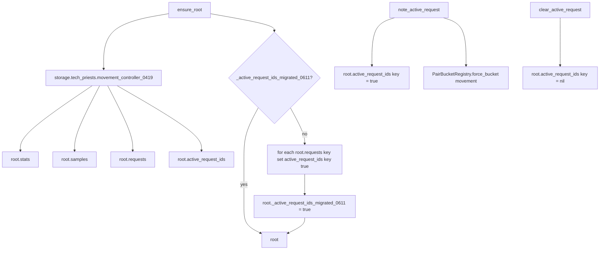

The active request table is important because `M.service` and `M.sample` iterate active ids, not all pairs.

---

## 4. Clamp Reason Chain

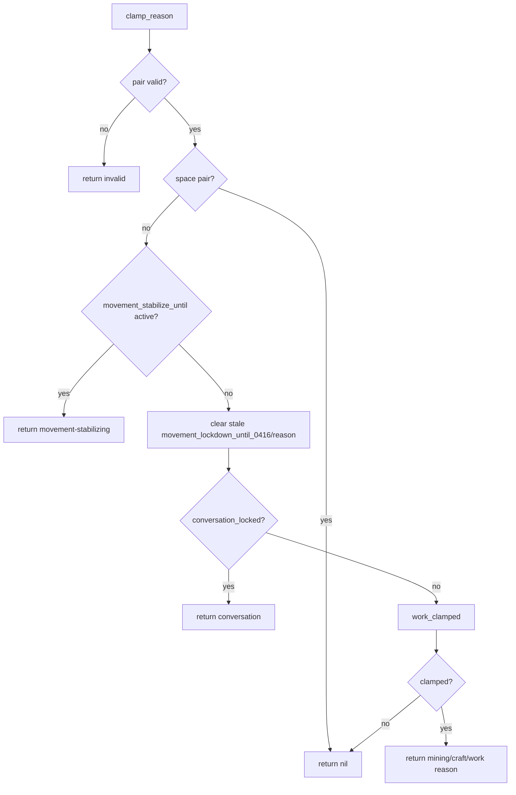

### Work clamp detail

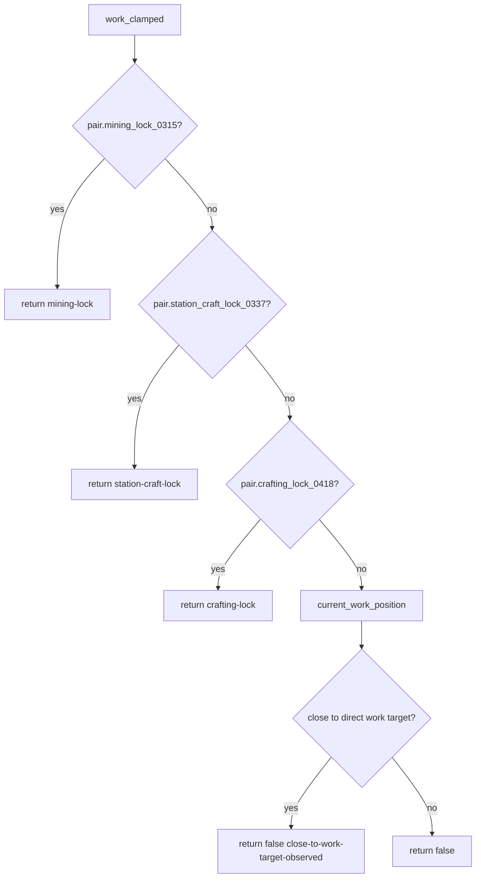

Note: direct work target proximity intentionally avoids clamping here; the direct acquisition executor owns the work clamp through `stop_for_work`.

---

## 5. `M.request` Retarget / Priority Flow

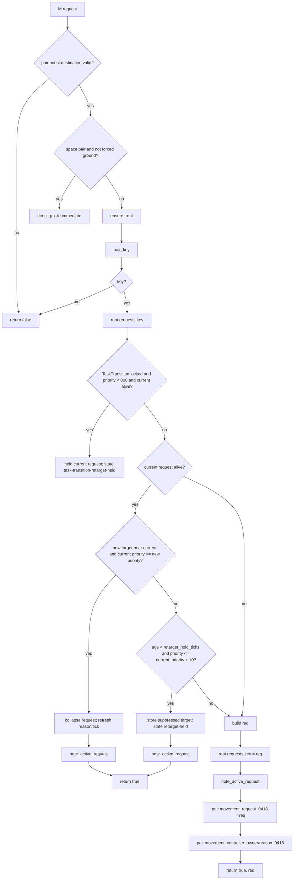

Key audit point: this retarget logic can preserve a stale request unless a higher-priority authority bypasses it or writes both `pair.movement_request_0418` and `root.requests[key]` directly. That is why the 0652/0654/0655/0656 repair layers update both fields.

---

## 6. Request Status Flow

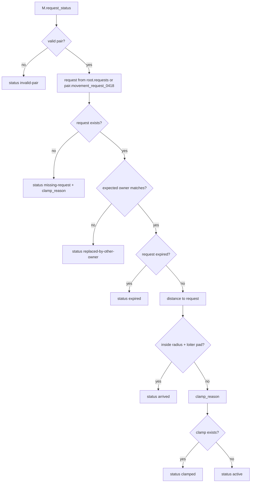

This is diagnostic/status only; it does not prune the request.

---

## 7. Combat Intent Flow

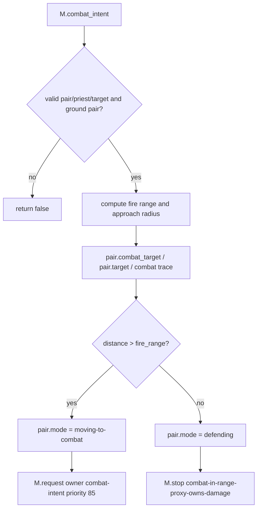

Combat does not issue attack commands through the ground priest. Proxy turret damage owns damage; movement controller owns positioning.

---

## 8. Stop and Apply Request Flow

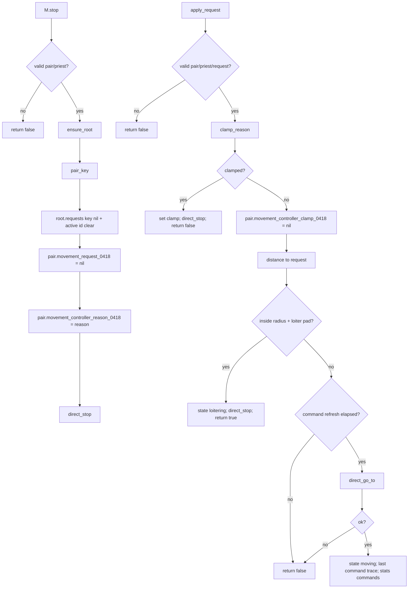

---

## 9. Service Loop Flow

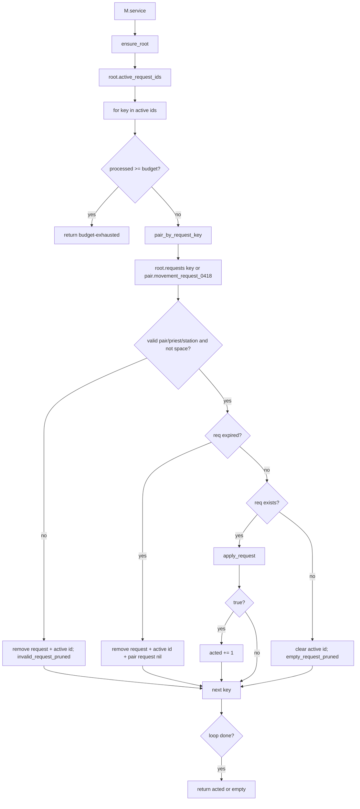

---

## 10. Snap / Speed Sample Flow

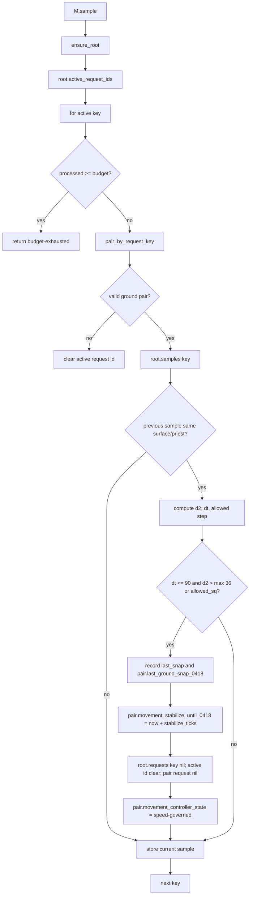

This no longer teleports the priest backwards; it records the jump, clears the stale request, and lets behavior resubmit a sane route.

---

## 11. Legacy Command Routing Flow

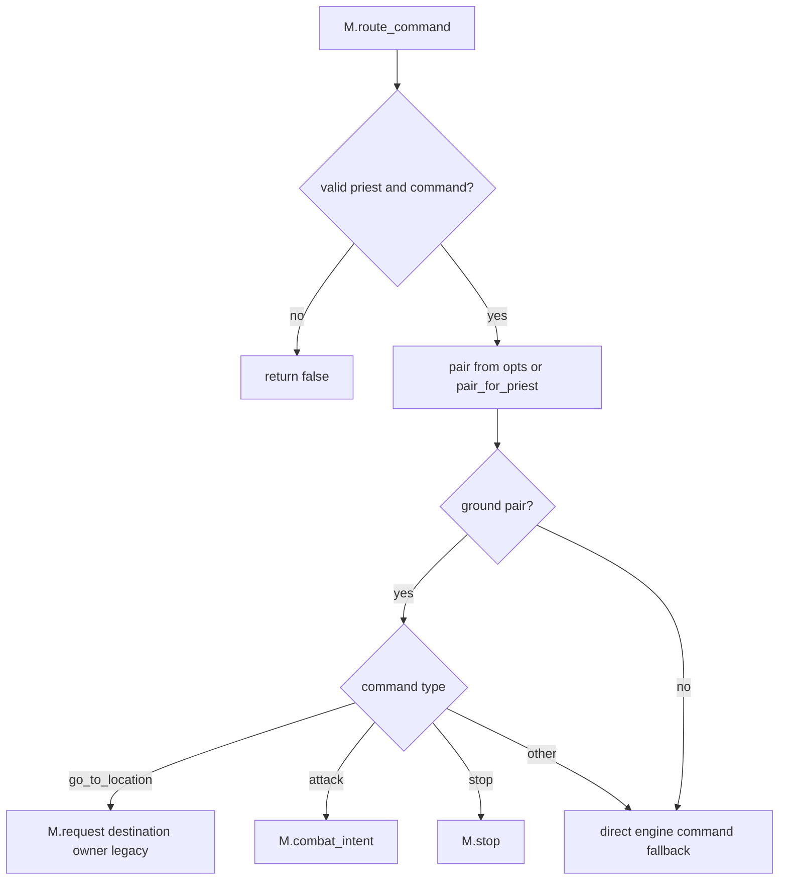

The route command is the bridge that turns older direct engine command calls into movement-controller requests.

---

## 12. Global Patch Surface

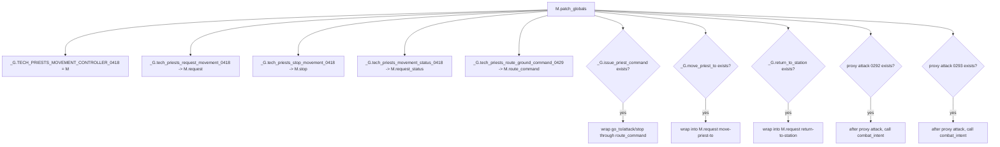

Risk: because this file installs global wrappers, later movement repair modules that also wrap `_G.tech_priests_request_movement_0418` and `M.route_command` must preserve wrapper ordering.

---

## 13. Diagnostic Command Surface

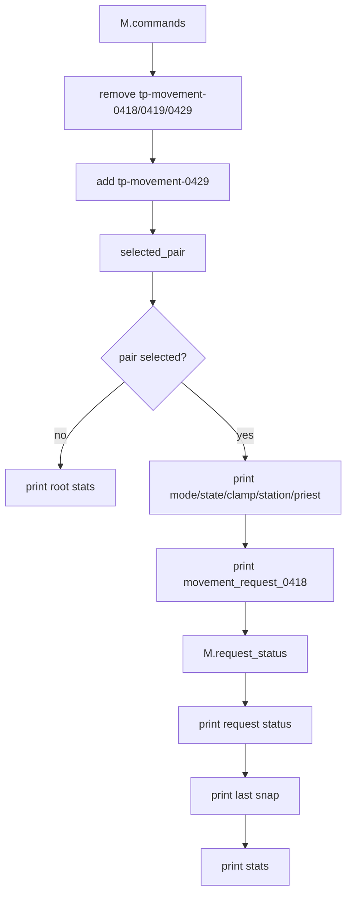

Cleanup note: this command still exists and should be removed if commandless runtime remains the project standard.

---

## 14. Install Flow

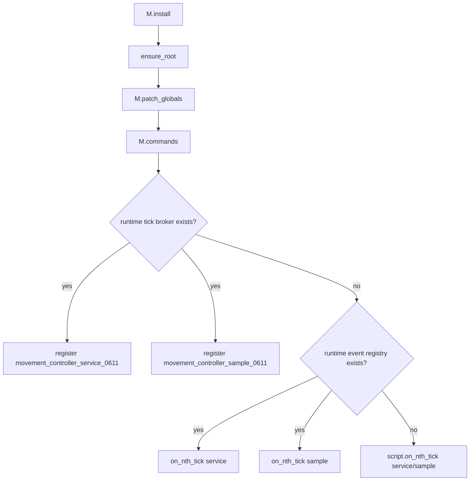

---

## 15. Movement State Write Matrix

| State field | Writer | Meaning | Risk |
|---|---|---|---|
| `storage.tech_priests.movement_controller_0419.requests[key]` | `M.request`, `M.stop`, `M.service`, `M.sample`, late authority modules | Backing active movement request | Critical |
| `storage.tech_priests.movement_controller_0419.active_request_ids[key]` | `note_active_request`, `clear_active_request`, `M.service`, `M.sample` | Service loop registry | High |
| `pair.movement_request_0418` | `M.request`, `M.stop`, `M.service`, `M.sample`, late authority modules | Pair-facing request | Critical |
| `pair.movement_controller_owner_0418` | `M.request`, late authority modules | Request owner | High |
| `pair.movement_controller_reason_0418` | `M.request`, `M.stop`, route wrappers | Request reason | High |
| `pair.movement_controller_state_0418` | `M.request`, `apply_request`, `M.sample`, late authority modules | Moving/loiter/held/clamped/speed-governed state | High |
| `pair.movement_controller_clamp_0418` | `M.request`, `apply_request`, `clamp_reason`, `M.sample` | Current clamp/reason | High |
| `pair.movement_controller_status_0418` | `M.request_status` | Diagnostic status | Medium |
| `pair.movement_controller_last_command_0418` | `apply_request`, late authority modules | Last engine command trace | Medium |
| `pair.combat_target` | `M.combat_intent` | Active combat target | High during combat |
| `pair.target` | `M.combat_intent`, legacy wrappers, other modules | Generic current target | Critical due legacy readers |
| `pair.movement_stabilize_until_0418` | `M.sample` | Post-snap stabilization clamp | Medium-high; stale value can briefly clamp |
| `pair.last_ground_snap_0418` | `M.sample` | Snap audit record | Diagnostic |

---

## 16. Request Failure / Exit Matrix

| Exit/status | Trigger | State change | Expected next behavior |
|---|---|---|---|
| `M.request false` | invalid pair/destination/key | none | caller should fail or fallback |
| `task-transition-retarget-held` | task transition lock + low priority + active current request | preserves current request | higher-priority authority may override |
| `request_collapsed` | new target very close and lower/equal priority | refreshes current request | movement continues same target |
| `retarget-held` | request too fresh and lower/equal priority | suppresses target | movement continues older target |
| `request_status missing-request` | no request | status only | scheduler may submit request |
| `request_status replaced-by-other-owner` | owner mismatch | status inactive | caller should stop claiming movement |
| `request_status expired` | expired request | status inactive | service will prune on tick |
| `request_status arrived` | within radius + loiter pad | status arrived | executor should perform work |
| `request_status clamped` | clamp reason exists | status clamped | wait for clamp release |
| `apply_request false clamped` | clamp reason exists | direct_stop called | movement paused |
| `apply_request true loitering` | within radius | direct_stop called | executor should act |
| `M.service budget-exhausted` | active ids exceed budget | partial processing | next tick continues |
| `M.service empty` | no active processed | none | idle |
| `M.sample speed-governed` | huge displacement sample | clears request and stabilizes | scheduler must repath |

---

## 17. Movement Debugging Decision Tree

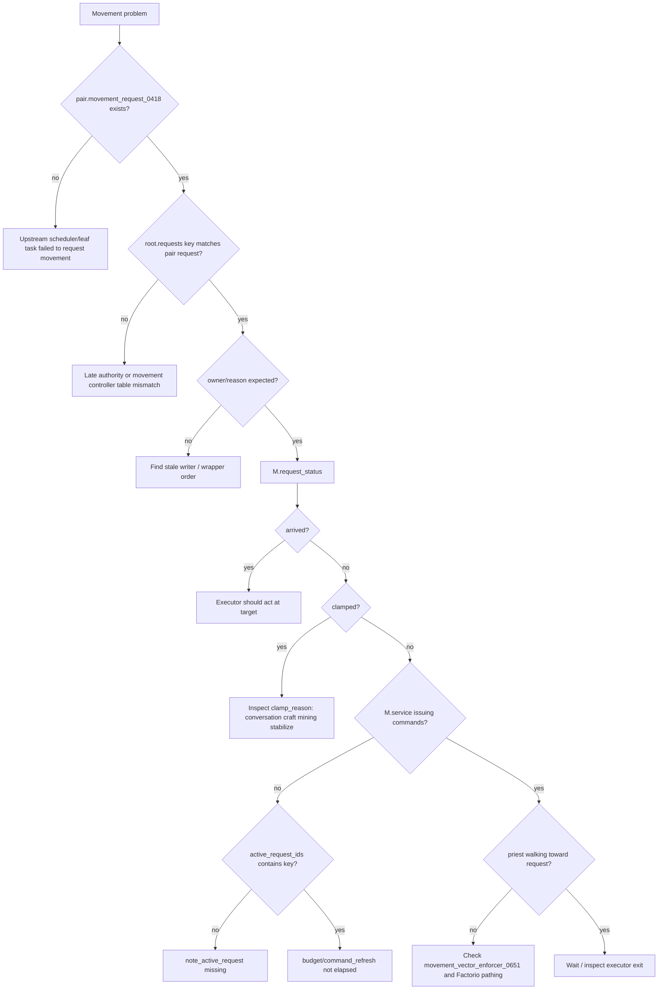

---

## 18. Cleanup Targets

1. Remove `/tp-movement-0429` command block if commandless runtime remains the standard.
2. Review retarget-hold interaction with high-priority leaf truth authorities. It may be safe only because later modules overwrite both pair and backing request tables.
3. Reduce wrapper layering once `active_leaf_task_truth_0655` has proven stable.
4. Audit any module still calling `commandable.set_command` directly instead of `M.request` or `M.route_command`, except explicit fallback layers.
5. Confirm stale `movement_controller_clamp_0418` values are not mistaken for active clamps; true clamp must come from `clamp_reason`.
6. Confirm active request ids are always written when late authority modules install requests directly into backing tables.
7. Review speed-governed request clearing against vector enforcement so a huge displacement does not create a silent idle state.
