# Tech-Priests Function-Level Mermaid Drilldown: Construction Planner + Site Planner

Version: 0.1.665-map-pass-6  
Previous drilldown: `docs/BEHAVIOR_MERMAID_FUNCTION_DRILLDOWN_0664_MOVEMENT_CONTROLLER.md`  
Companion overview: `docs/BEHAVIOR_MERMAID_MAP_0660.md`

Purpose: map the physical construction branch: how station-held placeable items become construction tasks, how placement sites are chosen, how priests move to the station/build site, and how the entity is created.

Mapped modules:

- `construction_planner.lua`
- `construction_site_planner.lua`

Related authority already mapped earlier:

- `construction_placement_authority_0656.lua`

Important finding:

- `construction_planner.lua` is now commandless and owns the actual physical placement execution.
- `construction_site_planner.lua` owns where something can safely go and intentionally keeps inventory ownership out of placement decisions.
- `construction_placement_authority_0656.lua` is the preemptor/leaf authority that makes this branch win once a station has a buildable infrastructure item.

---

## 1. Construction Module Boundary

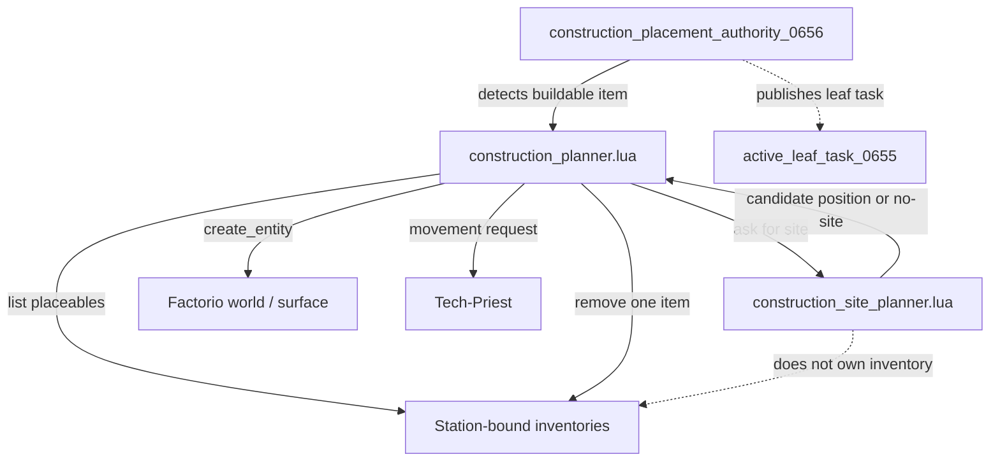

The site planner's own header states that it owns physical placement scanning and intentionally keeps inventory ownership out of the placement algorithm.

---

## 2. `construction_planner.lua` Function Inventory

| Function | Type | Role | Major side effects |
|---|---:|---|---|
| `debug_chat_allowed_0626(root)` | local helper | Checks verbose debug chat | reads runtime debug global |
| `valid`, `now`, `pair_map`, `dist_sq`, `valid_pair` | local helpers | Validity/time/pair/distance | none |
| `routed_find(surface,filters,category,negative_key,ttl)` | local scan helper | Uses scan routing or raw surface search | may call `TechPriestsScanRouting0610.find_entities` |
| `ensure_root()` | local storage root | Ensures construction planner state | writes `storage.tech_priests.construction_planner_0359` |
| `proto_item(name)` | local prototype helper | Gets item prototype | reads `prototypes.item` |
| `proto_entity(name)` | local prototype helper | Gets entity prototype | reads `prototypes.entity` |
| `place_result_name(item_name)` | local mapper | Maps placeable item to entity | reads item `place_result` |
| `entity_type(entity_name)` | local mapper | Reads entity type | reads entity prototype |
| `category_for_entity(entity_name)` | local classifier | Categorizes placeable entity | classifies emergency/miner/furnace/assembler/lab/power/network/generic |
| `task_is_emergency(task)` | local predicate | Checks emergency build priority/category | none |
| `preempt_conflicting_work_for_build(pair,task)` | local preemptor | Clears acquisition/craft/emergency work for emergency builds | writes multiple pair task fields/mode/status |
| `safe_inventory(entity,inv_id)` | local inventory helper | Safely gets inventory | none |
| `inventories_for(entity)` | local inventory lister | Lists useful inventories on an entity | reads chest/trunk/assembling/furnace inventories |
| `iter_contents(inv)` | local iterator | Lists inventory contents | none |
| `inventory_count(inv,item)` | local count | Counts items | none |
| `remove_one(inv,item)` | local mutator | Removes one item | mutates inventory |
| `station_bound_sources(pair)` | local inventory source builder | Gets station/work inventory source list | calls station source/inventory steward helpers or falls back to station inventories |
| `find_item_source(pair,item_name)` | local source finder | Finds station-bound inventory containing item | none |
| `list_placeables(pair)` | local scanner | Lists placeable items in station-bound inventories | reads station inventories/prototypes |
| `plan_site(pair,placeable)` | local site wrapper | Calls `SitePlanner.plan_site` | none |
| `draw_status(pair,text,ttl)` | local visual | Emits overhead status through global helper | visual/status side effect |
| `set_move(pair,pos,reason)` | local movement | Requests priest movement or direct command fallback | writes `pair.mode`, `pair.last_build_move_command_0338` |
| `entity_label(entity,fallback)` | local helper | Friendly label | none |
| `print_msg(pair,msg)` | local debug/log | Logs and optional chat | logs/player prints |
| `current_task(pair)` | local accessor | Reads current construction task | reads `pair.construction_task_0338` |
| `choose_placeable(pair)` | local planner | Chooses buildable item and site | may write `root.skipped` |
| `can_place(surface,force,name,pos)` | local placement test | Calls Factorio `surface.can_place_entity` | none |
| `try_place(pair,task)` | local executor | Removes item, destroys ghost if needed, creates entity | mutates inventory/world; writes `last_construction_success_0338`; clears bootstrap ghost |
| `Build.service_pair(pair,reason)` | public service | Main construction state machine | writes construction task/mode/status, calls movement and placement |
| `Build.service_all(reason)` | public loop | Services all pairs | calls `Build.service_pair` |
| `Build.describe_pair(pair)` | public diagnostic | Summarizes placeables/task | none |
| `Build.install()` | public installer | Exposes globals and registers broker/nth tick | writes many `_G.TECH_PRIESTS_CONSTRUCTION_PLANNER_*` globals |

---

## 3. Construction Planner Main Flow

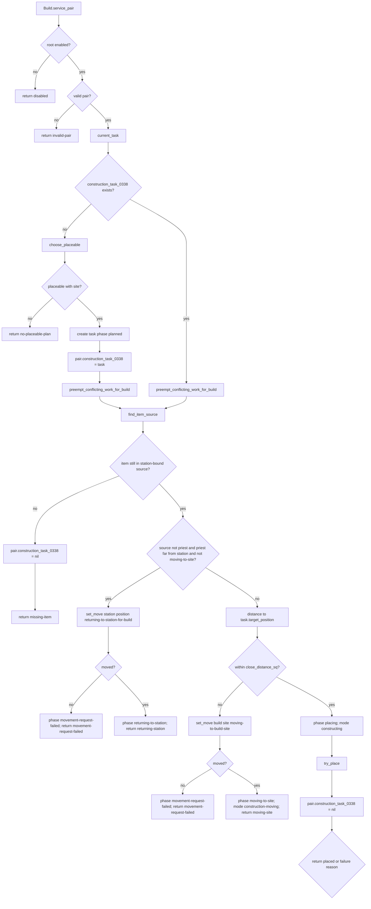

---

## 4. Station Inventory and Placeable Discovery

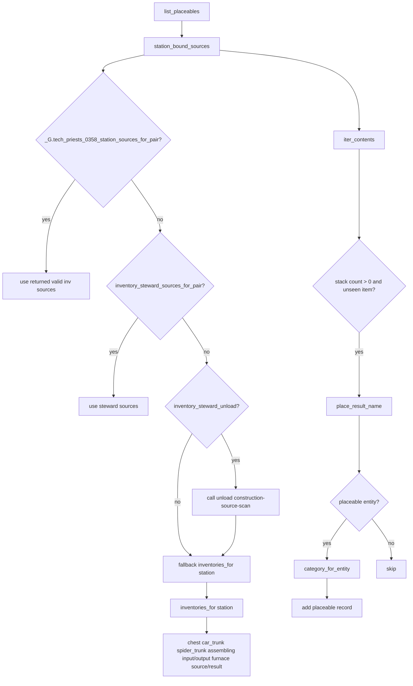

Audit note: `inventories_for` includes machine input/output and furnace source/result. That is acceptable for scanning station-bound sources only if the inventory steward/source helper intentionally treats those inventories as station-owned work buffers. Direct arbitrary output/source insertion remains a separate safety concern.

---

## 5. Placeable Choice Priority

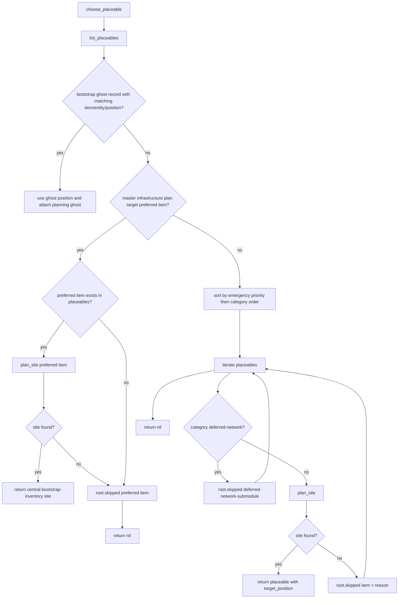

Priority order inside the fallback sorter:

1. Emergency explicit priority table
2. Emergency miner
3. Emergency smelter
4. Emergency powertrain
5. Emergency power pole
6. Normal miner
7. Furnace
8. Assembler
9. Lab
10. Power machine
11. Generic
12. Deferred network items ignored

---

## 6. Physical Placement Execution

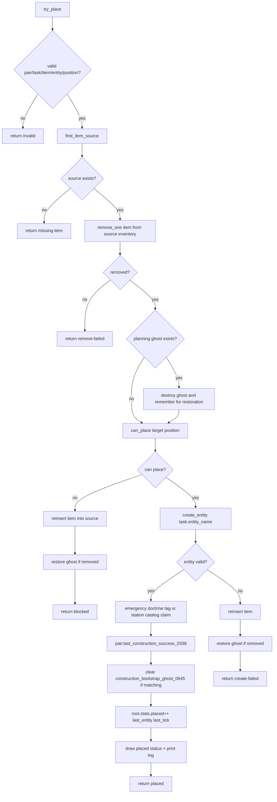

This is the core line where station inventory becomes actual infrastructure.

---

## 7. Construction Site Planner Function Inventory

| Function | Type | Role | Major side effects |
|---|---:|---|---|
| `valid(e)` | local helper | Entity validity | none |
| `constraints()` | local dependency | Gets planning constraints module | may require `planning_constraints_0646` |
| `routed_find(surface,filters,category,negative_key,ttl)` | local scan helper | Uses scan routing or raw surface search | may call scan routing |
| `dist_sq(a,b)` | local math | Squared distance | none |
| `proto_entity(name)` | local prototype helper | Gets entity prototype | reads prototypes |
| `entity_type(entity_name)` | local prototype helper | Gets entity type | reads prototypes |
| `radius_for(pair)` | local helper | Computes station operating radius | calls radius globals if present |
| `as_xy(pos)` | local adapter | Converts Factorio position/table to x/y | none |
| `box_for(entity_name)` | local geometry | Reads collision box dimensions | reads entity prototype collision box |
| `buffer_for(entity_name,category)` | local policy | Chooses placement clearance buffer | none |
| `footprint_area(entity_name,pos,buffer)` | local geometry | Builds search area around footprint | none |
| `area_clear(surface,entity_name,pos,buffer,ignore_resources)` | local clearance | Checks blocking entities in footprint area | calls routed find |
| `can_place(surface,force,entity_name,pos)` | local placement | Calls Factorio can_place_entity | none |
| `open_side_clear(surface,entity_name,pos,buffer)` | local assembler/service check | Requires at least one open side | calls area_clear |
| `has_existing_miner_near(surface,pos)` | local anti-overlap | Detects nearby mining drill | calls routed find |
| `plan_resource_miner(pair,entity_name)` | local resource planner | Chooses resource patch miner site | scans resource entities and checks constraints |
| `x_order_for_ring(r)` | local ordering | Builds left-preferred x order | none |
| `spiral_offsets(r)` | local geometry | Builds ring offsets top/north then left/west first | none |
| `grid_position(origin,dx,dy)` | local geometry | Converts offset to position | none |
| `Planner.plan_spiral(pair,entity_name,category)` | public planner | Chooses generic station-yard spiral site | uses territory/can_place/clearance/open-side checks |
| `Planner.plan_site(pair,placeable)` | public selector | Chooses miner/resource or spiral placement by category | checks tech unlock and category |
| `Planner.debug_sequence(pair,entity_name,limit)` | public diagnostic | Returns early spiral sequence positions | none |

---

## 8. Site Planner Category Routing

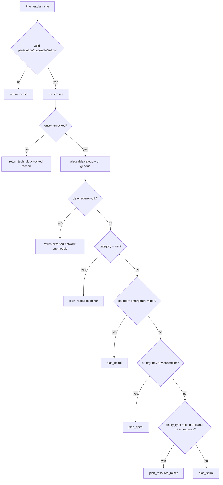

Important rule: normal miners prefer real resource patches. Emergency miners are patchless and use station-yard spiral placement.

---

## 9. Resource Miner Site Flow

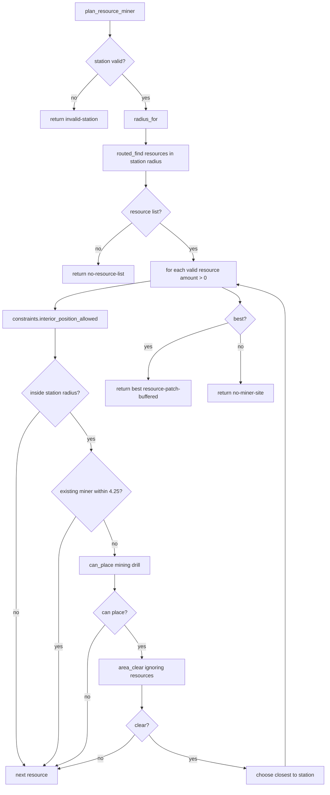

This is the branch that should eventually support normal burner mining drill placement on actual patches before emergency miners are used, depending on planner priority and available items.

---

## 10. Spiral Site Flow

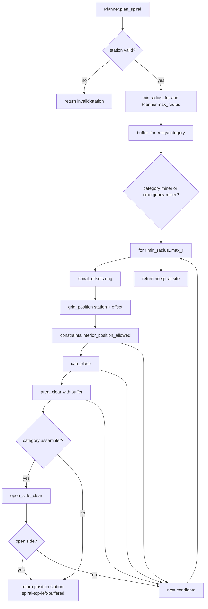

The spiral starts at the top/north center of the station and prefers left/west before right/east on each ring.

---

## 11. Geometry / Clearance Flow

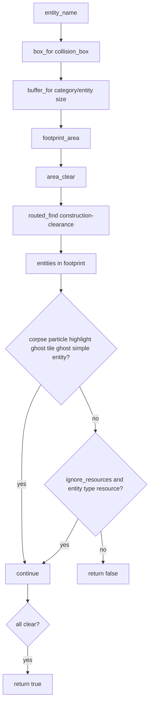

This is the construction planner's safety check around the candidate footprint.

---

## 12. Movement Handoff Inside Construction Planner

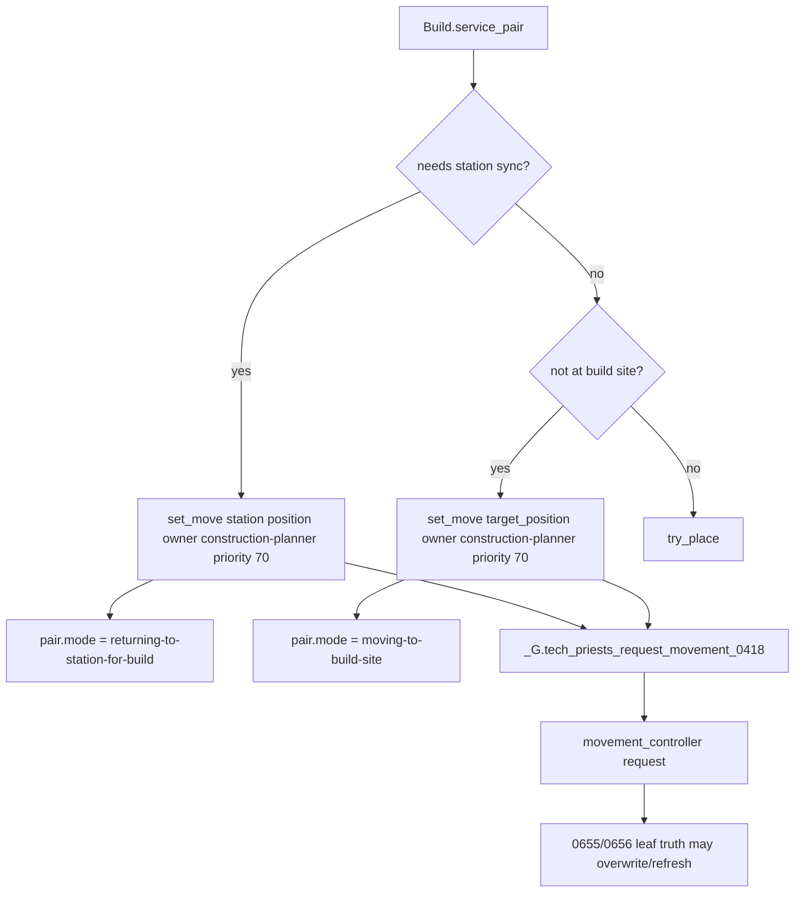

Note: `construction_placement_authority_0656` uses higher-priority movement ownership than this planner's internal `construction-planner` owner, so the authority should win if both are active.

---

## 13. Install / Service Loop

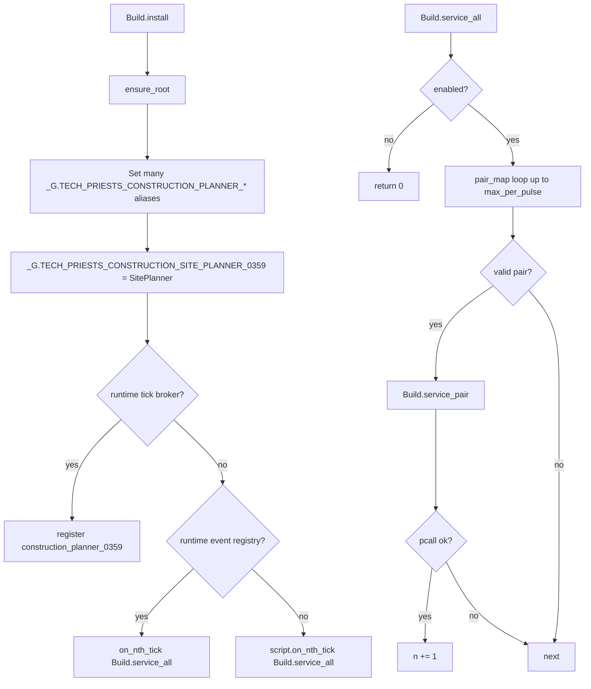

This file no longer registers slash commands; it logs that it loaded without slash commands.

---

## 14. Construction State Write Matrix

| State field | Writer | Meaning | Risk |
|---|---|---|---|
| `pair.construction_task_0338` | `Build.service_pair`, `try_place` cleanup | Active physical construction task | Critical |
| `pair.build_preempts_acquisition_until_0342` | `preempt_conflicting_work_for_build` | Stops emergency construction from losing priority | High |
| `pair.direct_acquisition_task_0336` | `preempt_conflicting_work_for_build` | Cleared for emergency construction | High; can interrupt acquisition |
| `pair.active_acquisition_0333` | `preempt_conflicting_work_for_build` | Cleared for emergency construction | High |
| `pair.acquisition_repair_task_0333` | `preempt_conflicting_work_for_build` | Cleared for emergency construction | Medium-high |
| `pair.resource_doctrine_task_0325` | `preempt_conflicting_work_for_build` | Cleared for emergency construction | Medium-high |
| `pair.station_crafting_task_0337` | `preempt_conflicting_work_for_build` | Cleared for emergency construction | High; may interrupt craft |
| `pair.emergency_operation` / `independent_emergency_operation` | `preempt_conflicting_work_for_build` | Cleared for emergency construction | High |
| `pair.mode` | `preempt_conflicting_work_for_build`, `set_move`, service phases | Current coarse mode | High |
| `pair.status` | `preempt_conflicting_work_for_build` | Coarse status | Medium |
| `pair.last_build_move_command_0338` | `set_move` | Movement throttling/trace | Medium |
| `pair.last_construction_success_0338` | `try_place` | Success trace for placement authority | High |
| `pair.construction_bootstrap_ghost_0645` | `try_place` | Cleared when matching ghost is built | High |
| `root.stats.planned/placed/failed` | service/try_place | Planner metrics | Low |
| `root.skipped[item]` | `choose_placeable` | Reason item was not planned | Diagnostic |

---

## 15. Failure / Exit Matrix

| Exit | Trigger | State change | Expected next behavior |
|---|---|---|---|
| `disabled` | planner root disabled | none | construction authority/planner idle |
| `invalid-pair` | invalid station/priest | none | pair cleanup handles |
| `no-placeable-plan` | no station-held placeable with valid site | none or skipped reasons | upstream builds/fetches materials |
| `missing-item` | task item no longer in station-bound source | clears construction task | upstream reacquires/refetches item |
| `movement-request-failed` station sync | cannot move to station | task phase failed; mode construction-movement-failed | movement authority should recover |
| `returning-station` | priest far from station inventory | phase returning-to-station | continue until station sync |
| `movement-request-failed` build site | cannot move to site | task phase failed; mode construction-movement-failed | movement authority should recover |
| `moving-site` | target site not reached | phase moving-to-site | continue movement |
| `invalid` | try_place invalid task | construction task cleared by service | planner will retry later |
| `remove-failed` | cannot remove item from source | construction task cleared; failure status | inventory source bug or race |
| `blocked` | can_place fails after ghost removal | item refunded; ghost restored | site planner/collision race |
| `create-failed` | create_entity fails | item refunded; ghost restored | prototype/surface issue |
| `placed` | entity created successfully | success trace and ghost clear | station catalog/doctrine should claim entity |

---

## 16. Construction Debugging Decision Tree

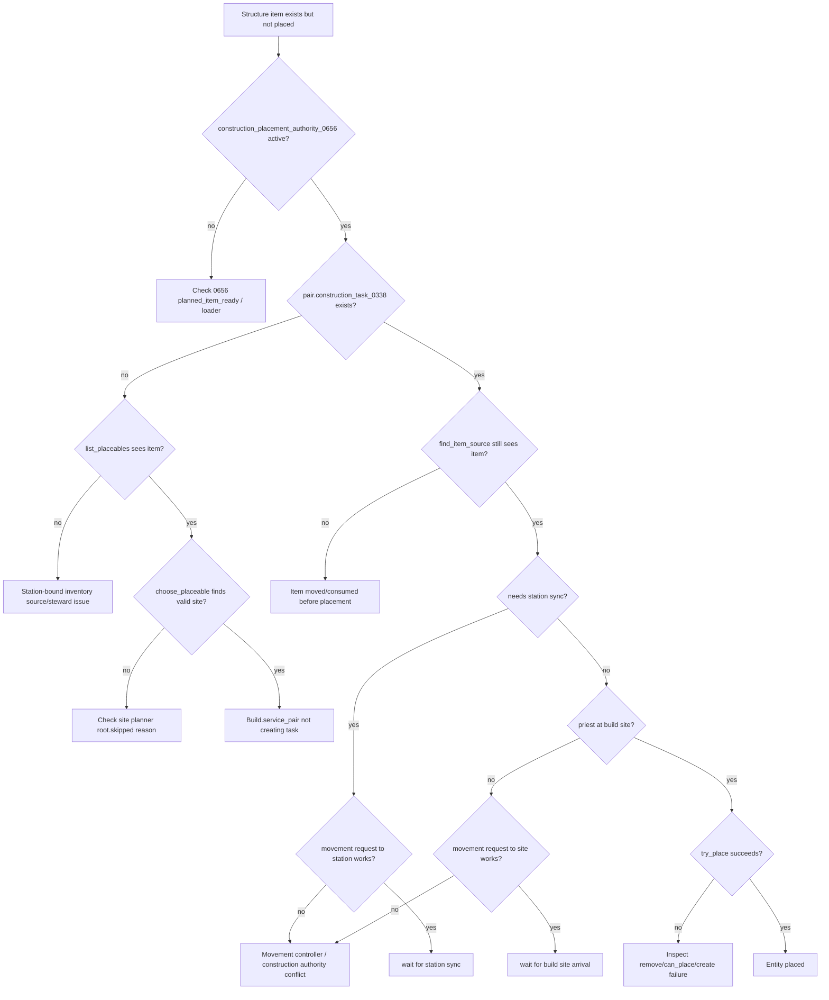

---

## 17. Cleanup / Audit Targets

1. Review `inventories_for(pair.station)` use of assembling input/output and furnace source/result as station-bound sources. It may be safe through station-owned work inventories, but it deserves explicit inventory-steward confirmation.
2. Review `try_place` direct `source.inv.insert` refund paths. These are refunds to the same source inventory, but still involve raw insert calls.
3. Verify `construction_placement_authority_0656` and `Build.service_pair` cannot fight over movement priority. Authority should remain higher priority.
4. Confirm `root.skipped` reasons are surfaced in diagnostics so no-site failures are visible without slash commands.
5. Confirm ordinary miner placement happens before emergency miner usage when a normal miner item and resource patch exist.
6. Confirm emergency miner patchless behavior is intentional and does not consume fuel or create misleading mining expectations.
7. Confirm ghost removal/restoration does not duplicate ghosts when `create_entity` fails repeatedly.
8. Consider splitting long one-line construction planner code into maintainable functions in a future refactor; current behavior is mapped, but editing risk is high.
