# Tech-Priests Function-Level Mermaid Drilldown: Master Infrastructure Plan + Bootstrap Ghost Planner

Version: 0.1.666-map-pass-7  
Previous drilldown: `docs/BEHAVIOR_MERMAID_FUNCTION_DRILLDOWN_0665_CONSTRUCTION.md`  
Companion overview: `docs/BEHAVIOR_MERMAID_MAP_0660.md`

Purpose: map the upstream infrastructure-planning chain that decides what station-local capability should exist next and turns that decision into one persistent construction planning ghost.

Mapped modules:

- `master_infrastructure_plan_0644.lua`
- `construction_bootstrap_ghost_planner_0645.lua`

Downstream modules already mapped:

- `construction_site_planner.lua`
- `construction_planner.lua`
- `construction_placement_authority_0656.lua`

Important current-code truth:

- The active infrastructure sequence is still a fixed bootstrap spine:
  1. smelting
  2. storage
  3. resource extraction when a local resource exists
  4. crafting
  5. research
- `next_small_science_objective()` is calculated and stored on the bootstrap ghost record, but it does **not currently select or decompose the infrastructure plan**. It is metadata, not yet an active planning authority.
- The ghost planner creates only one station-local planning ghost at a time.

---

## 1. End-to-End Planning Chain

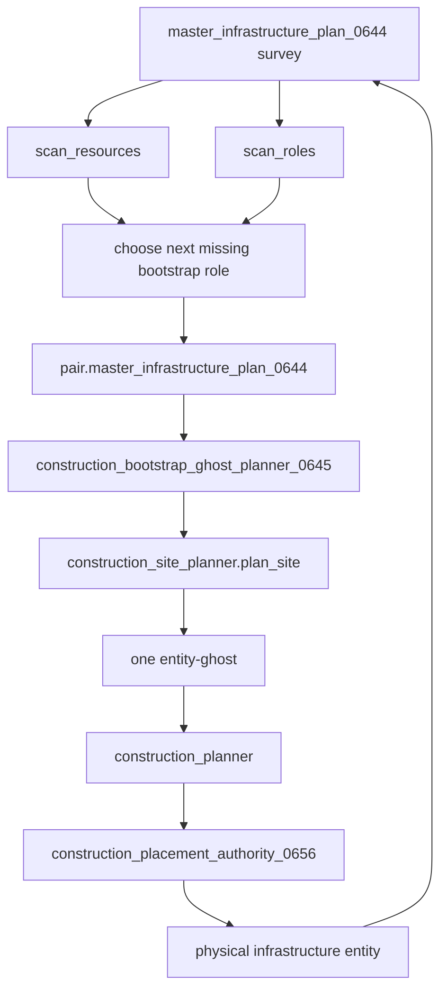

Once the physical entity exists, the next survey should detect the completed role and advance to the next missing role.

---

## 2. Fixed Bootstrap Target Table

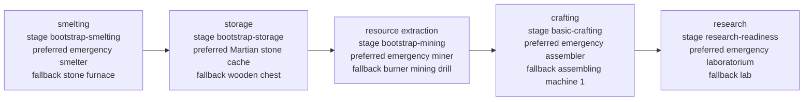

Delivery metadata stored on targets:

| Target | Delivery metadata |
|---|---|
| Smelter | `direct-ore-and-fuel-service` |
| Storage | `place-near-station` |
| Miner | `direct-service-until-belts` |
| Assembler | `place-near-storage` |
| Lab | `place-after-basic-crafting` |

These delivery strings are currently plan metadata. They do not themselves execute belt, inserter, train, or priest-transfer construction.

---

## 3. `master_infrastructure_plan_0644.lua` Function Inventory

| Function | Type | Role | Major side effects |
|---|---:|---|---|
| `now`, `valid`, `safe`, `pair_map`, `valid_pair`, `station_unit`, `priest_unit`, `dist_sq` | local helpers | Time, entity, formatting, pair identity, distance | none |
| `root()` | local storage root | Ensures planner state | writes `storage.tech_priests.master_infrastructure_plan_0644` |
| `stat(name,n)` | local metric | Increments planner stats | writes root stats |
| `record(action,pair,detail)` | local metric/history | Stores recent planning events | writes root recent |
| `radius_for(pair)` | local helper | Gets station operating radius | calls `_G.get_station_operating_radius` or pair radius |
| `safe_inventory(entity,id)` | local inventory helper | Gets inventory safely | none |
| `inv_count(inv,item)` | local inventory count | Counts item | none |
| `station_count(pair,item)` | local aggregate count | Counts preferred/fallback item across steward sources and station chest | reads inventory steward sources and station chest |
| `item_available(pair,preferred,fallback)` | local selector | Chooses preferred item, fallback item, or missing preferred | none |
| `scan_resources(pair)` | local survey | Summarizes resource entities in station radius | scans surface resources |
| `entity_role(e)` | local classifier | Converts nearby entity into infrastructure role | none |
| `scan_roles(pair)` | local survey | Counts nearby infrastructure roles | scans same-force entities in radius |
| `has_role(roles,a,b)` | local predicate | Tests whether either role exists | none |
| `first_resource(resources)` | local selector | Chooses highest-priority local resource | none |
| `choose(pair,resources,roles)` | local planner | Selects first missing infrastructure target | reads station inventory for item availability |
| `summarize(t)` | local formatter | Makes resource/role summary strings | none |
| `M.build_plan(pair,reason)` | public planner | Builds full station survey plan | writes `pair.master_infrastructure_plan_0644` |
| `M.service_pair(pair,reason)` | public service | Builds plan and records outcome | writes stats/recent through helpers |
| `M.service_all(reason)` | public loop | Services valid pairs | calls `M.service_pair` |
| `install_bootstrap()` | local installer | Requires and installs ghost planner | invokes `construction_bootstrap_ghost_planner_0645.install` |
| `M.install()` | public installer | Exposes module and registers periodic survey | writes `_G.TechPriestsMasterInfrastructurePlan0644` |

---

## 4. Resource Survey Flow

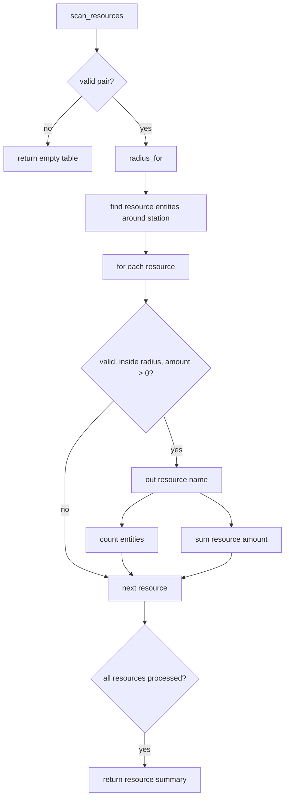

### Resource priority

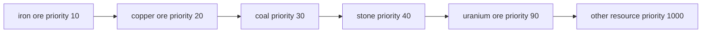

`first_resource()` sorts only the names found in the resource survey. It does not choose a patch position; physical miner placement is delegated to the construction site planner.

---

## 5. Infrastructure Role Classification

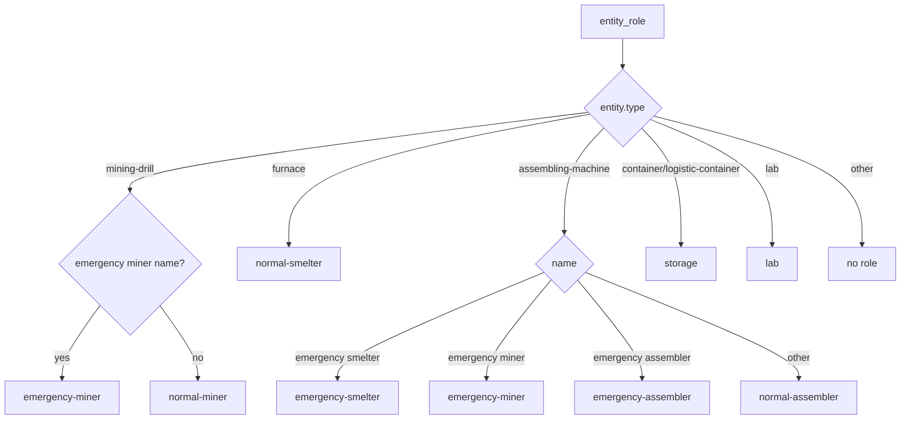

The emergency smelter is recognized as an assembling-machine by Factorio type but explicitly reclassified as `emergency-smelter` by name.

---

## 6. Role Survey Flow

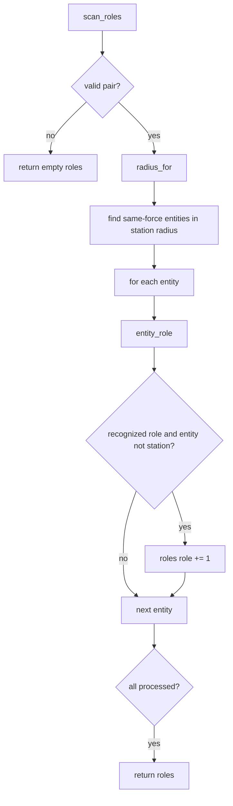

Role existence is counted, not evaluated for operational condition. A damaged, unpowered, unconfigured, or inaccessible machine can still satisfy the role survey if it exists and is recognized.

---

## 7. Item Availability / Preferred-Fallback Flow

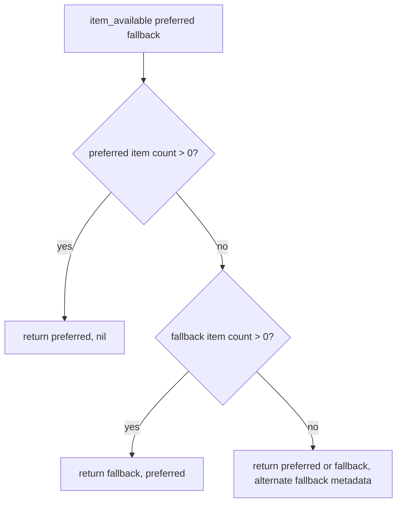

Meaning of returned fields inside the target plan:

- `preferred_item` becomes the item that should actually be used next.
- `fallback_item` is populated when the chosen item is a fallback or when both names are being recorded for a missing target.
- `blocker` is cleared only when the selected `preferred_item` is already present in station inventory.

Potential naming confusion: when a fallback item is physically available, the returned `preferred_item` becomes that fallback item, while `fallback_item` stores the original emergency/preferred item.

---

## 8. Master Target Selection Flow

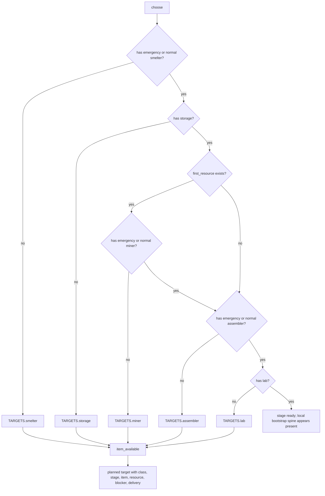

Important detail: when no local resource exists, the miner branch is skipped and the planner proceeds to assembler. The fixed sequence is therefore conditional at the miner stage.

---

## 9. Master Plan Build Flow

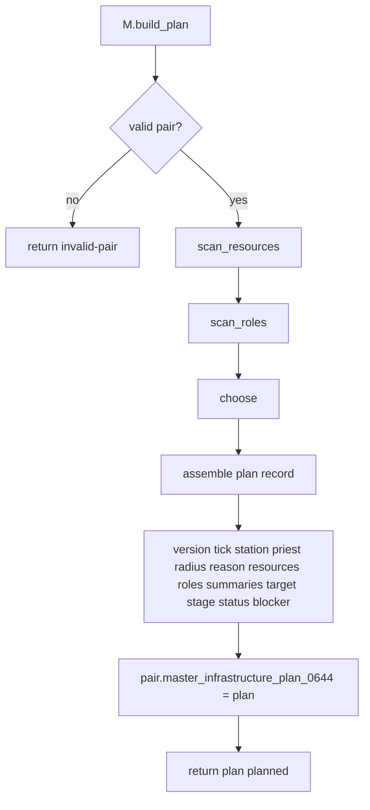

### Stored plan shape

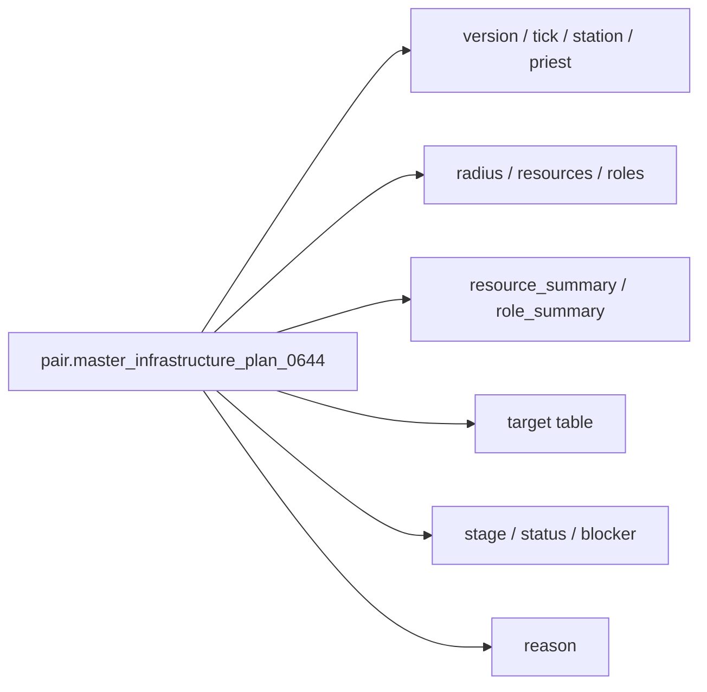

---

## 10. Master Planner Service / Install Flow

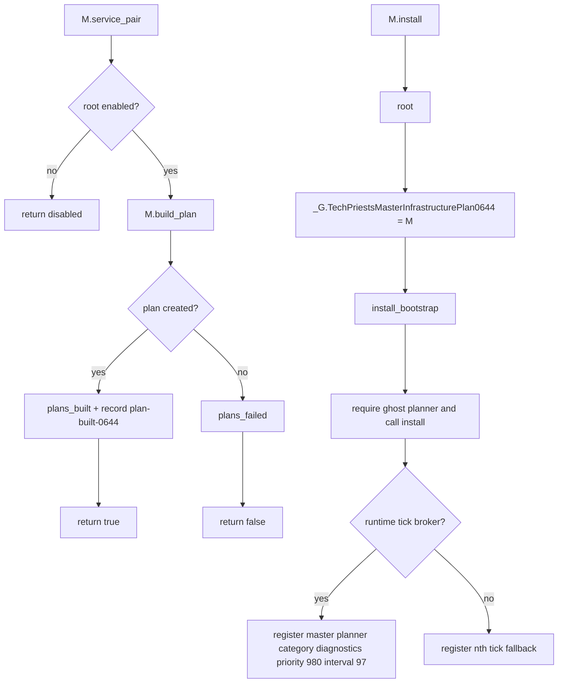

The master planner is registered in the `diagnostics` category at very late priority, despite producing active plan state. The ghost planner can call `M.build_plan` directly, so it does not depend on the late periodic survey having already run.

---

## 11. `construction_bootstrap_ghost_planner_0645.lua` Function Inventory

| Function | Type | Role | Major side effects |
|---|---:|---|---|
| `now`, `valid`, `safe`, `lower`, `pair_map`, `valid_pair`, `station_unit`, `priest_unit` | local helpers | Time/entity/formatting/pair access | none |
| `planning_constraints()` | local dependency | Gets constraints module | may require `planning_constraints_0646` |
| `root()` | local storage root | Ensures ghost planner state | writes `storage.tech_priests.construction_bootstrap_ghost_planner_0645` |
| `stat`, `record` | local metrics/history | Tracks ghost events | writes root stats/recent |
| `entity_exists(name)` | local prototype helper | Checks entity prototype | reads prototypes |
| `entity_name_for_item(item)` | local mapper | Converts item or entity name into placeable entity name | reads item `place_result` |
| `category_for(entity_name,class)` | local classifier | Chooses construction site category | reads explicit name map and entity type |
| `build_plan(pair,reason)` | local planner dependency | Calls master infrastructure `build_plan` or uses stored plan | may write `pair.master_infrastructure_plan_0644` |
| `plan_site(pair,entity_name,category)` | local site dependency | Calls construction site planner | none |
| `active_ghost(pair)` | local ghost resolver | Finds valid stored ghost or reacquires entity-ghost at recorded position | may update `rec.ghost` |
| `target_complete(pair,rec)` | local completion test | Checks for built target entity near recorded position | scans world |
| `science_pack_name(ingredient)` | local extractor | Reads science pack name | none |
| `technology_unlocked(tech)` | local predicate | Checks researched flag | none |
| `prerequisites_met(tech)` | local predicate | Checks all technology prerequisites researched | none |
| `next_small_science_objective(pair)` | local selector | Chooses lowest-score available technology | reads force technologies |
| `should_bootstrap(pair,plan)` | local predicate | Requires valid pair, target, and stage not ready | none |
| `create_planning_ghost(pair,entity_name,pos)` | local world mutator | Creates non-expiring entity ghost | mutates surface |
| `make_record(pair,plan,entity_name,pos,why,ghost)` | local writer | Creates bootstrap ghost record | writes `pair.construction_bootstrap_ghost_0645` |
| `M.service_pair(pair,reason)` | public service | Maintains existing ghost or creates next one | writes/clears ghost record and world ghost |
| `M.service_all(reason)` | public loop | Services valid pairs | calls `M.service_pair` |
| `M.install()` | public installer | Exposes module and registers service | writes `_G.TechPriestsConstructionBootstrapGhostPlanner0645` |

---

## 12. Item-to-Entity and Category Mapping

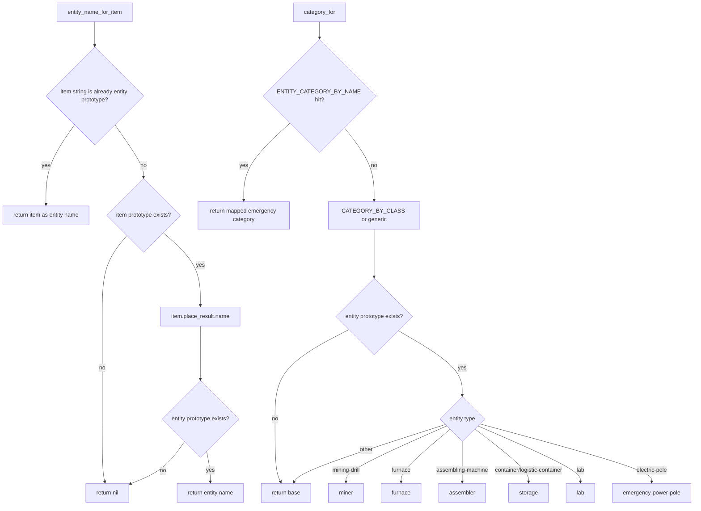

---

## 13. Active Ghost Resolution Flow

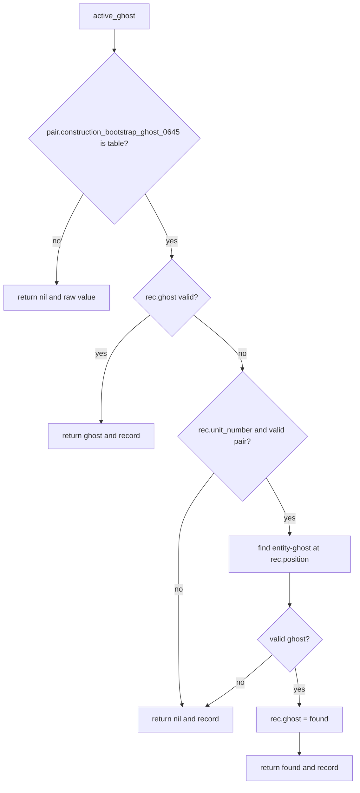

The reacquisition condition checks `rec.unit_number`, but `surface.find_entity` uses only ghost name and recorded position. The stored unit number is acting as a marker that a real ghost had once existed.

---

## 14. Built Target Completion Flow

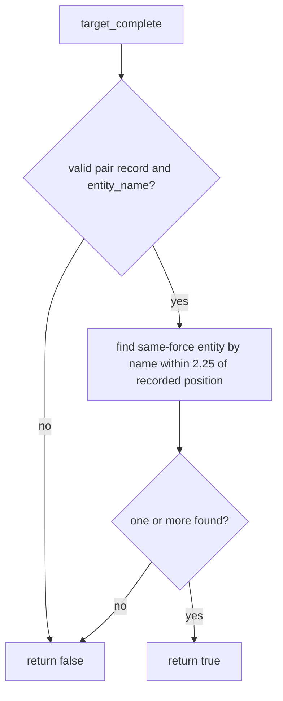

Completion is based on a matching physical entity near the planned position, not on ghost disappearance alone.

---

## 15. Science Objective Selector

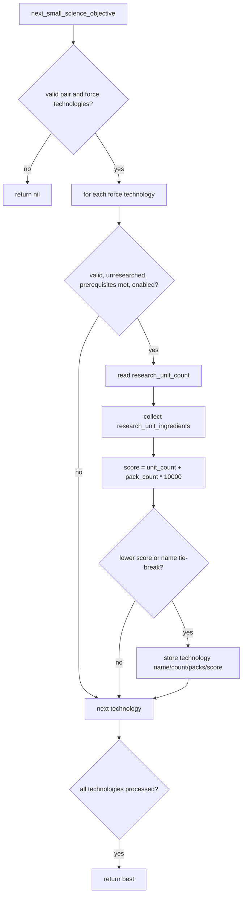

### Current science authority boundary

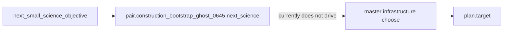

The score heavily prioritizes technologies requiring fewer distinct science pack types, because every science pack ingredient adds 10,000 points. Research unit count is a secondary factor.

---

## 16. Ghost Creation and Record Flow

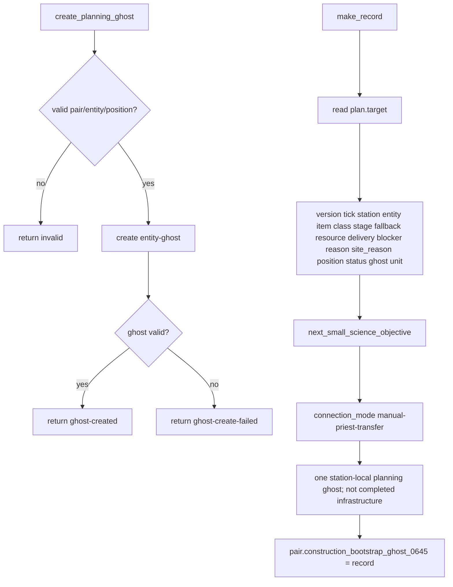

`connection_mode = manual-priest-transfer` is currently metadata. It does not actively build belts, dispatch trains, or create interstation logistics.

---

## 17. Ghost Planner Main Service Flow

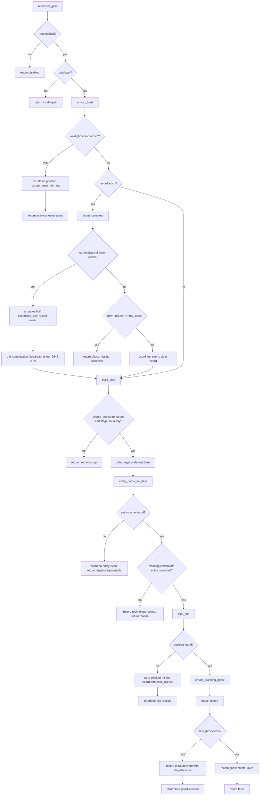

---

## 18. Blocked-No-Site Record Flow

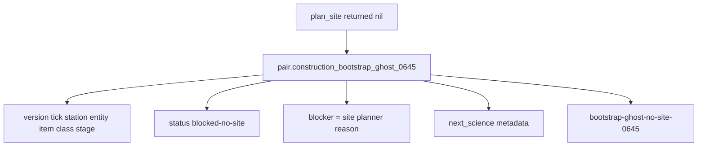

Because this creates a record without a valid ghost, subsequent service calls enter the missing-record retry cooldown for ten seconds before trying again.

---

## 19. Ghost Planner Service / Install Flow

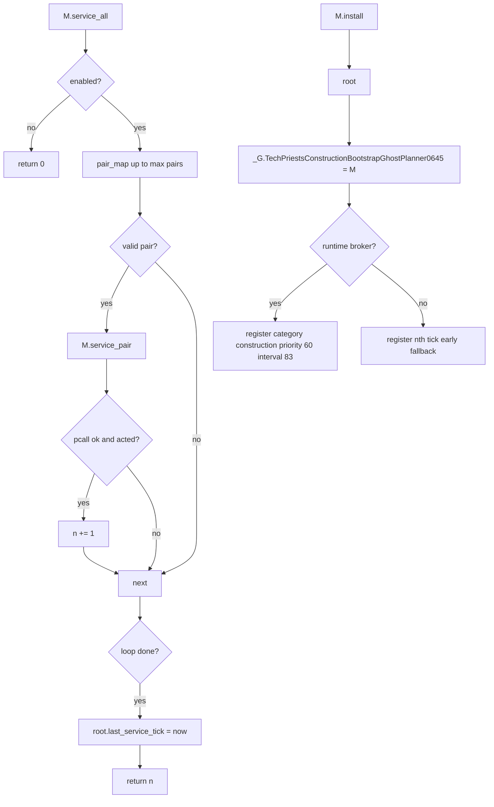

---

## 20. Cross-Module Sequence

```mermaid
sequenceDiagram
    participant GP as Ghost Planner 0645
    participant MP as Master Plan 0644
    participant PC as Planning Constraints 0646
    participant SP as Site Planner
    participant W as Factorio World
    participant CP as Construction Planner
    participant CPA as Placement Authority 0656

    GP->>MP: build_plan(pair)
    MP->>MP: scan_resources + scan_roles
    MP->>MP: choose first missing bootstrap role
    MP-->>GP: plan.target
    GP->>GP: entity_name_for_item(target.preferred_item)
    GP->>PC: entity_unlocked(pair, entity)
    PC-->>GP: unlocked / reason
    GP->>SP: plan_site(pair, entity, category)
    SP-->>GP: position / reason
    GP->>W: create entity-ghost
    GP->>GP: store construction_bootstrap_ghost_0645
    CP->>CP: choose_placeable adopts matching ghost when item exists
    CPA->>CP: service construction aggressively
    CP->>W: remove item + destroy ghost + create physical entity
    CP->>GP: last success / matching built entity visible next survey
    GP->>GP: target_complete -> clear ghost record
    MP->>MP: next survey advances bootstrap stage
```

---

## 21. Infrastructure Planning State Write Matrix

| State field | Writer | Meaning | Risk |
|---|---|---|---|
| `pair.master_infrastructure_plan_0644` | `M.build_plan` | Latest station survey and next target | Critical upstream planning state |
| `plan.resources` | master planner | Resource counts/amounts in radius | Medium; stale only until next survey/build |
| `plan.roles` | master planner | Existing infrastructure role counts | High; drives target selection |
| `plan.target` | `choose` via `build_plan` | Next fixed bootstrap target | Critical |
| `plan.stage/status/blocker` | master planner | Planning state and missing item reason | High |
| `pair.construction_bootstrap_ghost_0645` | ghost planner | Current one-ghost plan record | Critical construction handoff |
| `rec.ghost` | `make_record`, `active_ghost` | LuaEntity ghost reference | High; can become invalid |
| `rec.status` | ghost service | ghosted/built/planned-no-ghost/blocked-no-site | High |
| `rec.next_science` | `make_record` or blocked record | Informational smallest technology objective | Medium; not active authority yet |
| `rec.connection_mode` | `make_record` | Manual priest transfer metadata | Low; not executed |
| `root.stats/recent` | both modules | Planner/ghost metrics | Diagnostic |

---

## 22. Failure / Exit Matrix

### Master planner

| Exit | Trigger | State change | Expected next behavior |
|---|---|---|---|
| `invalid-pair` | station/priest invalid | no plan | pair cleanup |
| `disabled` | root disabled | no new plan | old plan may remain |
| `planned` missing item | selected role absent and item not present | blocker `missing <item>` | fetch/craft/acquisition should obtain item |
| `planned` item present | selected role absent and item present | blocker nil | ghost/construction should proceed |
| `ready` | all surveyed roles present | stage ready | bootstrap ghost planner exits not-bootstrap |

### Ghost planner

| Exit | Trigger | State change | Expected next behavior |
|---|---|---|---|
| `disabled` | root disabled | no changes | no ghost planning |
| `invalid-pair` | invalid pair | no changes | cleanup |
| `active-ghost-present` | valid stored ghost exists | refresh last_seen_tick | wait for construction |
| `ghost-missing-cooldown` | record exists, ghost missing, retry under ten seconds | record retained | wait before retry |
| `not-bootstrap` | plan ready/no target | no new ghost | idle or other planning |
| `target-not-placeable` | target item has no entity/place_result | event only | plan/item mapping bug |
| `technology-locked` | constraints reject entity | event only | choose unlocked fallback or await research |
| `no-site` | site planner cannot place entity | blocked-no-site record | retry after cooldown/site change |
| `ghost-created` | ghost entity created | full record stored | construction planner waits for item/adopts ghost |
| `ghost-create-failed` | world creation failed | planned-no-ghost record | retry after cooldown |
| built cleanup | physical entity found near planned position | marks built then clears record | master plan advances next stage |

---

## 23. Infrastructure Planning Debugging Decision Tree

```mermaid
flowchart TD
    Bug[No planned structure / wrong planned structure] --> Plan{pair.master_infrastructure_plan_0644 exists?}
    Plan -- no --> MasterInstall[Check master planner install/service/build_plan]
    Plan -- yes --> Roles{plan.roles matches actual local entities?}
    Roles -- no --> RoleScan[Check entity_role classification and radius]
    Roles -- yes --> Resources{plan.resources matches local patches?}
    Resources -- no --> ResourceScan[Check scan_resources and radius]
    Resources -- yes --> Target{plan.target is expected fixed next role?}
    Target -- no --> ChooseBug[Check choose fixed priority and role names]
    Target -- yes --> Item{target.preferred_item correct and available?}
    Item -- no --> Availability[Check item_available fallback semantics/station_count]
    Item -- yes --> GhostRec{construction_bootstrap_ghost_0645 exists?}
    GhostRec -- no --> GhostService[Check ghost planner install/should_bootstrap]
    GhostRec -- yes --> Status{record status}
    Status -- ghosted --> Visible{ghost entity visible/valid?}
    Visible -- no --> Reacquire[active_ghost/unit marker/position issue]
    Visible -- yes --> Construction[Check construction planner adoption and item stock]
    Status -- blocked-no-site --> Site[Check site planner blocker]
    Status -- planned-no-ghost --> GhostCreate[Check surface.create_entity entity-ghost]
    Status -- built --> Clear[Record should clear and master plan advance]
```

---

## 24. Current Architectural Gaps Exposed by the Map

1. **Science objective is informational only.** `next_small_science_objective` does not currently decompose recipes, choose science infrastructure, or coordinate production across stations.
2. **The bootstrap sequence is fixed.** It does not yet derive the smallest viable production layout for the chosen science pack.
3. **Role existence is not operational readiness.** An entity can satisfy a role even if unpowered, unfueled, damaged, recipe-less, or disconnected.
4. **Storage is any container.** The survey does not distinguish usable station-owned storage from unrelated same-force containers in range.
5. **Any miner satisfies extraction.** It does not confirm that the miner covers the resource chosen in `plan.target.resource` or that output can be collected.
6. **Any assembler satisfies crafting.** It does not check recipes, inputs, power, or output routing.
7. **Any lab satisfies research.** It does not check science-pack production or lab supply.
8. **Delivery metadata is not execution.** Strings such as `direct-service-until-belts` and `place-near-storage` do not build transfer infrastructure.
9. **Blocked-no-site uses the same record field as a real ghost.** This works through cooldown logic but conflates planning failure state with active ghost state.
10. **Planner category mismatch.** The master planner registers under diagnostics despite being active planning state; service order should be reviewed before future expansion.

---

## 25. Next Mapping Targets

The next logical drilldown should cover one of these connected branches:

1. `emergency_production_executor_0514.lua` and station crafting handoff, to map how missing target items are actually produced.
2. `station_catalog` and inventory steward modules, to map how station inventory availability and nearby infrastructure are represented.
3. `consecration_executor_0515.lua`, to finish the primary maintenance branch.
4. `single_dispatcher_0510.lua`, to compare the intended priority order against the actual arbitration code.

The highest-value next pass is `single_dispatcher_0510.lua`, because it will reveal the actual broad branch order that invokes these already-mapped executors.
