# Tech-Priests Function-Level Mermaid Drilldown: Single Dispatcher 0510

Version: 0.1.667-map-pass-8  
Previous drilldown: `docs/BEHAVIOR_MERMAID_FUNCTION_DRILLDOWN_0666_INFRASTRUCTURE_PLANNING.md`  
Companion overview: `docs/BEHAVIOR_MERMAID_MAP_0660.md`

Purpose: map the actual broad arbitration core currently present in code. This document distinguishes what the dispatcher directly owns, what is merely classified, what remains legacy-controlled, and what later wrappers preempt before the dispatcher runs.

Mapped module:

- `single_dispatcher_0510.lua`

Directly connected modules:

- `order_queue_0469.lua`
- `combat_repair_doctrine_0517.lua`
- `action_state_arbiter_0488.lua`
- `direct_acquisition_executor_0513.lua`
- `emergency_production_executor_0514.lua`
- `crafting_executor.lua`
- `consecration_executor_0515.lua`
- `repair_executor_0516.lua`
- `acquisition_executor.lua`
- legacy global `tick_pair`
- external wrapper: `logistics_fetch_executor_0527.lua`

Important current-code truths:

1. The dispatcher is not yet the only behavior owner.
2. It directly executes:
   - direct acquisition
   - station craft / emergency production
   - consecration
   - combat repair
   - ordinary repair
3. It does **not** directly execute ordinary combat or construction. The code explicitly leaves those as `legacy-leaf-family`.
4. `logistics_fetch_executor_0527` wraps `single_dispatcher_0510.service_pair`, so a real-inventory fetch can run before the dispatcher's own classification/execution path.
5. Construction placement and movement/leaf authorities also run as independent broker services rather than dispatcher branches.
6. The legacy `tick_pair` gate window is five ticks, while the dispatcher interval is twenty-three ticks. Therefore the legacy gate is not continuously active between dispatcher pulses.
7. The dispatcher still installs `/tp-dispatcher-0510`; this remains a command cleanup target.

---

## 1. Actual Runtime Position of the Dispatcher

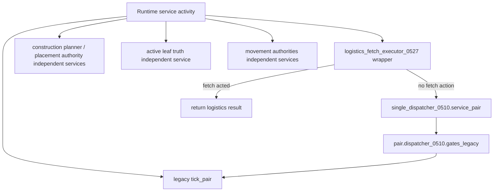
```mermaid
flowchart TD
    Tick[Runtime service activity]
    LF[logistics_fetch_executor_0527 wrapper]
    D[single_dispatcher_0510.service_pair]
    CP[construction planner / placement authority independent services]
    Leaf[active leaf truth independent service]
    Move[movement authorities independent services]
    Legacy[legacy tick_pair]

    Tick --> LF
    LF -->|fetch acted| FetchDone[return logistics result]
    LF -->|no fetch action| D

    Tick --> CP
    Tick --> Leaf
    Tick --> Move
    Tick --> Legacy

    D --> Gate[pair.dispatcher_0510.gates_legacy]
    Gate --> Legacy
```

This is not a single call tree. It is a set of independently scheduled services plus wrappers around the dispatcher's service function.

---

## 2. Dispatcher Ownership Flags

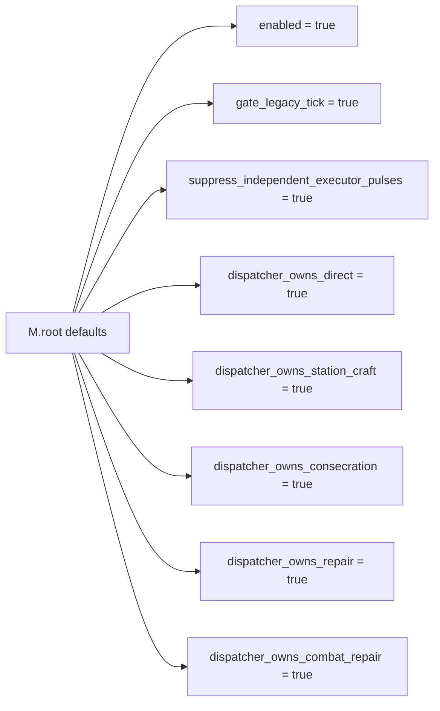
```mermaid
flowchart LR
    Root[M.root defaults]
    Root --> Enabled[enabled = true]
    Root --> Gate[gate_legacy_tick = true]
    Root --> Pulses[suppress_independent_executor_pulses = true]
    Root --> Direct[dispatcher_owns_direct = true]
    Root --> Craft[dispatcher_owns_station_craft = true]
    Root --> Consecration[dispatcher_owns_consecration = true]
    Root --> Repair[dispatcher_owns_repair = true]
    Root --> CombatRepair[dispatcher_owns_combat_repair = true]
```

There is no `dispatcher_owns_combat` or `dispatcher_owns_construction` flag in this module.

---

## 3. Function Inventory

| Function | Type | Role | Major side effects |
|---|---:|---|---|
| `now`, `valid`, `safe`, `lower`, `station_unit`, `priest_unit`, `valid_pair`, `pair_map`, `dist_sq` | local helpers | Time/entity/string/pair/distance helpers | none |
| `M.root()` | public storage root | Ensures dispatcher configuration/state | writes `storage.tech_priests.single_dispatcher_0510` |
| `stat(name,n)` | local metric | Increments dispatcher stats | writes root stats |
| `record(action,pair,detail)` | local history | Records dispatch/wrapper events | writes root recent |
| `current_direct_task(pair)` | local selector | Finds current direct task in three task containers | none |
| `target_entity(cur)` | local extractor | Finds current entity/target/source | none |
| `target_position(pair,cur)` | local extractor | Finds entity/current/pair target position | none |
| `target_label(cur)` | local formatter | Formats target for diagnostics | none |
| `repair_identity(pair,reason)` | local repair | Rebuilds pair identity indexes and reactivates priest | writes pair IDs and storage pair indexes; sets priest indestructible/active |
| `order_tick(pair)` | local scheduler call | Advances order queue before classification | calls `order_queue_0469.tick_pair` |
| `choose_action(pair)` | local classifier selector | Gets action from combat repair, arbiter, or fallback chain | none directly |
| `action_family(action)` | local normalizer | Converts action kind into dispatcher family | none |
| `execute_direct(pair)` | local executor adapter | Calls direct 0513, then old acquisition executor fallback | executor side effects |
| `execute_craft(pair)` | local executor adapter | Calls emergency production 0514, then crafting executor fallback | executor side effects |
| `execute_consecration(pair)` | local executor adapter | Calls consecration 0515 | executor side effects |
| `execute_combat_repair(pair)` | local executor adapter | Calls combat repair doctrine 0517 | executor side effects |
| `execute_repair(pair)` | local executor adapter | Calls repair executor 0516 | executor side effects |
| `active_family_needs_legacy_gate(family,pair)` | local gate selector | Determines whether legacy `tick_pair` should be suppressed | reads family-specific executor active state and mode |
| `M.service_pair(pair,reason)` | public dispatcher | Repairs identity, ticks order queue, classifies, executes owned family, records state | writes `pair.dispatcher_0510` and action claim |
| `M.service_all(reason)` | public loop | Dispatches all valid pairs | writes `root.dispatching` |
| `M.should_gate_legacy(pair)` | public predicate | Returns true during fresh dispatcher-owned active family window | reads dispatcher state/tick |
| `wrap_legacy_tick_pair()` | local wrapper | Wraps global `tick_pair` to suppress it when gated | replaces `_G.tick_pair` |
| `wrap_executor_pulses()` | local wrapper | Suppresses old independent acquisition/craft pulses | replaces `acquisition_executor.pulse`, `crafting_executor.pulse` |
| `selected_pair(player)` | local command helper | Resolves selected pair | none |
| `install_command()` | local command installer | Registers `/tp-dispatcher-0510` | command surface |
| `wrap_pair_dump()` | local diagnostics wrapper | Adds dispatcher state to pair dump | replaces diagnostics `pair_dump_lines` |
| `M.install()` | public installer | Installs wrappers, command, service registration, global export | writes `_G.TechPriestsSingleDispatcher0510` |

---

## 4. Pair Identity Repair Flow

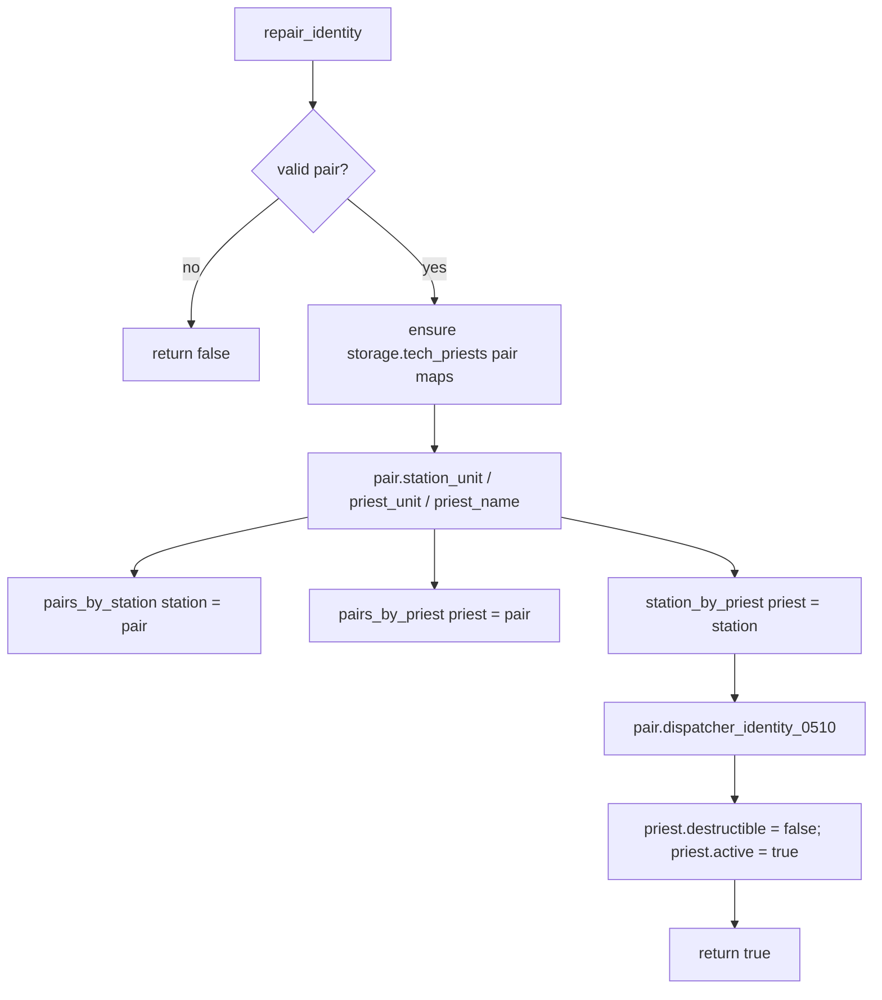
```mermaid
flowchart TD
    Repair[repair_identity] --> Valid{valid pair?}
    Valid -- no --> False[return false]
    Valid -- yes --> Storage[ensure storage.tech_priests pair maps]
    Storage --> PairIDs[pair.station_unit / priest_unit / priest_name]
    PairIDs --> ByStation[pairs_by_station station = pair]
    PairIDs --> ByPriest[pairs_by_priest priest = pair]
    PairIDs --> StationByPriest[station_by_priest priest = station]
    StationByPriest --> Trace[pair.dispatcher_identity_0510]
    Trace --> Priest[priest.destructible = false; priest.active = true]
    Priest --> True[return true]
```

The dispatcher repairs identity every service call before choosing work. This is lifecycle repair behavior embedded inside arbitration.

---

## 5. Order Queue Pre-Classification Flow

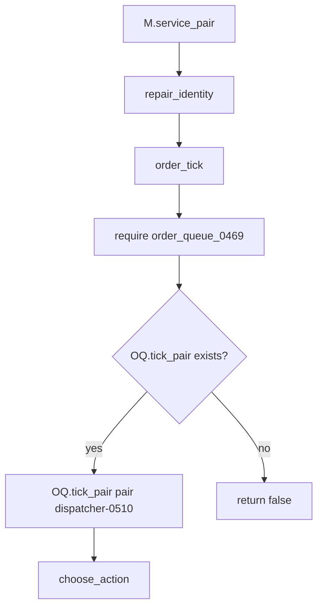
```mermaid
flowchart TD
    Service[M.service_pair] --> Identity[repair_identity]
    Identity --> Order[order_tick]
    Order --> Require[require order_queue_0469]
    Require --> HasTick{OQ.tick_pair exists?}
    HasTick -- yes --> Tick[OQ.tick_pair pair dispatcher-0510]
    HasTick -- no --> False[return false]
    Tick --> Classify[choose_action]
```

The order queue is advanced before action classification. Therefore order queue mutations can change the action selected in the same dispatcher pulse.

---

## 6. Actual `choose_action` Priority

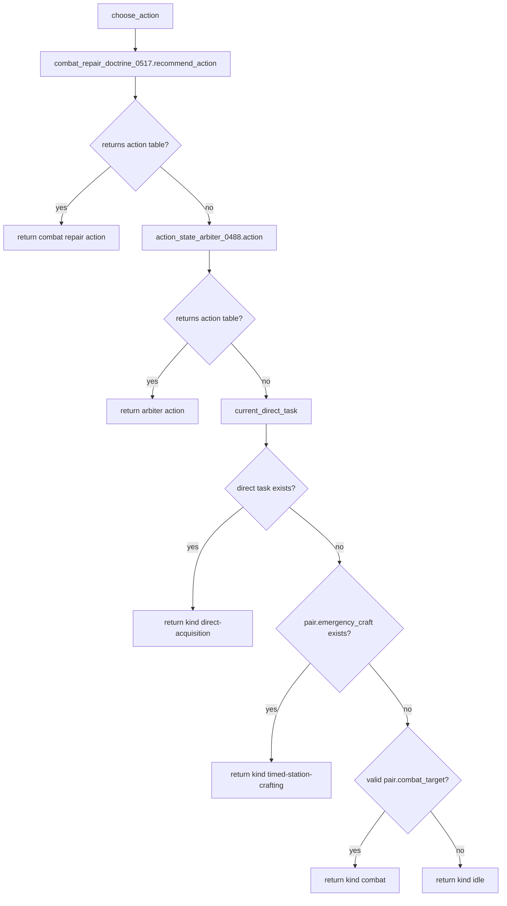
```mermaid
flowchart TD
    Choose[choose_action]

    Choose --> CombatRepair[combat_repair_doctrine_0517.recommend_action]
    CombatRepair --> CRAction{returns action table?}
    CRAction -- yes --> ReturnCR[return combat repair action]
    CRAction -- no --> Arbiter[action_state_arbiter_0488.action]

    Arbiter --> ArbAction{returns action table?}
    ArbAction -- yes --> ReturnArb[return arbiter action]
    ArbAction -- no --> Direct[current_direct_task]

    Direct --> HasDirect{direct task exists?}
    HasDirect -- yes --> ReturnDirect[return kind direct-acquisition]
    HasDirect -- no --> Emergency{pair.emergency_craft exists?}

    Emergency -- yes --> ReturnCraft[return kind timed-station-crafting]
    Emergency -- no --> Combat{valid pair.combat_target?}

    Combat -- yes --> ReturnCombat[return kind combat]
    Combat -- no --> ReturnIdle[return kind idle]
```

This is the dispatcher's own fallback order. The full behavior order cannot be known until `action_state_arbiter_0488.action()` is mapped because the arbiter usually wins before direct/emergency/combat fallback checks.

---

## 7. Action Family Normalization

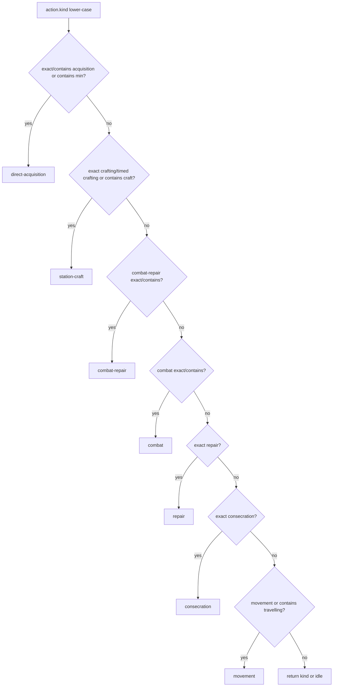
```mermaid
flowchart TD
    Kind[action.kind lower-case]
    Kind --> Acquisition{exact/contains acquisition or contains min?}
    Acquisition -- yes --> Direct[direct-acquisition]
    Acquisition -- no --> Craft{exact crafting/timed crafting or contains craft?}
    Craft -- yes --> StationCraft[station-craft]
    Craft -- no --> CombatRepair{combat-repair exact/contains?}
    CombatRepair -- yes --> CombatRepairFamily[combat-repair]
    CombatRepair -- no --> Combat{combat exact/contains?}
    Combat -- yes --> CombatFamily[combat]
    Combat -- no --> Repair{exact repair?}
    Repair -- yes --> RepairFamily[repair]
    Repair -- no --> Consecration{exact consecration?}
    Consecration -- yes --> ConsecrationFamily[consecration]
    Consecration -- no --> Movement{movement or contains travelling?}
    Movement -- yes --> MovementFamily[movement]
    Movement -- no --> Other[return kind or idle]
```

Potential broad-match risk: any action kind containing `min` is normalized to `direct-acquisition`, even when `min` might occur in an unrelated word.

---

## 8. Executor Adapter Flow

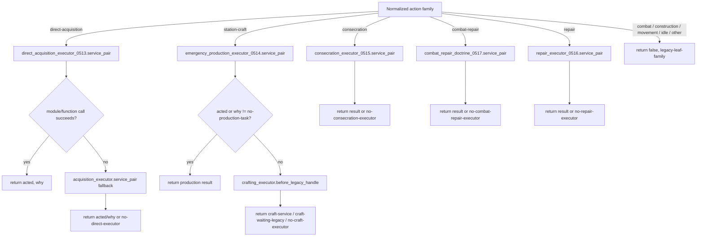
```mermaid
flowchart TD
    Family[Normalized action family]

    Family -->|direct-acquisition| Direct513[direct_acquisition_executor_0513.service_pair]
    Direct513 --> DirectOK{module/function call succeeds?}
    DirectOK -- yes --> DirectResult[return acted, why]
    DirectOK -- no --> OldDirect[acquisition_executor.service_pair fallback]
    OldDirect --> OldDirectResult[return acted/why or no-direct-executor]

    Family -->|station-craft| Prod514[emergency_production_executor_0514.service_pair]
    Prod514 --> ProdMeaningful{acted or why != no-production-task?}
    ProdMeaningful -- yes --> CraftResult[return production result]
    ProdMeaningful -- no --> OldCraft[crafting_executor.before_legacy_handle]
    OldCraft --> OldCraftResult[return craft-service / craft-waiting-legacy / no-craft-executor]

    Family -->|consecration| Cons515[consecration_executor_0515.service_pair]
    Cons515 --> ConsResult[return result or no-consecration-executor]

    Family -->|combat-repair| CR517[combat_repair_doctrine_0517.service_pair]
    CR517 --> CRResult[return result or no-combat-repair-executor]

    Family -->|repair| Repair516[repair_executor_0516.service_pair]
    Repair516 --> RepairResult[return result or no-repair-executor]

    Family -->|combat / construction / movement / idle / other| LegacyLeaf[return false, legacy-leaf-family]
```

---

## 9. Main Dispatcher Service Flow

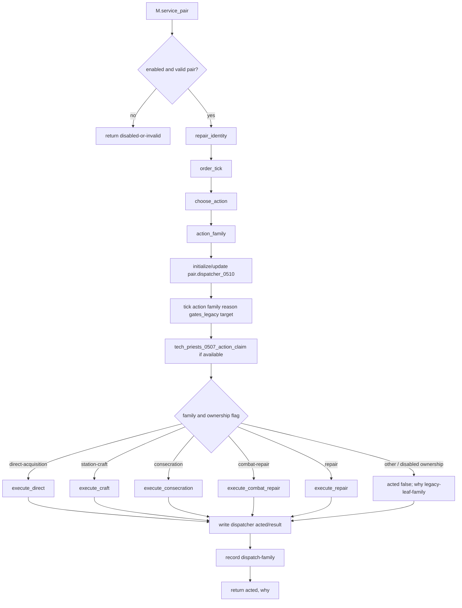
```mermaid
flowchart TD
    Service[M.service_pair] --> Enabled{enabled and valid pair?}
    Enabled -- no --> Exit[return disabled-or-invalid]
    Enabled -- yes --> Identity[repair_identity]
    Identity --> Order[order_tick]
    Order --> Action[choose_action]
    Action --> Family[action_family]

    Family --> State[initialize/update pair.dispatcher_0510]
    State --> Fields[tick action family reason gates_legacy target]
    Fields --> Claim[tech_priests_0507_action_claim if available]
    Claim --> Owned{family and ownership flag}

    Owned -- direct-acquisition --> ExecDirect[execute_direct]
    Owned -- station-craft --> ExecCraft[execute_craft]
    Owned -- consecration --> ExecCons[execute_consecration]
    Owned -- combat-repair --> ExecCR[execute_combat_repair]
    Owned -- repair --> ExecRepair[execute_repair]
    Owned -- other / disabled ownership --> Legacy[acted false; why legacy-leaf-family]

    ExecDirect --> Result
    ExecCraft --> Result
    ExecCons --> Result
    ExecCR --> Result
    ExecRepair --> Result
    Legacy --> Result[write dispatcher acted/result]
    Result --> Record[record dispatch-family]
    Record --> Return[return acted, why]
```

---

## 10. Dispatcher Pair State Shape

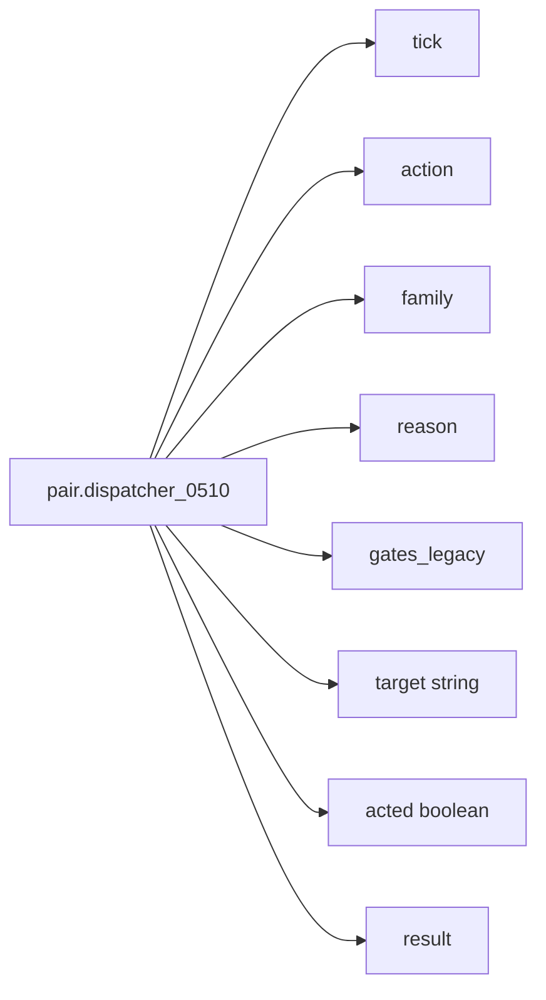
```mermaid
flowchart LR
    D[pair.dispatcher_0510]
    D --> Tick[tick]
    D --> Action[action]
    D --> Family[family]
    D --> Reason[reason]
    D --> Gate[gates_legacy]
    D --> Target[target string]
    D --> Acted[acted boolean]
    D --> Result[result]
```

The target is stored as a formatted string, not as an entity reference. Concrete movement/leaf target ownership remains in executor and movement modules.

---

## 11. Legacy Gate Decision

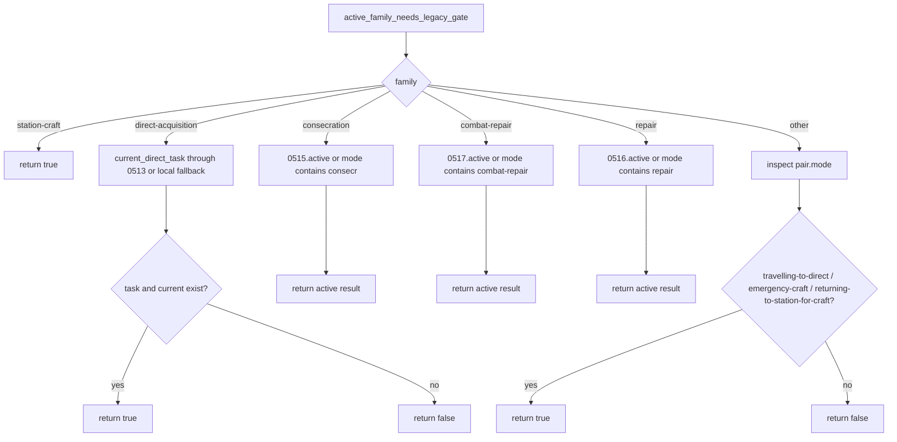
```mermaid
flowchart TD
    Gate[active_family_needs_legacy_gate]
    Gate --> Family{family}

    Family -- station-craft --> TrueCraft[return true]

    Family -- direct-acquisition --> DirectExecutor[current_direct_task through 0513 or local fallback]
    DirectExecutor --> DirectActive{task and current exist?}
    DirectActive -- yes --> TrueDirect[return true]
    DirectActive -- no --> FalseDirect[return false]

    Family -- consecration --> ConsActive[0515.active or mode contains consecr]
    ConsActive --> GateCons[return active result]

    Family -- combat-repair --> CRActive[0517.active or mode contains combat-repair]
    CRActive --> GateCR[return active result]

    Family -- repair --> RepairActive[0516.active or mode contains repair]
    RepairActive --> GateRepair[return active result]

    Family -- other --> Mode[inspect pair.mode]
    Mode --> Special{travelling-to-direct / emergency-craft / returning-to-station-for-craft?}
    Special -- yes --> TrueMode[return true]
    Special -- no --> False[return false]
```

Ordinary combat and construction do not inherently request a legacy gate through their family names.

---

## 12. Legacy Gate Time Window

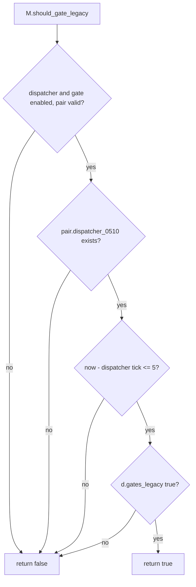
```mermaid
flowchart TD
    Should[M.should_gate_legacy] --> Enabled{dispatcher and gate enabled, pair valid?}
    Enabled -- no --> False[return false]
    Enabled -- yes --> State{pair.dispatcher_0510 exists?}
    State -- no --> False
    State -- yes --> Fresh{now - dispatcher tick <= 5?}
    Fresh -- no --> False
    Fresh -- yes --> Gate{d.gates_legacy true?}
    Gate -- yes --> True[return true]
    Gate -- no --> False
```

### Timing mismatch

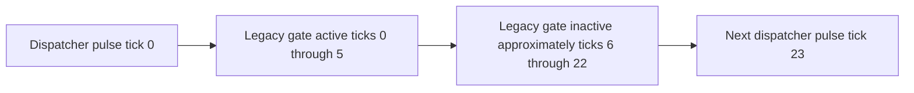
```mermaid
flowchart LR
    Dispatch0[Dispatcher pulse tick 0]
    Gate0[Legacy gate active ticks 0 through 5]
    Open[Legacy gate inactive approximately ticks 6 through 22]
    Dispatch23[Next dispatcher pulse tick 23]

    Dispatch0 --> Gate0 --> Open --> Dispatch23
```

Unless another caller invokes `M.service_pair` more frequently, the five-tick gate window does not cover the full twenty-three-tick dispatcher interval.

---

## 13. Legacy `tick_pair` Wrapper

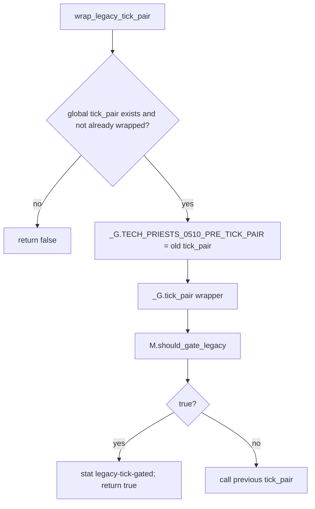
```mermaid
flowchart TD
    Wrap[wrap_legacy_tick_pair] --> Exists{global tick_pair exists and not already wrapped?}
    Exists -- no --> False[return false]
    Exists -- yes --> Save[_G.TECH_PRIESTS_0510_PRE_TICK_PAIR = old tick_pair]
    Save --> Replace[_G.tick_pair wrapper]
    Replace --> Gate[M.should_gate_legacy]
    Gate --> Gated{true?}
    Gated -- yes --> Suppress[stat legacy-tick-gated; return true]
    Gated -- no --> Old[call previous tick_pair]
```

The wrapper suppresses the whole legacy `tick_pair`, not merely the conflicting action family inside it.

---

## 14. Independent Executor Pulse Suppression

### Acquisition executor pulse

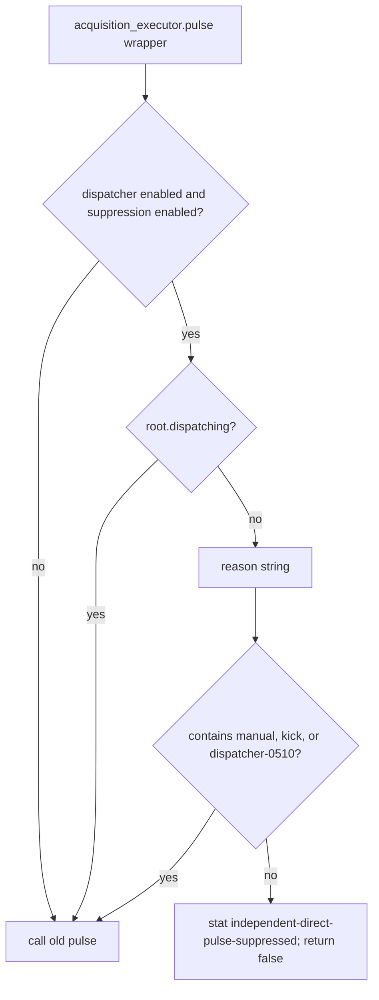
```mermaid
flowchart TD
    Pulse[acquisition_executor.pulse wrapper] --> Enabled{dispatcher enabled and suppression enabled?}
    Enabled -- no --> Old[call old pulse]
    Enabled -- yes --> Dispatching{root.dispatching?}
    Dispatching -- yes --> Old
    Dispatching -- no --> Reason[reason string]
    Reason --> Allowed{contains manual, kick, or dispatcher-0510?}
    Allowed -- yes --> Old
    Allowed -- no --> Suppress[stat independent-direct-pulse-suppressed; return false]
```

### Crafting executor pulse

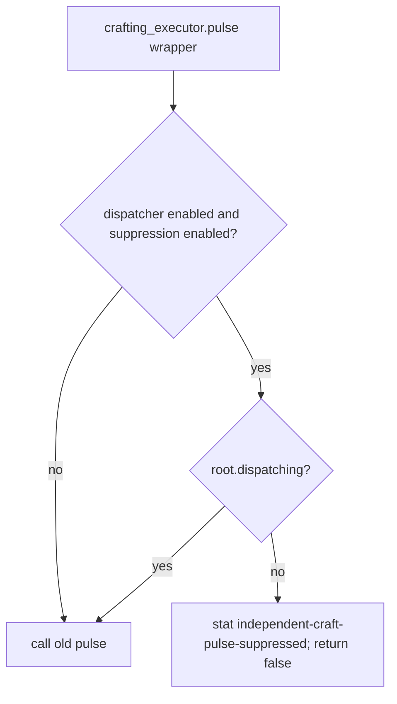
```mermaid
flowchart TD
    Pulse[crafting_executor.pulse wrapper] --> Enabled{dispatcher enabled and suppression enabled?}
    Enabled -- no --> Old[call old pulse]
    Enabled -- yes --> Dispatching{root.dispatching?}
    Dispatching -- yes --> Old
    Dispatching -- no --> Suppress[stat independent-craft-pulse-suppressed; return false]
```

The craft pulse wrapper has no manual/kick exception. It allows the pulse only while the dispatcher's `root.dispatching` flag is true or suppression is disabled.

---

## 15. Service-All Scheduling Flow

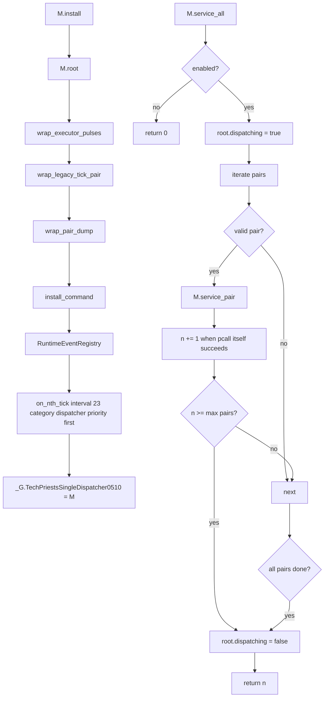
```mermaid
flowchart TD
    Install[M.install] --> Root[M.root]
    Root --> PulseWrap[wrap_executor_pulses]
    PulseWrap --> TickWrap[wrap_legacy_tick_pair]
    TickWrap --> Dump[wrap_pair_dump]
    Dump --> Command[install_command]
    Command --> Registry[RuntimeEventRegistry]
    Registry --> Register[on_nth_tick interval 23 category dispatcher priority first]
    Register --> Global[_G.TechPriestsSingleDispatcher0510 = M]

    ServiceAll[M.service_all] --> Enabled{enabled?}
    Enabled -- no --> Zero[return 0]
    Enabled -- yes --> Dispatching[root.dispatching = true]
    Dispatching --> Loop[iterate pairs]
    Loop --> Valid{valid pair?}
    Valid -- yes --> Service[M.service_pair]
    Valid -- no --> Next[next]
    Service --> Count[n += 1 when pcall itself succeeds]
    Count --> Limit{n >= max pairs?}
    Limit -- no --> Next
    Limit -- yes --> Finish
    Next --> Done{all pairs done?}
    Done -- yes --> Finish[root.dispatching = false]
    Finish --> Return[return n]
```

`n` increments when `pcall(M.service_pair)` succeeds, regardless of whether the dispatcher actually performed an action.

---

## 16. External Logistics Wrapper Precedence

`logistics_fetch_executor_0527` wraps `D.service_pair` after requiring the dispatcher. Its wrapper performs fetch service first.

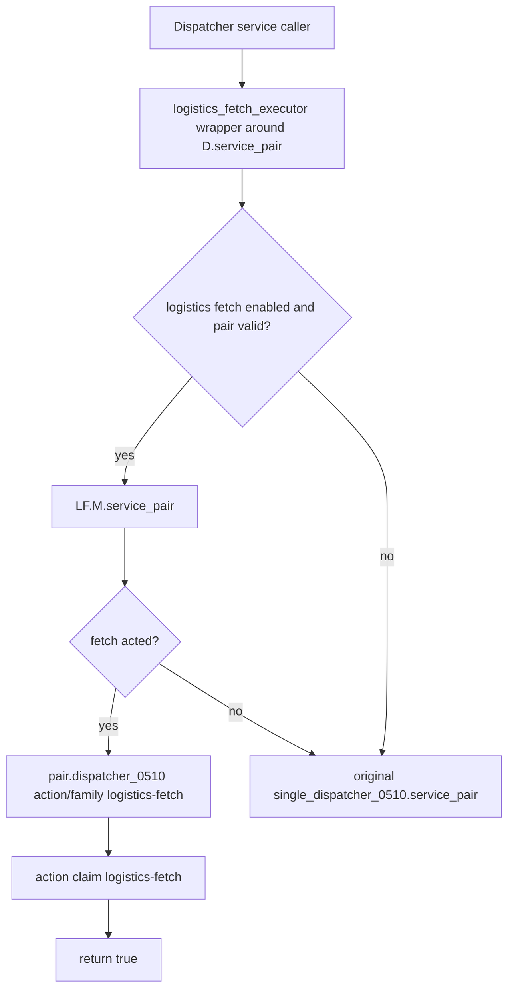
```mermaid
flowchart TD
    Caller[Dispatcher service caller] --> LFWrapper[logistics_fetch_executor wrapper around D.service_pair]
    LFWrapper --> Enabled{logistics fetch enabled and pair valid?}
    Enabled -- yes --> Fetch[LF.M.service_pair]
    Fetch --> Acted{fetch acted?}
    Acted -- yes --> Write[pair.dispatcher_0510 action/family logistics-fetch]
    Write --> Claim[action claim logistics-fetch]
    Claim --> ReturnFetch[return true]
    Acted -- no --> Original[original single_dispatcher_0510.service_pair]
    Enabled -- no --> Original
```

Consequences:

- Logistics fetch is not represented in the original dispatcher's `choose_action` or executor branches.
- It is a pre-dispatch wrapper family.
- The actual runtime order depends on module installation/wrapper order.

---

## 17. Construction and Combat Outside Direct Dispatcher Ownership

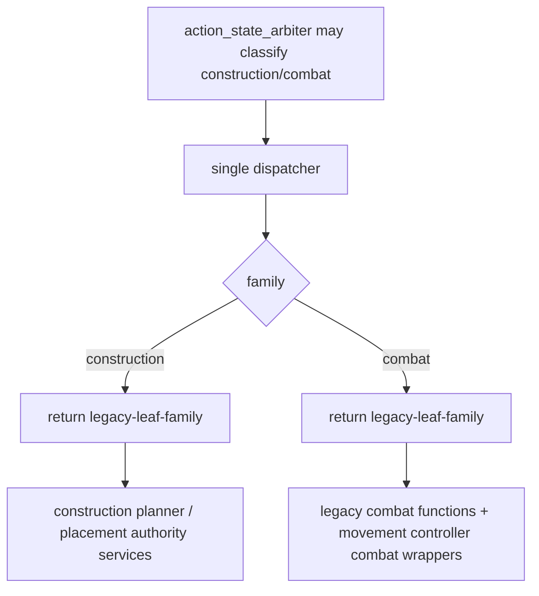
```mermaid
flowchart TD
    Arbiter[action_state_arbiter may classify construction/combat]
    Arbiter --> Dispatcher[single dispatcher]
    Dispatcher --> Family{family}
    Family -- construction --> LegacyConstruction[return legacy-leaf-family]
    Family -- combat --> LegacyCombat[return legacy-leaf-family]

    LegacyConstruction --> IndependentConstruction[construction planner / placement authority services]
    LegacyCombat --> LegacyCombatModules[legacy combat functions + movement controller combat wrappers]
```

This is why the overview map's desired centralized priority order is not yet equivalent to one dispatcher switch statement.

---

## 18. Command Surface

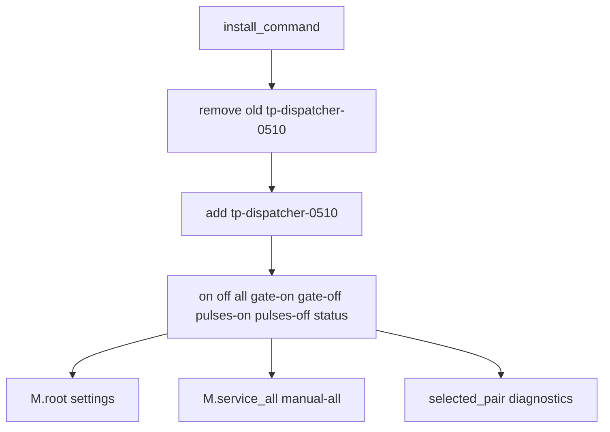
```mermaid
flowchart TD
    Command[install_command] --> Remove[remove old tp-dispatcher-0510]
    Remove --> Add[add tp-dispatcher-0510]
    Add --> Params[on off all gate-on gate-off pulses-on pulses-off status]
    Params --> Root[M.root settings]
    Params --> Manual[M.service_all manual-all]
    Params --> Selected[selected_pair diagnostics]
```

Cleanup target: remove this command once automatic diagnostics expose the same state.

---

## 19. Diagnostics Pair-Dump Wrapper

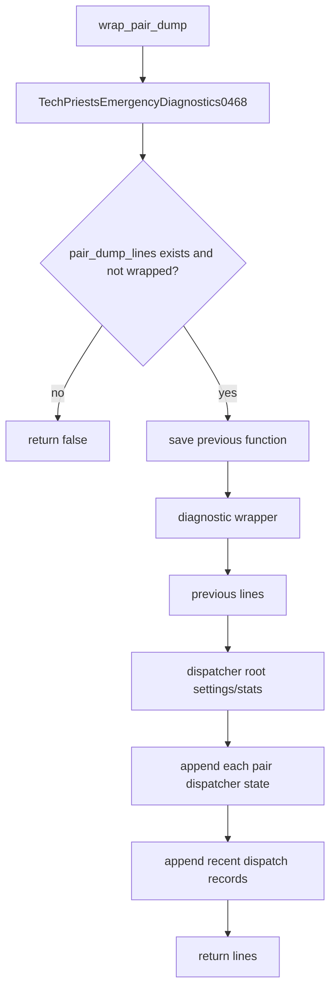
```mermaid
flowchart TD
    Wrap[wrap_pair_dump] --> Diag[TechPriestsEmergencyDiagnostics0468]
    Diag --> Exists{pair_dump_lines exists and not wrapped?}
    Exists -- no --> False[return false]
    Exists -- yes --> Save[save previous function]
    Save --> Replace[diagnostic wrapper]
    Replace --> Prev[previous lines]
    Prev --> Root[dispatcher root settings/stats]
    Root --> PairLoop[append each pair dispatcher state]
    PairLoop --> Recent[append recent dispatch records]
    Recent --> Return[return lines]
```

---

## 20. Dispatcher State Write Matrix

| State field | Writer | Meaning | Risk |
|---|---|---|---|
| `storage.tech_priests.single_dispatcher_0510` | `M.root` | Dispatcher configuration, stats, history | High configuration authority |
| `root.dispatching` | `M.service_all` | Allows wrapped independent pulses during dispatch | High; stale true/false changes pulse behavior |
| `pair.station_unit`, `pair.priest_unit`, `pair.priest_name` | `repair_identity` | Pair identity repair | High lifecycle/index correctness |
| `pairs_by_station`, `pairs_by_priest`, `station_by_priest` | `repair_identity` | Global pair indexes | Critical lifecycle state |
| `pair.dispatcher_identity_0510` | `repair_identity` | Identity repair trace | Diagnostic |
| `pair.priest.destructible` | `repair_identity` | Priest protection | High gameplay behavior |
| `pair.priest.active` | `repair_identity` | Priest engine activity | High |
| `pair.dispatcher_0510.tick` | `M.service_pair` | Last dispatch tick | Critical to five-tick legacy gate |
| `pair.dispatcher_0510.action` | `M.service_pair` or logistics wrapper | Classified action | High diagnostic/arbiter trace |
| `pair.dispatcher_0510.family` | same | Normalized family | High; execution and gate semantics |
| `pair.dispatcher_0510.reason` | same | Classification reason | Medium |
| `pair.dispatcher_0510.gates_legacy` | `M.service_pair` | Whether old tick should be suppressed briefly | Critical conflict control |
| `pair.dispatcher_0510.target` | `M.service_pair` | Formatted target string | Diagnostic only |
| `pair.dispatcher_0510.acted/result` | dispatcher or logistics wrapper | Executor result | High diagnostics |

---

## 21. Execution / Failure Matrix

| Family | Direct owner? | Primary executor | Fallback | Dispatcher result on no ownership |
|---|---:|---|---|---|
| Logistics fetch | External wrapper | `logistics_fetch_executor_0527` | original dispatcher if no action | wrapper preempts |
| Direct acquisition | Yes | `direct_acquisition_executor_0513` | `acquisition_executor.service_pair` | executor result |
| Station craft | Yes | `emergency_production_executor_0514` | `crafting_executor.before_legacy_handle` | executor result |
| Consecration | Yes | `consecration_executor_0515` | none | no-consecration-executor |
| Combat repair | Yes | `combat_repair_doctrine_0517` | none | no-combat-repair-executor |
| Repair | Yes | `repair_executor_0516` | none | no-repair-executor |
| Combat | No | legacy modules | movement controller combat wrappers | legacy-leaf-family |
| Construction | No | independent construction services | legacy fragments | legacy-leaf-family |
| Movement | No | movement controller/authorities | legacy routing wrappers | legacy-leaf-family |
| Idle | No active executor | legacy idle/conversation systems | none | legacy-leaf-family |

---

## 22. Actual Broad Arbitration Diagram

```mermaid
flowchart TD
    Start[Pair service opportunity]
    Start --> Logistics{0527 wrapper has fetch action?}
    Logistics -- yes --> Fetch[Execute inventory/loose-stack fetch]
    Logistics -- no --> Identity[Repair pair identity]
    Identity --> Orders[Tick order queue]
    Orders --> CombatRepair{0517 recommends tactical combat repair?}
    CombatRepair -- yes --> CR[Execute combat repair]
    CombatRepair -- no --> Arbiter{0488 returns action?}
    Arbiter -- yes --> Normalize[Normalize action family]
    Arbiter -- no --> DirectFallback{Current direct task?}
    DirectFallback -- yes --> Direct[Execute direct acquisition]
    DirectFallback -- no --> EmergencyFallback{Emergency craft object?}
    EmergencyFallback -- yes --> Craft[Execute production/craft]
    EmergencyFallback -- no --> CombatFallback{Valid combat target?}
    CombatFallback -- yes --> Combat[Classify combat but leave legacy-controlled]
    CombatFallback -- no --> Idle[Classify idle but leave legacy-controlled]

    Normalize --> Family{Owned family?}
    Family -- direct --> Direct
    Family -- station craft --> Craft
    Family -- consecration --> Cons[Execute consecration]
    Family -- combat repair --> CR
    Family -- repair --> Repair[Execute repair]
    Family -- combat/construction/movement/idle/other --> Legacy[Return legacy-leaf-family]
```

This is the closest current-code diagram to the real broad order, but the internals of `action_state_arbiter_0488` remain the largest unmapped decision block.

---

## 23. Architectural Gaps Exposed

1. **The dispatcher is not globally authoritative.** Logistics wraps it, construction runs beside it, movement authorities run beside it, and combat remains legacy-controlled.
2. **The legacy gate has a timing gap.** Five gate ticks do not cover a twenty-three-tick dispatcher period.
3. **Combat and construction are explicitly not migrated.** They return `legacy-leaf-family`.
4. **Action classification is delegated to an unmapped arbiter.** The dispatcher's visible fallback order is secondary whenever `action_state_arbiter_0488` returns an action.
5. **Lifecycle repair is mixed into arbitration.** Pair index repair and priest destructibility/activity are rewritten every dispatch.
6. **Pulse suppression differs by executor.** Acquisition permits manual/kick exceptions; crafting does not.
7. **The gate suppresses all legacy `tick_pair` behavior.** It is not scoped to only the conflicting family.
8. **Service count measures successful calls, not actions.** `service_all` increments even when `service_pair` returns `false` without throwing.
9. **Command surface remains.** `/tp-dispatcher-0510` can mutate runtime authority flags.
10. **Family normalization is broad.** Any kind containing `min` becomes direct acquisition.

---

## 24. Dispatcher Debugging Decision Tree

```mermaid
flowchart TD
    Bug[Wrong broad behavior selected] --> Fetch{Did 0527 wrapper preempt?}
    Fetch -- yes --> FetchMap[Inspect logistics active request/source]
    Fetch -- no --> Orders{Did order_queue mutate current order?}
    Orders -- yes --> OrderMap[Map order_queue_0469]
    Orders -- no --> CR{Combat repair recommendation returned?}
    CR -- yes --> CRMap[Map combat_repair_doctrine_0517]
    CR -- no --> Arb{action_state_arbiter returned action?}
    Arb -- yes --> ArbMap[Map action_state_arbiter_0488]
    Arb -- no --> Fallback{Direct/emergency/combat fallback expected?}
    Fallback -- direct --> DirectMap[Inspect direct task containers]
    Fallback -- craft --> CraftMap[Inspect emergency_craft]
    Fallback -- combat --> CombatLegacy[Combat remains legacy-controlled]
    Fallback -- idle --> IdleLegacy[Idle remains legacy-controlled]

    ArbMap --> Family{action_family normalized correctly?}
    Family -- no --> NormalizeBug[Fix normalization]
    Family -- yes --> Ownership{dispatcher owns family flag true?}
    Ownership -- no --> LegacyResult[legacy-leaf-family expected]
    Ownership -- yes --> Executor{executor acted?}
    Executor -- no --> ExecutorMap[Inspect family executor]
```

---

## 25. Next Mapping Targets

The highest-value next pass is:

1. `action_state_arbiter_0488.lua` — actual main action classification hidden inside `choose_action`.

Then:

2. `order_queue_0469.lua` — scheduler mutation before classification.
3. `emergency_production_executor_0514.lua` — station craft/devolved production execution.
4. `consecration_executor_0515.lua`.
5. `repair_executor_0516.lua` and `combat_repair_doctrine_0517.lua`.
6. Legacy combat behavior modules.
7. Idle/conversation systems.

Until the arbiter is mapped, the full end-to-end behavior order cannot be considered complete.
