# Tech-Priests Function-Level Mermaid Drilldown: Action State Arbiter 0488

Version: 0.1.668-map-pass-9  
Previous drilldown: `docs/BEHAVIOR_MERMAID_FUNCTION_DRILLDOWN_0667_SINGLE_DISPATCHER.md`  
Companion overview: `docs/BEHAVIOR_MERMAID_MAP_0660.md`

Purpose: map the classifier that usually determines the action seen by `single_dispatcher_0510.choose_action()`. This module was introduced as a late-loaded single-action visual arbiter, but it also mutates task state, requests movement, fails stale orders, suppresses lasers/scans, and patches overhead/work visuals.

Mapped module:

- `action_state_arbiter_0488.lua`

Important current-code truths:

1. This arbiter is not merely observational.
2. It runs every eleven ticks in the scheduler category at `priority = last`.
3. It normally outranks the dispatcher's direct/emergency/combat fallback classification because `single_dispatcher_0510.choose_action()` asks this arbiter before those fallback checks.
4. Its active classification order is:
   - invalid pair
   - conversation
   - valid hostile/combat target
   - stale combat order becomes idle
   - actual timed crafting
   - repair
   - acquisition/logistics/emergency/machine-logistics intent
   - consecration
   - idle
5. Acquisition intentionally outranks stale consecration state.
6. `pair.emergency_craft` does not automatically mean crafting. If it still contains a current physical entity/target/source, or no active craft timer/lock exists, the arbiter can classify it as acquisition.
7. When crafting wins, `service_pair()` clears `direct_acquisition_task_0336`, `scavenge`, and `inventory_scan`.
8. The module still registers `/tp-action-state-0488`.

---

## 1. Runtime Position

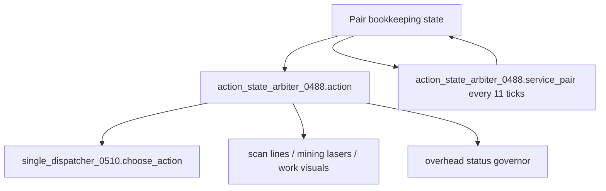

The dispatcher consumes the action table, while the arbiter's own scheduled service separately enforces visual and bookkeeping consequences.

---

## 2. Function Inventory

| Function | Type | Role | Major side effects |
|---|---:|---|---|
| `now`, `valid`, `lower`, `safe`, `dist_sq` | local helpers | Time, validity, text, distance | none |
| `root()` | local storage root | Ensures arbiter configuration/stats | writes `storage.tech_priests.action_state_arbiter_0488` |
| `enabled()` | local predicate | Returns root enabled state | none |
| `stat(k,n)` | local metric | Increments counters | writes root stats |
| `pairs_by_station()` | local accessor | Reads pair map | none |
| `valid_pair(p)` | local predicate | Valid station/priest pair | none |
| `pair_key(p)` | local helper | Station/priest identity key | none |
| `current_order(pair)` | local selector | Gets order queue current or active order | none |
| `item_from(v)` | local extractor | Reads common item fields | none |
| `order_item(o)` | local extractor | Gets item from order or nested task | none |
| `normalize_kind(k)` | local classifier | Normalizes strings into combat/repair/consecration/crafting/acquisition | none |
| `is_hostile(priest,target)` | local predicate | Checks enemy force relationship | none |
| `entity_or_pos(v,seen)` | local recursive extractor | Finds entity or position inside nested task-like tables | none |
| `current_target(pair)` | local selector | Chooses first target/entity/position across ordered pair state fields | none |
| `name_item_from_entity(e)` | local mapper | Infers item/resource from entity | none |
| `actual_crafting(pair)` | local predicate | Distinguishes active timed station craft from acquisition subtask | none |
| `M.action(pair)` | public classifier | Returns one visible action table | none directly |
| `destroy(obj)` | local render helper | Safely destroys render object | destroys render object |
| `M.clear_beams(pair)` | public visual cleanup | Clears scan/mining beam state | destroys pair and work-visual scan lines |
| `request_move(pair,pos,reason)` | local movement helper | Requests movement before remote scan/laser | writes movement through 0418 or direct command fallback |
| `M.allow_scan(pair,target)` | public visual gate | Allows only acquisition scan on matching/near target | may clear beams, request movement, increment stats |
| `M.allow_laser(priest,target,reason)` | public visual/action gate | Allows combat laser only in combat and mining laser only in acquisition/near target | may clear beams, request movement, suppress laser |
| `progress_bar(p,w)` | local formatter | Builds craft status bar | none |
| `M.status(pair)` | public display resolver | Returns action-based overhead text/color | none |
| `M.service_pair(pair)` | public scheduled mutator | Claims action, records action state, fails stale combat, clears beams/tasks | writes pair state and may mutate order/task state |
| `M.tick_all()` | public loop | Services all pairs | calls `M.service_pair` |
| `M.wrap_visuals()` | public wrapper installer | Wraps scan/laser/work visual functions | replaces global/module visual functions |
| `M.wrap_overhead()` | public wrapper installer | Wraps overhead canonical status | replaces governor function |
| `M.wrap_diagnostics()` | public wrapper installer | Adds arbiter state to pair dump | replaces diagnostics function |
| `M.register_commands()` | public command installer | Registers `/tp-action-state-0488` | command surface |
| `M.install()` | public installer | Exposes arbiter, installs wrappers/command, schedules tick | writes `_G.TECH_PRIESTS_ACTION_STATE_ARBITER_0488` |

---

## 3. Kind Normalization

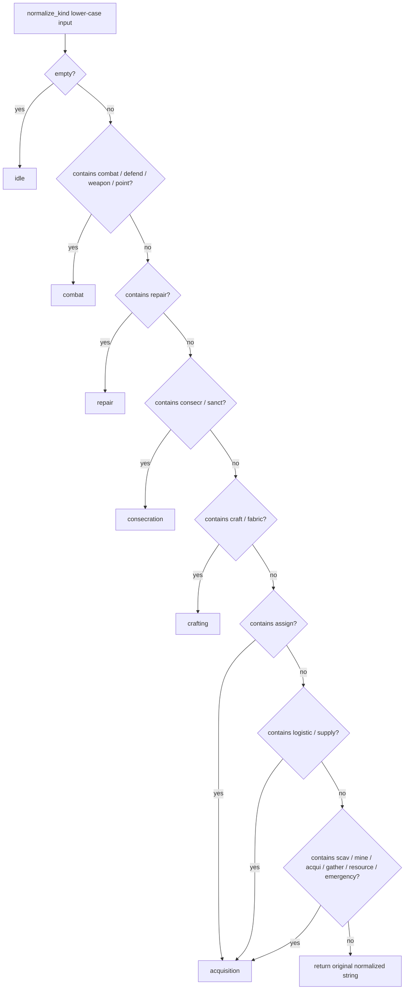

Broad-match consequences:

- Any kind containing `point` becomes combat.
- Any kind containing `emergency` becomes acquisition unless `actual_crafting()` independently wins first.
- Logistics and supply are represented as acquisition, not a separate arbiter family.

---

## 4. Recursive Entity / Position Extraction

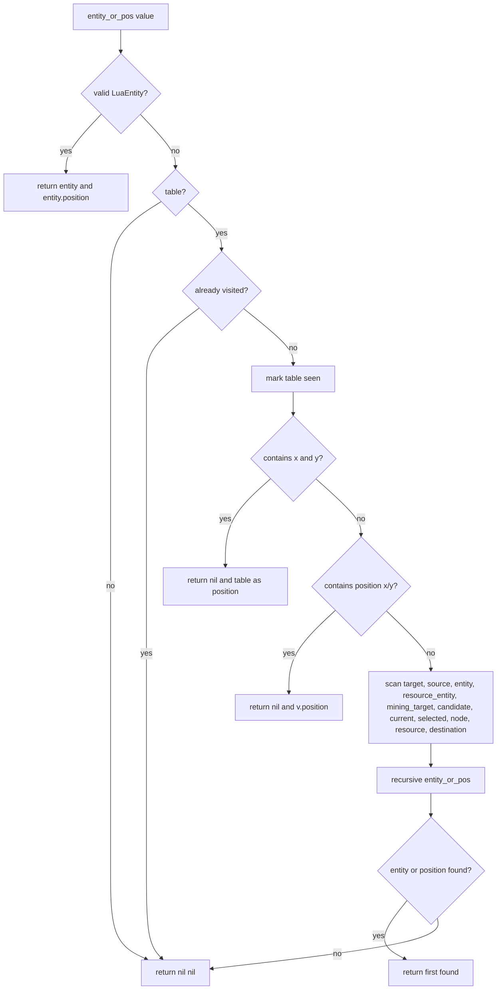

This recursive search permits deeply nested legacy task records to continue influencing current action targeting.

---

## 5. Current Target Priority

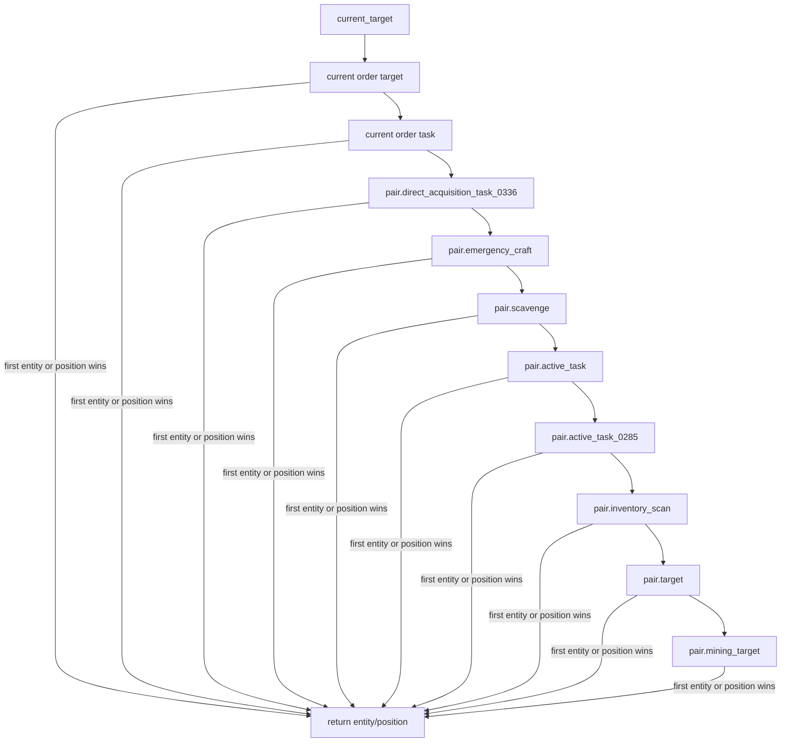

Risk: a stale target nested in a higher-priority field can hide the physically correct target stored later in the list.

---

## 6. Entity-to-Item Inference

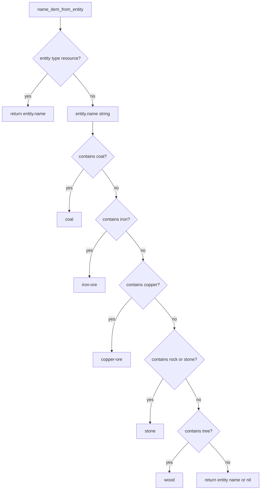

This inferred item is used for the arbiter's acquisition action display and dispatcher classification.

---

## 7. Actual Crafting Predicate

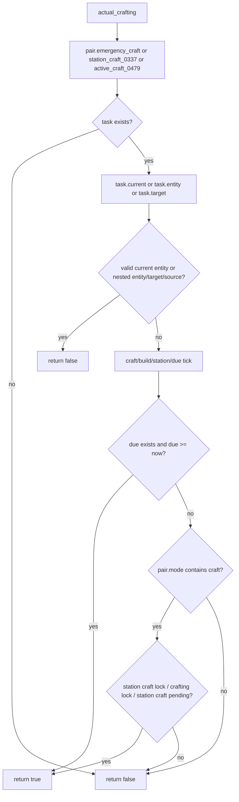

This is the key distinction between:

- an emergency craft object currently driving physical ingredient acquisition, and
- an emergency/station craft object actively timing a craft.

---

## 8. Actual `M.action` Classification Order

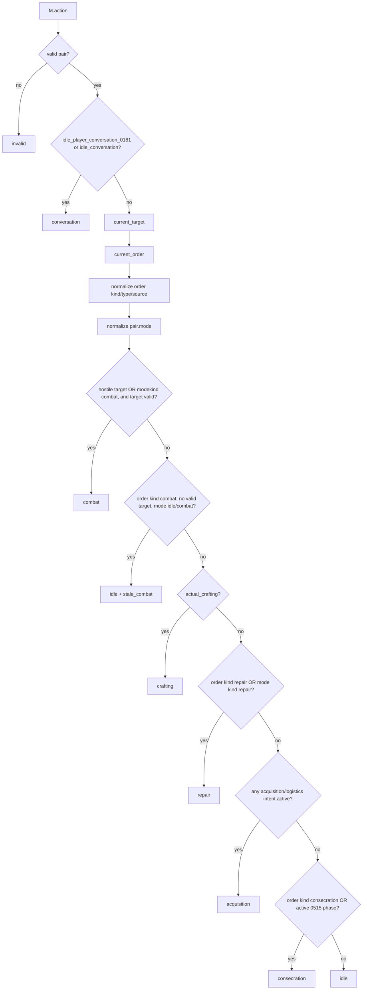

---

## 9. Acquisition Intent Predicate

Acquisition wins when any of the following is true:

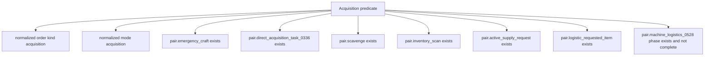

Item selection inside the returned acquisition action:

1. Infer item from valid target entity.
2. Current order item.
3. Active supply request item.
4. Logistic requested item.
5. Emergency craft item.
6. Direct acquisition task item.

Because the valid target entity wins, a stale target can also produce stale overhead item text.

---

## 10. Consecration Predicate

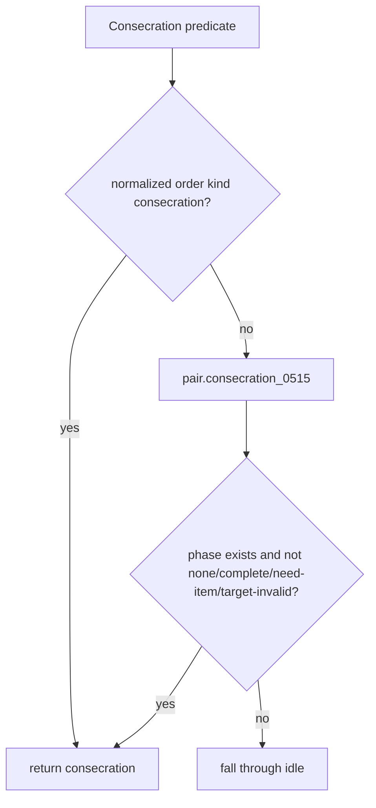

Acquisition is checked before this branch specifically to prevent stale consecration labels from suppressing real acquisition/logistics work.

---

## 11. Returned Action Shapes

| Kind | Important fields |
|---|---|
| `invalid` | `kind` |
| `conversation` | `kind` |
| `combat` | `kind`, `target`, `item = combat` |
| stale combat idle | `kind = idle`, `stale_combat = true` |
| `crafting` | `kind`, selected item |
| `repair` | `kind`, `target`, `item = repair-pack` |
| `acquisition` | `kind`, `target`, `pos`, inferred/requested item |
| `consecration` | `kind`, `target`, `item = sacred-machine-oil` |
| `idle` | `kind`, order item, target, position |

The action table does not contain an executor reference. `single_dispatcher_0510` later normalizes the kind and chooses an executor.

---

## 12. Beam Cleanup

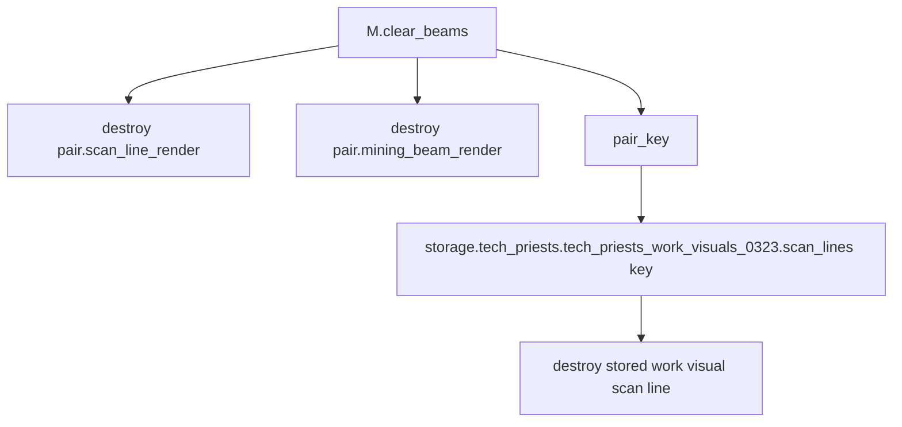

The arbiter suppresses incorrect visual ownership by destroying render objects rather than deleting queued tasks.

---

## 13. Movement Before Visual/Work Action

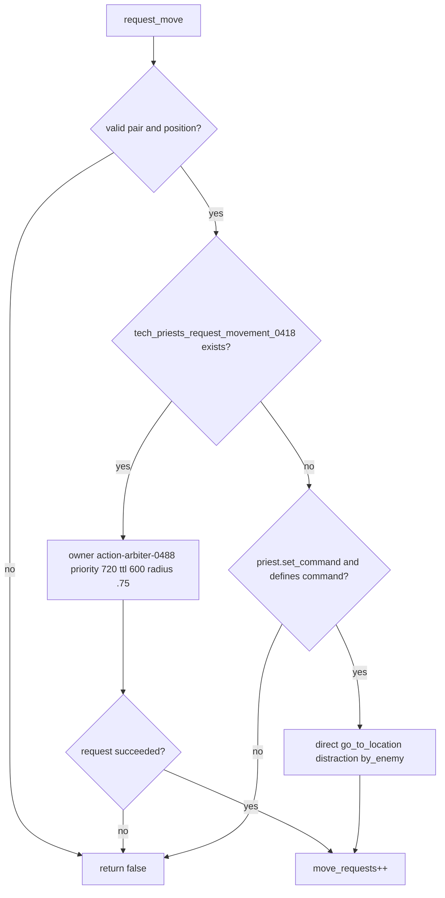

Later movement intent/leaf authorities may redirect or overwrite this movement request when a more concrete target exists.

---

## 14. Scan Gate

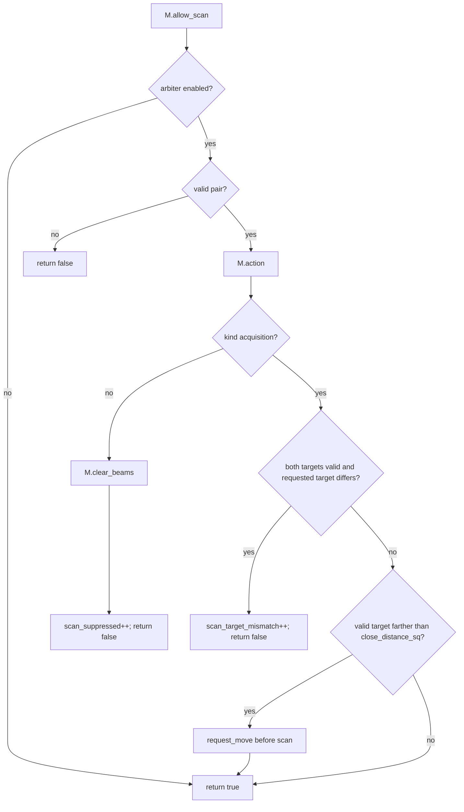

Unlike the laser gate, a remote scan can still be allowed after requesting movement.

---

## 15. Laser Gate

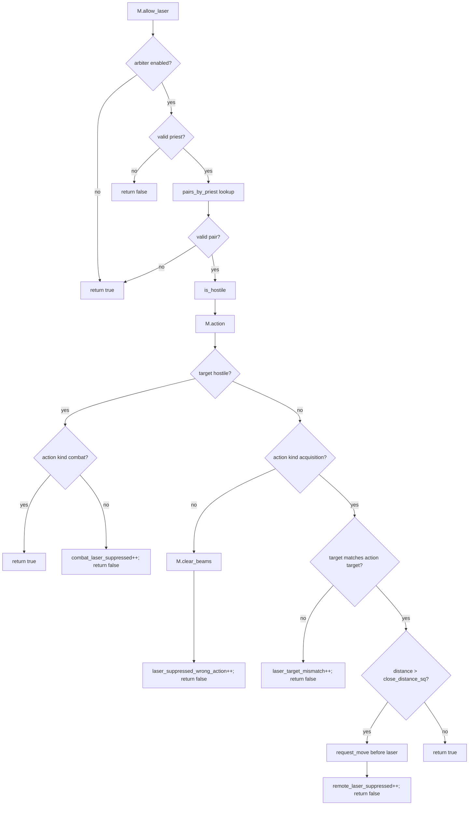

Remote mining laser is explicitly suppressed until the priest is close enough.

---

## 16. Status Resolution

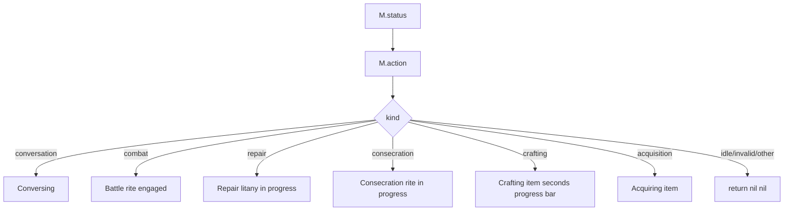

This is broad parent-level status. The later `active_leaf_task_truth_0655` patch is intended to supersede it with concrete leaf text when a real leaf task exists.

---

## 17. Scheduled `service_pair` Mutation Flow

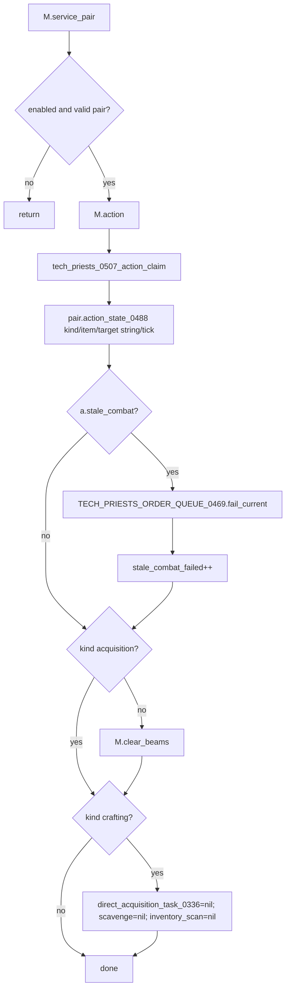

This is a real behavior mutation path, not merely visual arbitration.

---

## 18. Stale Combat Failure Path

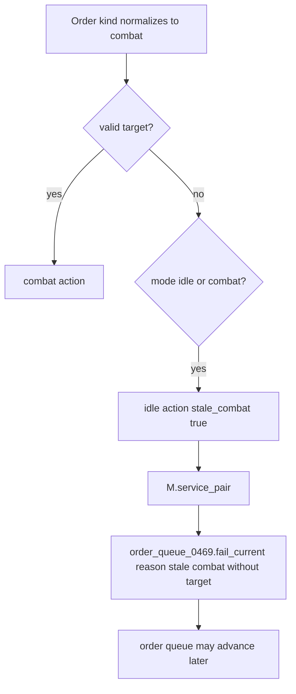

The arbiter can fail scheduler work based on visual/action-state validation.

---

## 19. Visual Wrapper Surface

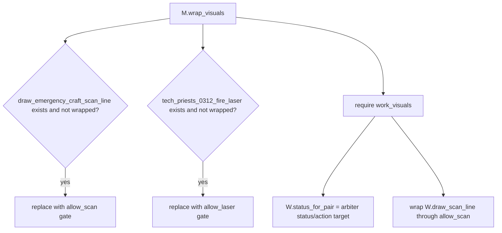

`W.status_for_pair` is replaced outright, not wrapped around a previous function.

---

## 20. Overhead Wrapper Order

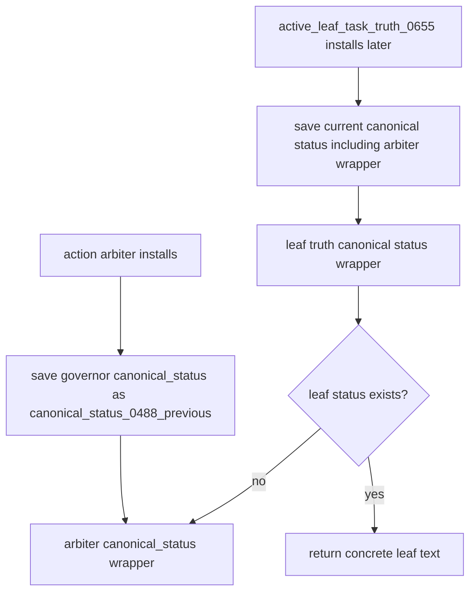

This expected ordering means concrete leaf truth should win while retaining arbiter status as fallback. If installation order changes, overhead priority can change.

---

## 21. Diagnostics Wrapper

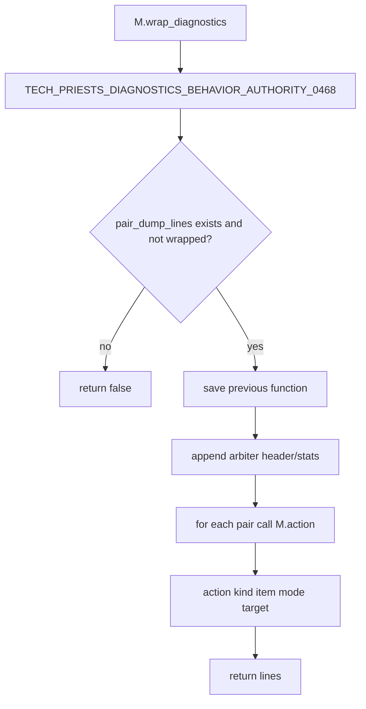

---

## 22. Command Surface

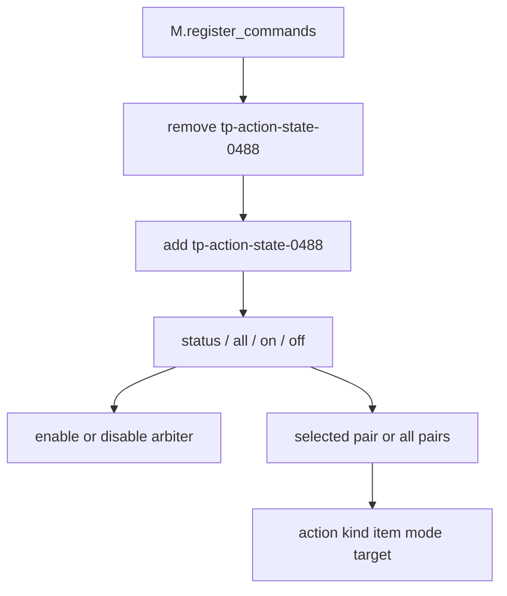

Cleanup target: remove this runtime mutation/inspection command once automatic diagnostics fully replace it.

---

## 23. Install / Scheduling Flow

```mermaid
flowchart TD
    Install[M.install]
    Install --> Root[root]
    Root --> Global[_G.TECH_PRIESTS_ACTION_STATE_ARBITER_0488 = M]
    Global --> Visuals[M.wrap_visuals]
    Visuals --> Overhead[M.wrap_overhead]
    Overhead --> Diagnostics[M.wrap_diagnostics]
    Diagnostics --> Commands[M.register_commands]
    Commands --> Registry[RuntimeEventRegistry]
    Registry --> Schedule[on_nth_tick interval 11 category scheduler priority last]
    Schedule --> Tick[M.tick_all + M.wrap_overhead]
```

`M.wrap_overhead()` is retried every arbiter tick, allowing it to patch a governor that loaded after the arbiter.

---

## 24. State Write Matrix

| State field / object | Writer | Meaning | Risk |
|---|---|---|---|
| `storage.tech_priests.action_state_arbiter_0488` | `root` | Enabled flag and suppression stats | High configuration authority |
| `pair.action_state_0488` | `M.service_pair` | Last arbiter kind/item/target string/tick | High diagnostic/action trace |
| current order state | `M.service_pair` via `order_queue.fail_current` | Fails stale combat order | High scheduler mutation |
| `pair.direct_acquisition_task_0336` | `M.service_pair` crafting branch | Cleared when crafting wins | Critical; can cancel direct task |
| `pair.scavenge` | same | Cleared when crafting wins | High |
| `pair.inventory_scan` | same | Cleared when crafting wins | High |
| `pair.scan_line_render` | `M.clear_beams` | Scan visual ownership | Visual |
| `pair.mining_beam_render` | `M.clear_beams` | Mining visual ownership | Visual |
| `work_visuals.scan_lines[key]` | `M.clear_beams` | Stored work scan visual | Visual |
| movement request state | `request_move` through 0418 | Moves before scan/laser | Critical when target stale |
| global scan/laser functions | `M.wrap_visuals` | Gates legacy visuals/actions | Critical wrapper order |
| `work_visuals.status_for_pair` | `M.wrap_visuals` | Broad action status provider | High visual authority |
| overhead canonical status | `M.wrap_overhead` | Broad action overhead fallback | High visual authority |

---

## 25. Action / Side-Effect Matrix

| Arbiter action | Beam behavior | Movement behavior | Task mutation |
|---|---|---|---|
| Invalid | non-acquisition cleanup if serviced | none | none |
| Conversation | clears acquisition beams | none | none |
| Combat | hostile laser allowed; acquisition scan suppressed | combat positioning handled elsewhere | none |
| Stale combat idle | clears beams | none | fails current order |
| Crafting | clears beams | none here | clears direct acquisition, scavenge, inventory scan |
| Repair | clears beams | repair executor later | none here |
| Acquisition | matching scan allowed; matching close laser allowed | requests movement before remote scan/laser | none here |
| Consecration | clears acquisition beams | consecration executor later | none here |
| Idle | clears acquisition beams | none | none |

---

## 26. Interaction with Single Dispatcher

```mermaid
sequenceDiagram
    participant D as single_dispatcher_0510
    participant A as action_state_arbiter_0488
    participant E as family executor
    participant S as arbiter scheduled service

    D->>A: action(pair)
    A-->>D: action kind/target/item
    D->>D: action_family(action)
    D->>E: execute owned family or return legacy-leaf-family

    Note over S,A: Independently every 11 ticks
    S->>A: action(pair)
    S->>S: claim action and write action_state_0488
    S->>S: fail stale combat / clear beams / clear acquisition fields when crafting
```

The dispatcher and scheduled arbiter call the same classifier but execute different consequences.

---

## 27. Actual Broad Classification Diagram After Arbiter Mapping

```mermaid
flowchart TD
    Fetch[0527 logistics wrapper] -->|no fetch action| Dispatcher[single dispatcher]
    Dispatcher --> OrderTick[order_queue_0469.tick_pair]
    OrderTick --> CombatRepair[combat_repair_doctrine_0517 recommendation]
    CombatRepair -->|no tactical repair| Arbiter[action_state_arbiter_0488.action]

    Arbiter --> Conversation{conversation lock?}
    Conversation -- yes --> ConversationA[conversation -> dispatcher legacy family]
    Conversation -- no --> Combat{hostile/combat target valid?}
    Combat -- yes --> CombatA[combat -> dispatcher legacy family]
    Combat -- no --> Stale{stale combat order?}
    Stale -- yes --> IdleA[idle + scheduled fail current]
    Stale -- no --> Craft{actual timed crafting?}
    Craft -- yes --> CraftA[station-craft -> emergency production/craft executor]
    Craft -- no --> Repair{repair intent?}
    Repair -- yes --> RepairA[repair executor]
    Repair -- no --> Acquisition{acquisition/logistics/emergency/machine logistics intent?}
    Acquisition -- yes --> AcquisitionA[direct-acquisition family -> direct executor]
    Acquisition -- no --> Cons{consecration intent active?}
    Cons -- yes --> ConsA[consecration executor]
    Cons -- no --> IdleB[idle -> legacy family]
```

Important mismatch: the arbiter returns `kind = acquisition` for logistics, emergency ingredient work, machine logistics, scavenging, mining, and direct acquisition. The dispatcher then normalizes all of these to `direct-acquisition`, unless the external 0527 logistics wrapper acts first.

---

## 28. Architectural Gaps Exposed

1. **Visual arbiter has behavioral side effects.** It fails orders and clears task fields.
2. **Acquisition is overloaded.** Direct mining, storage fetch, machine logistics, scavenging, and emergency ingredient work share one kind.
3. **Current-target priority can preserve stale targets.** Nested order/task targets outrank later pair fields.
4. **The arbiter runs independently of the dispatcher.** Eleven-tick state mutation continues even if dispatcher timing or ownership differs.
5. **Conversation outranks combat classification.** An active conversation flag returns conversation before evaluating hostile targets.
6. **Repair outranks acquisition, but acquisition outranks consecration.** This is the actual current ordering.
7. **Crafting clears acquisition state.** A misclassified craft can delete direct/scavenge/inventory work.
8. **Remote scan and remote laser differ.** Scan requests movement but remains allowed; laser requests movement and is suppressed.
9. **Broad parent status remains.** Concrete leaf truth must install later to provide precise overhead text.
10. **Wrapper order matters.** Scan, laser, work visual, and overhead functions are globally replaced/wrapped.
11. **Command surface remains.** The arbiter can be disabled at runtime through slash command.
12. **Action kind does not encode ownership.** Dispatcher must infer executor family from a broad string.

---

## 29. Debugging Decision Tree

```mermaid
flowchart TD
    Bug[Wrong action family or visuals] --> Action[M.action pair]
    Action --> Conversation{conversation selected unexpectedly?}
    Conversation -- yes --> ConvFlags[Inspect idle_player_conversation_0181 / idle_conversation]
    Conversation -- no --> Target{current_target is physically correct?}
    Target -- no --> TargetPriority[Inspect ordered target source list for stale nested target]
    Target -- yes --> Kind{order/mode normalized correctly?}
    Kind -- no --> Normalize[Inspect normalize_kind broad substring match]
    Kind -- yes --> Craft{actual_crafting result expected?}
    Craft -- no --> CraftState[Inspect due ticks, locks, and physical current target]
    Craft -- yes --> Acquisition{acquisition predicate unexpectedly true?}
    Acquisition -- yes --> Fields[Inspect emergency_craft/direct/scavenge/inventory/supply/logistics/machine logistics fields]
    Acquisition -- no --> Consecration{consecration active unexpectedly?}
    Consecration -- yes --> ConsState[Inspect 0515 phase/order kind]
    Consecration -- no --> Dispatcher[Inspect dispatcher normalization/executor ownership]

    Dispatcher --> Visual{Only visual wrong?}
    Visual -- yes --> WrapperOrder[Inspect arbiter vs active leaf overhead/work visual wrapper order]
    Visual -- no --> Mutation{Task disappeared?}
    Mutation -- yes --> CraftClear[Check arbiter crafting branch clearing direct/scavenge/inventory]
```

---

## 30. Progressive Development Targets

The next procedural map should cover:

1. `order_queue_0469.lua`, because it mutates scheduler state immediately before dispatcher/arbiter classification and receives stale-combat failure calls from this arbiter.

Then:

2. `emergency_production_executor_0514.lua`.
3. `consecration_executor_0515.lua`.
4. `repair_executor_0516.lua`.
5. `combat_repair_doctrine_0517.lua`.
6. Machine logistics 0528 and inventory steward/catalog systems.
7. Legacy combat and idle/conversation systems.

After those are mapped, the overview Mermaid tree should be regenerated from the verified function maps rather than the earlier intended architecture alone.
