# Tech-Priests Function-Level Mermaid Drilldown: Order Queue 0469

Version: 0.1.669-map-pass-10  
Previous drilldown: `docs/BEHAVIOR_MERMAID_FUNCTION_DRILLDOWN_0668_ACTION_STATE_ARBITER.md`  
Companion overview: `docs/BEHAVIOR_MERMAID_MAP_0660.md`

Purpose: map the per-pair order queue that stabilizes repeated scheduler, resource, logistics, scavenge, assignment, repair, consecration, combat, and emergency-craft claims before the dispatcher and action-state arbiter classify visible behavior.

Mapped module:

- `order_queue_0469.lua`

Direct consumers and callers:

- `single_dispatcher_0510.order_tick()` calls `M.tick_pair()` before action classification.
- `action_state_arbiter_0488` calls `M.fail_current()` for stale combat orders.
- Wrapped task-assignment, cancellation, emergency acquisition, supply scavenging, inventory scavenging, and resource-doctrine entry points submit orders into this queue.

Important current-code truths:

1. An order key may appear only once across active and pending orders.
2. Higher-priority work preempts lower-priority work, but the lower order is paused and inserted at the front of the pending queue.
3. Pending queue length is capped at eight orders.
4. Queue priority is numeric and independent from the later action-state arbiter order.
5. The queue can adopt pre-existing pair task surfaces whenever no current order exists.
6. Promoted orders can reactivate legacy behavior by calling preserved original functions.
7. Completion is inferred from old pair fields, active task comparison, mode strings, target validity, timeouts, and a six-second paused lease.
8. Multiple order kinds collapse to the same `gather:<station>:<surface>:<item>` key, intentionally deduplicating logistics, scavenging, acquisition, direct mining, gathering, and emergency crafting for the same item.
9. The module still installs `/tp-order-queue-0469` and permits clearing a selected pair's queue at runtime.

---

## 1. Runtime Position

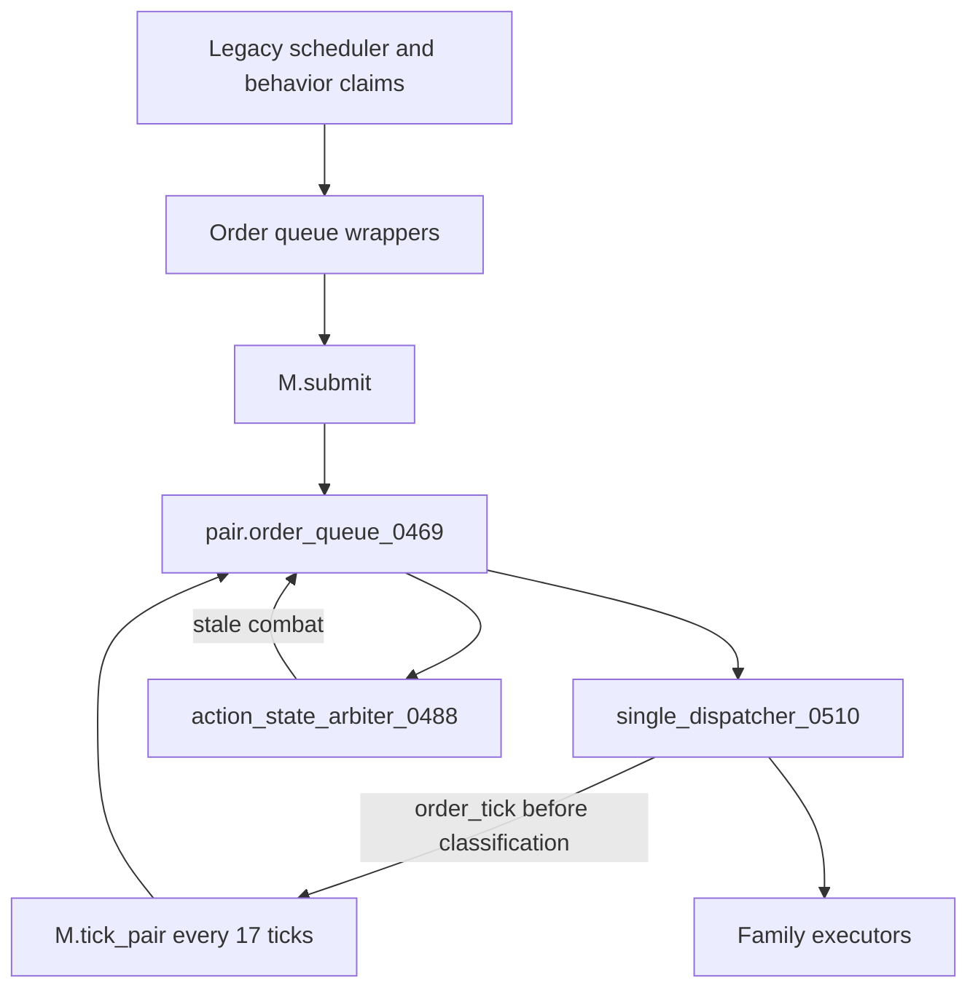

The queue does not execute all behavior itself. It maintains stable order identity and calls preserved legacy activation callbacks when an order becomes active.

---

## 2. Priority Table

```mermaid
flowchart LR
    Validate[validate 1000]
    Combat[combat / defense 900]
    Repair[repair 800]
    Consecration[consecration / sanctify 700]
    Assignment[assignment 610]
    Logistics[logistics 600]
    Supply[supply 590]
    Scavenge[scavenge 580]
    Acquisition[acquisition / gather / direct mine 570]
    EmergencyCraft[emergency craft 540]
    Emergency[emergency 530]
    Return[return to station 400]
    Unknown[unknown normalized kind 100]
    Idle[idle 0]

    Validate --> Combat --> Repair --> Consecration --> Assignment --> Logistics --> Supply --> Scavenge --> Acquisition --> EmergencyCraft --> Emergency --> Return --> Unknown --> Idle
```

An explicit numeric `task.priority` overrides this table.

---

## 3. Function Inventory

| Function | Type | Role | Major side effects |
|---|---:|---|---|
| `now`, `valid`, `safe`, `lower` | local helpers | Time, validity, formatting | none |
| `ensure_root()` | local storage root | Ensures global queue configuration/stats | writes `storage.tech_priests.order_queue_0469` |
| `enabled()` | local predicate | Reads root enabled flag | none |
| `root_stat(name,delta)` | local metric | Increments global stats | writes root stats |
| `pair_map`, `valid_pair`, `station_unit`, `surface_name` | local helpers | Pair access and identity | none |
| `item_from(v)` | local extractor | Reads common item fields | none |
| `entity_key(entity)` | local key helper | Converts entity to stable name/unit key | none |
| `target_key(target)` | local key helper | Converts entity or position into target key | none |
| `priority_for(kind,explicit)` | local priority resolver | Uses explicit or table priority | none |
| `normalize_kind(kind)` | local classifier | Normalizes many legacy kind strings | none |
| `order_label(order)` | local diagnostic formatter | Formats order summary | none |
| `queue(pair)` | local queue root | Ensures and defensively rebuilds pair queue/pending-key set | writes `pair.order_queue_0469` and compacts pending list |
| `current_key(pair)` | local accessor | Returns active order key | none |
| `has_order(pair,key)` | local duplicate lookup | Searches current/pending order | calls `queue()` and may compact queue |
| `make_key(pair,kind,item,target,role)` | local identity builder | Generates deduplication key | none |
| `order_from_task(pair,task,source,reason)` | local converter | Converts task-like table into normalized order | none |
| `order_from_pair_surface(pair,source)` | local adoption converter | Builds order from already-active pair fields | none |
| `remember_history(q,order,status,why)` | local history | Adds bounded history entry | writes queue history |
| `put_pending_front(q,order)` | local queue mutator | Pauses and inserts preempted order first | writes pending and pending_keys |
| `put_pending(q,order)` | local queue mutator | Enqueues order subject to limit | writes pending/stats |
| `mark_duplicate(pair,q,order,existing)` | local dedupe mutator | Records duplicate and raises existing count to max | writes stats, duplicate trace, existing order count/update tick |
| `M.submit(pair,order,opts)` | public queue entry | Starts, preempts, queues, or rejects duplicate order | writes active/pending queue and active order mirror |
| `active_task_matches(pair,order)` | local completion predicate | Compares active legacy task with order | none |
| `lower_surfaces_active(pair,order)` | local completion predicate | Checks lower-level pair fields/mode for active work | none |
| `order_should_finish(pair,order)` | local completion predicate | Determines completion/expiry/failure | none |
| `pop_next(q)` | local queue mutator | Pops first valid nonexpired pending order | removes pending entries and keys |
| `call_original_assign(pair,order)` | local activation adapter | Reinvokes preserved assignment function | legacy task side effects |
| `activate_callback(pair,order)` | local activation router | Calls original source-specific function after promotion | writes active status/ticks; invokes legacy behavior |
| `M.reactivate_current(pair,reason)` | public watchdog hook | Reinvokes current order's activation callback | writes attempts/history/result traces |
| `promote(pair,q,reason)` | local queue executor | Activates next pending order | writes current/active order/history/stats; calls callback |
| `M.fail_current(pair,reason)` | public authority hook | Fails current order and promotes next | mutates queue/history/active order |
| `M.tick_pair(pair,reason)` | public lifecycle tick | Adopts surface, promotes, finishes, expires, or refreshes current order | mutates queue/current/history |
| `selected_pair(player)` | local command helper | Resolves selected pair | none |
| `describe(pair)` | local diagnostic | Returns queue status lines | calls `queue()` |
| `write_diag_line(text)` | local diagnostic writer | Writes order queue log line | file/log side effect |
| `M.write_all_queues(reason)` | public diagnostic | Dumps all queues | file/log side effect |
| `fail_current_if_order(pair,order,why)` | local activation cleanup | Fails newly active order if original callback rejects it | mutates current/history |
| `M.wrap_assign_task()` | public wrapper installer | Wraps `tech_priests_0285_assign_task` | replaces global function |
| `M.wrap_cancel_task()` | public wrapper installer | Wraps task cancellation | replaces global function |
| `M.wrap_emergency_acquire()` | public wrapper installer | Wraps emergency item acquisition | replaces global function |
| `M.wrap_supply_scavenge()` | public wrapper installer | Wraps supply scavenging and inventory scan start | replaces two global functions |
| `M.wrap_doctrine()` | public wrapper installer | Wraps resource doctrine direct/no-source paths | replaces doctrine functions |
| `M.wrap_diagnostics()` | public wrapper installer | Appends order queue data to pair dump | replaces diagnostics function |
| `M.install_commands()` | public command installer | Registers `/tp-order-queue-0469` | command surface |
| `M.tick_all(reason)` | public loop | Ticks every valid pair | calls `M.tick_pair` |
| `M.install()` | public installer | Installs wrappers, diagnostics, command, periodic service, globals | broad global side effects |

---

## 4. Kind Normalization

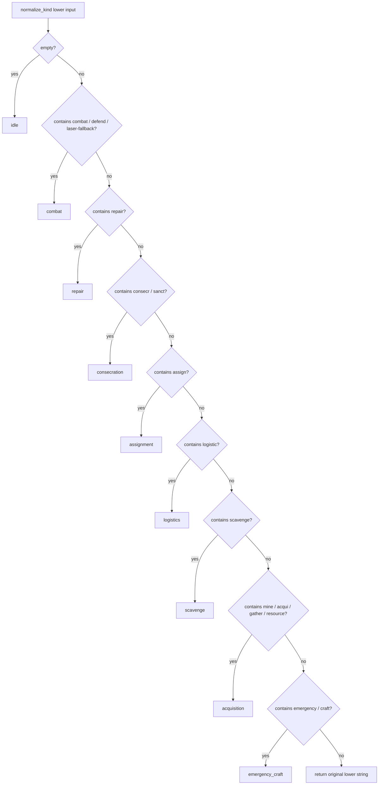

Unlike the action-state arbiter, this normalizer keeps logistics and scavenging as distinct kinds until key generation and later classification.

---

## 5. Order Key Generation

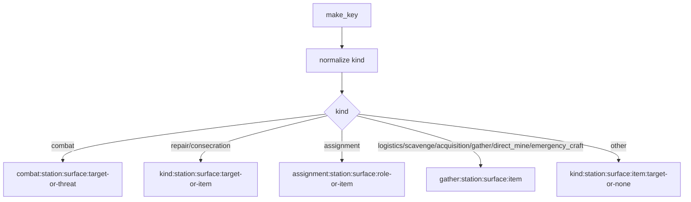

### Consequence of gather-key collapse

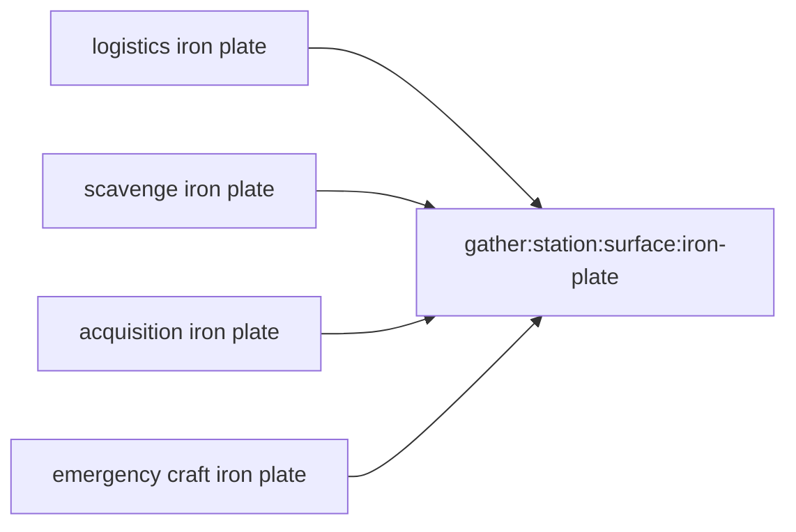

These become duplicates rather than independent orders, regardless of source or target.

---

## 6. Queue Initialization and Defensive Rebuild

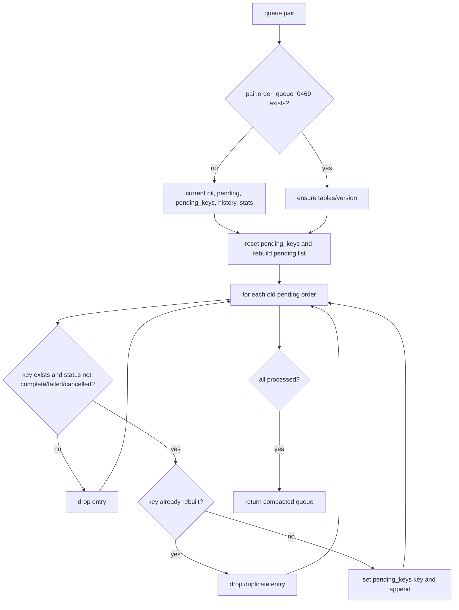

Calling `queue(pair)` is not a pure getter; it repairs and mutates the pending queue.

---

## 7. Task-to-Order Conversion

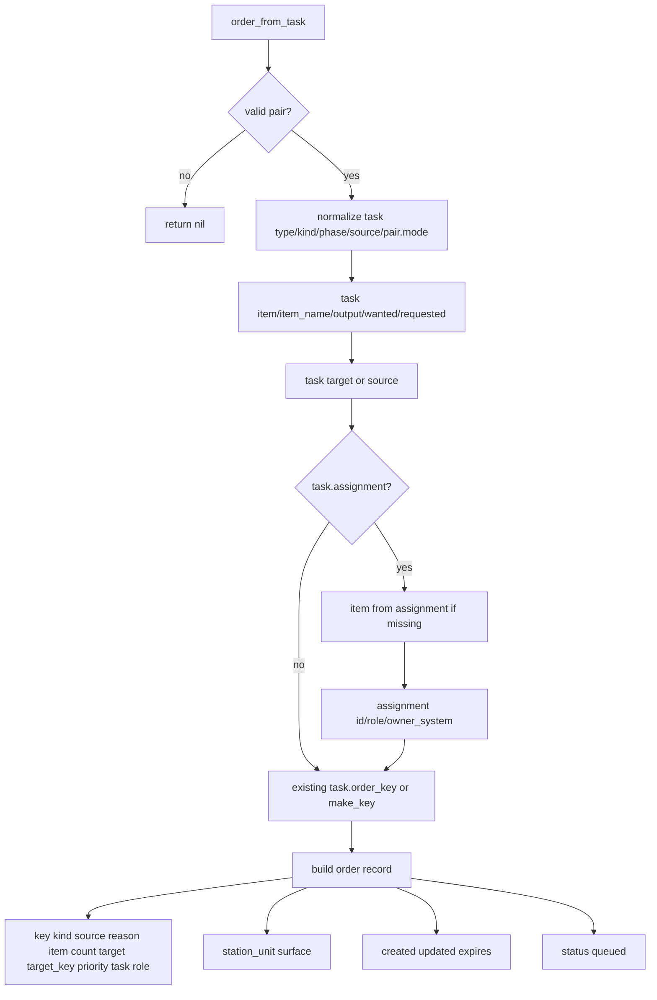

The original task table is retained by reference in `order.task`.

---

## 8. Surface Adoption Priority

When no current queue order exists, `order_from_pair_surface()` adopts the first matching active surface in this order:

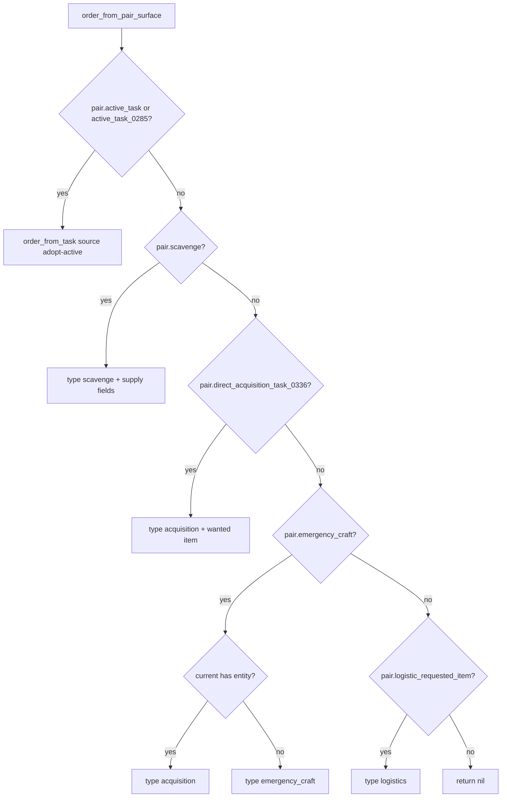

A pre-existing `active_task` can mask later direct, emergency, scavenging, or logistics surfaces during adoption.

---

## 9. Submission State Machine

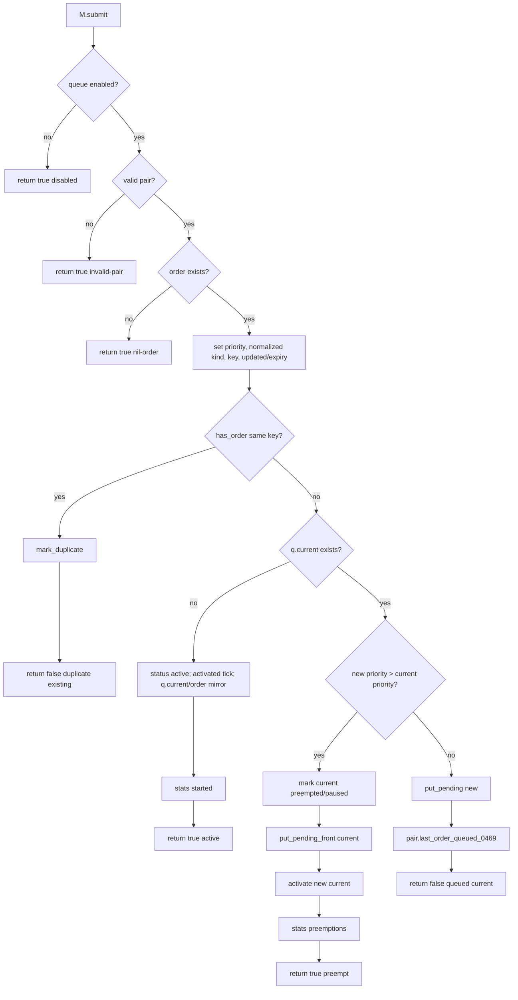

The `opts` parameter is currently accepted but unused.

---

## 10. Duplicate Handling

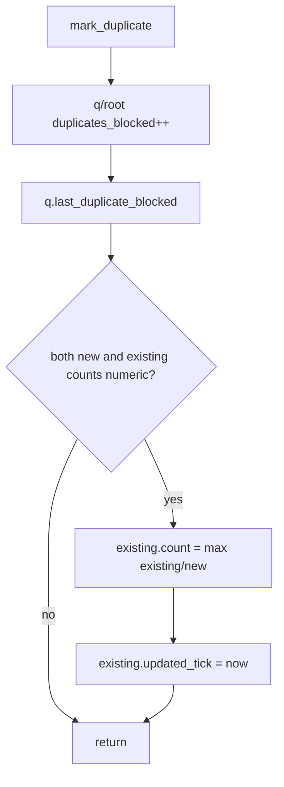

A duplicate can increase requested count, but cannot change source, target, reason, priority, timeout, task reference, or callback metadata.

---

## 11. Pending Queue Behavior

### Normal enqueue

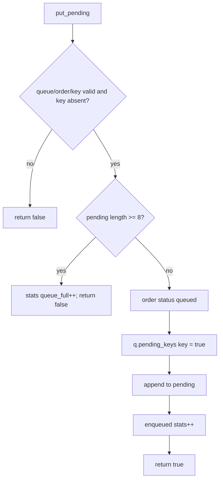

### Preempted order reinsertion

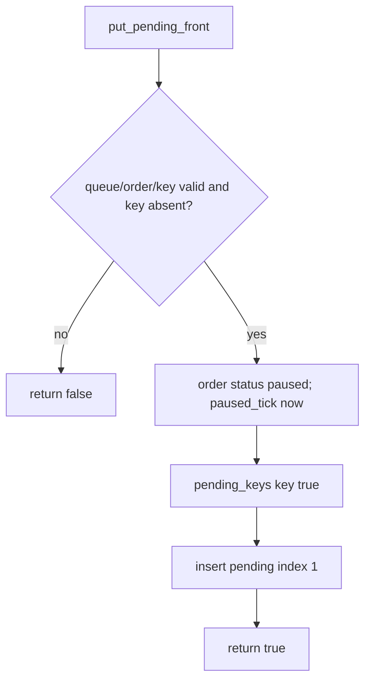

`put_pending_front()` does not check the queue limit. A preempted active order can therefore produce a pending queue longer than eight.

---

## 12. Lower-Surface Activity Detection

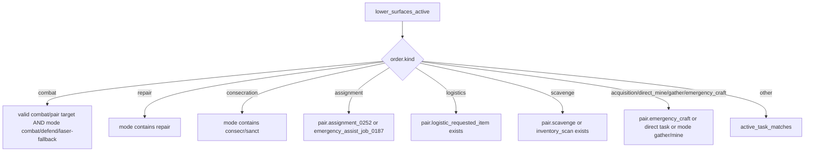

This completion model relies heavily on old pair surface fields and coarse mode strings.

---

## 13. Active Task Matching

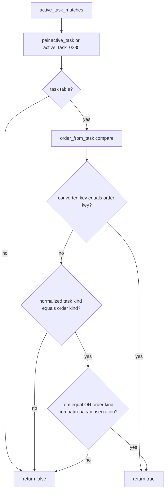

Combat, repair, and consecration can match an active task by kind without matching item or target.

---

## 14. Order Completion Predicate

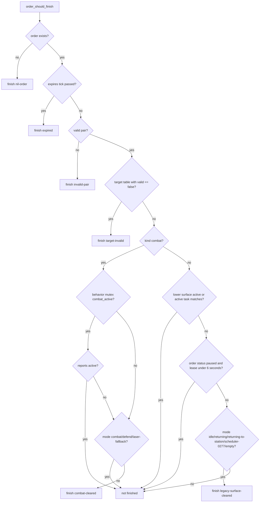

A current active order normally has status `active`, not `paused`; the paused lease mainly protects preempted orders before or during resumption-related checks.

---

## 15. Pending Promotion

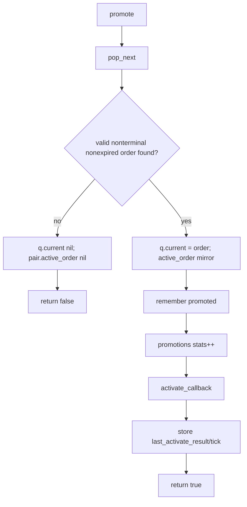

`promote()` does not fail or remove the newly current order when its activation callback returns false. It records `no-direct-callback` and leaves the order current.

---

## 16. Activation Callback Router

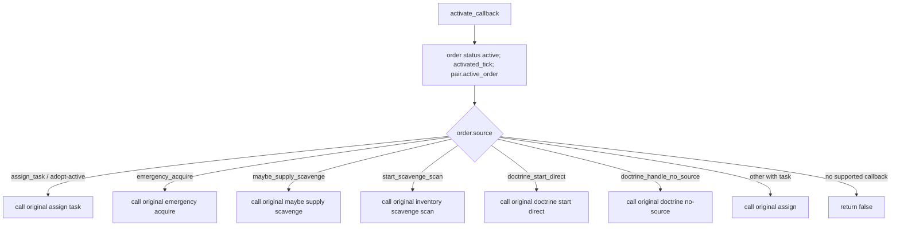

Orders adopted from pair surfaces may have sources such as `adopt-surface`, `adopt-logistics`, or `doctrine_handle_no_source`; only explicitly supported source names reactivate direct callbacks.

---

## 17. Reactivation Watchdog Hook

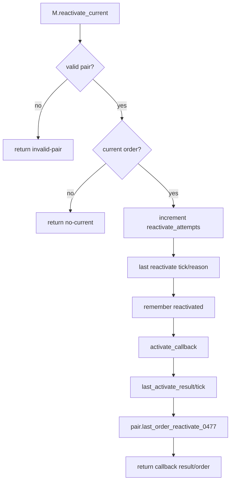

This function is intended for an execution watchdog and may repeatedly call preserved legacy task-entry functions.

---

## 18. Explicit Failure Authority

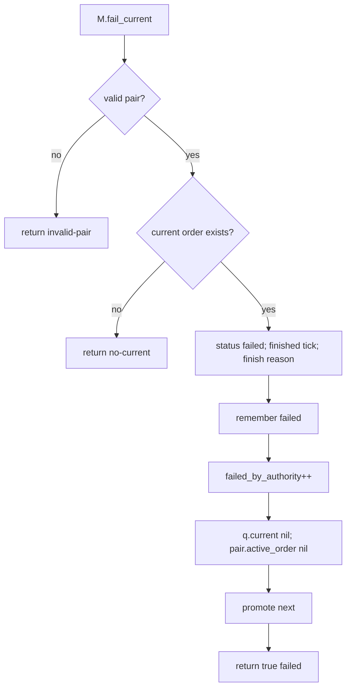

The action-state arbiter's stale-combat path uses this function.

---

## 19. Main Queue Tick

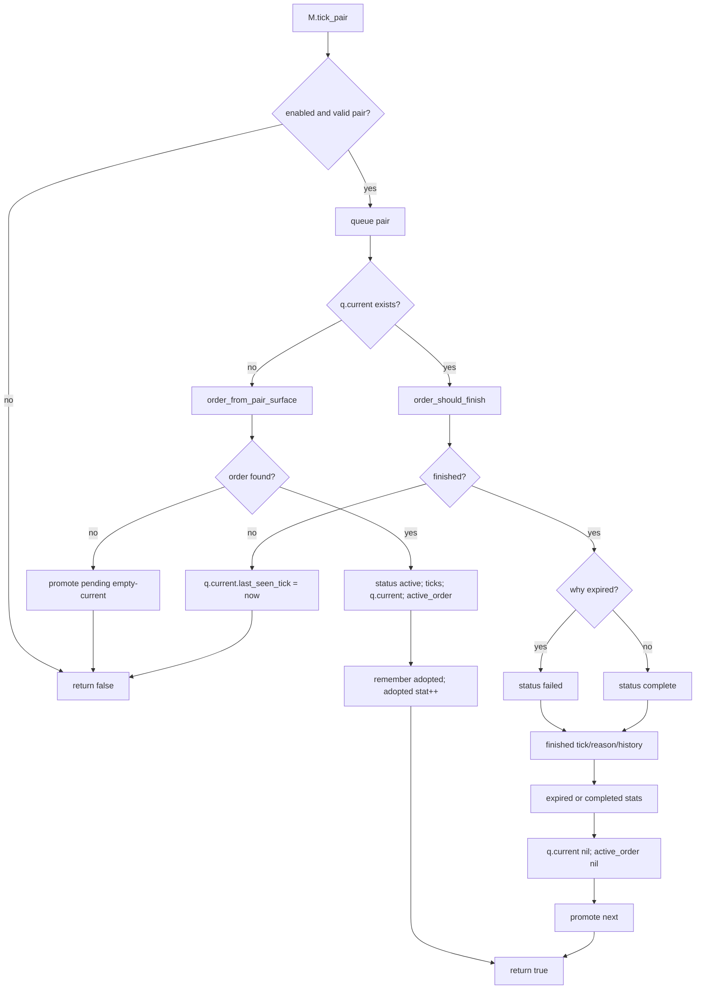

When an order is adopted from an existing pair surface, `activate_callback()` is not called because the underlying task is presumed already active.

---

## 20. Assignment Wrapper

```mermaid
flowchart TD
    Wrapper[wrapped tech_priests_0285_assign_task]
    Wrapper --> Enabled{queue enabled and valid pair?}
    Enabled -- no --> Original[call original directly]
    Enabled -- yes --> Convert[order_from_task source assign_task]
    Convert --> Submit[M.submit]
    Submit --> State{duplicate or queued?}
    State -- yes --> ReturnTrue[return true without calling original]
    State -- no --> Allowed{allowed active/preempt?}
    Allowed -- yes --> Call[call original assign task]
    Call --> Did{accepted?}
    Did -- no --> Fail[fail_current_if_order assign-task-rejected]
    Did -- yes --> ReturnDid[return result]
    Allowed -- no --> ReturnTrue
```

Queued and duplicate task submissions report success to callers even though the original assignment function is not invoked yet.

---

## 21. Cancellation Wrapper

```mermaid
flowchart TD
    Cancel[wrapped tech_priests_0285_cancel_task]
    Cancel --> Current{queue enabled and current order?}
    Current -- yes --> Mark[status cancelled; finished tick/reason/history]
    Mark --> Clear[q.current nil; pair.active_order nil]
    Current -- no --> Original
    Clear --> Original[call original cancel task]
```

The cancellation wrapper does not promote the next pending order immediately. Promotion waits for the next queue tick or another explicit path.

---

## 22. Emergency Acquisition Wrapper

```mermaid
flowchart TD
    Emergency[wrapped emergency_operation_acquire_item_0185]
    Emergency --> Valid{enabled valid pair item?}
    Valid -- no --> Original[call original]
    Valid -- yes --> Order[build logistics order priority 600]
    Order --> Metadata[store op and depth]
    Metadata --> Submit[M.submit]
    Submit --> State{duplicate or queued?}
    State -- yes --> ReturnTrue[return true]
    State -- no --> Call[call original emergency acquire]
    Call --> Did{accepted?}
    Did -- no --> Fail[fail current activation rejected]
    Did -- yes --> Return[return result]
```

---

## 23. Supply / Inventory Scavenge Wrappers

```mermaid
flowchart TD
    Supply[wrapped maybe_start_supply_scavenge]
    Supply --> Item[active supply request item or kind; repair -> repair-pack]
    Item --> Order[scavenge order priority 580]
    Order --> Submit[M.submit]
    Submit --> Queued{duplicate/queued?}
    Queued -- yes --> ReturnTrue[return true]
    Queued -- no --> Original[call original scavenging]
    Original --> Reject{false?}
    Reject -- yes --> Fail[fail current]
    Reject -- no --> Return[return original result]

    Scan[wrapped start_logistic_scavenge_inventory_scan]
    Scan --> RequestItem[item_from request]
    RequestItem --> ScanOrder[scavenge order priority 580]
    ScanOrder --> Submit2[M.submit]
    Submit2 --> Queued2{duplicate/queued?}
    Queued2 -- yes --> ReturnTrue2[return true]
    Queued2 -- no --> OriginalScan[call original scan]
    OriginalScan --> Reject2{false?}
    Reject2 -- yes --> Fail2[fail current]
    Reject2 -- no --> Return2[return result]
```

---

## 24. Resource Doctrine Wrappers

```mermaid
flowchart TD
    Doctrine[M.wrap_doctrine]
    Doctrine --> Start[wrap Doctrine.start_direct_task]
    Doctrine --> NoSource[wrap Doctrine.handle_no_source]

    Start --> DirectItem[source output/item or wanted]
    DirectItem --> DirectOrder[acquisition order priority 570]
    DirectOrder --> DirectMeta[store doctrine source/wanted item]
    DirectMeta --> Submit[M.submit]
    Submit --> DirectQueued{duplicate/queued?}
    DirectQueued -- yes --> DirectTrue[return true]
    DirectQueued -- no --> DirectOriginal[call original start direct]
    DirectOriginal --> DirectReject{false?}
    DirectReject -- yes --> DirectFail[fail current]

    NoSource --> LogisticsOrder[logistics order priority 600]
    LogisticsOrder --> NoSourceMeta[store wanted item/recipe]
    NoSourceMeta --> Submit2[M.submit]
    Submit2 --> LogisticsQueued{duplicate/queued?}
    LogisticsQueued -- yes --> LogisticsTrue[return true]
    LogisticsQueued -- no --> NoSourceOriginal[call original handle no source]
    NoSourceOriginal --> NoSourceReject{false?}
    NoSourceReject -- yes --> NoSourceFail[fail current]
```

---

## 25. Wrapper Activation Failure Helper

```mermaid
flowchart TD
    Fail[fail_current_if_order]
    Fail --> Match{q.current exists and key equals submitted order key?}
    Match -- no --> Return[do nothing]
    Match -- yes --> Mark[status failed; finished tick; reason]
    Mark --> History[remember failed]
    History --> Clear[q.current nil; active_order nil]
    Clear --> Stat[activation_failed++]
```

Unlike `M.fail_current()`, this helper does not promote the next pending order immediately.

---

## 26. Periodic Scheduling and Dispatcher Double-Tick

```mermaid
flowchart TD
    Install[M.install]
    Install --> Broker[register order_queue service every 17 ticks priority 30]
    Broker --> TickAll[M.tick_all]
    TickAll --> TickPair[M.tick_pair each pair]

    Dispatcher[single_dispatcher every 23 ticks]
    Dispatcher --> OrderTick[requires order queue and calls M.tick_pair again]
```

The queue therefore advances through both:

- its own seventeen-tick service, and
- every dispatcher service call.

This can cause completion/promotion checks at irregular combined intervals rather than only every seventeen ticks.

---

## 27. Diagnostics and Command Surface

### Diagnostics wrapper

```mermaid
flowchart TD
    Wrap[M.wrap_diagnostics]
    Wrap --> Save[save existing pair_dump_lines]
    Save --> Replace[append queue enabled/current/pending/duplicates/preemptions]
    Replace --> Pending[append every pending order]
```

### Manual file dump

```mermaid
flowchart TD
    Dump[M.write_all_queues]
    Dump --> Begin[write BEGIN reason]
    Begin --> Pairs[for each valid pair]
    Pairs --> Describe[describe current/pending/duplicate trace]
    Describe --> Write[tech_priests log helper, helpers.write_file, or log fallback]
    Write --> End[write END]
```

### Slash command

```mermaid
flowchart TD
    Command[M.install_commands]
    Command --> Add[add tp-order-queue-0469]
    Add --> Params[status / all / write / on / off / clear]
    Params --> Enable[root.enabled true/false]
    Params --> Dump[M.write_all_queues]
    Params --> Clear[pair.order_queue_0469 = nil]
    Params --> Print[print queue state]
```

The `clear` command deletes the whole queue record without cancelling or clearing the underlying legacy task surfaces.

---

## 28. Install Flow

```mermaid
flowchart TD
    Install[M.install]
    Install --> Root[ensure_root]
    Root --> Assign[M.wrap_assign_task]
    Assign --> Cancel[M.wrap_cancel_task]
    Cancel --> Emergency[M.wrap_emergency_acquire]
    Emergency --> Scavenge[M.wrap_supply_scavenge]
    Scavenge --> Doctrine[M.wrap_doctrine]
    Doctrine --> Diagnostics[M.wrap_diagnostics]
    Diagnostics --> Commands[M.install_commands]
    Commands --> Broker{runtime broker exists?}
    Broker -- yes --> Register[register category scheduler interval 17 priority 30]
    Broker -- no --> Registry[registry/script nth tick fallback]
    Register --> Globals[export queue module/submit/status globals]
    Registry --> Globals
```

---

## 29. Queue State Shape

```mermaid
flowchart LR
    Q[pair.order_queue_0469]
    Q --> Version[version]
    Q --> Current[current order]
    Q --> Pending[pending array]
    Q --> Keys[pending_keys set]
    Q --> History[history max 200]
    Q --> Stats[stats]

    Current --> Mirror[pair.active_order_0469]
```

### Order record shape

```mermaid
flowchart LR
    O[Order]
    O --> Identity[key kind source reason]
    O --> Payload[item count target target_key task role]
    O --> Scope[station_unit surface]
    O --> Priority[priority]
    O --> Time[created updated activated paused expires finished last seen]
    O --> State[status finish_reason preempted_by]
    O --> Callback[source-specific metadata]
```

---

## 30. State Write Matrix

| State field | Writer | Meaning | Risk |
|---|---|---|---|
| `storage.tech_priests.order_queue_0469` | `ensure_root` | Global enabled flag/stats | High configuration authority |
| `pair.order_queue_0469` | `queue`, command clear | Per-pair order queue | Critical scheduler state |
| `q.current` | submit, adopt, promote, fail, finish, cancel | Active stable order | Critical |
| `pair.active_order_0469` | same paths | Mirror consumed by arbiter/dispatcher | Critical |
| `q.pending` | enqueue, preempt, pop, rebuild | Paused/future orders | High |
| `q.pending_keys` | enqueue, preempt, pop, rebuild | Duplicate key index | High |
| `q.history` | finish/fail/promote/reactivate/adopt/cancel | Bounded audit history | Diagnostic/high-value |
| `q.stats` | queue paths | Per-pair queue metrics | Diagnostic |
| `q.last_duplicate_blocked` | duplicate path | Last dedupe trace | Diagnostic |
| `pair.last_order_queued_0469` | nonpreempting submit | Queue trace | Diagnostic |
| `pair.last_order_reactivate_0477` | watchdog reactivation | Reactivation trace | Diagnostic/high-value |
| original legacy task surfaces | activation callbacks | Recreated/resumed physical behavior | Critical indirect mutation |

---

## 31. Failure and Exit Matrix

| Result | Trigger | State effect | Next behavior |
|---|---|---|---|
| `disabled` | queue disabled | caller usually proceeds | queue no longer stabilizes claims |
| `invalid-pair` / `nil-order` | bad submission | caller sees allowed true | original wrapper may proceed |
| `duplicate` | same key active/pending | existing count may increase | original callback suppressed |
| `active` | no current order | becomes current immediately | wrapper calls original behavior |
| `preempt` | higher priority | old current paused at front; new current active | wrapper calls new behavior |
| `queued` | lower/equal priority | pending append if capacity | original callback suppressed |
| queue full | lower/equal priority and eight pending | `put_pending` false but `M.submit` still returns queued/current | submitted work is not stored |
| `expired` | timeout | current marked failed and next promoted | activation callback for next |
| `target-invalid` | target table has `valid == false` | current marked complete, not failed | next promoted |
| `combat-cleared` | no mutex/mode combat | current complete | next promoted |
| `legacy-surface-cleared` | no active surface and idle/return mode | current complete | next promoted |
| `failed-by-authority` | explicit `M.fail_current` | current failed | next promoted immediately |
| activation rejected | wrapper original callback false | current failed/cleared | promotion waits for later tick |
| cancellation | original cancel called | current cancelled/cleared | promotion waits for later tick |

Important bug-risk: `put_pending()` can fail due to queue capacity, but `M.submit()` ignores its boolean return and still returns `false, "queued", q.current`. The caller therefore reports success while the order may have been dropped.

---

## 32. Interaction with Arbiter and Dispatcher

```mermaid
sequenceDiagram
    participant W as Wrapped legacy claim
    participant Q as Order Queue 0469
    participant D as Single Dispatcher 0510
    participant A as Action Arbiter 0488
    participant E as Executor

    W->>Q: submit normalized order
    alt no current
        Q->>Q: activate current
        W->>W: call original behavior function
    else higher priority
        Q->>Q: pause current at pending front
        Q->>Q: activate new current
        W->>W: call original behavior function
    else duplicate/queued
        Q-->>W: report handled without original activation
    end

    D->>Q: tick_pair before classification
    Q->>Q: adopt/promote/finish current
    D->>A: action(pair) reads q.current through active_order mirror
    A-->>D: action kind/item/target
    D->>E: execute normalized family

    alt stale combat
        A->>Q: fail_current
        Q->>Q: promote next
    end
```

---

## 33. Actual Scheduler Priority Layer

```mermaid
flowchart TD
    Claim[New behavior claim]
    Claim --> Normalize[Order kind normalization]
    Normalize --> Priority[Queue numeric priority]
    Priority --> Current{Higher than current?}
    Current -- yes --> Preempt[Pause/resume semantics]
    Current -- no --> Pending[Queue or duplicate collapse]

    Preempt --> ActiveOrder[pair.active_order_0469]
    Pending --> ActiveOrder
    ActiveOrder --> Arbiter[action-state classification order]
    Arbiter --> Dispatcher[dispatcher family ownership]
    Dispatcher --> Executor[executor state machine]
```

There are three distinct priority systems:

1. **Order queue numeric priority** controls which writ is current.
2. **Action-state arbiter branch order** controls visible/dispatcher action classification.
3. **Movement request priority and late authorities** control where the priest actually walks.

These systems can disagree.

---

## 34. Architectural Gaps Exposed

1. **Queue capacity failure is silently reported as queued.** `M.submit()` ignores `put_pending()` failure.
2. **Preempted orders bypass queue limit.** `put_pending_front()` can grow pending beyond eight.
3. **Duplicate keys collapse distinct sources/targets.** All gather-like work for the same item shares one key.
4. **Duplicate updates only count.** Priority, target, callback metadata, source, reason, and timeout remain stale.
5. **Promotion callback failure leaves current active.** `promote()` records `no-direct-callback` but does not fail/promote again.
6. **Activation failure helper does not promote next.** Queue can remain empty until next tick.
7. **Cancellation does not promote next immediately.** Same delayed handoff.
8. **Target invalid is marked complete, not failed.** Invalid-target orders count as completed.
9. **Completion depends on legacy mode strings and fields.** Stale/cleared fields can prematurely complete or indefinitely hold orders.
10. **Surface adoption does not call activation callbacks.** It assumes the underlying behavior is already truly active.
11. **Current-target identity is often item-only.** Different mining patches or inventories deduplicate.
12. **Queue ticks through two paths.** Independent seventeen-tick service plus dispatcher calls create irregular timing.
13. **Slash command can clear queue only.** Underlying task surfaces may remain and be readopted immediately.
14. **The queue is a wrapper net around legacy entry points.** It is not yet a clean scheduler with explicit executor contracts.
15. **Three priority systems can conflict.** Queue priority, arbiter branch order, and movement priority are separate.

---

## 35. Debugging Decision Tree

```mermaid
flowchart TD
    Bug[Expected order missing or wrong order active]
    Bug --> Queue{pair.order_queue_0469 exists?}
    Queue -- no --> Install[Check queue install/wrapper order or command clear]
    Queue -- yes --> Current{q.current exists?}
    Current -- no --> Surface{active legacy surface exists?}
    Surface -- yes --> Adopt[Check order_from_pair_surface priority]
    Surface -- no --> Pending{pending orders exist?}
    Pending -- yes --> Promote[Check pop_next/promote/activation callback]
    Pending -- no --> Submitters[Check wrapped claim function called]

    Current -- yes --> Expected{current key/kind/item expected?}
    Expected -- no --> Priority[Compare numeric priorities and preemption history]
    Priority --> Duplicate{expected work collapsed as duplicate?}
    Duplicate -- yes --> Key[Inspect gather key collapse and duplicate trace]
    Duplicate -- no --> QueueFull{queue_full stats increased?}
    QueueFull -- yes --> Dropped[Order may have been silently dropped]

    Expected -- yes --> Active{lower_surfaces_active or active_task_matches true?}
    Active -- no --> Finish[Inspect mode, timeout, target validity, paused lease]
    Active -- yes --> Executor{behavior actually active?}
    Executor -- no --> Callback[Inspect last_activate_result and source-specific callback]

    Executor --> Arbiter{arbiter selects same family?}
    Arbiter -- no --> ArbiterMap[Inspect action-state branch order/fields]
    Arbiter -- yes --> Movement{movement owner agrees?}
    Movement -- no --> MovementMap[Inspect late movement authority/request priority]
```

---

## 36. Progressive Development Targets

The next procedural mapping pass should cover:

1. `emergency_production_executor_0514.lua`, because station-craft orders are a directly owned dispatcher family and are frequently decomposed into acquisition work.

Then:

2. `consecration_executor_0515.lua`.
3. `repair_executor_0516.lua`.
4. `combat_repair_doctrine_0517.lua`.
5. `machine_logistics_0528` modules.
6. Inventory steward and station catalog.
7. Legacy combat modules.
8. Idle/conversation systems.

After mapping the directly owned executor families, the first code-cleanup phase should address confirmed queue defects before adding new scheduler features.
