# Tech-Priests Function-Level Mermaid Drilldown: Emergency Production Executor 0514

Version: 0.1.670-map-pass-11  
Previous drilldown: `docs/BEHAVIOR_MERMAID_FUNCTION_DRILLDOWN_0669_ORDER_QUEUE.md`  
Companion overview: `docs/BEHAVIOR_MERMAID_MAP_0660.md`

Purpose: map the dispatcher-owned emergency/station production executor that handles the transition from “the station needs an item” into one of four outcomes:

1. the item is already present,
2. finished output is collected from a Martian emergency facility,
3. emergency facility doctrine starts or continues production,
4. a timed station fallback craft is performed after material readiness is established.

Mapped module:

- `emergency_production_executor_0514.lua`

Related systems:

- `single_dispatcher_0510.lua` directly calls this executor for `station-craft` family work.
- `action_state_arbiter_0488.actual_crafting()` determines whether a task currently appears as crafting rather than acquisition.
- `direct_acquisition_executor_0513.lua` can set `station_craft_pending_0513` and return to the station after gathering materials.
- `order_queue_0469.lua` supplies emergency-craft order proxies and can be completed by this executor.
- `emergency_facility_doctrine.lua` is treated as a leaf helper and has independent pulses suppressed by this module.

Important current-code truths:

1. The module is not independently scheduled by its own `install()` function. It is normally driven by `single_dispatcher_0510`, legacy craft wrappers, or manual command execution.
2. It prefers emergency facilities before timed station fallback.
3. It first checks station inventory, then collects matching output from registered emergency facilities.
4. It calls emergency facility doctrine even if the relevant facility role does not yet exist; the doctrine can therefore create, feed, or otherwise act on the emergency-production chain.
5. After a facility action starts, the executor waits up to eight seconds for machine output before falling through to other options.
6. Non-strict timed fallback requires prior material evidence through gathered-unit or station-craft-pending flags. It does not independently resolve a real recipe.
7. Strict timed fallback requires `strict_recipe_ingredients_0647` and physically removes those ingredients only when the timer completes.
8. Timed fallback inserts output directly into the first valid station inventory returned by `station_inventory()`.
9. The module still installs `/tp-emergency-production-0514`.

---

## 1. End-to-End Production Flow

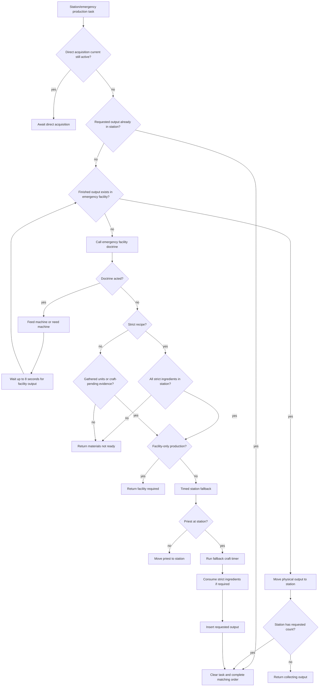

---

## 2. Function Inventory

| Function | Type | Role | Major side effects |
|---|---:|---|---|
| `now`, `valid`, `safe`, `lower` | local helpers | Time, entity validity, formatting | none |
| `pair_map`, `valid_pair`, `station_unit`, `priest_unit` | local pair helpers | Pair access and identity | none |
| `dist_sq`, `at_station` | local geometry | Station proximity | none |
| `item_exists(name)` | local prototype helper | Checks item prototype | reads `prototypes.item` |
| `M.root()` | public storage root | Ensures executor configuration/stats/history | writes `storage.tech_priests.emergency_production_executor_0514` |
| `stat(name,n)` | local metric | Increments stats | writes root stats |
| `record(action,pair,detail)` | local history | Adds bounded event record | writes root recent |
| `draw(pair,text,ttl)` | local display helper | Emits overhead status through 0473/0184 | visual side effect |
| `bar(progress,width)` | local formatter | Creates progress bar | none |
| `station_inventory(pair)` | local inventory selector | Returns first valid station inventory among chest/machine/furnace IDs | none directly |
| `inv_count`, `inv_remove`, `inv_insert` | local inventory helpers | Count/remove/insert physical items | mutate inventories for remove/insert |
| `station_count(pair,item)` | local count | Counts item only in selected station inventory | none |
| `station_insert(pair,item,count)` | local deposit | Inserts into selected station inventory | mutates inventory |
| `current_order(pair)` | local accessor | Reads queue current | none |
| `task_item(task)` | local extractor | Resolves output/requested item | none |
| `current_task(pair)` | local selector | Finds emergency/station/active craft task or creates order proxy | creates transient proxy table only |
| `task_has_direct_current(task)` | local predicate | Detects direct-mining current subtask | none |
| `needed_count(task)` | local resolver | Output quantity | none |
| `needed_units(task)` | local resolver | Required gathered units | none |
| `gathered_units(task)` | local resolver | Current gathered progress | none |
| `ready_materials(task)` | local predicate | Uses station craft pending flags or gathered-unit threshold | none |
| `strict_ingredients(task)` | local accessor | Reads `strict_recipe_ingredients_0647` | none |
| `strict_materials_ready(pair,task)` | local predicate | Checks every strict ingredient in station inventory | none |
| `consume_strict_materials(pair,task)` | local inventory mutator | Removes strict ingredients sequentially | mutates station inventory |
| `set_phase(pair,phase,detail)` | local state writer | Updates dispatcher production phase | writes dispatcher action/phase/state |
| `complete_order_if_matches(pair,item,reason)` | local queue mutator | Marks matching current order complete and clears it | mutates queue/current/history |
| `clear_task(pair,source)` | local task cleanup | Clears source task field except order proxy | mutates pair task fields |
| `request_move_station(pair,reason)` | local movement writer | Moves priest to station | writes target/mode/move trace; requests movement |
| `facility_root()` | local accessor | Gets emergency facility doctrine storage | none |
| `facility_records(pair)` | local facility resolver | Returns valid station facility records and prunes invalid ones | mutates facility root when invalid records found |
| `facility_inventory(entity,id)` | local inventory helper | Gets facility inventory | none |
| `collect_from_facilities(pair,item,count)` | local transfer executor | Removes matching output from facility inventories and inserts into station | mutates facility and station inventories |
| `production_role_for(item)` | local classifier | Maps requested output to smelter/condenser/assembler role | none |
| `has_facility_role(pair,role)` | local predicate | Checks registered facility role | none |
| `call_facility_doctrine(pair,item,reason)` | local executor adapter | Calls emergency facility doctrine under dispatch flag | writes root dispatching flag; doctrine side effects |
| `fallback_ticks(task)` | local timing | Computes timed fallback duration | none |
| `service_timed_station_fallback(pair,task,source,item)` | local executor | Return-to-station, timer, strict consumption, output insertion, completion | broad movement/inventory/task/queue side effects |
| `M.service_pair(pair,reason)` | public executor | Main production decision tree | broad state/inventory/doctrine side effects |
| `M.service_all(reason)` | public loop | Services all pairs with current production task | calls `M.service_pair` |
| `should_block_legacy(pair)` | local predicate | Determines whether legacy desperation craft functions should be intercepted | none |
| `wrap_legacy_desperation_craft()` | local wrapper installer | Replaces legacy handle function with 0514 service when active | replaces global function |
| `wrap_legacy_finish()` | local wrapper installer | Replaces legacy finish function with 0514 service when active | replaces global function |
| `wrap_facility_doctrine()` | local wrapper installer | Suppresses independent facility `service_pair` and `service_all` pulses | replaces doctrine functions |
| `selected_pair(player)` | local command helper | Resolves selected pair | none |
| `install_command()` | local command installer | Registers `/tp-emergency-production-0514` | command surface |
| `wrap_pair_dump()` | local diagnostics wrapper | Adds production state to pair dump | replaces diagnostics function |
| `M.install()` | public installer | Installs wrappers/command/diagnostics/global export | no periodic registration |

---

## 3. Executor Configuration

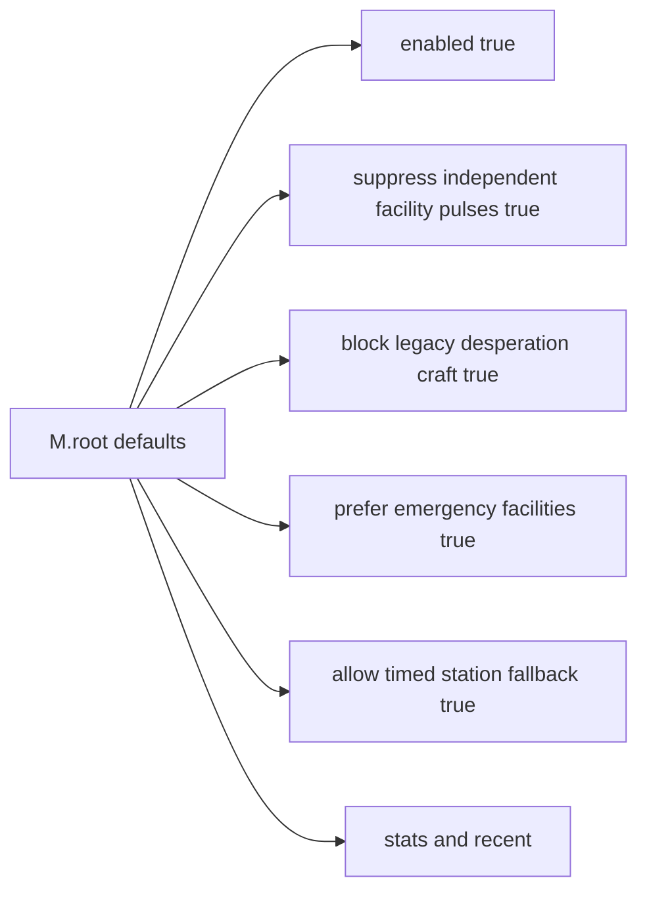

These flags can be changed through the remaining slash command.

---

## 4. Station Inventory Selection

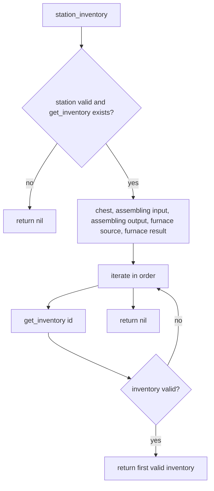

Important consequence:

- This is not an aggregate station inventory view.
- `station_count`, `station_insert`, strict-material checks, and strict-material consumption all use only the first valid inventory returned.
- On a station prototype exposing more than one valid inventory, later inventories are invisible to these helpers.

---

## 5. Current Production Task Selection

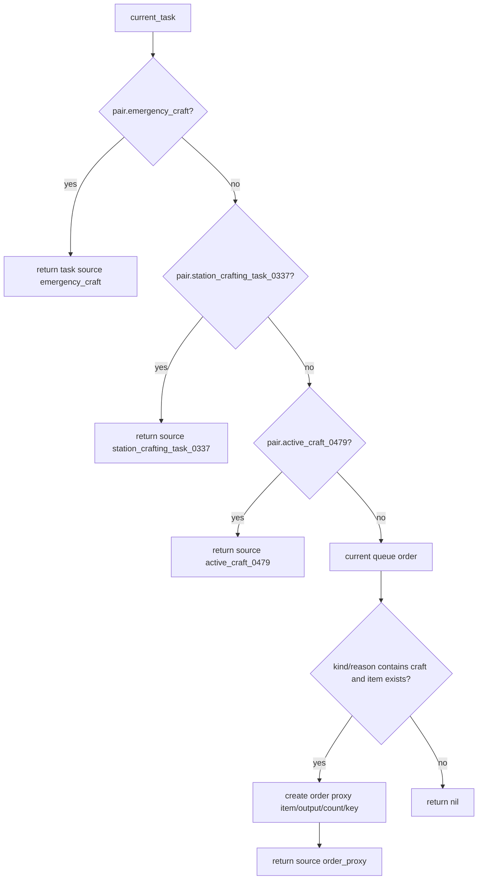

An order proxy is not stored back on the pair. It is recreated on every call from the queue current order.

---

## 6. Direct-Acquisition Handoff Predicate

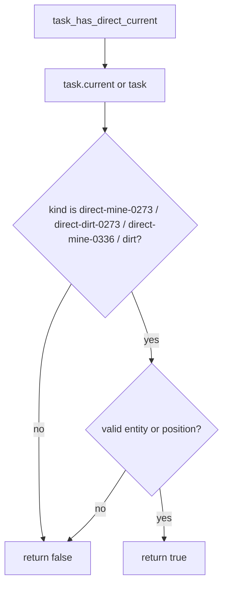

When true, `M.service_pair()` returns `await-direct-acquisition` and does not attempt facility production or station fallback.

---

## 7. Material Readiness Models

### Legacy/gathered-unit model

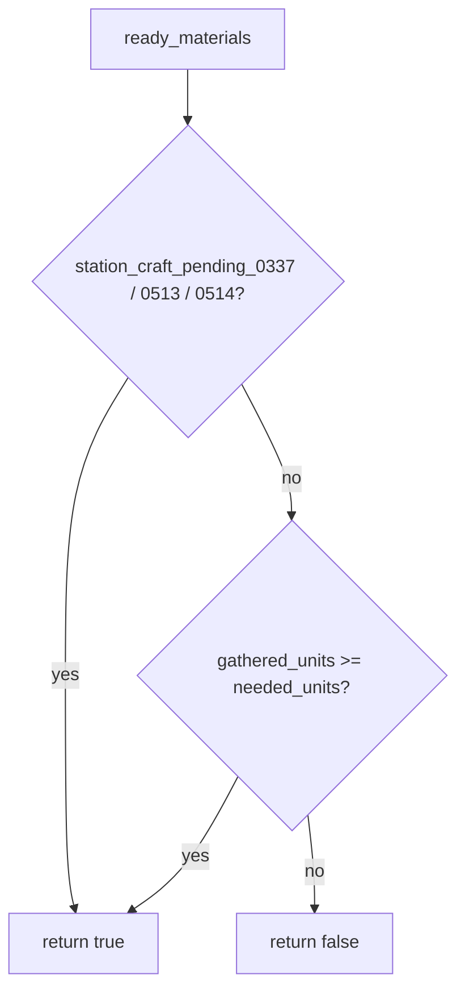

This is material evidence, not a physical ingredient check.

### Strict recipe model

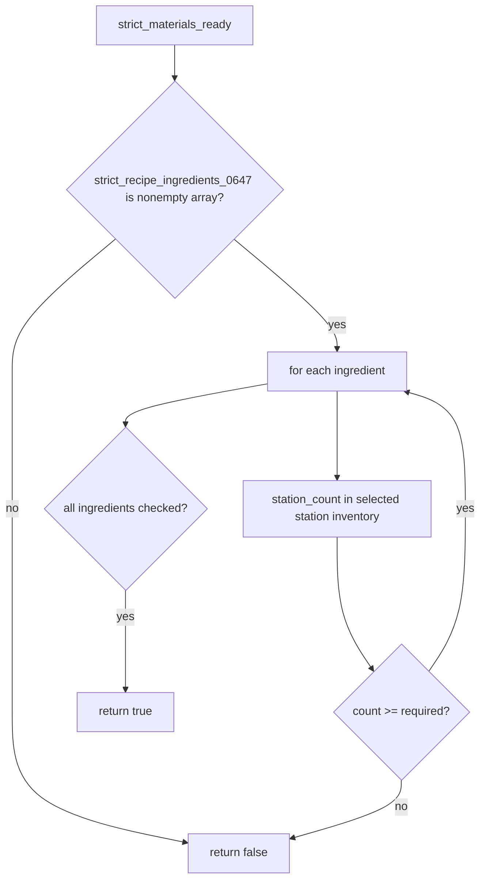

---

## 8. Strict Material Consumption

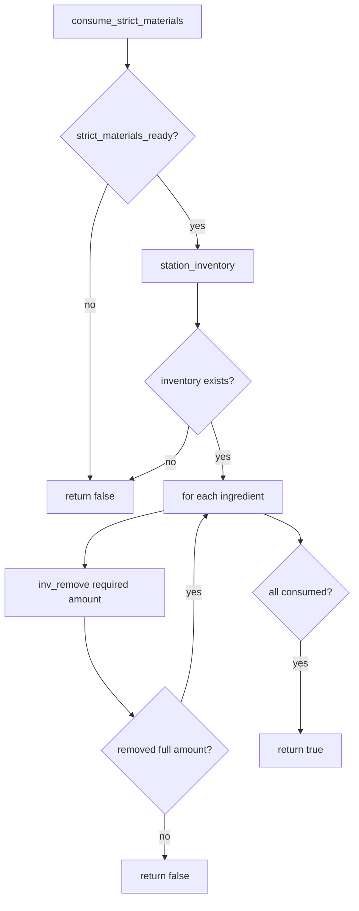

Risk: consumption is sequential and has no rollback. If an unexpected removal failure occurs after earlier ingredients were removed, the function returns false while previously removed ingredients remain consumed.

---

## 9. Production Phase State

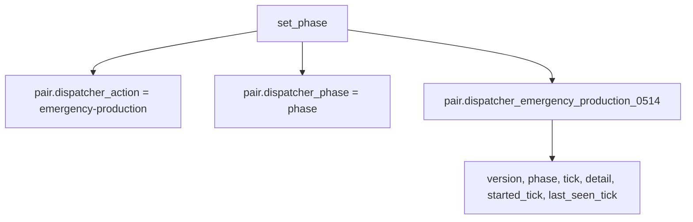

`started_tick` is set once and is not reset by `set_phase()` when the executor moves to a new phase.

---

## 10. Matching Order Completion

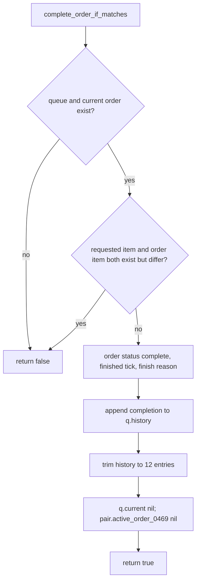

Important differences from the order queue's own lifecycle functions:

- It does not call `order_queue_0469.promote()`.
- It trims queue history to twelve entries, while the queue itself normally retains up to two hundred.
- The next pending order waits until a later queue tick or dispatcher order tick.

---

## 11. Return-to-Station Movement

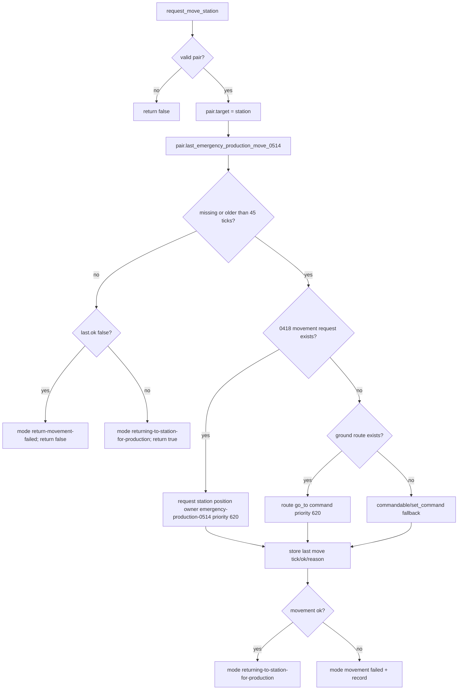

Late leaf/movement authorities may redirect this station movement if a concrete acquisition or construction leaf remains active.

---

## 12. Emergency Facility Records

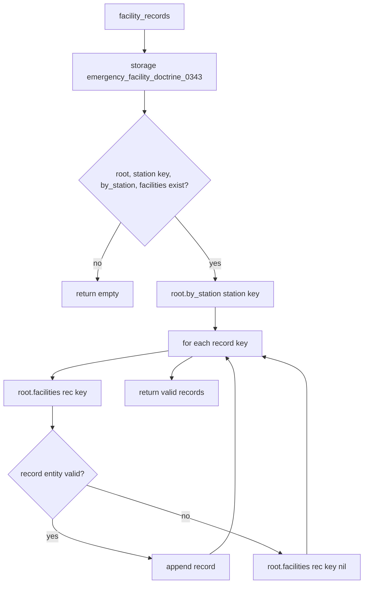

Invalid facility records are pruned from `root.facilities`, but the station bucket's key set is not cleared here.

---

## 13. Facility Output Collection

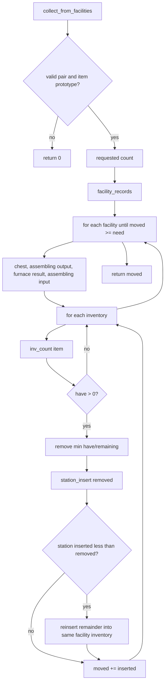

Risk: assembling-machine input is included as a collectible output source. Requested items placed as machine ingredients can be pulled back out and treated as finished production.

---

## 14. Production Role Classification

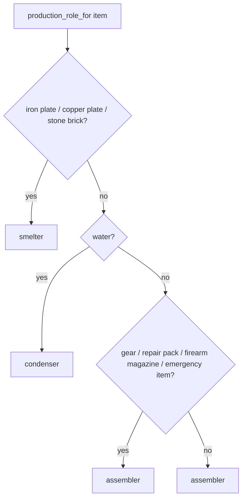

Every item not explicitly recognized as smelting or water production defaults to assembler.

---

## 15. Facility Doctrine Handoff

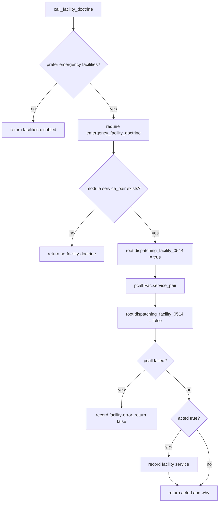

If the doctrine call throws a Lua error, the dispatching flag is still cleared because the error is captured by `pcall` before the flag reset line executes.

---

## 16. Facility Preference and Wait Flow

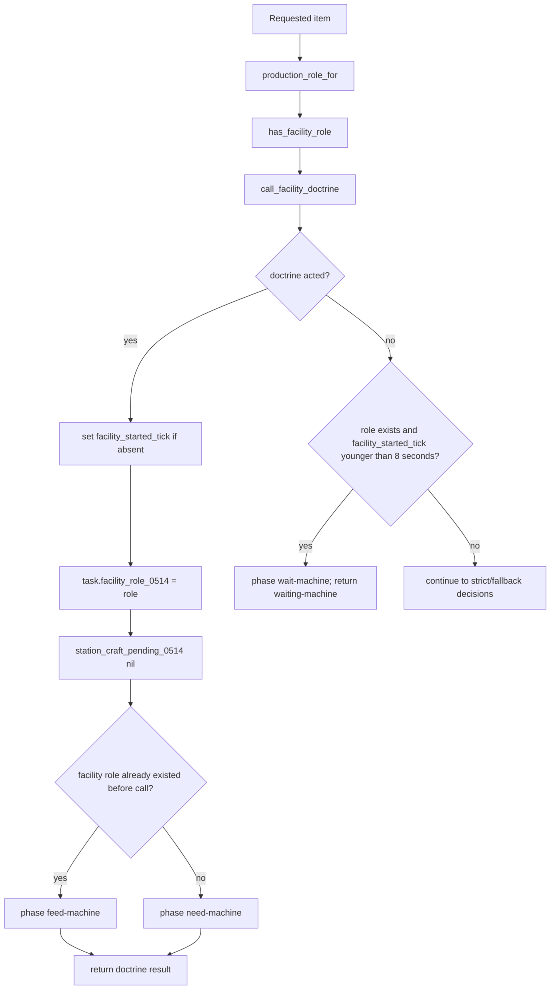

`have_role` is evaluated before the doctrine call. If the doctrine creates the required facility during that call, the phase for that tick remains `need-machine` even though a facility may now exist.

---

## 17. Timed Fallback Duration

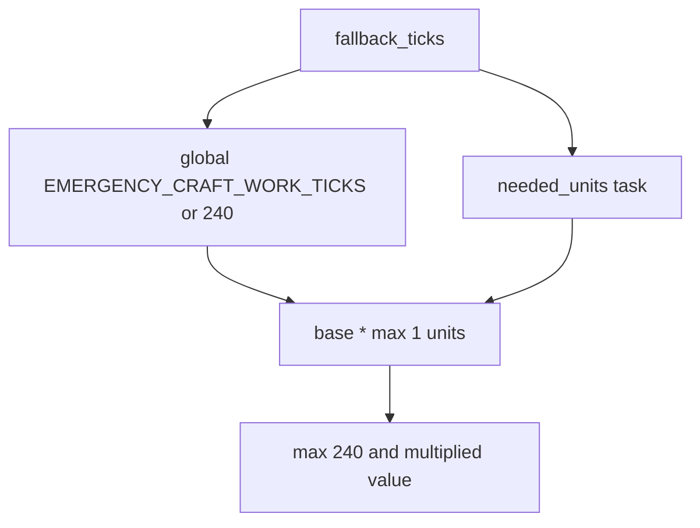

The duration scales with recipe units/required count, not recipe energy, complexity, ingredient count, or item crafting time.

---

## 18. Timed Station Fallback State Machine

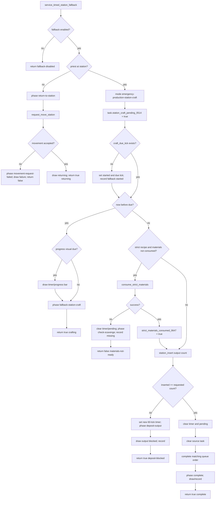

---

## 19. Output-Blocked Overproduction Risk

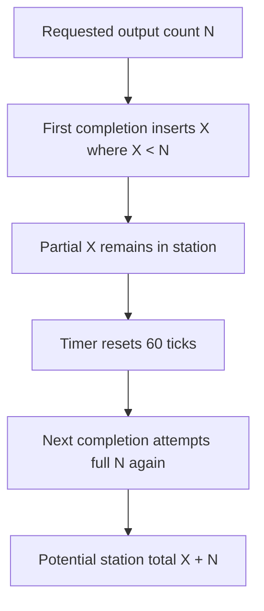

The blocked-output branch does not remove the partial output already inserted and does not reduce the remaining requested count. On a later retry it attempts the full `need` again. This can overproduce when the first insertion was partial.

---

## 20. Main `M.service_pair` Flow

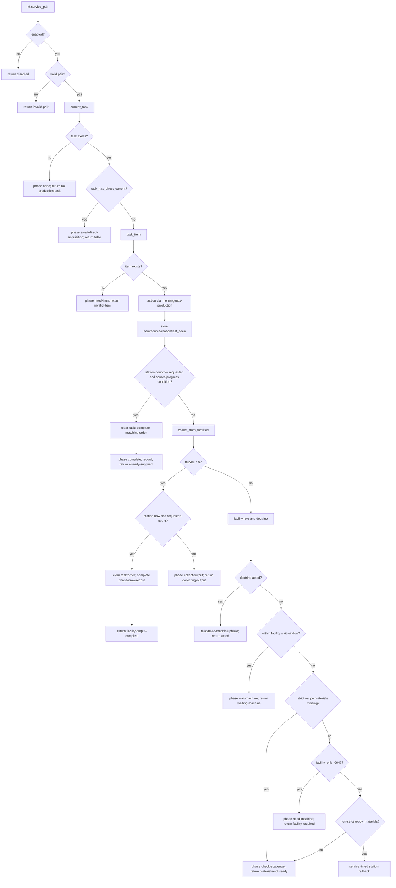

---

## 21. Already-Supplied Condition

```mermaid
flowchart TD
    Supplied[station_count >= requested]
    Supplied --> Extra{source order_proxy OR gathered_units <= 0 OR ready_materials?}
    Extra -- yes --> Complete[clear task/order and return already-supplied]
    Extra -- no --> Continue[continue facility/fallback path]
```

This condition prevents a material-gathering task with positive but insufficiently certified gathered-unit state from being completed merely because the output item happens to be present. For most task records with `gathered_units` absent or zero, station inventory alone completes the task.

---

## 22. Strict vs Non-Strict Decision Boundary

```mermaid
flowchart TD
    Decision[After facility doctrine/wait]
    Decision --> Strict{task.strict_recipe_0647?}
    Strict -- yes --> ReadyStrict{strict ingredients physically ready?}
    ReadyStrict -- no --> MaterialWait[return materials-not-ready]
    ReadyStrict -- yes --> FacilityOnly

    Strict -- no --> ReadyLegacy{pending flag or gathered_units threshold?}
    ReadyLegacy -- no --> MaterialWait
    ReadyLegacy -- yes --> FacilityOnly{facility_only_0647?}

    FacilityOnly -- yes --> NeedMachine[return facility-required]
    FacilityOnly -- no --> TimedFallback[timed fallback]
```

There is no non-strict physical ingredient verification in this executor.

---

## 23. Service-All Behavior

```mermaid
flowchart TD
    All[M.service_all]
    All --> Enabled{enabled?}
    Enabled -- no --> Zero[return 0]
    Enabled -- yes --> Loop[iterate pair map]
    Loop --> Eligible{valid pair and current_task exists?}
    Eligible -- yes --> Service[pcall M.service_pair]
    Eligible -- no --> Next[next]
    Service --> PcallOK{pcall succeeded?}
    PcallOK -- yes --> Increment[n += 1]
    PcallOK -- no --> Next
    Increment --> Limit{n >= 24?}
    Limit -- yes --> Return[return n]
    Limit -- no --> Next
```

Like several other service loops, the count increments when the call does not throw, even if `M.service_pair()` returns `false`.

---

## 24. Legacy Desperation Craft Blocking

### Gate predicate

```mermaid
flowchart TD
    Block[should_block_legacy]
    Block --> Config{executor enabled and block legacy true?}
    Config -- no --> False[return false]
    Config -- yes --> Valid{valid pair and current task?}
    Valid -- no --> False
    Valid -- yes --> Phase{dispatcher production phase exists and not none?}
    Phase -- yes --> True[return true]
    Phase -- no --> Dispatcher{single dispatcher family station-craft within 180 ticks?}
    Dispatcher -- yes --> True
    Dispatcher -- no --> False
```

### Handle wrapper

```mermaid
flowchart TD
    Handle[wrapped handle_emergency_desperation_craft]
    Handle --> Block{should_block_legacy?}
    Block -- no --> Original[call old function]
    Block -- yes --> Service[pcall M.service_pair legacy-handle-wrapper]
    Service --> Record[record legacy craft blocked]
    Record --> OK{pcall ok?}
    OK -- yes --> Return[return acted not false]
    OK -- no --> True[return true]
```

### Finish wrapper

```mermaid
flowchart TD
    Finish[wrapped finish_emergency_desperation_craft]
    Finish --> Block{should_block_legacy?}
    Block -- no --> Original[call old finish]
    Block -- yes --> Service[pcall M.service_pair legacy-finish-wrapper]
    Service --> Record[record legacy finish blocked]
    Record --> OK{pcall ok?}
    OK -- yes --> Return[return acted not false]
    OK -- no --> True[return true]
```

If the replacement service throws, both wrappers return `true`, suppressing the old function while reporting the legacy call as handled.

---

## 25. Emergency Facility Doctrine Pulse Suppression

```mermaid
flowchart TD
    Wrap[wrap_facility_doctrine]
    Wrap --> ServicePair[wrap Fac.service_pair]
    Wrap --> ServiceAll[wrap Fac.service_all]

    ServicePair --> Gate{enabled, suppression true, not dispatching flag, reason not dispatcher/command/manual?}
    Gate -- yes --> Suppress[return false suppressed-by-0514]
    Gate -- no --> Original[call saved service_pair]

    ServiceAll --> GateAll{same suppression conditions?}
    GateAll -- yes --> SuppressAll[return 0]
    GateAll -- no --> OriginalAll[call saved service_all]
```

`call_facility_doctrine()` temporarily sets `root.dispatching_facility_0514 = true`, allowing its own doctrine call through the wrapper.

---

## 26. Command Surface

```mermaid
flowchart TD
    Command[install_command]
    Command --> Add[add tp-emergency-production-0514]
    Add --> Params[on/off/all/facilities-on/facilities-off/legacy-on/legacy-off]
    Params --> Enabled[root.enabled]
    Params --> FacilitySuppression[root.suppress_independent_facility_pulses]
    Params --> LegacyBlock[root.block_legacy_desperation_craft]
    Params --> Manual[M.service_all manual-all]
    Params --> Print[selected pair phase/item/source/detail and global stats]
```

The command does not expose `prefer_emergency_facilities` or `allow_timed_station_fallback`, even though both are root configuration fields.

---

## 27. Diagnostics Wrapper

```mermaid
flowchart TD
    Wrap[wrap_pair_dump]
    Wrap --> Save[save previous pair_dump_lines]
    Save --> Header[append enabled/suppression/block/stats]
    Header --> Pairs[for every station pair]
    Pairs --> Task[current_task]
    Task --> State[phase item source facility count detail]
    State --> Recent[append last thirteen recent events]
    Recent --> Return[return lines]
```

---

## 28. Install Flow

```mermaid
flowchart TD
    Install[M.install]
    Install --> Root[M.root]
    Root --> Facility[wrap_facility_doctrine]
    Facility --> LegacyHandle[wrap_legacy_desperation_craft]
    LegacyHandle --> LegacyFinish[wrap_legacy_finish]
    LegacyFinish --> Diagnostics[wrap_pair_dump]
    Diagnostics --> Command[install_command]
    Command --> Global[_G.TechPriestsEmergencyProductionExecutor0514 = M]
```

No tick broker, event registry, or `script.on_nth_tick` registration occurs in this module's `install()`.

---

## 29. State Write Matrix

| State field | Writer | Meaning | Risk |
|---|---|---|---|
| `storage.tech_priests.emergency_production_executor_0514` | `M.root` | Configuration, dispatch flag, stats, history | High authority |
| `root.dispatching_facility_0514` | `call_facility_doctrine` | Bypasses doctrine pulse suppression for sanctioned call | Critical wrapper control |
| `pair.dispatcher_action` | `set_phase` | Broad action emergency-production | High |
| `pair.dispatcher_phase` | `set_phase` | Broad current phase | High |
| `pair.dispatcher_emergency_production_0514` | `set_phase`, `M.service_pair` | Detailed production trace | Critical for legacy blocking |
| `pair.target` | `request_move_station` | Station return target | Critical movement target |
| `pair.mode` | movement/fallback branches | Return, craft, or failure mode | High; arbiter reads mode |
| `pair.last_emergency_production_move_0514` | `request_move_station` | Movement throttle/result | Medium-high |
| `task.station_craft_pending_0514` | fallback/facility paths | Craft material/timer readiness | High; arbiter reads craft-pending state indirectly |
| `task.craft_started_tick_0514` | fallback | Timer start | High |
| `task.craft_due_tick_0514` | fallback | Timer completion/retry | High |
| `task.next_progress_visual_0514` | fallback | Display throttle | Low |
| `task.strict_materials_consumed_0647` | strict fallback | Prevents repeated strict ingredient removal | High |
| `task.facility_started_tick_0514` | facility doctrine acted | Machine wait start | High |
| `task.facility_role_0514` | facility doctrine acted | Required facility role | Medium |
| `pair.emergency_craft` | `clear_task` | Primary emergency production task | Critical |
| `pair.station_crafting_task_0337` | `clear_task` | Station craft task | Critical |
| `pair.active_craft_0479` | `clear_task` | Alternate craft task | Critical |
| queue current/active order/history | `complete_order_if_matches` | Completes matching order without promotion | Critical scheduler state |
| facility inventories | collection/refund | Physical output transfer | Critical inventory truth |
| selected station inventory | strict consumption/output insert | Physical ingredient/output state | Critical inventory truth |

---

## 30. Phase / Result Matrix

| Phase | Trigger | Return | Expected next system |
|---|---|---|---|
| `none` | no task | `no-production-task` false | dispatcher chooses other family |
| `await-direct-acquisition` | direct current still active | false | direct executor continues |
| `need-item` | invalid/missing output item | false | task metadata repair needed |
| `complete` | already supplied, facility output complete, or fallback complete | true | queue later promotes next |
| `collect-output` | partial facility output moved | true | next call collects more |
| `feed-machine` | facility existed and doctrine acted | true | doctrine/machine works |
| `need-machine` | doctrine acted without role or facility-only without machine | true or false depending branch | construction/facility doctrine |
| `wait-machine` | facility started within eight seconds | true | poll facility output |
| `check-scavenge` | materials not ready | false | scheduler/logistics/direct acquisition |
| `return-to-station` | fallback ready but priest away | true or false on movement | movement controller |
| `movement-request-failed` | return movement rejected | false | movement recovery |
| `fallback-station-craft` | timer active | true | continue timer |
| `deposit-output` | partial/blocked output insert | true | retry timer |

---

## 31. Failure and Risk Matrix

| Risk | Mechanism | Consequence |
|---|---|---|
| First-valid station inventory only | `station_inventory()` returns one inventory | Materials/output in other station inventories are ignored |
| Strict consumption lacks rollback | Sequential `inv_remove` | Partial ingredient loss on unexpected mid-loop failure |
| Facility input harvested as output | Collection includes assembling input | Ingredients can be pulled out as finished requested product |
| Partial output retry inserts full count again | Deposit-blocked branch does not track remainder | Potential overproduction |
| Order completion does not promote | Clears current directly | Pending work waits for later queue tick |
| Queue history retention is reduced | Trims to 12 entries | Older queue history can be unexpectedly discarded |
| Non-strict fallback is not recipe-backed | Uses flags/gathered units only | Incorrect upstream flags can permit synthetic production |
| Facility role classification defaults assembler | Unknown outputs route assembler | Wrong facility type may be requested |
| Facility wait is only eight seconds | Fixed wait window | Slow facilities may be bypassed by fallback |
| Legacy wrapper reports handled on executor error | Returns true after pcall failure | Old fallback is suppressed during replacement failure |
| Order proxy is transient | Recreated each call | Timer/progress cannot persist on order-proxy table itself unless task state lives elsewhere |
| No own periodic service | Install registers no scheduler | Production depends on dispatcher/wrapper/manual invocation |
| Raw station insertion | Uses selected inventory `insert` | Bypasses broader safe-deposit/steward system |

---

## 32. Dispatcher / Arbiter / Direct Executor Interaction

```mermaid
sequenceDiagram
    participant A as Action Arbiter 0488
    participant D as Single Dispatcher 0510
    participant P as Production Executor 0514
    participant X as Direct Executor 0513
    participant F as Facility Doctrine
    participant Q as Order Queue 0469

    A->>A: actual_crafting(pair)
    alt physical direct current exists
        A-->>D: acquisition
        D->>X: execute direct acquisition
        X->>X: gather units and set station craft pending
    else timed craft or craft lock active
        A-->>D: crafting
        D->>P: service_pair
    end

    P->>P: check already supplied
    P->>P: collect facility output
    P->>F: sanctioned facility service
    alt facility acts
        P-->>D: feed-machine / need-machine / waiting-machine
    else materials ready and fallback allowed
        P->>P: timed station fallback
        P->>Q: complete matching current order
    else materials missing
        P-->>D: materials-not-ready false
    end
```

---

## 33. Debugging Decision Tree

```mermaid
flowchart TD
    Bug[Production task not completing or wrong output]
    Bug --> Task{current_task returns expected task/source?}
    Task -- no --> SourceFields[Inspect emergency_craft, station task, active craft, queue order]
    Task -- yes --> Direct{task_has_direct_current true?}
    Direct -- yes --> DirectMap[Inspect direct executor target/progress/handoff]
    Direct -- no --> Item{task_item valid prototype?}
    Item -- no --> Metadata[Repair task output/item metadata]
    Item -- yes --> Station{station_count sees expected physical output?}
    Station -- no --> Inventory[Check first-valid station inventory limitation]
    Station -- yes --> SuppliedCondition{already-supplied extra condition passes?}
    SuppliedCondition -- no --> Gathered[Inspect gathered_units and pending flags]
    SuppliedCondition -- yes --> Complete[Should clear task/order]

    Station -- no --> FacilityOutput{facility contains output?}
    FacilityOutput -- yes --> Collection[Check facility registration/inventory list/station space]
    FacilityOutput -- no --> Doctrine{facility doctrine acted?}
    Doctrine -- yes --> Wait[Check role, facility_started tick, machine operation/output]
    Doctrine -- no --> Strict{strict recipe?}
    Strict -- yes --> StrictReady[Check strict ingredient counts in selected station inventory]
    Strict -- no --> Ready[Check pending flags and gathered units]
    StrictReady --> FacilityOnly{facility-only?}
    Ready --> FacilityOnly
    FacilityOnly -- yes --> FacilityRequired[Need actual emergency machine]
    FacilityOnly -- no --> AtStation{priest at station?}
    AtStation -- no --> Movement[Inspect movement request owner/priority/leaf conflicts]
    AtStation -- yes --> Timer{craft timer active/complete?}
    Timer -- no --> TimerStart[Check service call frequency]
    Timer -- yes --> Deposit{output insert full?}
    Deposit -- no --> Space[Check station space and partial-overproduction risk]
    Deposit -- yes --> Order{matching queue order cleared?}
    Order -- no --> ItemMismatch[Inspect order item and delayed promotion]
```

---

## 34. Progressive Development Targets

The next procedural mapping pass should cover:

1. `consecration_executor_0515.lua`, the next dispatcher-owned family.

Then:

2. `repair_executor_0516.lua`.
3. `combat_repair_doctrine_0517.lua`.
4. `machine_logistics_0528` modules.
5. Inventory steward and station catalog.
6. Emergency facility doctrine internals.
7. Legacy combat modules.
8. Idle/conversation systems.

After those maps exist, the first corrective code phase should address the confirmed order-queue and emergency-production defects before extending behavior features.
