# Tech-Priests Function-Level Mermaid Drilldown: Consecration Executor 0515

Version: 0.1.671-map-pass-12  
Previous drilldown: `docs/BEHAVIOR_MERMAID_FUNCTION_DRILLDOWN_0670_EMERGENCY_PRODUCTION.md`  
Companion overview: `docs/BEHAVIOR_MERMAID_MAP_0660.md`

Purpose: map the dispatcher-owned consecration executor that turns machine sanctity maintenance into a visible, local, physical priest action:

1. find or honor an explicit eligible machine,
2. reserve that target against other priests,
3. move into rite range,
4. spend ritual time,
5. consume one useful consecration item from the station,
6. apply sanctity with explicit priest/station source context,
7. release the claim, apply cooldowns, and complete the matching order.

Mapped module:

- `consecration_executor_0515.lua`

Related systems:

- `single_dispatcher_0510.lua` directly calls this executor for `consecration` family work.
- `action_state_arbiter_0488` identifies consecration intent after acquisition has been ruled out.
- `active_leaf_task_truth_0655` converts executor state into `Walking to consecrate <machine>` or `Consecrating <machine>` leaf truth.
- `order_queue_0469.lua` can hold a priority-700 consecration order.
- `task_scheduler.try_consecration` and legacy `sanctify_target_with_priest` are wrapped into this executor.

Important current-code truths:

1. Consecration is local machine maintenance. Targets outside tier-based station travel limits are rejected.
2. The executor requires the station to have at least one consecration item before scanning for targets.
3. Explicit order/task targets are evaluated before station-radius scanning.
4. Multiple priests are prevented from selecting the same machine through a twelve-second target-claim lease.
5. Eligibility depends on sanctity ratio, target cooldown, item usefulness, travel range, target recognition, and claim ownership.
6. A direct consecration order uses the looser `idle_ratio = 0.92`; ordinary idle maintenance uses `routine_ratio = 0.70`; busy non-idle maintenance uses `maintenance_ratio = 0.50`.
7. Target score favors low sanctity, functioning machines, and shorter priest travel distance.
8. The rite lasts ninety ticks once in range.
9. One station consecration item is physically consumed before sanctity is applied.
10. If sanctity application fails after consumption, the code attempts to refund one item to the station inventory.
11. Completion applies both a forty-five-tick pair cooldown and an eight-second target cooldown.
12. `complete_order()` clears the matching current order but does not promote the next pending order.
13. The module is not independently scheduled by `install()`; it is normally invoked by the dispatcher, scheduler wrapper, legacy wrapper, or manual command.
14. `/tp-consecration-executor-0515` remains installed.

---

## 1. End-to-End Consecration Flow

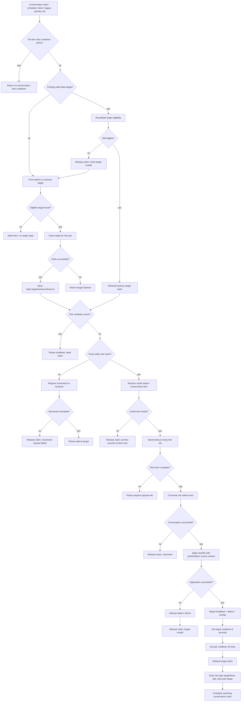

---

## 2. Function Inventory

| Function | Type | Role | Major side effects |
|---|---:|---|---|
| `now`, `valid`, `lower`, `safe`, `dist_sq` | local helpers | Time, validity, formatting, distance | none |
| `valid_pair`, `station_unit`, `priest_unit`, `pair_map` | local pair helpers | Pair validation and identity | none |
| `tier_key(pair)` | local classifier | Resolves junior/intermediate/senior/planetary tier | none |
| `travel_limit(pair)` | local policy | Gets tier-specific station travel radius | none |
| `within_travel_limit(pair,entity)` | local boundary check | Rejects machines too far from station | none |
| `M.root()` | public storage root | Ensures config/stats/recent/claims | writes `storage.tech_priests.consecration_executor_0515` |
| `stat`, `record` | local metrics/history | Tracks executor events | writes root stats/recent |
| `claims_root()` | local claim root | Ensures claim table | writes `root.target_claims` |
| `target_claim_key(entity)` | local key builder | Surface + unit/name target identity | none |
| `cleanup_claims()` | local claim cleanup | Removes malformed/expired claims | mutates claim table |
| `pair_claim_id(pair)` | local owner identity | Station/priest pair ID | none |
| `claim_owner_for_target(entity)` | local claim lookup | Reads and lazily expires target claim | may clear expired claim |
| `target_claimed_by_other(pair,entity)` | local predicate | Detects competing priest claim | none beyond lazy expiry |
| `claim_target(pair,entity,reason)` | local claim writer | Creates/refreshes twelve-second claim | writes target claim |
| `release_target_claim(pair,entity,reason)` | local claim cleanup | Releases own claim and records event | mutates claim table/history |
| `get_order(pair)` | local accessor | Reads queue current or active order mirror | none |
| `order_kind`, `order_is_consecration` | local classifiers | Detects consecration order | none |
| `target_from(v,seen)` | local recursive extractor | Finds target entity inside nested records | none |
| `order_target(pair)` | local selector | Prioritizes order, active tasks, then pair target | none |
| `record_for(entity)` | local sanctity accessor | Calls global consecration record getter | none |
| `is_target(entity)` | local target predicate | Calls global target classifier | none |
| `max_for(record,entity)` | local maximum resolver | Record max, force max, or 100 fallback | none |
| `item_for(station,missing)` | local item selector | Gets useful station consecration item | none |
| `has_station_item(station)` | local inventory predicate | Checks station has any consecration item | none |
| `consume_station_item(station,item_name)` | local inventory mutator | Uses global consume helper or direct removal fallback | physically removes one item |
| `service_threshold(pair,order)` | local policy | Chooses sanctity ratio threshold | none |
| `eligible(pair,entity,order)` | local eligibility engine | Validates target/range/record/cooldown/claim/item/ratio | none beyond lazy claim cleanup |
| `find_target(pair,order)` | local selector | Explicit target first, otherwise scan and score candidates | may record negative scan cache |
| `request_move(pair,target,reason)` | local movement writer | Requests movement at priority 705 | movement/global command side effects |
| `make_actor(pair)` | local source formatter | Builds priest/station display labels | none |
| `apply_source(pair,target,item_name,info)` | local sanctity executor | Applies enriched source-context sanctity or fallback restoration | mutates sanctity record |
| `complete_order(pair,reason)` | local queue mutator | Completes matching consecration order | clears queue current/active mirror |
| `M.active(pair)` | public predicate | Detects active consecration state/order/mode | none |
| `M.service_pair(pair,reason,forced_target)` | public executor | Full claim/move/timer/consume/apply/complete state machine | broad state/inventory/record effects |
| `M.submit_or_assign_consecration_task(pair,target,reason)` | public scheduler bridge | Assigns task and submits order | task scheduler/pair/order queue side effects |
| `wrap_legacy_sanctify()` | local wrapper installer | Routes legacy direct sanctify call through phased executor | replaces global function |
| `wrap_scheduler()` | local wrapper installer | Replaces scheduler try-consecration target selection | replaces scheduler function |
| `selected_pair(player)` | local command helper | Resolves selected pair | none |
| `install_command()` | local command installer | Registers `/tp-consecration-executor-0515` | command surface |
| `wrap_pair_dump()` | local diagnostics wrapper | Appends consecration state/claims/events | replaces diagnostics function |
| `M.install()` | public installer | Installs wrappers/diagnostics/command/global | no periodic registration |

---

## 3. Tier-Based Travel Limits

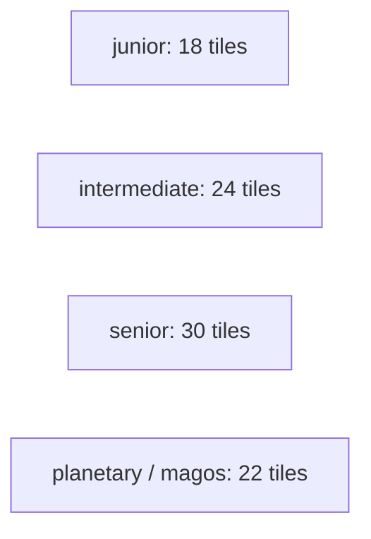

### Tier resolution

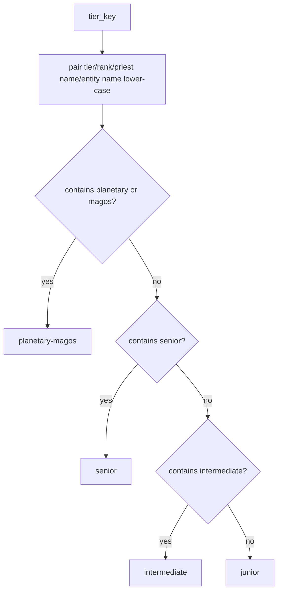

Planetary/Magos priests have a shorter local maintenance radius than senior priests.

---

## 4. Travel-Limit Enforcement

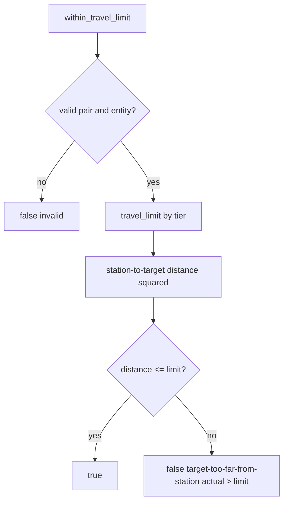

The boundary is measured from the station, not from the priest.

---

## 5. Target Claim System

### Claim key

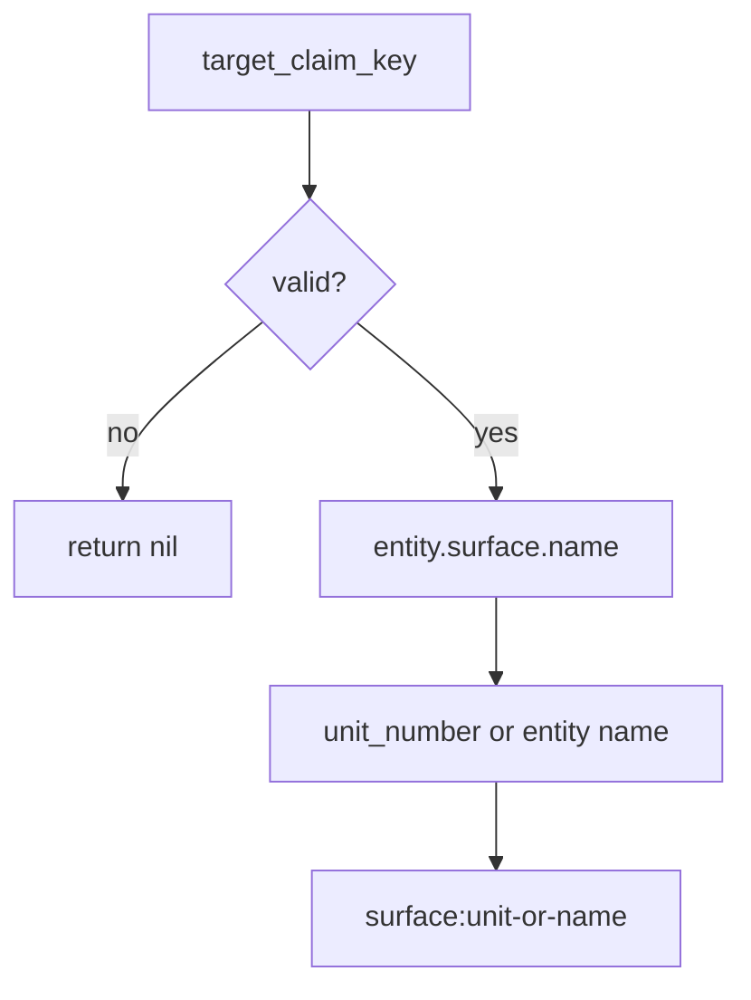

### Claim acquisition

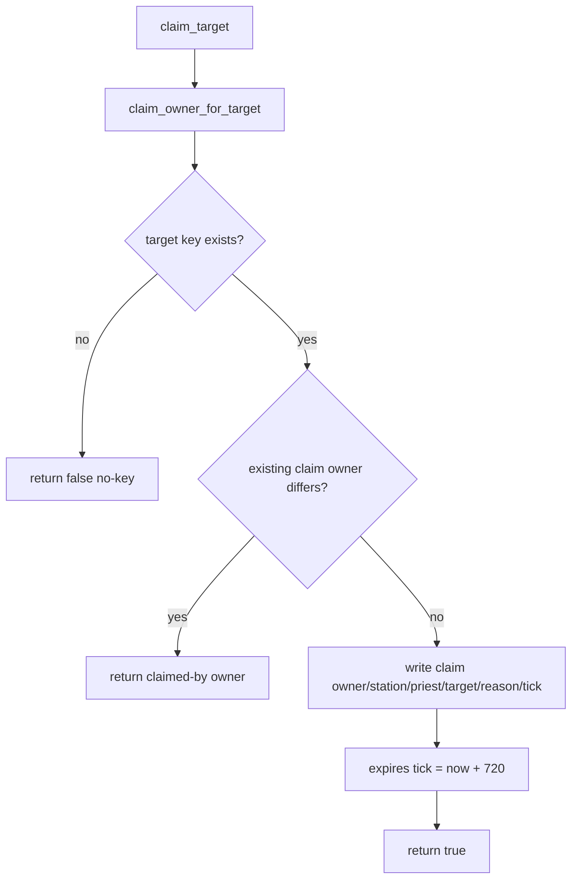

### Claim release

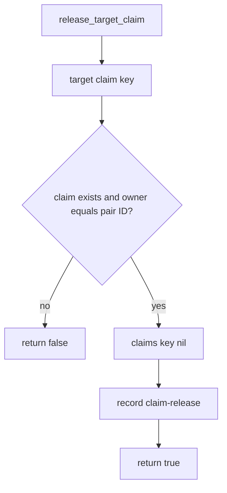

Claims are global within the mod storage and keyed per surface/entity identity.

---

## 6. Claim Cleanup

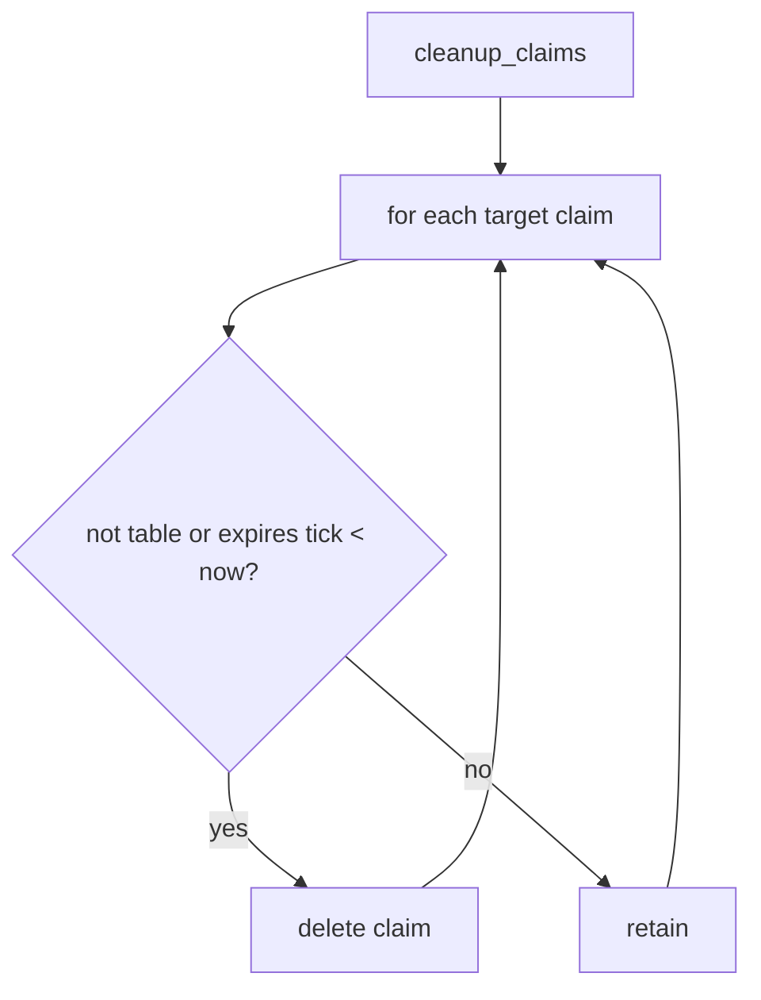

Cleanup runs at the start of every `M.service_pair()` invocation.

---

## 7. Order and Target Resolution

### Order lookup

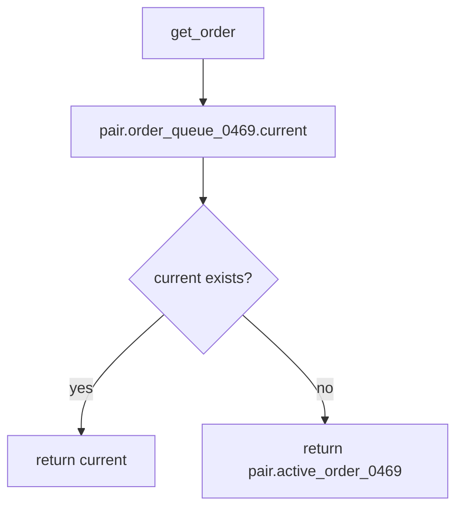

### Recursive target extraction

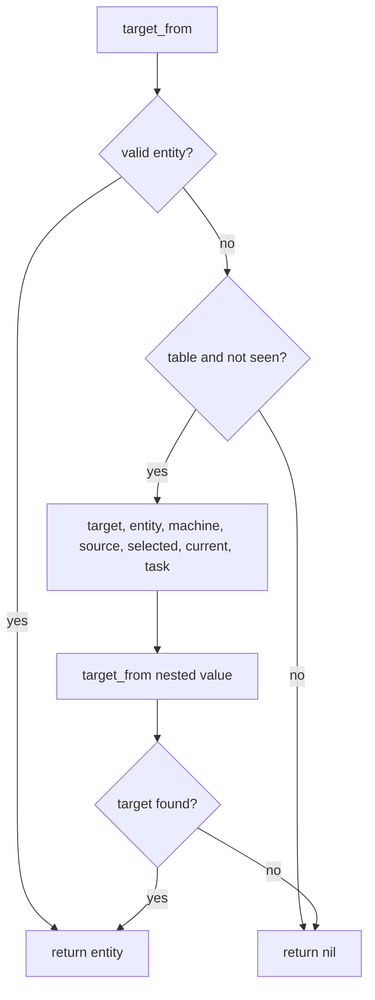

### Target priority

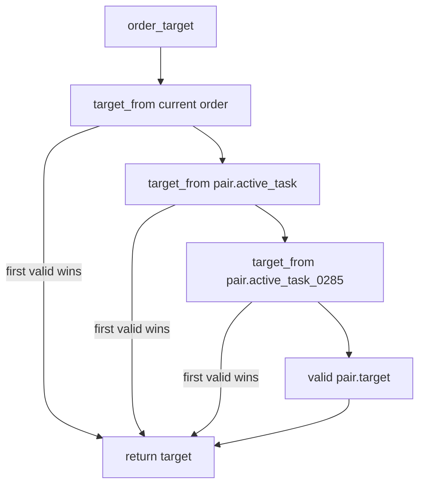

A stale target nested in the current order can override a newer target stored in active tasks or `pair.target`.

---

## 8. Service Threshold Policy

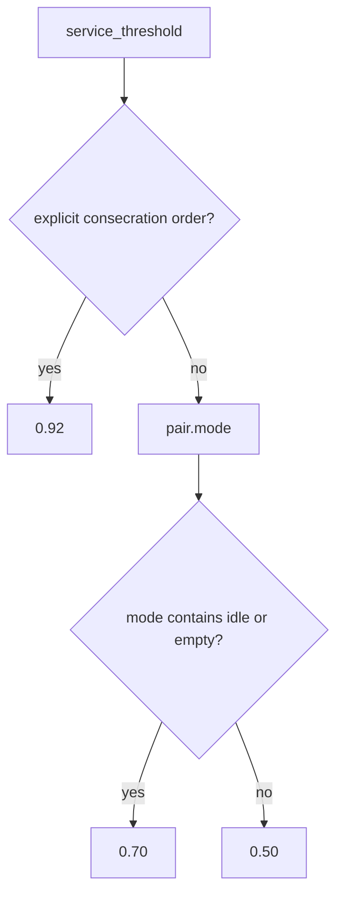

`urgent_ratio = 0.35` is defined but is not used by `service_threshold()` in the current file.

---

## 9. Eligibility Engine

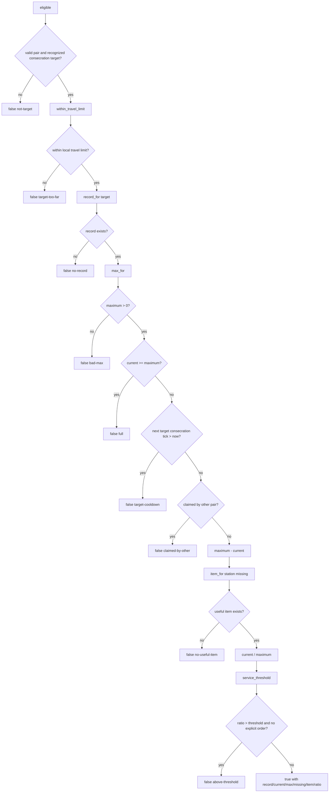

Eligibility does not itself verify that the selected item can still be consumed later. That is rechecked only at rite completion.

---

## 10. Target Search Flow

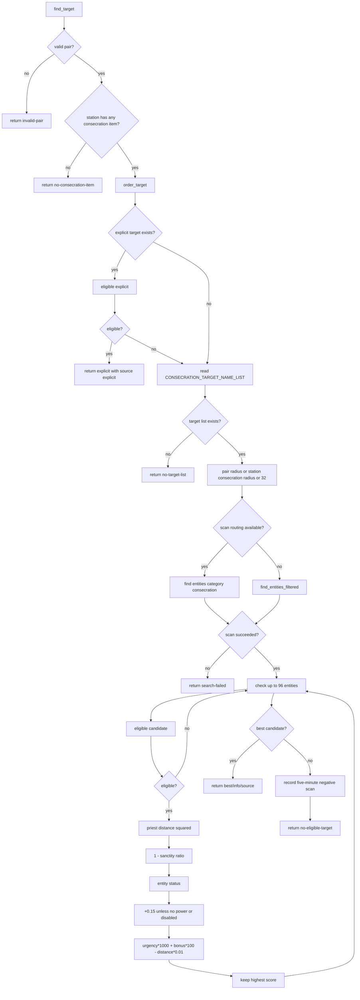

Urgency overwhelmingly dominates score. Distance is a small tie-breaking penalty.

---

## 11. Candidate Score

```mermaid
flowchart LR
    Score[Candidate score]
    Score --> Urgency[(1 - sanctity ratio) × 1000]
    Score --> Active[Functioning status bonus × 100]
    Score --> Distance[Minus priest distance² × 0.01]
```

An unpowered/disabled machine receives no active bonus but remains eligible if all other requirements pass.

---

## 12. Movement Request Flow

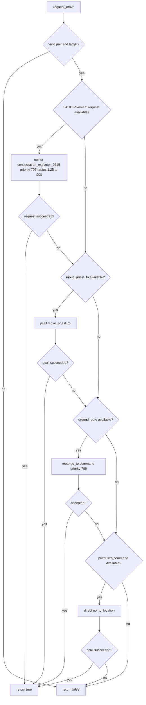

Potential issue: the legacy `move_priest_to` branch treats a successful `pcall` as success even if the wrapped function returns `false`.

---

## 13. Source-Context Construction

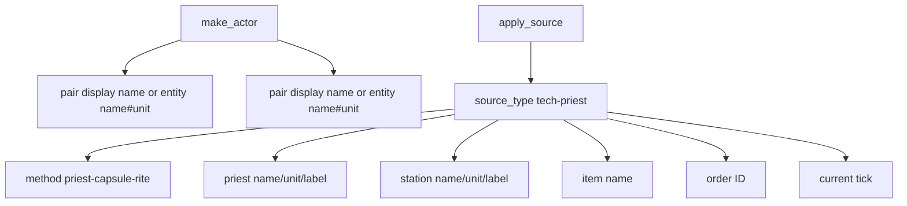

The enriched API receives explicit provenance for audit/history systems.

---

## 14. Sanctity Application Flow

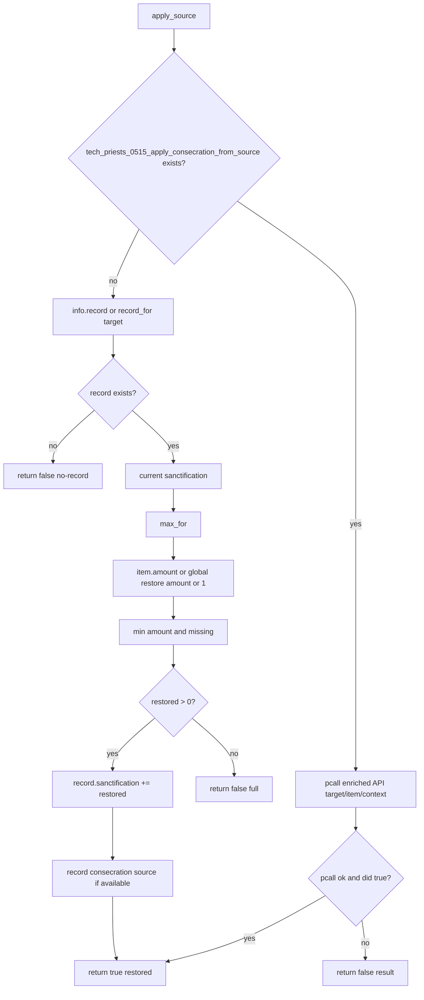

The fallback reads `info.item.amount`, assuming the selected item descriptor may contain an `amount` field.

---

## 15. Main `M.service_pair` Entry and Target Selection

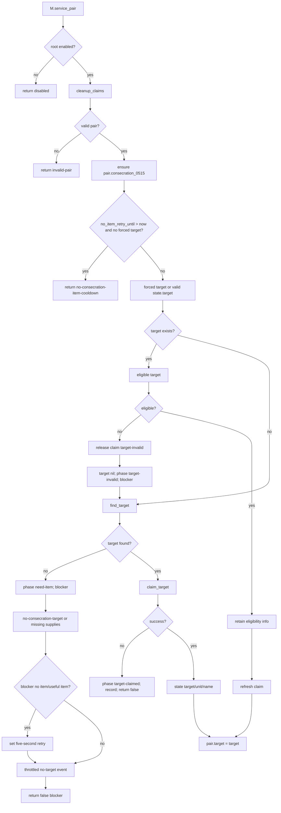

---

## 16. Pair Cooldown Branch

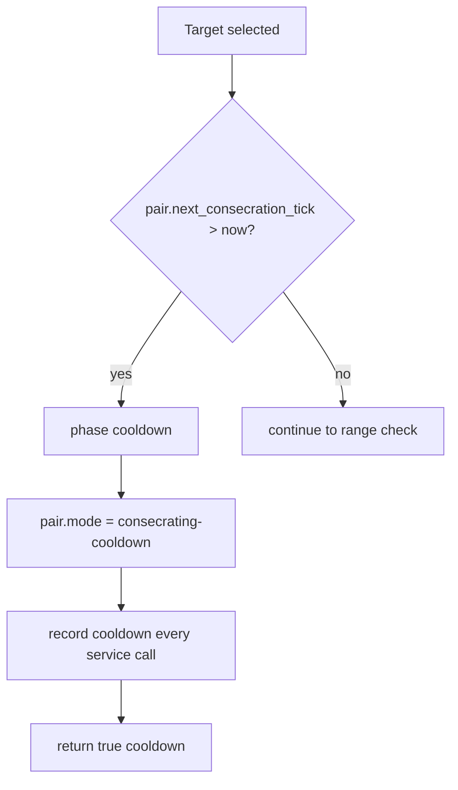

The target claim is retained while pair cooldown is active and refreshed on every service call through `claim_target()`.

---

## 17. Movement Branch

```mermaid
flowchart TD
    Range[distance priest to target]
    Range --> Far{distance² > PRIEST_CONSECRATION_REACH_DISTANCE_SQ or 16?}
    Far -- no --> Item[continue rite item check]
    Far -- yes --> Move[request_move]
    Move --> StoreDistance[state.distance]
    StoreDistance --> Moved{movement accepted?}
    Moved -- no --> Release[release target claim]
    Release --> Fail[phase movement-request-failed; blocker; mode failure; record]
    Fail --> ReturnFalse[return false]
    Moved -- yes --> Walk[phase walk-to-target]
    Walk --> Mode[pair.mode = moving-to-consecrate]
    Mode --> Record[record walk every service call]
    Record --> ReturnTrue[return true walk-to-target]
```

The walk event is not throttled in this branch, so repeated service calls can fill recent history with walk records.

---

## 18. Rite Item Check

```mermaid
flowchart TD
    Item[In rite range]
    Item --> Missing[eligibility info missing amount or item_for station]
    Missing --> Has{useful item exists?}
    Has -- yes --> Rite[continue rite timer]
    Has -- no --> Release[release claim]
    Release --> Need[phase need-item; blocker no-useful-consecration-item]
    Need --> Retry[set five-second no-item retry]
    Retry --> Mode[pair.mode = missing-consecration-supplies]
    Mode --> Record[throttled need-item record]
    Record --> Return[return false]
```

The executor performs an initial item check before scanning and a second item selection when the priest reaches the target.

---

## 19. Rite Timer Flow

```mermaid
flowchart TD
    Rite[Useful item and in range]
    Rite --> Phase{state phase already throw-or-apply-capsule?}
    Phase -- yes --> Keep[retain phase]
    Phase -- no --> Prepare[phase prepare-capsule-rite]
    Keep --> Fields
    Prepare --> Fields[state.item; started_tick if nil; due_tick if nil now+90]
    Fields --> Mode[pair.mode = performing-consecration-rite]
    Mode --> Due{now < due_tick?}
    Due -- yes --> Progress[record rite-progress every service call]
    Progress --> Return[return true prepare-capsule-rite]
    Due -- no --> ApplyPhase[phase throw-or-apply-capsule]
```

`started_tick` and `due_tick` are only cleared on successful completion. Several failure paths leave them intact.

---

## 20. Item Consumption and Application

```mermaid
flowchart TD
    ApplyPhase[throw-or-apply-capsule]
    ApplyPhase --> Consume[consume_station_item]
    Consume --> Consumed{success?}
    Consumed -- no --> ReleaseConsume[release claim consume-failed]
    ReleaseConsume --> Need[phase need-item; blocker consume-failed; record]
    Need --> ReturnConsume[return false consume-failed]

    Consumed -- yes --> Apply[apply_source]
    Apply --> Applied{success?}
    Applied -- no --> Refund[try get_station_inventory and insert one item]
    Refund --> ReleaseApply[release claim apply-failed]
    ReleaseApply --> Invalid[phase target-invalid; blocker includes result; record]
    Invalid --> ReturnApply[return false]

    Applied -- yes --> Feedback[play repair feedback]
    Feedback --> Labels[draw sanctification label + update overlay]
    Labels --> TargetRecord[record_for target]
    TargetRecord --> Cooldown[set target next priest tick +480]
    Cooldown --> PairCooldown[set pair next tick +45]
    PairCooldown --> ReleaseComplete[release claim complete]
    ReleaseComplete --> Clear[phase complete, completed tick, restored; clear target/start/due]
    Clear --> PairIdle[pair.mode idle; pair.target nil]
    PairIdle --> Order[complete_order]
    Order --> RecordComplete[record complete]
    RecordComplete --> ReturnComplete[return true]
```

---

## 21. Consumption Fallback

```mermaid
flowchart TD
    Consume[consume_station_item]
    Consume --> Helper{consume_consecration_item_from_station exists?}
    Helper -- yes --> Call[pcall helper]
    Call --> Result[return true only if helper returns true]
    Helper -- no --> Inventory[get_station_inventory]
    Inventory --> Remove[inv.remove one item]
    Remove --> Result2[return removed > 0]
```

The fallback uses the single inventory returned by `get_station_inventory` and does not search station-bound inventory steward sources.

---

## 22. Application Failure Refund

```mermaid
flowchart TD
    ApplyFailed[Sanctity application failed after consumption]
    ApplyFailed --> Inventory[get_station_inventory]
    Inventory --> Exists{inventory exists?}
    Exists -- yes --> Insert[insert one consumed item]
    Exists -- no --> Lost[refund silently unavailable]
    Insert --> Ignored[insert result not checked]
```

The refund is best-effort. It does not verify full insertion or spill the item if station inventory is full.

---

## 23. Completion Cleanup

```mermaid
flowchart TD
    Complete[Successful rite]
    Complete --> State[phase complete]
    State --> Completed[completed_tick/restored]
    Completed --> ClearTarget[state.target nil]
    ClearTarget --> ClearTimers[started_tick nil; due_tick nil]
    ClearTimers --> PairMode[pair.mode idle]
    PairMode --> PairTarget[pair.target nil]
    PairTarget --> Queue[complete_order if current order is consecration]
```

Fields such as `target_name`, `target_unit`, `item`, `last_blocker`, and `target_source` remain in the state record after completion as historical residue.

---

## 24. Matching Order Completion

```mermaid
flowchart TD
    Complete[complete_order]
    Complete --> Queue{queue current exists and is consecration?}
    Queue -- no --> Return[do nothing]
    Queue -- yes --> Mark[status complete; finished tick; reason]
    Mark --> Clear[q.current nil; pair.active_order nil]
```

The function does not append queue history and does not promote the next pending order.

---

## 25. Active Predicate

```mermaid
flowchart TD
    Active[M.active]
    Active --> State{state phase exists and not none/complete?}
    State -- yes --> True[return true]
    State -- no --> Order{current order consecration?}
    Order -- yes --> True
    Order -- no --> Mode{mode contains consecr or sanct?}
    Mode -- yes --> True
    Mode -- no --> False[return false]
```

A terminal failure phase such as `target-invalid`, `need-item`, `movement-request-failed`, `target-claimed`, or `cooldown` counts as active because it is neither `none` nor `complete`.

---

## 26. Task Submission Bridge

```mermaid
flowchart TD
    Submit[M.submit_or_assign_consecration_task]
    Submit --> Valid{valid pair?}
    Valid -- no --> False[return false]
    Valid -- yes --> Target{valid supplied target?}
    Target -- no --> Find[find_target]
    Find --> Found{valid target?}
    Found -- no --> False
    Found -- yes --> BuildTask
    Target -- yes --> BuildTask[construct task type/kind consecration priority 700]
    BuildTask --> Scheduler{task_scheduler.assign_task exists?}
    Scheduler -- yes --> Assign[pcall Scheduler.assign_task]
    Scheduler -- no --> Direct[pair.active_task and active_task_0285 = task; pair.target; mode consecrating]
    Assign --> Queue
    Direct --> Queue{order queue submit global exists?}
    Queue -- yes --> SubmitOrder[submit priority-700 sacred-machine-oil order]
    Queue -- no --> Return
    SubmitOrder --> Return[return true]
```

The result of scheduler assignment and queue submission is not checked. The function returns true once it has a valid target.

---

## 27. Legacy Sanctify Wrapper

```mermaid
flowchart TD
    Legacy[wrapped sanctify_target_with_priest]
    Legacy --> Enabled{executor enabled, wrap legacy true, pair valid?}
    Enabled -- no --> Original[call original sanctify]
    Enabled -- yes --> Submit[submit_or_assign task forced target]
    Submit --> Service[M.service_pair forced target]
    Service --> Return[return acted not false, why]
```

The old function is prevented from applying sanctity directly while the executor is enabled.

---

## 28. Scheduler Wrapper

```mermaid
flowchart TD
    Scheduler[wrapped task_scheduler.try_consecration]
    Scheduler --> Enabled{executor enabled and valid pair?}
    Enabled -- no --> Original[call original scheduler]
    Enabled -- yes --> Target[order_target]
    Target --> ValidTarget{valid?}
    ValidTarget -- no --> Find[find_target]
    Find --> Found{valid target?}
    Found -- no --> False[return false]
    Found -- yes --> Submit
    ValidTarget -- yes --> Submit[submit_or_assign task]
    Submit --> True[return true]
```

The wrapper does not immediately call `M.service_pair()`. It only assigns/submits the work; later dispatcher or legacy calls execute the phase machine.

---

## 29. Command Surface

```mermaid
flowchart TD
    Command[install_command]
    Command --> Add[add tp-consecration-executor-0515]
    Add --> Params[on / off / all / status]
    Params --> Enabled[root.enabled]
    Params --> Manual[call service_pair for every pair]
    Params --> Print[root flags/stats and selected pair state]
```

The command does not expose `dispatcher_owned` or `wrap_legacy` toggles despite printing them.

---

## 30. Diagnostics Wrapper

```mermaid
flowchart TD
    Wrap[wrap_pair_dump]
    Wrap --> Previous[previous pair dump]
    Previous --> Claims[count target claims]
    Claims --> Header[enabled/complete/walk/no-target/claim count]
    Header --> Pairs[for every valid pair]
    Pairs --> State[mode/phase/target/item/blocker/due/retry/restored]
    State --> Recent[last eleven events]
    Recent --> Return[return lines]
```

---

## 31. Install Flow

```mermaid
flowchart TD
    Install[M.install]
    Install --> Root[M.root]
    Root --> Legacy[wrap_legacy_sanctify]
    Legacy --> Scheduler[wrap_scheduler]
    Scheduler --> Diagnostics[wrap_pair_dump]
    Diagnostics --> Command[install_command]
    Command --> Global[_G.TechPriestsConsecrationExecutor0515 = M]
```

No broker or periodic service is registered here.

---

## 32. State Write Matrix

| State field | Writer | Meaning | Risk |
|---|---|---|---|
| `storage.tech_priests.consecration_executor_0515` | `M.root` | Config, stats, recent, target claims | High authority |
| `root.target_claims` | claim helpers | Global machine reservation table | Critical concurrency state |
| `pair.consecration_0515` | `M.service_pair` | Full rite state | Critical leaf/executor state |
| `state.phase` | service branches | none, target-invalid, need-item, target-claimed, cooldown, walk-to-target, movement-request-failed, prepare-capsule-rite, throw-or-apply-capsule, complete | Critical |
| `state.target` | selection/completion | Active target entity | Critical movement/work target |
| `state.target_unit/name/source` | selection | Target trace | Diagnostic/high-value |
| `state.no_item_retry_until` | missing-item branches | Five-second retry suppression | Medium-high |
| `state.started_tick/due_tick` | rite timer | Ritual timing | High |
| `state.item` | rite setup | Selected consumable | High |
| `state.last_blocker` | failure branches | Current failure explanation | Diagnostic/high-value |
| `state.distance` | walk branch | Last target distance | Diagnostic |
| `state.restored` | completion | Sanctity restored | Diagnostic |
| `pair.target` | service selection/completion, task assignment fallback | Generic active machine target | Critical due legacy readers |
| `pair.mode` | service branches | Missing supplies, moving, performing rite, cooldown, idle, failure | High; arbiter/dispatcher read it |
| `pair.next_consecration_tick` | completion | Pair cooldown | High scheduling state |
| `record.next_priest_consecration_tick_0515` | completion | Per-machine cooldown | High target eligibility state |
| consecration record sanctification | `apply_source` | Physical sanctity state | Critical gameplay state |
| station inventory | consume/refund | Consecration item truth | Critical inventory state |
| queue current/active order | `complete_order` | Matching order completion | Critical scheduler state |
| active task fields | submission fallback | Consecration task ownership | High |

---

## 33. Phase / Result Matrix

| Phase | Trigger | Return | Claim state |
|---|---|---|---|
| `none` | initial state only | not directly returned | none |
| `target-invalid` | current target failed eligibility or apply failed | false | released |
| `need-item` | no target because supplies missing, no useful item, or consume failed | false | released or absent |
| `target-claimed` | another priest owns selected target | false | not acquired |
| `cooldown` | pair cooldown active | true | retained/refreshed |
| `walk-to-target` | target outside rite reach | true | retained |
| `movement-request-failed` | move request failed | false | released |
| `prepare-capsule-rite` | timer active | true | retained |
| `throw-or-apply-capsule` | timer complete and applying | transient | retained until result |
| `complete` | sanctity successfully restored | true | released |

---

## 34. Failure and Risk Matrix

| Risk | Mechanism | Consequence |
|---|---|---|
| Stale order target wins | Order target precedes active task/pair target | Wrong machine can remain selected |
| `urgent_ratio` unused | Defined but never selected | No distinct urgent-maintenance threshold |
| `move_priest_to` return ignored | Successful `pcall` counts as movement success | False movement acceptance possible |
| Walk/progress/cooldown records unthrottled | Record every service call | Recent history churn and metric inflation |
| Some failure paths retain rite timers | `started_tick/due_tick` cleared only on success | New target/item can inherit old due time |
| Pair cooldown keeps target claim | Cooldown branch returns true without release | Machine reserved while priest waits |
| Active predicate treats failure states as active | Anything except none/complete | Dispatcher legacy gate can remain active during blockers |
| Consumption fallback sees one station inventory | Direct `get_station_inventory` removal | Supplies in other station-bound inventories ignored |
| Refund result ignored | Best-effort `insert` only | Rare consecration item can be lost on full inventory |
| Completion bypasses queue lifecycle | Clears current without history/promotion | Pending orders wait for later queue tick |
| Task/queue submission results ignored | `pcall` with no result handling | Function returns true even if no scheduler/order accepted work |
| Negative scan cache five minutes | No eligible target records negative | Newly eligible targets may be delayed depending scan routing invalidation |
| Candidate eligibility requires item before scan | No station item means no target selection | Target planning cannot advertise needed item until later state path |
| `dispatcher_owned` flag unused in service | Stored/printed but not checked | Configuration field has no behavioral effect |
| No independent service | Install registers no tick | Progress depends on dispatcher/wrapper/manual calls |
| Target claim key fallback can use name | Unitless target uses name per surface | Multiple unitless targets with same name can collide |

---

## 35. Dispatcher / Arbiter / Leaf Interaction

```mermaid
sequenceDiagram
    participant A as Action Arbiter 0488
    participant D as Single Dispatcher 0510
    participant C as Consecration Executor 0515
    participant L as Active Leaf Truth 0655
    participant M as Movement Controller
    participant Q as Order Queue 0469

    A->>A: detect consecration order/state after acquisition check
    A-->>D: action kind consecration
    D->>C: service_pair
    C->>C: find/claim target
    alt target far
        C->>M: movement request priority 705
        C->>C: phase walk-to-target
        L->>C: reads pair.consecration_0515
        L->>M: publishes walking-to-consecrate leaf target
    else target in range
        C->>C: phase prepare-capsule-rite
        L->>C: publishes consecrating target leaf
        C->>C: consume item and apply sanctity
        C->>Q: clear matching consecration current order
    end
```

Leaf truth should supersede the arbiter's broad `Consecration rite in progress` status with the actual walk/rite phase.

---

## 36. Debugging Decision Tree

```mermaid
flowchart TD
    Bug[Consecration not starting/completing or wrong target]
    Bug --> Active{M.active unexpectedly true/false?}
    Active -- wrong --> State[Inspect state phase/order/mode residue]
    Active -- expected --> Supply{station_has_consecration_item true?}
    Supply -- no --> Inventory[Inspect station item helpers/inventory sources]
    Supply -- yes --> Explicit{order_target valid and expected?}
    Explicit -- no --> Stale[Inspect order/active task/pair target priority]
    Explicit -- yes --> Eligible{eligible returns true?}
    Eligible -- no --> Reason[Inspect travel limit, record, max, full, cooldown, claim, item, ratio]
    Eligible -- yes --> Claim{target claim acquired?}
    Claim -- no --> Claims[Inspect root.target_claims owner/expiry]
    Claim -- yes --> Range{priest within rite reach?}
    Range -- no --> Move{movement request accepted and correct?}
    Move -- no --> Movement[Inspect 0418 wrappers/priority/legacy move result]
    Move -- yes --> Leaf[Inspect leaf target/visual line]
    Range -- yes --> Item{item_for still returns useful item?}
    Item -- no --> ItemRace[Supply changed between selection and rite]
    Item -- yes --> Timer{due tick progressing?}
    Timer -- no --> ServiceFrequency[Executor not being called often enough or stale timer]
    Timer -- yes --> Consume{station item consumed?}
    Consume -- no --> Consumption[Inspect helper/selected inventory]
    Consume -- yes --> Apply{sanctity application succeeds?}
    Apply -- no --> Refund[Inspect enriched API, record state, refund capacity]
    Apply -- yes --> Cleanup{claim/order/target/timers cleared?}
    Cleanup -- no --> Completion[Inspect completion path and delayed queue promotion]
```

---

## 37. Progressive Development Targets

The next procedural mapping pass should cover:

1. `repair_executor_0516.lua`, the next directly owned dispatcher family.

Then:

2. `combat_repair_doctrine_0517.lua`.
3. `machine_logistics_0528` modules.
4. Inventory steward and station catalog.
5. Emergency facility doctrine internals.
6. Legacy combat modules.
7. Idle/conversation systems.

Once the directly owned families are mapped, corrective implementation should begin with the highest-confidence defects already identified across queue, production, consecration, and movement systems.
