# Tech-Priests Function-Level Mermaid Drilldown: Repair Executor 0516

Version: 0.1.672-map-pass-13  
Previous drilldown: `docs/BEHAVIOR_MERMAID_FUNCTION_DRILLDOWN_0671_CONSECRATION.md`  
Companion overview: `docs/BEHAVIOR_MERMAID_MAP_0660.md`

Purpose: map the dispatcher-owned repair executor that turns damaged same-force infrastructure into a reserved, visible, physically supplied repair action:

1. find or honor a damaged target,
2. reserve that target so multiple priests spread out,
3. move into repair range,
4. spend forty-five ticks per repair pack,
5. consume one repair pack from the station,
6. restore health,
7. repeat until full or supplies fail,
8. release the reservation and complete the matching order.

Mapped module:

- `repair_executor_0516.lua`

Related systems:

- `single_dispatcher_0510.lua` directly invokes this executor for ordinary `repair` family work.
- `action_state_arbiter_0488` classifies repair before acquisition and consecration.
- `order_queue_0469.lua` stores priority-800 repair orders.
- `work_queue_authority` is the primary damaged-target discovery/claim source in current code.
- `work_reservations` is the preferred cross-priest reservation authority.
- `pair_bucket_registry` determines which pairs receive periodic repair service.
- Legacy `repair_target` and `task_scheduler.try_repair` are wrapped into this executor.

Important current-code truths:

1. The executor is periodically serviced every twenty-nine ticks through the runtime broker, restricted to the `repair` pair bucket with a budget of eight.
2. Target discovery does not perform its own raw surface scan. It asks `work_queue_authority` to claim the nearest repair order and, when empty, requests repair discovery through that authority.
3. An explicit/order/state target is checked before work-queue discovery.
4. A repair pack must exist before target discovery begins.
5. Every repair pack takes forty-five ticks and restores `REPAIR_AMOUNT_PER_PACK` or 75 health.
6. The default behavior continues consuming packs until the target is fully repaired.
7. Turrets and walls/gates receive the largest target-class score bonuses, but fractional damage remains the dominant score term in the helper.
8. Shared work reservations are preferred; a local reservation table is only the fallback.
9. Several current call sites use `eligible(..., true)`, bypassing local target-cooldown and “reserved by other” checks during eligibility. Reservation denial is then handled later by `reserve_target()`.
10. `full_repair` is configured and displayed but is not consulted by the service loop; repair always continues until full or blocked.
11. `dispatcher_owned` is configured and displayed but is not consulted by `service_pair()`.
12. `/tp-repair-executor-0516` remains installed.

---

## 1. End-to-End Repair Flow

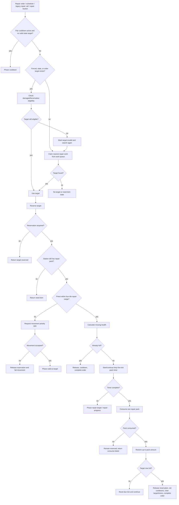

---

## 2. Function Inventory

| Function | Type | Role | Major side effects |
|---|---:|---|---|
| `now`, `valid`, `lower`, `safe`, `dist_sq` | local helpers | Time, validity, formatting, distance | none |
| `valid_pair`, `station_unit`, `priest_unit`, `pair_map` | local pair helpers | Pair validation and identity | none |
| `work_reservations()` | local dependency loader | Gets shared reservation authority | may require module |
| `work_queues()` | local dependency loader | Gets shared work-queue authority | may require module |
| `M.root()` | public storage root | Ensures config/stats/recent/local reservations/cooldowns | writes `storage.tech_priests.repair_executor_0516` |
| `stat`, `record` | local metrics/history | Tracks executor events | writes root stats/recent |
| `get_order(pair)` | local accessor | Reads queue current or active mirror | none |
| `order_kind`, `order_is_repair` | local classifiers | Detects repair order | none |
| `target_from(v,seen)` | local recursive extractor | Finds target entity inside task/order records | none |
| `order_target(pair)` | local selector | Order target, active tasks, then pair target | none |
| `amount_per_pack()` | local policy | Gets repair amount, default 75 | none |
| `missing_health(entity)` | local health helper | Uses global usefulness helper or max-health difference | none |
| `damaged(entity)` | local predicate | Tests repairable positive missing health | none |
| `is_priest_entity(entity)` | local exclusion | Detects priests | none |
| `proxy_name()` | local exclusion | Resolves proxy turret name | none |
| `station_has_pack(station)` | local supply predicate | Global helper or station inventory count | none |
| `consume_pack(station)` | local inventory mutator | Global helper or remove one pack | physically removes pack |
| `target_key(entity)` | local reservation key | Unit number or name@rounded position | none |
| `cleanup_reservations(r)` | local cleanup | Expires local reservations and cooldowns | mutates root tables |
| `reserved_by_other(r,entity,pair)` | local predicate | Shared or local reservation check | may increment stats |
| `reserve_target(r,pair,entity)` | local reservation writer | Shared claim or local fallback claim | mutates reservation authority/table |
| `release_target(r,entity,pair)` | local reservation cleanup | Releases shared and local claim | mutates reservation authority/table |
| `target_type_bonus(entity)` | local scoring policy | Class urgency bonus | none |
| `eligible(pair,entity,allow_reserved)` | local eligibility engine | Damage/exclusion/force/radius/cooldown/reservation checks | none beyond cleanup/stat |
| `score_target(pair,entity)` | local scoring helper | Damage/class/proximity score | none |
| `find_target(pair,explicit)` | local selector | Explicit target, then work queue claim/discovery | shared work-queue side effects |
| `request_move(pair,target,reason)` | local movement writer | Requests movement at priority 820 | movement/global command effects |
| `play_feedback(pair,target)` | local feedback | Plays repair effect | visual/audio effect |
| `complete_order(pair,reason)` | local queue mutator | Completes matching current repair order | clears queue current/active mirror |
| `M.active(pair)` | public predicate | Detects active repair state/order/mode | none |
| `M.submit_or_assign_repair_task(pair,target,reason)` | public scheduler bridge | Assigns task and submits repair order | scheduler/pair/order side effects |
| `M.service_pair(pair,reason,forced_target)` | public executor | Full reserve/move/timer/consume/heal/complete machine | broad state/inventory/entity effects |
| `M.service_repair_bucket(reason,budget)` | public periodic service | Services repair bucket or active fallback pairs | bucket/stat side effects |
| `wrap_legacy_repair_target()` | local wrapper installer | Routes legacy repair function through executor | replaces global function |
| `wrap_scheduler()` | local wrapper installer | Replaces scheduler repair selection | replaces scheduler function |
| `selected_pair(player)` | local command helper | Resolves selected pair | none |
| `install_command()` | local command installer | Registers `/tp-repair-executor-0516` | command surface |
| `wrap_pair_dump()` | local diagnostics wrapper | Appends repair state/events | replaces diagnostics function |
| `M.install()` | public installer | Installs wrappers/global and periodic repair-bucket service | runtime service registration |

---

## 3. Executor Configuration

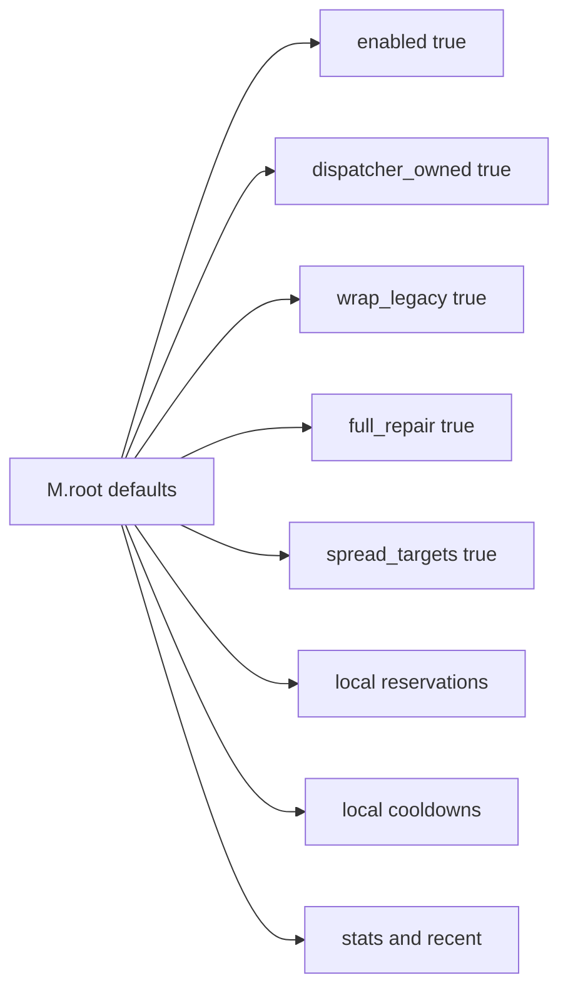

`full_repair` is not read elsewhere in the mapped file. Toggling or changing it currently has no effect.

---

## 4. Repair Timing and Range

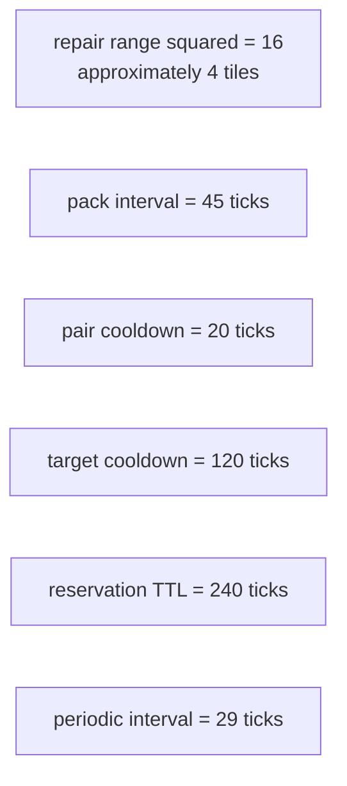

Because the service interval is twenty-nine ticks and a pack interval is forty-five ticks, repair-pack application is checked at irregular offsets and may occur later than exactly forty-five ticks.

---

## 5. Order and Target Resolution

### Recursive target extraction

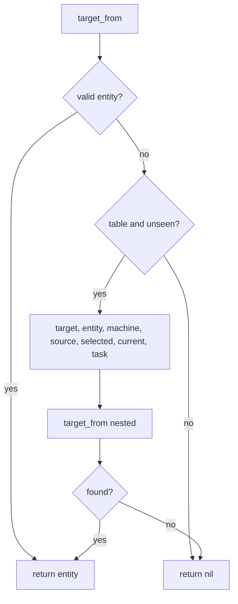

### Target priority

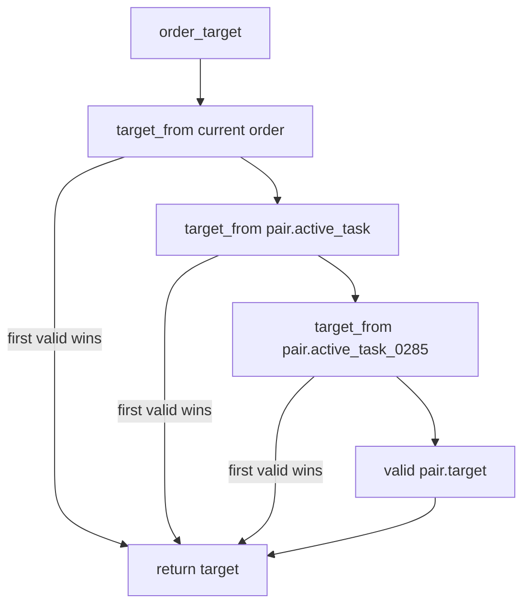

Like consecration, stale targets embedded in the current order outrank newer active-task or pair targets.

---

## 6. Repair-Pack Supply

### Pack availability

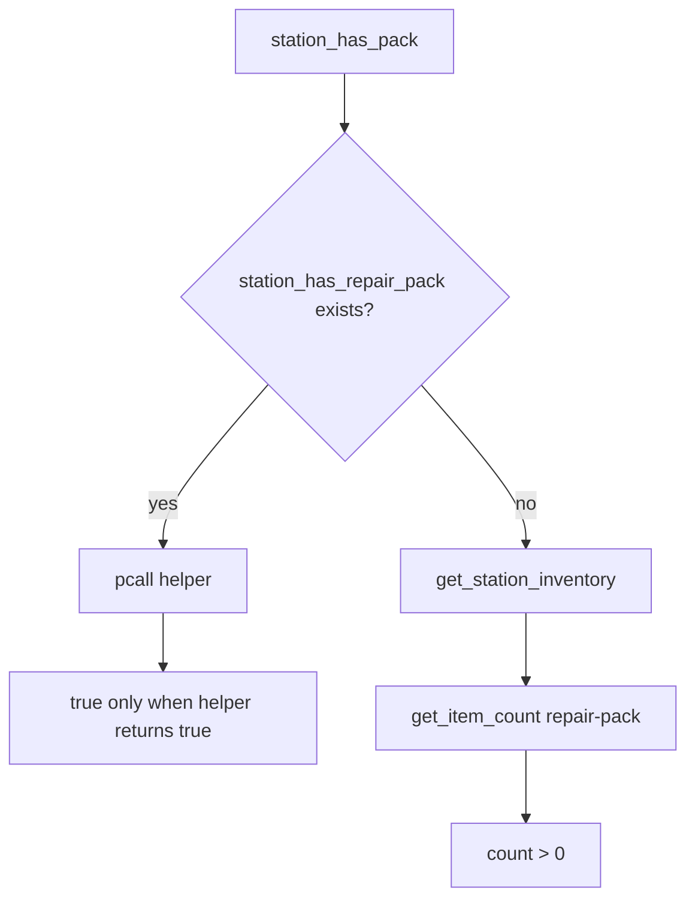

### Pack consumption

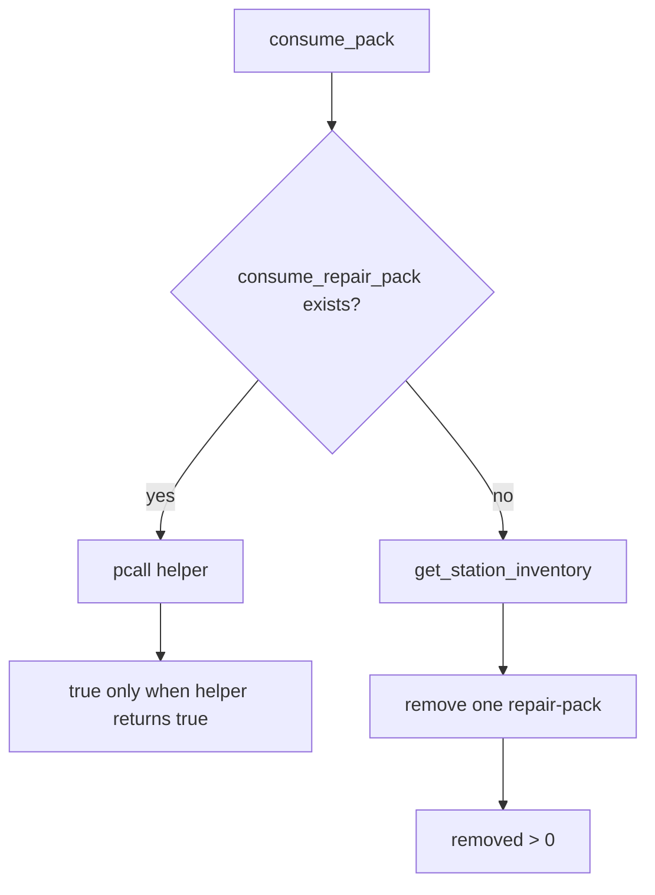

Fallback supply handling uses a single station inventory and does not inspect inventory-steward sources directly.

---

## 7. Missing-Health Calculation

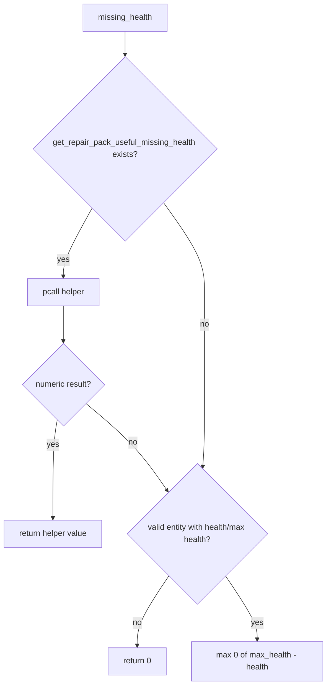

The global helper can redefine what counts as “useful” missing health and therefore whether an entity is considered damaged.

---

## 8. Target Exclusions

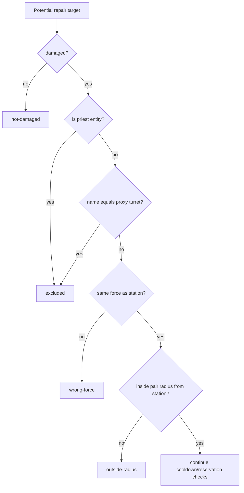

The hidden proxy turret is deliberately excluded from ordinary repair.

---

## 9. Reservation Architecture

### Preferred shared reservation path

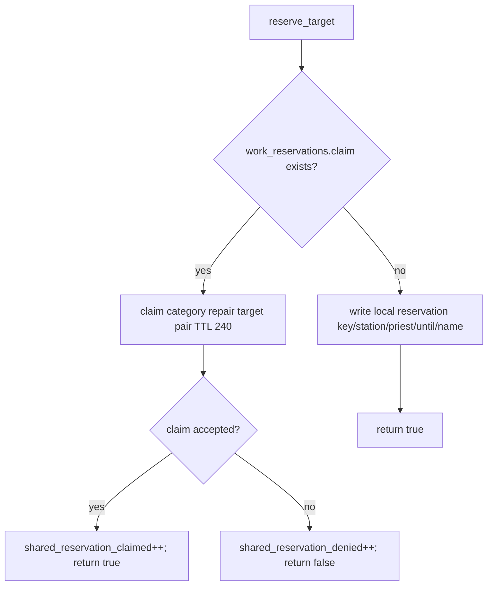

### Reservation check

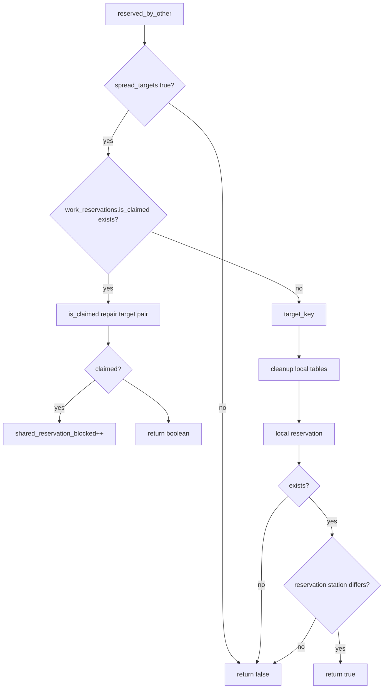

### Release

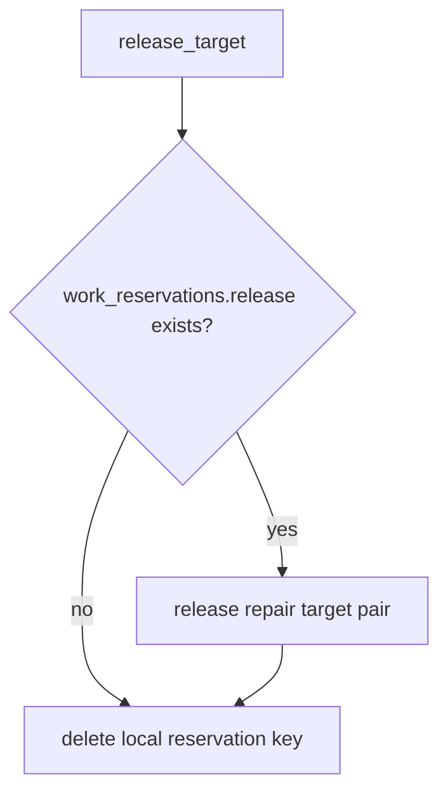

The local reservation is deleted even when a shared reservation system is active.

---

## 10. Local Reservation and Cooldown Cleanup

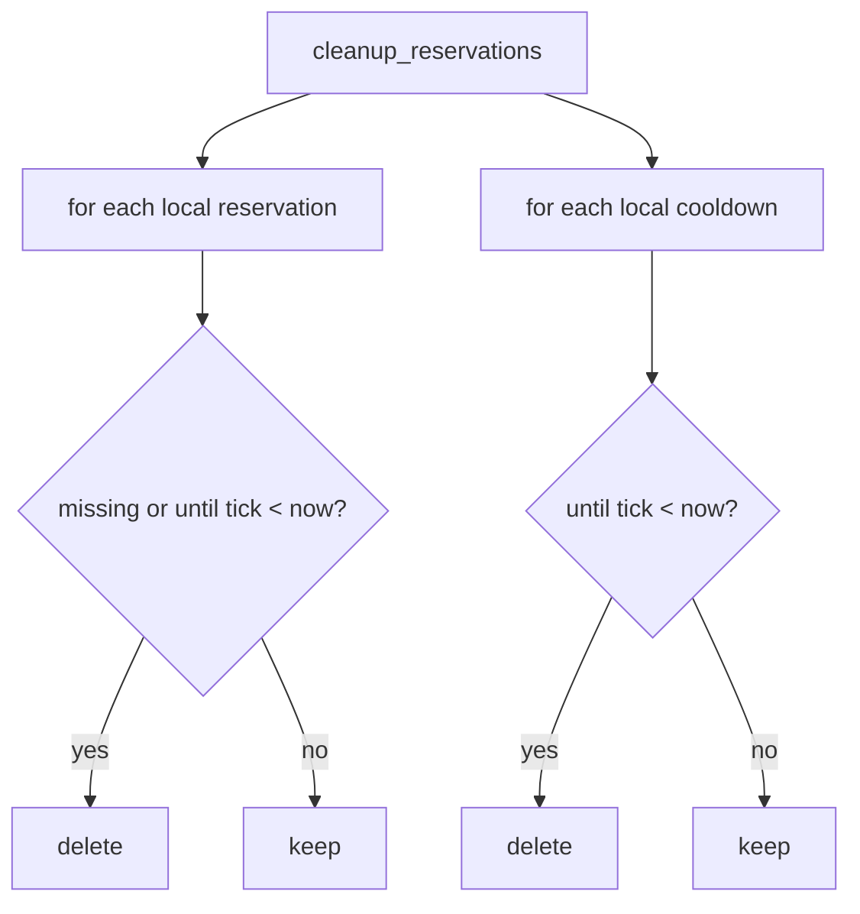

This cleanup does not manage shared work-reservation records; that module owns its own expiry.

---

## 11. Eligibility Engine

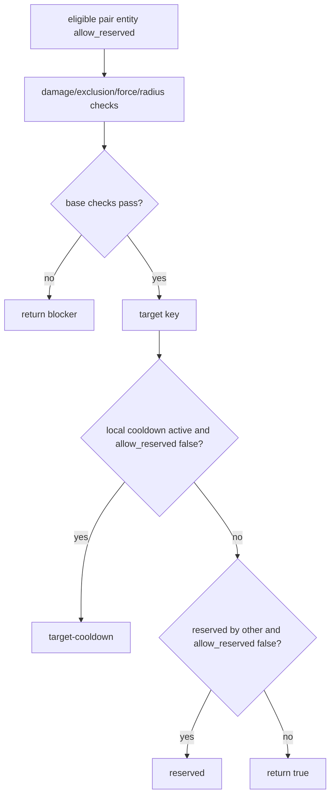

### Current bypass paths

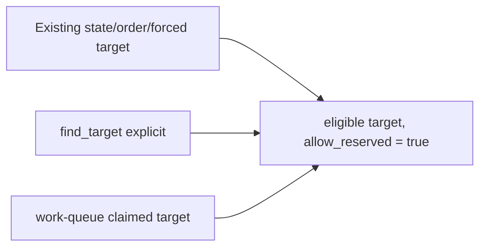

Because all mapped target-selection paths pass `allow_reserved = true`, local cooldown and reservation blocking in `eligible()` are effectively bypassed. Actual claim conflicts are handled later by `reserve_target()`.

---

## 12. Target-Class Bonus

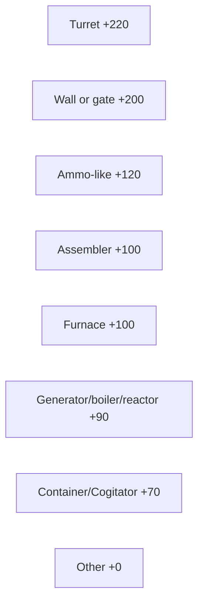

---

## 13. Target Score

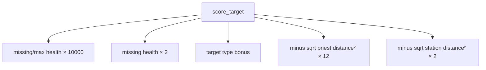

Fractional damage dominates. A heavily damaged generic machine can outrank a lightly damaged wall or turret despite class bonuses.

The current executor does not directly call `score_target()` during `find_target()`. Scoring is likely relevant to or duplicated by `work_queue_authority`; in this file the helper is presently unused by the visible selection path.

---

## 14. Target Discovery Flow

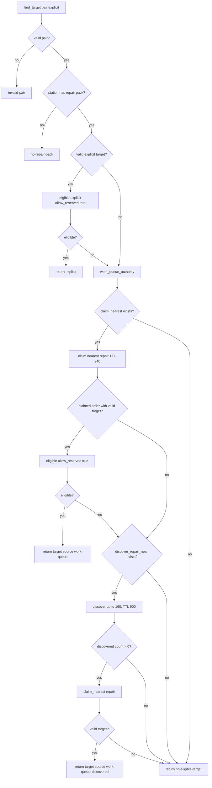

There is no direct `surface.find_entities_filtered` fallback in this executor.

---

## 15. Work-Queue / Reservation Double Claim

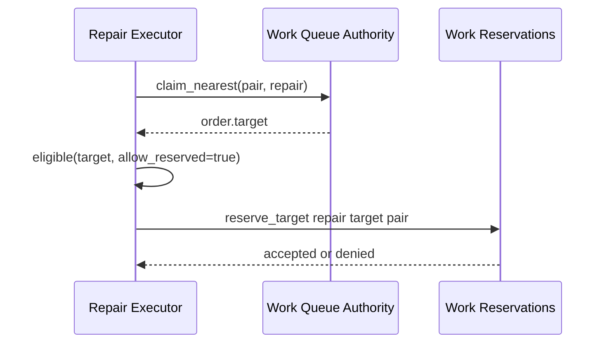

A target may already be claimed by the work-queue authority and then be separately claimed through the work-reservation authority. Whether this is duplicate or complementary depends on those modules' internals, which remain to be mapped.

---

## 16. Movement Request Flow

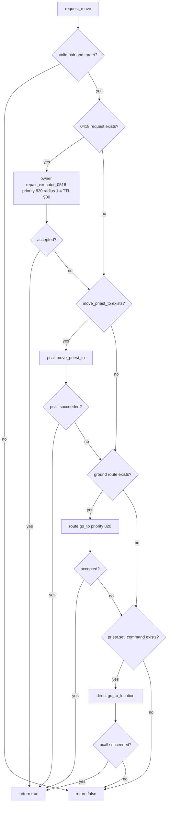

Like consecration, a successful `pcall(move_priest_to)` is treated as movement success without checking the function's returned value.

---

## 17. Order Completion

```mermaid
flowchart TD
    Complete[complete_order]
    Complete --> Queue{current order exists and is repair?}
    Queue -- no --> Return[do nothing]
    Queue -- yes --> Mark[status complete; finished tick; reason]
    Mark --> Clear[q.current nil; pair.active_order nil]
```

No queue history entry is added and no pending order is promoted immediately.

---

## 18. Active Predicate

```mermaid
flowchart TD
    Active[M.active]
    Active --> State{state phase exists and not none/complete?}
    State -- yes --> True[return true]
    State -- no --> Order{current order repair?}
    Order -- yes --> True
    Order -- no --> Mode{mode contains repair?}
    Mode -- yes --> True
    Mode -- no --> False[return false]
```

Blocked phases such as `need-item`, `no-target`, `target-invalid`, `target-reserved`, `movement-request-failed`, and `cooldown` count as active.

---

## 19. Repair Task Submission

```mermaid
flowchart TD
    Submit[M.submit_or_assign_repair_task]
    Submit --> Valid{valid pair?}
    Valid -- no --> False[return false]
    Valid -- yes --> Target{valid supplied target?}
    Target -- no --> Find[find_target using order target]
    Find --> Found{valid target?}
    Found -- no --> False
    Found -- yes --> Build
    Target -- yes --> Build[build priority-800 repair task]
    Build --> Scheduler{task_scheduler.assign_task exists?}
    Scheduler -- yes --> Assign[pcall scheduler assignment]
    Scheduler -- no --> Fallback[pair active tasks/target/mode repairing]
    Assign --> Queue
    Fallback --> Queue{order submit global exists?}
    Queue -- yes --> Order[submit repair-pack repair order priority 800]
    Queue -- no --> Return
    Order --> Return[return true]
```

Scheduler assignment and order submission results are not checked.

---

## 20. Main `M.service_pair` Entry

```mermaid
flowchart TD
    Service[M.service_pair]
    Service --> Enabled{root enabled?}
    Enabled -- no --> Disabled[return disabled]
    Enabled -- yes --> Valid{valid pair?}
    Valid -- no --> Invalid[return invalid-pair]
    Valid -- yes --> Cleanup[cleanup local reservations/cooldowns]
    Cleanup --> State[ensure pair.repair_0516 and service metadata]
    State --> PairCooldown{next repair tick active and state target invalid?}
    PairCooldown -- yes --> Cooldown[phase cooldown; mode repair-cooldown; return true]
    PairCooldown -- no --> Target[forced target, valid state target, or order target]
    Target --> HasTarget{target exists?}
    HasTarget -- yes --> Eligible[eligible allow_reserved true]
    Eligible --> EligibleNow{eligible?}
    EligibleNow -- no --> InvalidState[target nil; phase target-invalid; blocker]
    InvalidState --> Find
    EligibleNow -- yes --> Select
    HasTarget -- no --> Find[find_target]
    Find --> Found{target found?}
    Found -- no --> NoTarget[phase no-target or need-item]
    NoTarget --> Mode[no-repair-target or missing-repair-supplies]
    Mode --> Record[record no-target every service]
    Record --> ReturnNoTarget[return false blocker]
    Found -- yes --> Select[store target/name/unit and pair.target]
```

When a previously reserved state target becomes invalid or fully repaired, the code marks it invalid but does not call `release_target()` before searching for another target. The old reservation can remain until TTL expiry.

---

## 21. Reservation and Supply Branch

```mermaid
flowchart TD
    Select[Target selected]
    Select --> Reserve[reserve_target]
    Reserve --> Accepted{reservation accepted?}
    Accepted -- no --> Reserved[phase target-reserved; blocker; record; return false]
    Accepted -- yes --> Supply{station has repair pack?}
    Supply -- no --> Need[phase need-item; blocker no-repair-pack; mode missing supplies]
    Need --> Record[record need-item; return false]
    Supply -- yes --> Range[continue to range]
```

On the no-repair-pack branch after reservation, the reservation is not released. The target remains reserved until a later successful path, explicit release, shared authority behavior, or TTL expiry.

---

## 22. Movement Branch

```mermaid
flowchart TD
    Range[distance priest to target]
    Range --> Far{distance² > 16?}
    Far -- no --> Repair[continue repair]
    Far -- yes --> Move[request_move]
    Move --> Store[state.distance]
    Store --> Accepted{movement accepted?}
    Accepted -- no --> Fail[phase movement-request-failed; blocker; mode failure]
    Fail --> Release[release target]
    Release --> Record[record failure; return false]
    Accepted -- yes --> Walk[phase walk-to-target; mode moving-to-repair]
    Walk --> RecordWalk[record walk every service call]
    RecordWalk --> Return[return true walk-to-target]
```

---

## 23. Repair Timer and Already-Full Branch

```mermaid
flowchart TD
    Repair[Priest in range]
    Repair --> Phase[phase repair-target]
    Phase --> Timer[started tick if nil; due tick if nil now+45]
    Timer --> Mode[pair.mode repairing]
    Mode --> Missing[calculate missing health and max health]
    Missing --> Full{missing <= 0.01?}
    Full -- yes --> Complete[phase complete; completed tick]
    Complete --> Release[release target]
    Release --> TargetCD[local target cooldown +120]
    TargetCD --> PairCD[pair cooldown +20]
    PairCD --> PairClear[pair.target nil; mode idle]
    PairClear --> Order[complete repair order]
    Order --> Record[record already-full]
    Record --> Return[return complete]
    Full -- no --> Due{now < due tick?}
    Due -- yes --> Progress[record repair-progress every service]
    Progress --> ReturnProgress[return true repair-progress]
    Due -- no --> Consume[consume pack]
```

Critical inconsistency: the already-full completion path does **not** clear `state.target`, `state.started_tick`, `state.due_tick`, or `state.packs_used`.

---

## 24. Pack Application Loop

```mermaid
flowchart TD
    Consume[consume one repair pack]
    Consume --> Success{consumed?}
    Success -- no --> Need[phase need-item; blocker consume-failed; mode missing supplies]
    Need --> RecordFail[record consume-failed; return false]
    Success -- yes --> Amount[repair amount global or 75]
    Amount --> Before[target.health]
    Before --> After[min max_health, before + amount]
    After --> Write[pcall target.health = after]
    Write --> Feedback[play repair feedback]
    Feedback --> State[packs_used++, last_restore, last_pack_tick]
    State --> Timer[due_tick = now +45]
    Timer --> Record[record pack-used]
    Record --> Full{missing health <= 0.01?}
    Full -- no --> Continue[return true repair-pack-applied]
    Full -- yes --> Complete[phase complete; completed tick]
    Complete --> TargetCD[local cooldown +120]
    TargetCD --> Release[release target]
    Release --> PairCD[pair cooldown +20]
    PairCD --> ClearPair[pair.target nil; mode idle]
    ClearPair --> Order[complete repair order]
    Order --> RecordComplete[record packs used]
    RecordComplete --> ClearState[state.target/start/due/packs nil]
    ClearState --> Return[return true complete]
```

The executor writes health directly after consuming a pack. If assigning `target.health` fails inside `pcall`, the code does not inspect that failure and still counts the pack as used.

---

## 25. State Persistence Across Failure

```mermaid
flowchart TD
    State[state.target/start/due/packs]
    State --> MovementFailure[movement failure releases target but retains state target/timers]
    State --> NeedItem[no pack or consume failure retains target/timers/reservation]
    State --> TargetInvalid[invalid target retains state target reference]
    State --> AlreadyFull[already-full completion retains state target/timers]
    State --> SuccessfulPackCompletion[only this path clears target/start/due/packs]
```

These retained fields can influence `M.active()`, cooldown gating, target reuse, and later timer behavior.

---

## 26. Pair Cooldown Bypass Through Stale State Target

```mermaid
flowchart TD
    Completion[Already-full completion]
    Completion --> PairCD[next_repair_tick +20]
    Completion --> StaleTarget[state.target remains valid]
    StaleTarget --> NextService
    PairCD --> NextService[Next service]
    NextService --> Gate{pair cooldown active AND state.target invalid?}
    Gate -- no because target valid --> Revalidate[eligible stale target]
    Revalidate --> NotDamaged[target-invalid]
    NotDamaged --> FindNew[find another target during pair cooldown]
```

The pair cooldown gate applies only when `state.target` is not valid. A stale valid entity reference can bypass it.

---

## 27. Local Target Cooldown Effectiveness

```mermaid
flowchart TD
    Cooldown[Local r.cooldowns target key]
    Cooldown --> Check[eligible checks cooldown only when allow_reserved false]
    Check --> Existing[service current/order target calls allow_reserved true]
    Check --> Explicit[find explicit calls allow_reserved true]
    Check --> WorkQueue[work queue target calls allow_reserved true]
    Existing --> Bypass[Cooldown bypassed]
    Explicit --> Bypass
    WorkQueue --> Bypass
```

Within this file's visible paths, local target cooldowns are recorded but not used to reject the selected targets. Work-queue authority may independently enforce its own TTL/cooldowns.

---

## 28. Periodic Repair Bucket Service

```mermaid
flowchart TD
    Bucket[M.service_repair_bucket]
    Bucket --> Registry{pair_bucket_registry rebuild/each available?}
    Registry -- yes --> Rebuild[Buckets.rebuild]
    Rebuild --> Each[Buckets.each repair budget default 8]
    Each --> Service[M.service_pair]
    Service --> Counts[record bucket checked/acted]
    Counts --> Checked{checked > 0?}
    Checked -- no --> Empty[return false empty-repair-bucket]
    Checked -- yes --> Return[return true summary]

    Registry -- no --> Fallback[iterate pair map]
    Fallback --> Active{valid pair and M.active?}
    Active -- yes --> ServiceFallback[M.service_pair]
    ServiceFallback --> Budget{checked reached budget?}
    Budget -- no --> Fallback
    Budget -- yes --> ReturnFallback
    Active -- no --> Fallback
    ReturnFallback --> Any{checked > 0?}
    Any -- no --> EmptyFallback[return false]
    Any -- yes --> ReturnSummary[return true summary]
```

The bucket callback treats the first return value from `M.service_pair()` as “acted.” Blocked active states returning `false` reduce acted count but remain in the repair bucket depending on bucket-registry rules.

---

## 29. Legacy Repair Wrapper

```mermaid
flowchart TD
    Legacy[wrapped repair_target]
    Legacy --> Enabled{executor enabled, wrap legacy true, valid pair?}
    Enabled -- no --> Original[call original repair_target]
    Enabled -- yes --> Submit[submit_or_assign repair task]
    Submit --> Service[M.service_pair forced target]
    Service --> Return[return acted not false, why]
```

The old direct repair function is prevented from applying repair immediately while the executor is enabled.

---

## 30. Scheduler Wrapper

```mermaid
flowchart TD
    Scheduler[wrapped task_scheduler.try_repair]
    Scheduler --> Enabled{executor enabled and valid pair?}
    Enabled -- no --> Original[call original try_repair]
    Enabled -- yes --> Target[order_target]
    Target --> ValidTarget{valid?}
    ValidTarget -- no --> Find[find_target]
    Find --> Found{valid target?}
    Found -- no --> False[return false]
    Found -- yes --> Submit
    ValidTarget -- yes --> Submit[submit_or_assign repair task]
    Submit --> True[return true]
```

The scheduler wrapper does not immediately execute repair. It only creates task/order state.

---

## 31. Command Surface

```mermaid
flowchart TD
    Command[install_command]
    Command --> Add[add tp-repair-executor-0516]
    Add --> Params[on / off / all / spread-on / spread-off / status]
    Params --> Enabled[root.enabled]
    Params --> Spread[root.spread_targets]
    Params --> Manual[service every pair]
    Params --> Print[flags/stats and selected pair phase/target/missing/packs/blocker/due]
```

`full_repair`, `dispatcher_owned`, and `wrap_legacy` are displayed or stored but not command-configurable here.

---

## 32. Diagnostics Wrapper

```mermaid
flowchart TD
    Wrap[wrap_pair_dump]
    Wrap --> Previous[previous pair dump]
    Previous --> Header[enabled/full_repair/spread/stats]
    Header --> Pairs[every valid pair]
    Pairs --> State[mode/phase/target/missing/packs/blocker/due/distance]
    State --> Recent[last eleven events]
    Recent --> Return[return lines]
```

---

## 33. Install / Service Registration

```mermaid
flowchart TD
    Install[M.install]
    Install --> Root[M.root]
    Root --> Legacy[wrap_legacy_repair_target]
    Legacy --> Scheduler[wrap_scheduler]
    Scheduler --> Diagnostics[wrap_pair_dump]
    Diagnostics --> Command[install_command]
    Command --> Global[_G.TechPriestsRepairExecutor0516 = M]
    Global --> Broker{runtime broker register_service available?}
    Broker -- yes --> Register[name repair_executor_0516 category repair interval 29 priority 45 budget 8]
    Register --> Fn[service_repair_bucket]
    Broker -- no --> Registry{runtime event registry available?}
    Registry -- yes --> Nth[on_nth_tick 29 service bucket]
    Registry -- no --> NoPeriodic[no direct script fallback in this install]
```

---

## 34. State Write Matrix

| State field | Writer | Meaning | Risk |
|---|---|---|---|
| `storage.tech_priests.repair_executor_0516` | `M.root` | Configuration, stats, history, local reservations/cooldowns | High authority |
| shared work reservation state | reservation helpers | Cross-priest repair ownership | Critical concurrency state |
| local `r.reservations` | fallback reservation helpers | Fallback ownership | High if shared system unavailable |
| local `r.cooldowns` | completion | Target cooldown records | Currently bypassed by visible eligibility paths |
| `pair.repair_0516` | `M.service_pair` | Full phased repair state | Critical executor state |
| `state.phase` | service branches | cooldown, target-invalid, no-target, need-item, target-reserved, movement-request-failed, walk-to-target, repair-target, complete | Critical |
| `state.target` | selection/completion | Active repair entity | Critical movement/work target |
| `state.target_name/unit/source` | selection | Target trace | Diagnostic/high-value |
| `state.started_tick/due_tick` | repair timer | Pack timing | High |
| `state.missing/max_health` | repair loop | Current damage trace | High diagnostic |
| `state.packs_used` | pack loop | Packs used this task | Diagnostic/gameplay audit |
| `state.last_restore/last_pack_tick` | pack loop | Last healing result | Diagnostic |
| `state.last_blocker/distance` | failure/walk | Blocking reason/distance | Diagnostic |
| `pair.target` | service and submission fallback | Generic active target | Critical legacy/movement reader |
| `pair.mode` | all service phases | Repair state for arbiter/buckets | High |
| `pair.next_repair_tick_0516` | completion | Pair cooldown | High but bypassable through stale target |
| entity health | pack application | Physical repaired health | Critical gameplay state |
| station repair-pack inventory | consume | Physical resource cost | Critical inventory truth |
| queue current/active mirror | `complete_order` | Matching order completion | Critical scheduler state |
| task scheduler/active task fields | submission bridge | Repair work ownership | High |
| bucket stats | periodic service | Service diagnostics | Low |

---

## 35. Phase / Result Matrix

| Phase | Trigger | Return | Reservation behavior |
|---|---|---|---|
| `none` | initial state | not directly returned | none |
| `cooldown` | pair cooldown and no valid state target | true | none expected |
| `target-invalid` | current target no longer eligible | continues search or later returns blocker | old claim not explicitly released |
| `no-target` | pack exists but no work target | false | none/new work queue state |
| `need-item` | no pack or consume failure | false | reservation retained after post-selection supply failure |
| `target-reserved` | shared claim denied | false | no claim acquired |
| `movement-request-failed` | movement rejected | false | released |
| `walk-to-target` | outside repair range | true | retained/refreshed |
| `repair-target` | in range and repairing/timing | true | retained |
| `complete` | already full or repaired to full | true | released |

---

## 36. Failure and Risk Matrix

| Risk | Mechanism | Consequence |
|---|---|---|
| No raw scan fallback | Discovery entirely delegated to work queue | Repair can stop if work queue discovery/claiming fails |
| Work queue plus reservation double ownership | Claim nearest then reserve separately | Duplicate/contradictory ownership possible |
| Local cooldown effectively bypassed | All visible eligibility calls pass `allow_reserved=true` | Recently repaired target can be reselected through explicit/work-queue path |
| Local reservation check effectively bypassed | Same `allow_reserved=true` paths | Denial happens late at `reserve_target` instead of filtering candidates |
| Old reservation not released on invalid target | Revalidation clears local variable only | Target remains reserved until TTL/shared cleanup |
| Reservation retained on no-pack branch | Pack rechecked after reserve with no release | Damaged target blocked from other priests while supplies absent |
| Reservation retained on consume failure | No release in consume-failed branch | Same target can remain blocked |
| `move_priest_to` return ignored | Pcall success counts as movement success | False walk acceptance |
| Already-full completion leaves state target/timers | Cleanup missing in branch | Pair cooldown bypass and stale active state |
| Failure paths retain state target/timer | Partial cleanup | Old due tick or target can contaminate later attempt |
| Health assignment failure ignored | Pcall result not inspected | Pack counted as consumed even if health did not change |
| `full_repair` unused | Config never read | Cannot disable full-repair loop |
| `score_target` unused locally | Work queue controls actual choice | Documented local scoring policy may not affect selection |
| Active predicate includes blocked states | Any non-none/non-complete phase active | Repair bucket/dispatcher gate can retain blocked pairs |
| Completion bypasses queue lifecycle | Clears current only | No history and delayed pending promotion |
| Assignment/order submission results ignored | Pcall without result checks | Submission reports success even if not accepted |
| Record churn | no-target/walk/progress recorded every service | Recent history and stats can fill rapidly |
| Fallback station inventory only | Direct `get_station_inventory` supply path | Packs in other station sources may be ignored |
| Periodic timing mismatch | 29-tick service vs 45-tick pack timer | Repair occurs after variable delay, not exact timer |
| No direct script fallback in install | Broker and registry absent | No periodic repair service |
| Slash command remains | Runtime toggles spread/enabled | Commandless architecture incomplete |

---

## 37. Dispatcher / Arbiter / Bucket Interaction

```mermaid
sequenceDiagram
    participant B as Pair Bucket Registry
    participant R as Repair Executor 0516
    participant WQ as Work Queue Authority
    participant WR as Work Reservations
    participant A as Action Arbiter 0488
    participant D as Single Dispatcher 0510
    participant Q as Order Queue 0469

    B->>R: service repair bucket every 29 ticks
    R->>WQ: claim nearest repair work
    WQ-->>R: damaged target
    R->>WR: reserve target
    R->>R: move / time / consume pack / heal

    A->>A: repair intent before acquisition
    A-->>D: action kind repair
    D->>R: service_pair again during dispatcher pulse

    alt target fully repaired
        R->>WR: release reservation
        R->>Q: clear matching current repair order
    end
```

Repair can be serviced both by the periodic repair bucket and by the dispatcher, producing additional service calls between bucket intervals.

---

## 38. Debugging Decision Tree

```mermaid
flowchart TD
    Bug[Repair not starting/completing or wrong target]
    Bug --> Pack{station_has_pack true?}
    Pack -- no --> Inventory[Inspect station repair-pack helper/inventory steward]
    Pack -- yes --> Existing{state/order target expected?}
    Existing -- no --> WorkQueue[Inspect work_queue_authority claim/discover repair]
    Existing -- yes --> Eligible{damaged/same force/in radius?}
    Eligible -- no --> Stale[Inspect stale order/state target and missing reservation release]
    Eligible -- yes --> Reservation{reserve_target accepted?}
    Reservation -- no --> Shared[Inspect shared work reservation owner/TTL]
    Reservation -- yes --> Range{priest within four tiles?}
    Range -- no --> Move{movement request priority 820 accepted and correct?}
    Move -- no --> Movement[Inspect 0418 wrappers and move_priest_to return handling]
    Move -- yes --> Leaf[Inspect active leaf target/status]
    Range -- yes --> Timer{due tick progressing?}
    Timer -- no --> Frequency[Inspect bucket/dispatcher service frequency and stale timer]
    Timer -- yes --> Consume{pack consumed?}
    Consume -- no --> SupplyRace[Pack disappeared or helper rejected]
    Consume -- yes --> Health{target health increased?}
    Health -- no --> Assignment[Inspect pcall target.health write; pack may already be lost]
    Health -- yes --> Full{target now full?}
    Full -- no --> Continue[Next forty-five-tick pack cycle]
    Full -- yes --> Cleanup{state target/timers/order/reservation cleared?}
    Cleanup -- no --> Branch[Check already-full vs pack-complete cleanup discrepancy]
```

---

## 39. Progressive Development Targets

The next procedural mapping pass should cover:

1. `combat_repair_doctrine_0517.lua`, the final directly owned dispatcher family currently listed in the sequential plan.

Then:

2. `work_queue_authority` and `work_reservations`, because ordinary repair now depends on them for target discovery and concurrency.
3. `machine_logistics_0528` modules.
4. Inventory steward and station catalog.
5. Emergency facility doctrine internals.
6. Legacy combat modules.
7. Idle/conversation systems.

After combat repair is mapped, the direct dispatcher-owned family map will be complete enough to begin the first corrective code sequence based on the defects documented across 0513–0517.
