# Tech-Priests Function-Level Mermaid Drilldown: Combat Repair Doctrine 0517

Version: 0.1.675-map-pass-14  
Previous drilldown: `docs/BEHAVIOR_MERMAID_FUNCTION_DRILLDOWN_0672_REPAIR.md`  
Companion overview: `docs/BEHAVIOR_MERMAID_MAP_0660.md`

Purpose: map the dispatcher-owned tactical repair doctrine that decides whether a Tech-Priest may temporarily repair a damaged wall or gate under enemy pressure rather than continue fighting.

Mapped module:

- `combat_repair_doctrine_0517.lua`

Physical repair is delegated to:

- `repair_executor_0516.lua`
- `repair_executor_integrity_0673.lua`

Important current-code truths:

1. Combat repair is not ordinary repair selection. It only considers damaged wall/gate-like entities under current enemy pressure.
2. The doctrine requires allied cover by default: either an active/loaded turret or another nearby Tech-Priest considered to be defending.
3. Candidate search is centered on the priest, capped at 26 tiles and 120 wall-like entities.
4. Cluster reservations group nearby wall segments into three-tile cells for 150 ticks.
5. Candidate scoring strongly favors damage ratio, enemy count, active turret cover, and other-priest cover.
6. The selected combat-repair action has dispatcher priority 920, above the ordinary order-queue combat priority table and above normal repair.
7. The doctrine does not directly consume repair packs or write health. It creates/assigns an ordinary repair task and forces `repair_executor_0516.service_pair()` on the selected wall.
8. The module is not independently scheduled by `install()`. It is called by `single_dispatcher_0510.choose_action()` and its combat-repair executor branch.
9. Completion currently marks only the combat-repair state complete; it does not fully clear pair mode, generic target, repair state, task/order state, or the combat-repair target mirror.
10. `/tp-combat-repair-0517` remains installed.

---

## 1. Tactical Doctrine

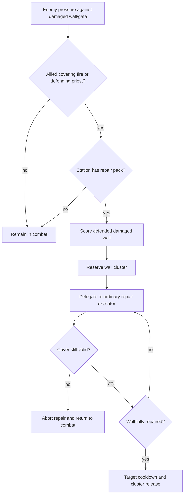

---

## 2. Configuration and Timing

| Setting | Current value |
|---|---:|
| Search radius around priest | 26 tiles |
| Enemy pressure radius around wall | 9 tiles |
| Turret-cover radius | 8 tiles |
| Other-priest cover radius | 12 tiles |
| Personal danger radius | 4 tiles |
| Repair range | 4 tiles |
| Cluster cell size | 3 tiles |
| Cluster reservation lease | 150 ticks |
| Target cooldown | 90 ticks |
| Minimum wall damage ratio | 4% |
| Critical wall damage ratio | 35% |
| Candidate cap | 120 |
| Dispatcher action priority | 920 |

---

## 3. Function Inventory

| Function | Role | Major side effects |
|---|---|---|
| `M.root` | Ensures doctrine config, stats, reservations, cooldowns | Writes doctrine storage root |
| `stat`, `record` | Metrics and bounded recent history | Writes stats/recent |
| `is_wallish` | Accepts wall/gate type or names containing wall/gate | None |
| `missing_health`, `missing_ratio`, `damaged` | Damage calculations | None |
| `same_force`, `enemyish` | Allied/enemy classification | None |
| `surface_entities`, `box` | Safe area scanning | Surface queries |
| `ammo_inventory_loaded` | Checks turret ammo inventory | None |
| `has_energy` | Checks turret energy above 1000 | None |
| `has_fluid` | Checks any positive turret fluidbox amount | None |
| `turret_active_or_loaded` | Classifies turret cover | None |
| `count_enemies_near` | Counts enemy-like entities and nearest distance | Surface queries |
| `turret_cover` | Counts active/loaded allied turrets near wall | Surface queries |
| `other_priest_cover` | Counts nearby priests in combat/defend state | Reads pair map |
| `cluster_key`, `target_key` | Reservation/cooldown identity | None |
| `cleanup_reservations` | Expires cluster leases and target cooldowns | Mutates doctrine root |
| `cluster_reserved_by_other` | Prevents different station from claiming same cluster | Reads/cleans reservations |
| `reserve_cluster` | Writes cluster lease | Mutates root |
| `release_cluster`, `release_cluster_key` | Deletes cluster lease | Mutates root |
| `station_has_repair_pack` | Uses repair-pack helper or one-inventory fallback | None |
| `eligible_wall` | Full tactical eligibility engine | Reads scans, supplies, reservations, cooldowns |
| `score_wall` | Tactical candidate score | None |
| `M.find_combat_repair_target` | Searches and selects best candidate | Records no-target events |
| `M.abort_pair` | Releases cluster and resets some combat/repair fields | Mutates pair and root |
| `M.recommend_action` | Dispatcher pre-classification recommendation | May abort active combat repair |
| `M.active` | Detects nonterminal combat-repair state | None |
| `clear_if_complete` | Applies cooldown, releases cluster, marks complete | Mutates root/state |
| `M.service_pair` | Selects/reserves target and delegates repair | Broad pair/task/repair effects |
| `install_command` | Registers runtime command | Command surface |
| `wrap_pair_dump` | Adds automatic diagnostic output | Wraps diagnostics |
| `M.install` | Installs command, diagnostics and global export | No periodic service |

---

## 4. Enemy Classification

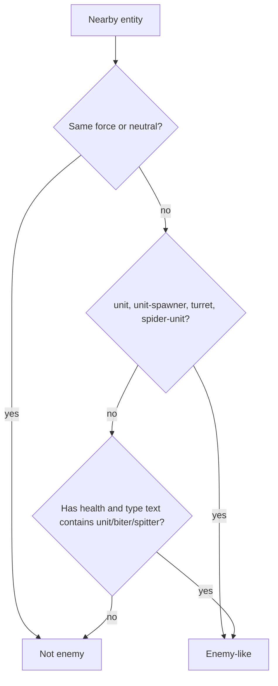

Risk: this uses force-name inequality rather than Factorio force diplomacy. A non-neutral allied force with a different name can be counted as hostile.

---

## 5. Turret Cover Classification

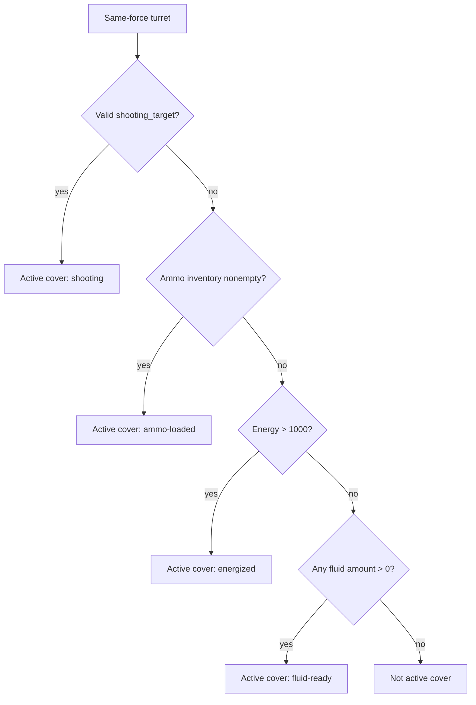

Risk: disabled, circuit-disabled, inactive, disconnected, or otherwise unable-to-fire turrets can still count as cover merely because they contain ammo, energy, or fluid.

---

## 6. Other-Priest Cover

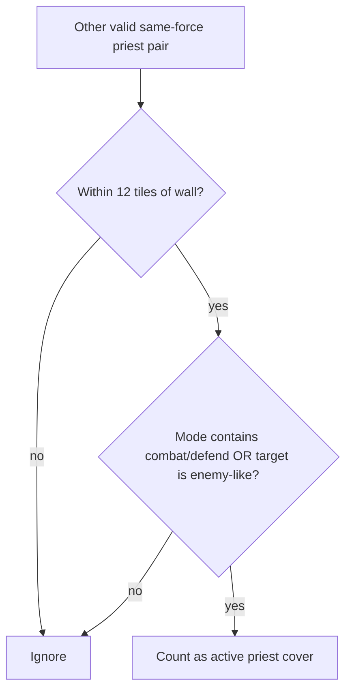

The check does not verify that the other priest has ammunition, a working proxy, line of fire, or an unobstructed path to the threat.

---

## 7. Cluster Reservation

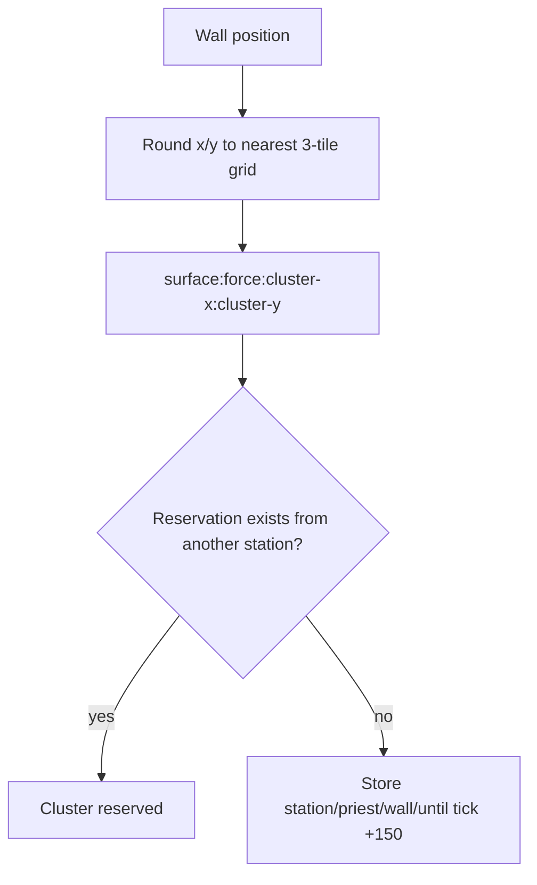

Reservation ownership compares station IDs, not priest IDs. Priests belonging to the same station would not block one another at this layer.

---

## 8. Wall Eligibility

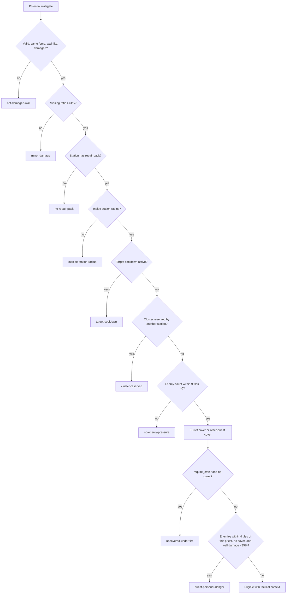

When `require_cover=true`, the personal-danger branch is mostly redundant because uncovered targets are rejected earlier.

---

## 9. Candidate Score

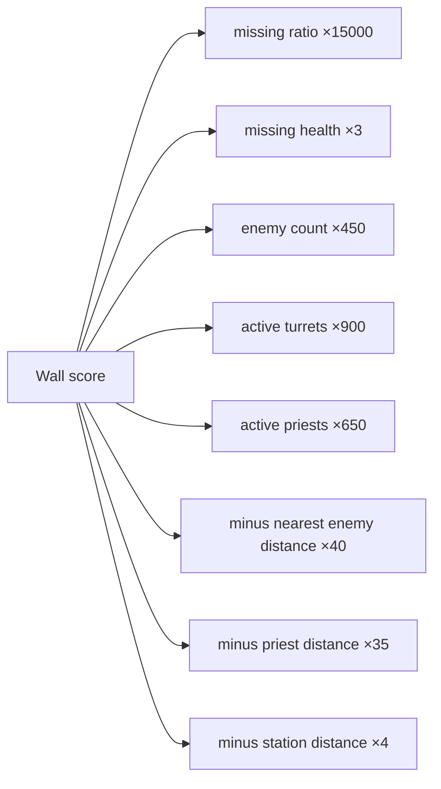

Damage ratio is the largest single factor, followed by tactical pressure and cover.

---

## 10. Candidate Search

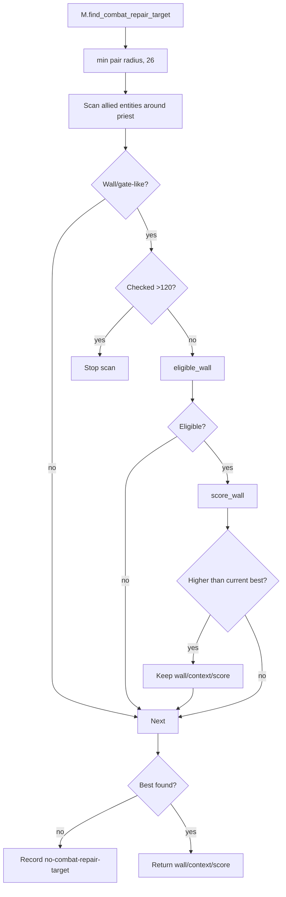

The search is centered on the priest rather than the station. Valid defended walls farther than 26 tiles from the priest are invisible even when within station territory.

---

## 11. Dispatcher Recommendation

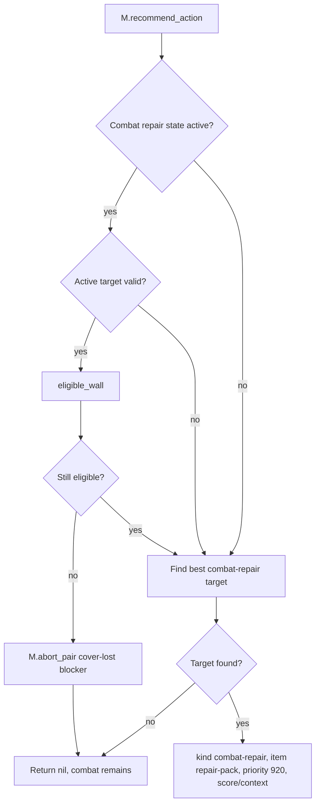

Risk: an active state with an invalid stored target is not aborted before searching for a new one, leaving stale state and cluster metadata behind.

---

## 12. Abort Flow

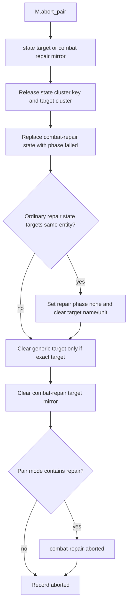

Defects:

- Ordinary repair timers, pack counters, reservations, task records, and repair orders are not cleared.
- Invalid targets cannot be passed to `release_cluster`, so only a stored cluster key can clean that lease.
- The pair can remain with a repair order that the dispatcher or periodic repair service later resumes.

---

## 13. Service Flow

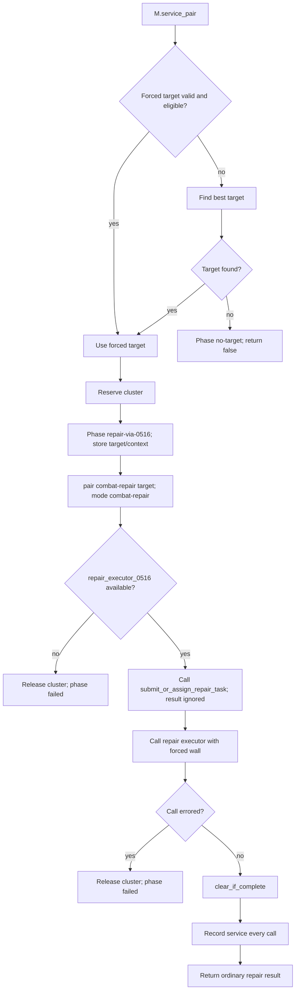

---

## 14. Completion Flow

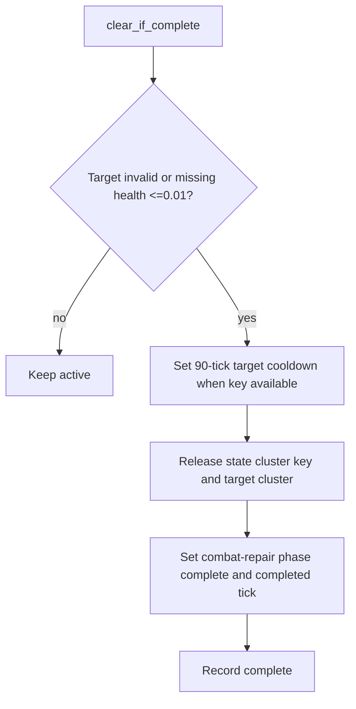

Missing cleanup:

- `state.target` and target metadata remain.
- `pair.combat_repair_target_0517` remains.
- `pair.target` remains.
- `pair.mode` remains `combat-repair`.
- Ordinary repair state/task/order cleanup is delegated implicitly and not verified.

---

## 15. Interaction with Ordinary Repair

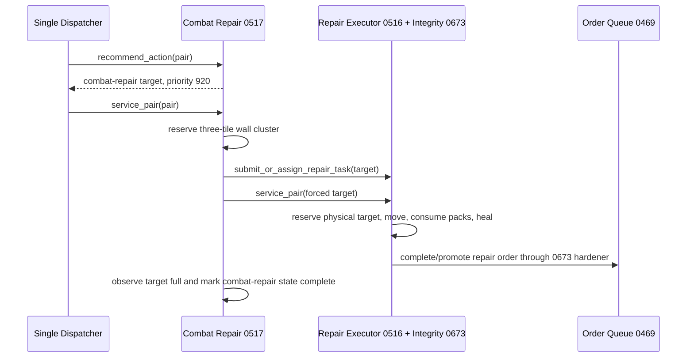

There are two concurrency controls:

1. Combat repair's three-tile cluster lease.
2. Ordinary repair's exact-target work reservation.

The cluster lease spreads tactical wall work across nearby segments; the exact reservation prevents two repair executors from using the same entity.

---

## 16. State Write Matrix

| State | Writer | Meaning |
|---|---|---|
| Doctrine root flags | `M.root`, slash command | Enabled, dispatcher ownership, cover and cluster policy |
| `cluster_reservations` | Reserve/release helpers | Tactical wall-cluster ownership |
| `target_cooldowns` | Completion | Short wall reselection suppression |
| `pair.combat_repair_0517` | Service, abort, completion | Tactical doctrine phase/context |
| `pair.combat_repair_target_0517` | Service/abort | Mirror of active wall |
| `pair.mode` | Service/abort | `combat-repair` or abort mode |
| `pair.repair_0516` | Ordinary repair executor and partial abort cleanup | Physical repair state |
| Active task/order | Ordinary repair submission | Physical repair scheduling |
| Station repair-pack inventories | Ordinary repair executor | Physical cost |
| Wall health | Ordinary repair executor | Repair result |

---

## 17. Defect and Risk Catalog

| # | Finding | Severity |
|---:|---|---|
| 1 | Enemy detection treats any non-neutral, differently named force as hostile instead of checking force diplomacy. | High |
| 2 | Ammo, energy, or fluid alone can classify a disabled/unable-to-fire turret as active cover. | High |
| 3 | Other-priest cover does not verify ammunition, proxy readiness, line of fire, or actual engagement capability. | Medium-high |
| 4 | Active state with invalid target is not aborted before selecting a replacement. | High |
| 5 | Changing targets does not release the previous cluster reservation. | High |
| 6 | No-target exit does not release or clear an old target/cluster state. | High |
| 7 | `reserve_cluster` result is ignored. | Medium |
| 8 | Repair-task submission result is ignored. | High |
| 9 | Abort only partially clears ordinary repair state and does not clear repair tasks/orders/reservations/timers. | Critical |
| 10 | Completion leaves pair mode and all target mirrors/state references behind. | Critical |
| 11 | Completion does not verify ordinary repair task/order/reservation cleanup. | High |
| 12 | Service events are recorded on every call, flooding recent diagnostics. | Medium |
| 13 | No-target events are recorded on every scan. | Medium |
| 14 | `dispatcher_owned` is configured but never enforced. | Medium |
| 15 | Search is centered on priest and capped at 26 tiles, possibly missing defended station walls. | Design risk |
| 16 | Cluster ownership compares station only, not priest. | Low for one-priest-per-station design |
| 17 | Target cooldown is not written when the target entity becomes invalid. | Low-medium |
| 18 | Runtime slash command can disable cover requirements and cluster spreading. | Medium / architecture |
| 19 | No independent service registration exists. | Reclassification candidate: dispatcher ownership is intentional |
| 20 | Personal-danger check is largely redundant when cover is mandatory. | Low cleanup |

---

## 18. Debugging Decision Tree

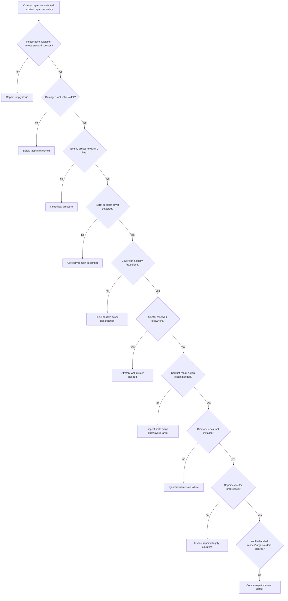

---

## 19. Progressive Development Target

The next corrective implementation should add a `combat_repair_integrity_0676.lua` hardener that:

1. Uses Factorio force diplomacy for enemy checks.
2. Tightens turret and other-priest cover validation.
3. Releases previous clusters whenever targets change, vanish, become ineligible, or no target is found.
4. Verifies cluster claim ownership and ordinary repair-task submission.
5. Fully aborts ordinary repair state/tasks/orders/reservations when tactical cover is lost.
6. Fully clears combat-repair mode, targets, state residue, ordinary repair residue, and scheduler state after completion.
7. Compacts repetitive service/no-target history.
8. Enforces `dispatcher_owned`.
9. Removes `/tp-combat-repair-0517`.
10. Adds automatic diagnostics and a remediation-status ledger with runtime validation scenarios.
