# Tech-Priests Mermaid Behavior Map

Version: 0.1.660-map-pass-1  
Base behavior map: `docs/BEHAVIOR_FUNCTION_MAP_0659.md`  
Purpose: provide a visual, iterative, code-shaped behavior map of how the Tech-Priest pair systems currently act on each other.

This document is intended to grow over multiple commits. It should be updated whenever a behavior authority, dispatcher wrapper, movement owner, overhead/visual owner, construction owner, logistics owner, or direct-acquisition owner changes.

## Reading Rules

The diagrams use these conventions:

- **Authority** means a module can change pair state, movement target, task ownership, or visible status.
- **Observer** means a module reports state but should not decide behavior.
- **Leaf task** means the actual concrete action being performed right now.
- **Parent order** means the broader objective that created a chain of leaf tasks.
- **Movement truth** means the target the priest's feet and vector enforcer should obey.
- **Visual truth** means the target shown to the player through overhead text and selected intent line.

The existing prose behavior map states the governing rule: each behavior should have a clear entry condition, active owner, movement target, overhead status, and exit condition. If a future patch adds a behavior without placing it in this map, it is probably another hidden competing authority.

---

## 1. Current Authority Install Order

This shows the order currently installed through `planning_constraints_0646.lua` after the 0.1.659 scavenge consolidation.

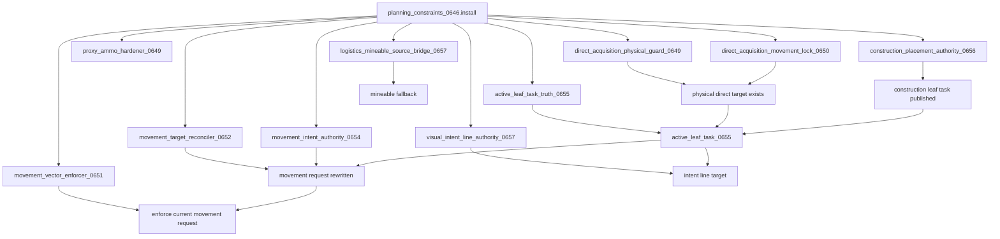

Critical rule: target/leaf truth must run before vector enforcement. Vector enforcement must never decide the target; it only enforces whatever movement target is already authoritative.

---

## 2. Global Pair Tick / Service Shape

This is the broad order of operations as the pair is serviced by runtime broker / nth-tick handlers and wrapped dispatchers.

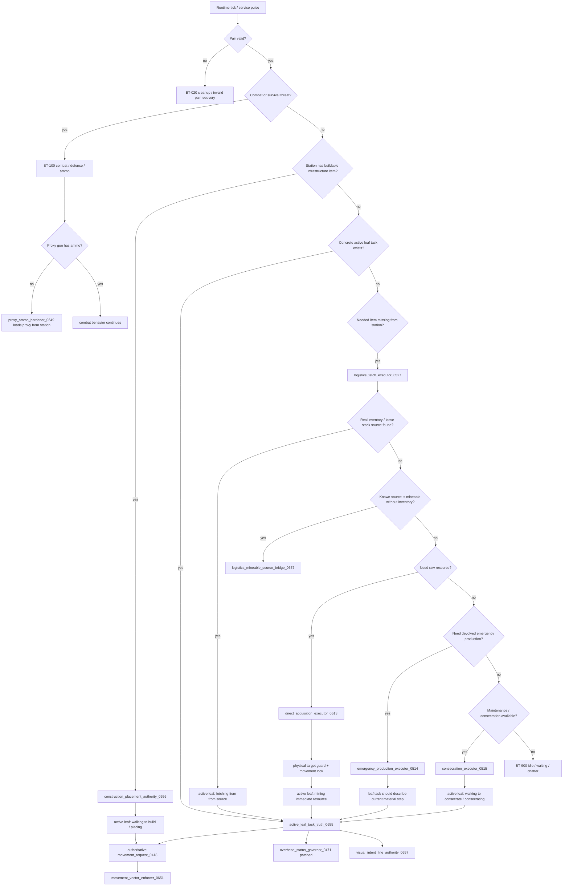

This graph is the current desired end-to-end behavior shape. Any module that bypasses this and writes `pair.target` or `pair.movement_request_0418` directly without publishing leaf truth is a candidate for future cleanup.

---

## 3. Behavior Priority Stack

The prose map defines the current intended priority order as pair validity, combat, construction placement, active leaf task, real-inventory logistics fetch, mineable salvage fallback, direct acquisition, emergency production, consecration, and idle.

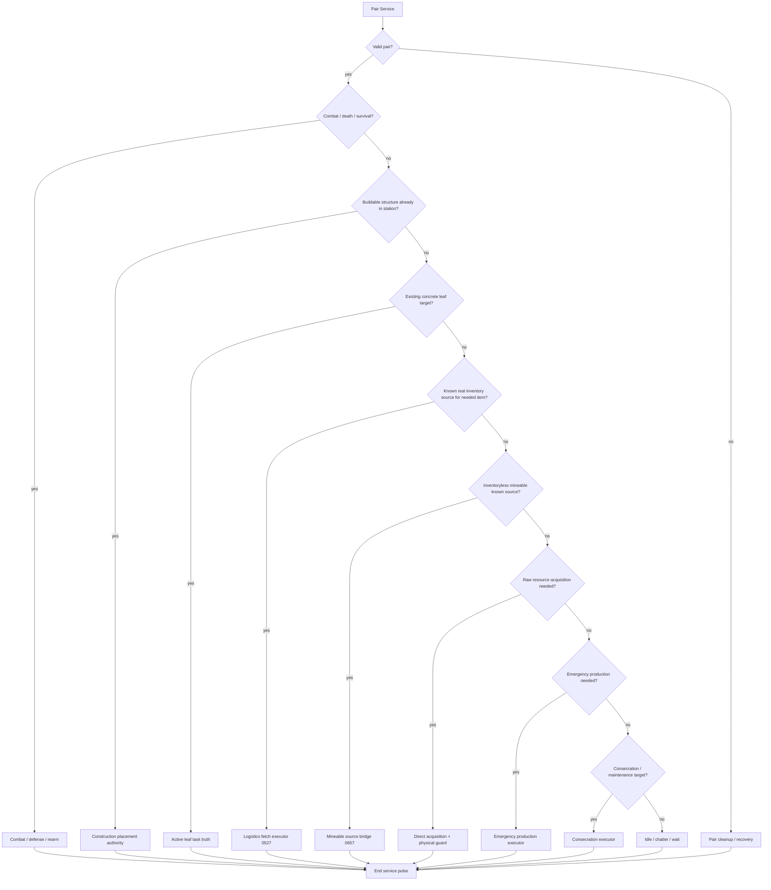

This is an intended priority stack, not yet a proven single centralized switch statement. Several pieces are still wrappers, broker services, or older subsystem calls. That matters: if behavior still fights, the next audit should identify which legacy module is bypassing this priority stack.

---

## 4. Parent Order to Leaf Task Pipeline

This diagram separates the parent objective from the concrete task the priest is actually doing.

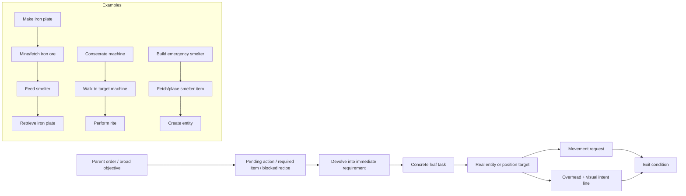

Invariant: the overhead text and visual intent line must describe `Leaf`, not `Parent`.

---

## 5. Movement Truth Pipeline

This is the currently intended movement ownership chain.

```mermaid
flowchart TD
    LeafSource{Which module has concrete work?}
    LeafSource -->|Direct acquisition| DirectLock[direct_acquisition_target_lock_0650]
    LeafSource -->|Construction| BuildTask[construction_task_0338 / construction_priority_0656]
    LeafSource -->|Logistics| FetchTask[logistics_fetch_0527]
    LeafSource -->|Consecration| ConsecrateTask[consecration_0515]
    LeafSource -->|Emergency| EmergencyTask[emergency_craft / current subtask]

    DirectLock --> ALTT[active_leaf_task_truth_0655]
    BuildTask --> CPA[construction_placement_authority_0656]
    CPA --> ALTT
    FetchTask --> ALTT
    ConsecrateTask --> ALTT
    EmergencyTask --> ALTT

    ALTT --> PairTarget[pair.target / current_work_target_0655]
    ALTT --> PairMove[pair.movement_request_0418]
    PairMove --> MC[storage.tech_priests.movement_controller_0419.requests[key]]
    MC --> Command[Factorio go_to_location command]
    MC --> MVE[movement_vector_enforcer_0651]
    MVE --> Reissue[Reissue movement if walking away]
    Reissue --> Command
```

Debugging rule: if the priest walks the wrong way, inspect `pair.active_leaf_task_0655`, then `pair.movement_request_0418`, then the vector enforcer. Do not begin by changing the vector enforcer.

---

## 6. Visual Truth Pipeline

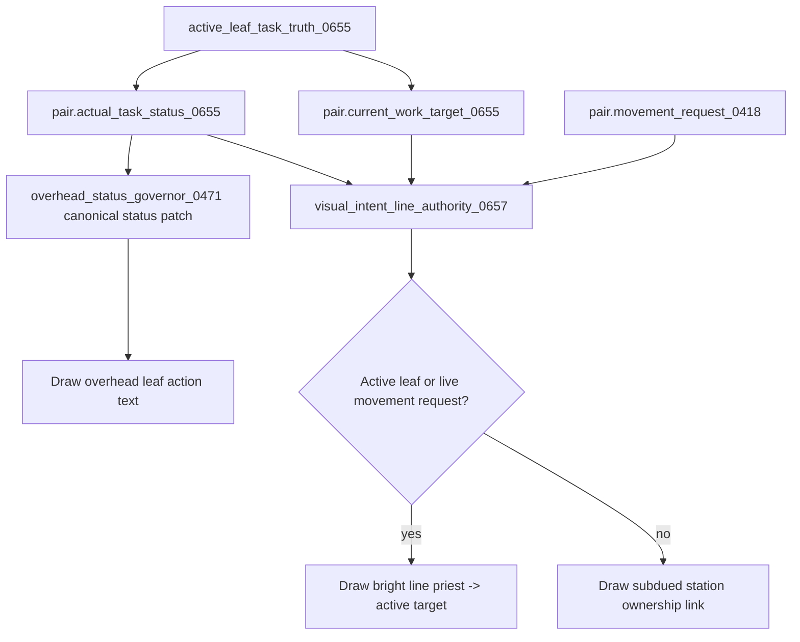

The bright line is no longer supposed to mean station ownership. It is now meant to represent the current active intent target whenever a current target exists.

---

## 7. Logistics / Inventory Scavenge Flow

This map reflects the 0.1.659 consolidation: `logistics_fetch_executor_0527` owns real inventory scavenging. `nearby_inventory_scavenge_authority_0658` was removed.

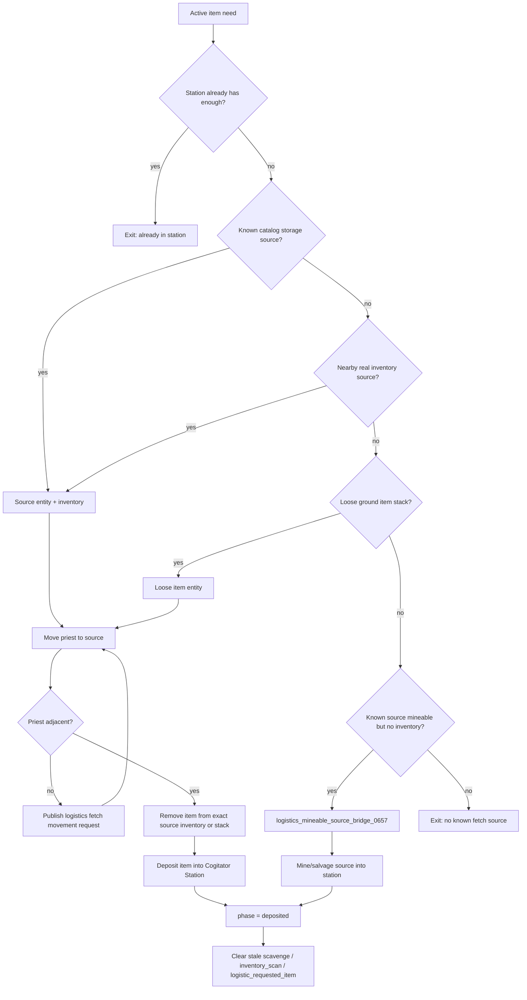

Inventory source classes now intended to include containers, logistic containers, assembling machines, furnaces, mining drills, labs, cars, spider vehicles, cargo wagons, artillery wagons, rocket silos, roboports, ammo turrets, artillery turrets, character corpses, and loose item stacks.

---

## 8. Direct Acquisition Flow

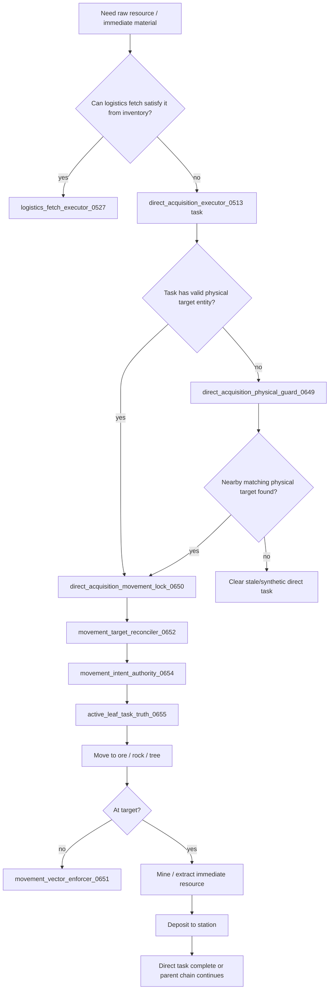

Invariant: if the parent needs iron plate but the direct task is mining ore, the displayed leaf action is `Mining iron ore`.

---

## 9. Construction / Infrastructure Flow

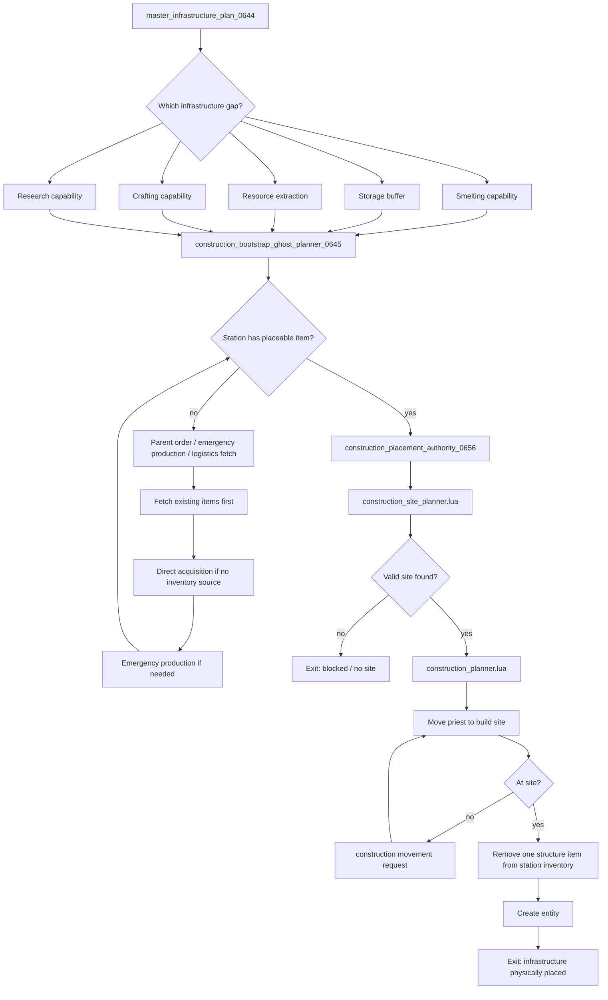

Construction should preempt additional acquisition once a buildable structure item exists in the station.

---

## 10. Consecration / Maintenance Flow

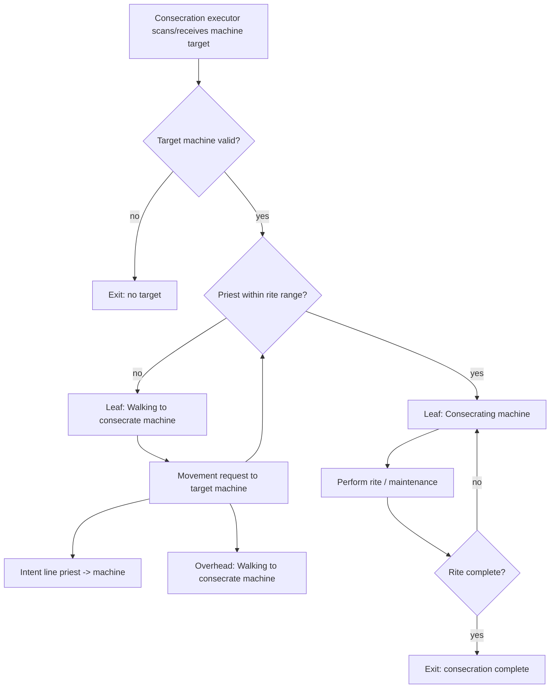

If this behavior visibly points to a station while claiming consecration, the bug is in the leaf truth / movement request / visual intent chain, not in the rite itself.

---

## 11. Combat / Ammo Flow

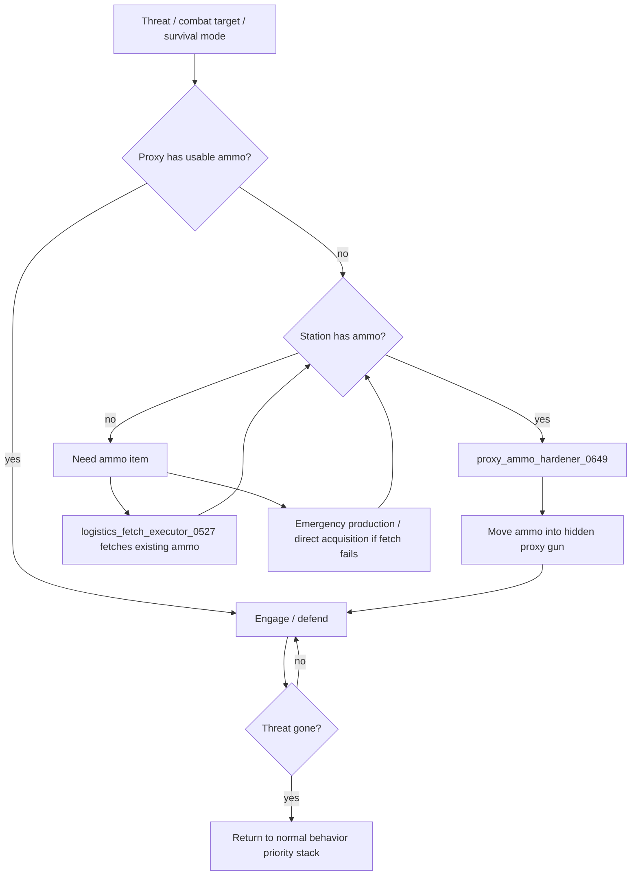

Combat may preempt normal work. Ammo satisfaction must mean the proxy can actually fire, not merely that ammunition exists somewhere in station storage.

---

## 12. Emergency Production / Devolved Work Flow

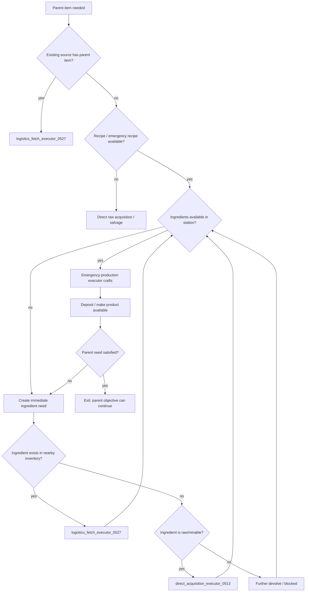

Display rule: if the priest is currently fetching/mine/crafting an ingredient, overhead shows the ingredient leaf action, not the parent item.

---

## 13. Diagnostics / Debugging Decision Tree

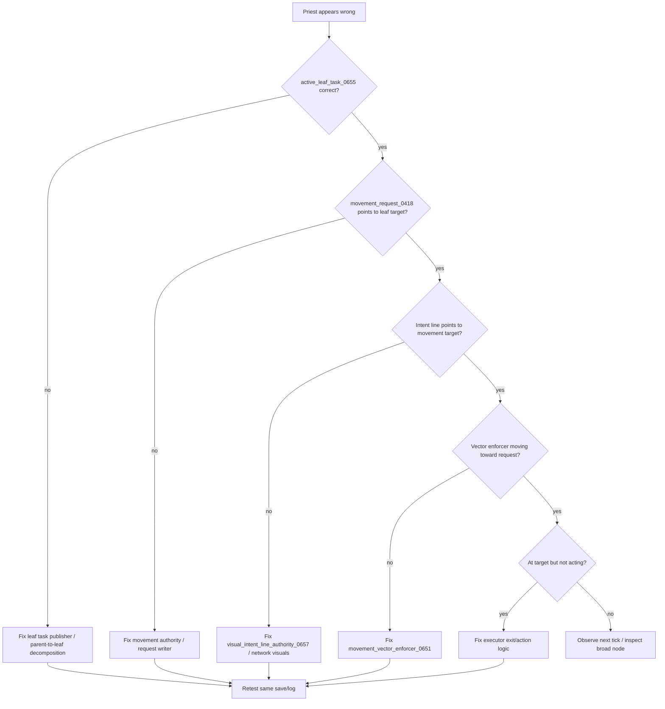

This decision tree is meant to stop repair work from adding duplicate authorities before identifying which layer diverged first.

---

## 14. Known Incomplete Areas For Future Map Passes

The following areas need deeper per-module Mermaid maps in later commits:

1. `single_dispatcher_0510.lua` exact branch order.
2. Combat/defense modules and their interaction with proxy ammo.
3. Inventory steward family and all safe deposit/count helpers.
4. Emergency production recipe decomposition and blocked-item state fields.
5. Station catalog scan/update cycle and known-source selection.
6. Consecration target selection, rite timing, and completion state.
7. Remaining legacy modules that still write `pair.target`, `pair.mode`, or `pair.movement_request_0418` directly.
8. Remaining slash-command cleanup map for old diagnostic modules.

Any one of these can become the next sequential Mermaid-map commit.
