# Tech Priests Current Recovery Authority Map

**Status:** Current architecture map for base-state recovery  
**Authoritative branch:** `main`  
**Packaged baseline:** `0.1.672`  
**Development lane:** `0.1.674-dev`  
**Work-order authority:** `RECOVERY_REPAIR_SEQUENCE.md`  
**Mapped:** 2026-07-17

## Purpose

This map connects the detailed 0659–0675 Mermaid/function drilldowns to the later 0680–0739 authority families and the active recovery changes. It distinguishes source presence, installation, authority, and proof:

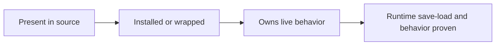

Source implementation is not runtime proof.

## Recovered Runtime Spine

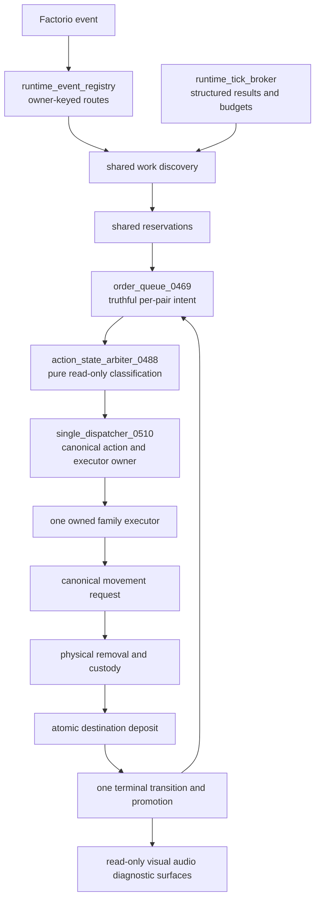

The generated legacy fragments and remaining family wrappers are compatibility surfaces beneath this target, not parallel authorities to be expanded.

## Loader and Hardener Recovery

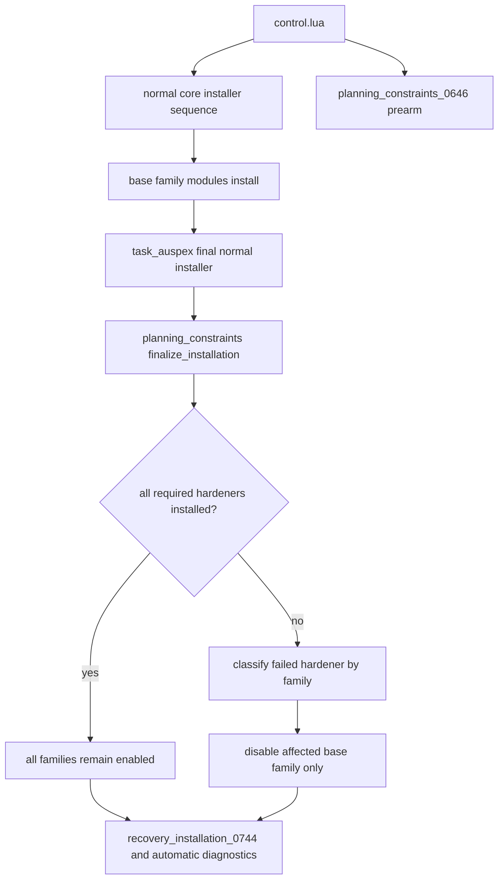

Early installation failures are provisional. The final post-loader pass occurs while event registration remains legal. A final failure no longer permits the affected family to continue as though fully hardened.

## Stage 1 — Physical State and Scheduler Truth

### Emergency production and order queue

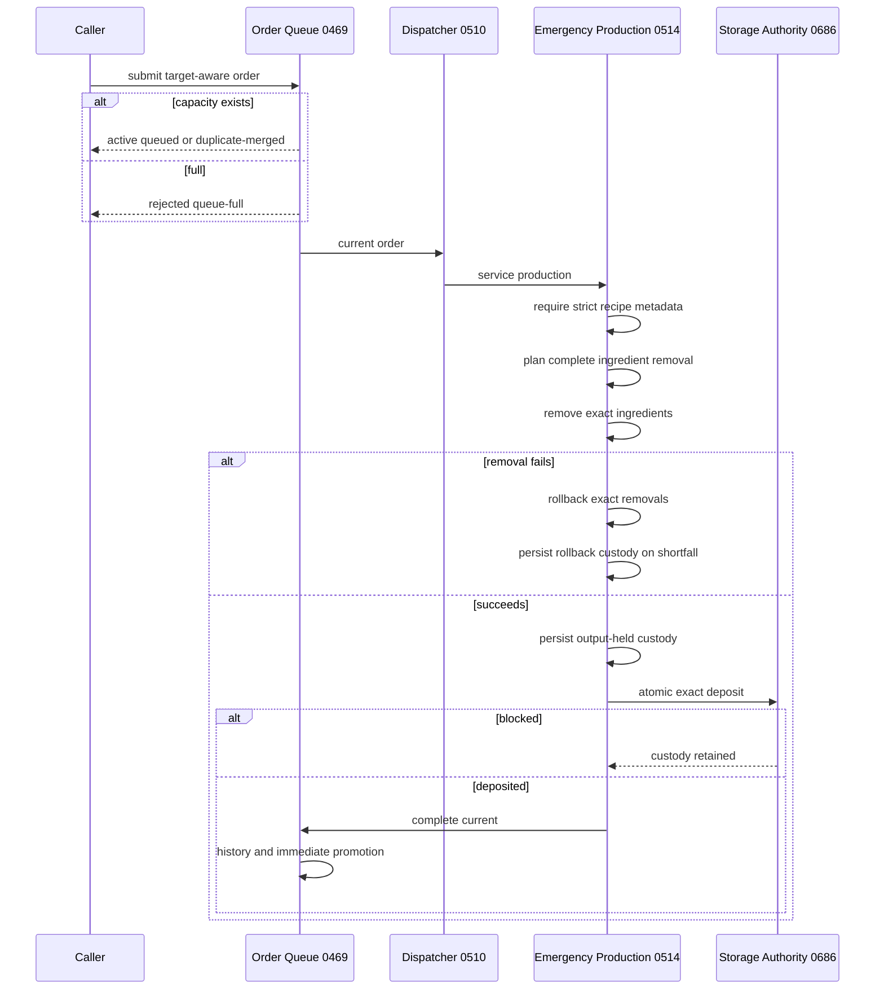

### Consecration

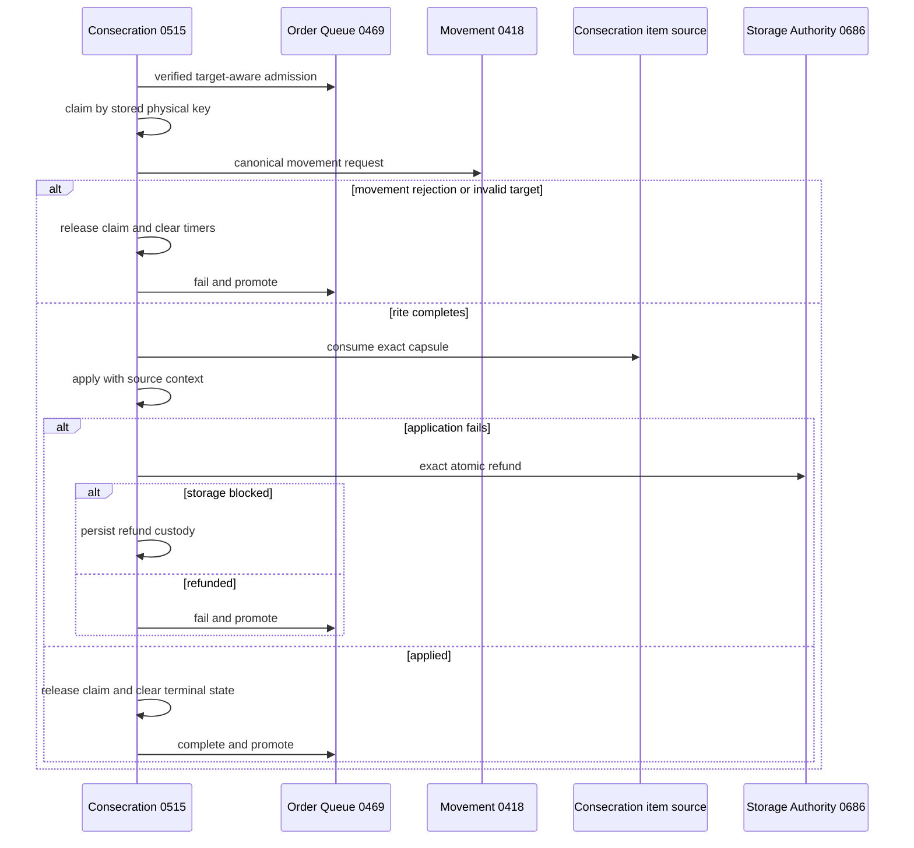

### Direct acquisition and station-craft handoff

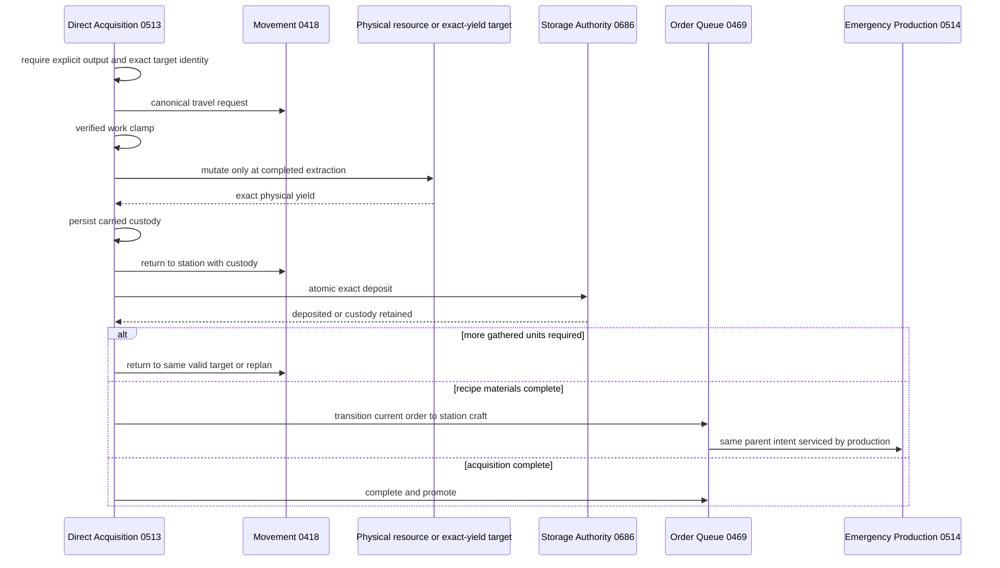

### Stage 1 source invariants

- Full queues reject rather than discard work.
- Order identity includes physical target context and duplicates refresh mutable metadata.
- Preemption cannot lose the interrupted order.
- Invalid targets fail rather than complete.
- Initial callbacks execute once and promoted callbacks execute once.
- Terminal transitions promote immediately.
- Production ingredients and outputs remain transactionally accounted.
- Consecration claims, timers, movement, admission, refunds, and terminal state are explicit.
- Direct acquisition neither invents fallback output nor damages resources during presentation.
- Direct output travels through persistent custody and physical return before deposit.
- Acquisition-to-production handoff is a canonical scheduler transition.

## Stage 2 — Shared Runtime Spine

### Owner-keyed event routes

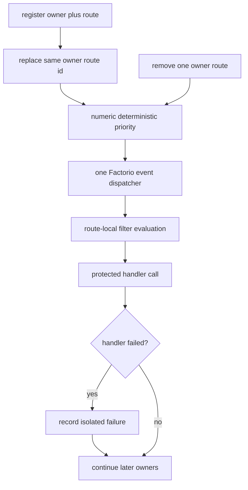

`first/front` and `last/final` are actual priorities. Removing one owner no longer clears all handlers for the event or cadence.

### Structured broker truth

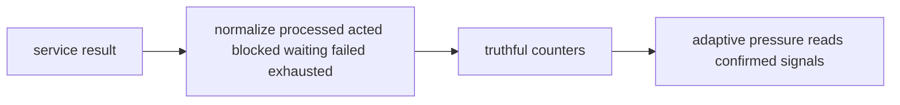

Numeric zero, `nil`, waiting, or blocked results are not counted as actions. Re-registering a service preserves its next due tick unless explicitly replaced.

## Stage 3 — Canonical Behavioral Authority

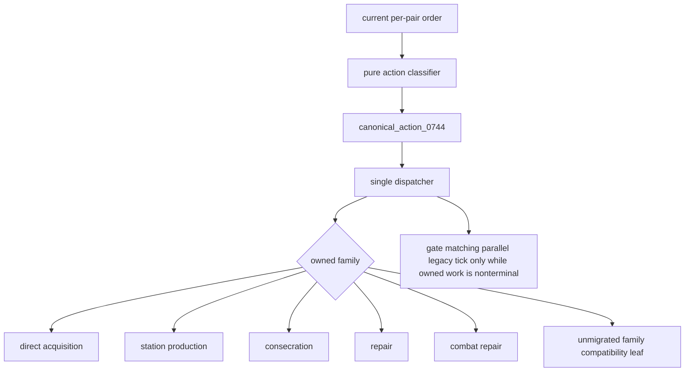

The classifier owns no queue mutation, movement request, executor clearing, pair mode write, pair target write, or periodic timer. The dispatcher publishes one serializable action record containing action identity, family, owner, phase, status, order, item, target identity, position, source, and timestamps.

Specialized later families remain compatibility leaves until runtime evidence proves their existing wrapper ownership and they can be migrated without jeopardizing physical custody.

## Stage 4 — Static UPS Recovery Gate

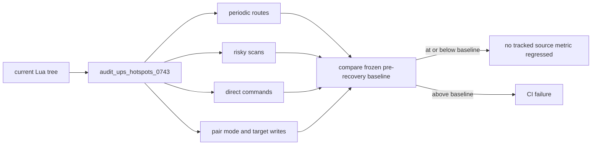

The frozen baseline is 510 periodic routes, 17 active routes at 30 ticks or faster, 68 risky scans, 916 rewrite sites, 72 direct command sites, 352 `pair.mode` writes, and 177 `pair.target` writes. Source-count reduction demonstrates graph simplification only; it does not replace a clean-world profiler run.

## Later Specialized Families

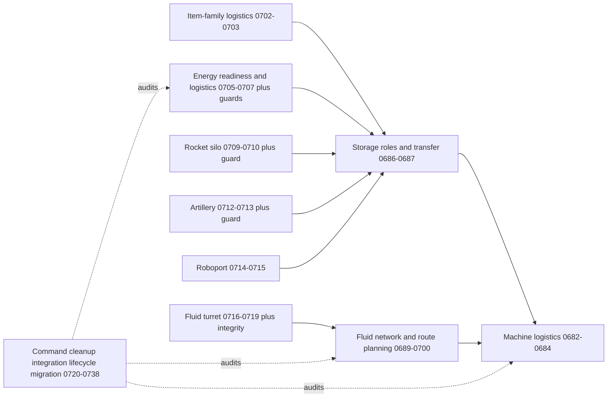

These families contain strong physical-custody source doctrine but remain runtime-unproven.

## Movement Ownership

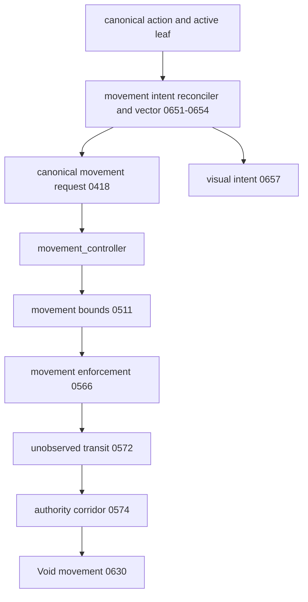

Void movement still requires collision recovery, proxy synchronization, elapsed-time stepping, fairness, save/load proof, and executor recovery tests.

## Remaining Boundary

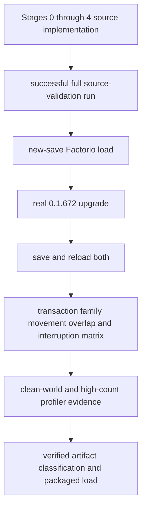

Further claims are blocked on external Factorio and GitHub Actions evidence, not on another speculative source wrapper.

## Documentation and Evidence Connections

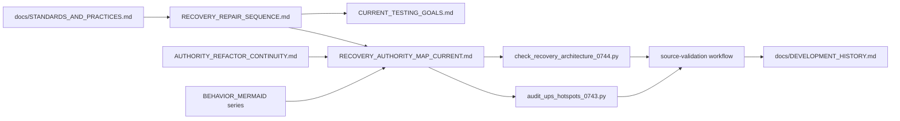

## Evidence Status

- Stages 1 through 4 are source-implemented and source-enforced on `main`.
- Changed Lua modules were grammar-parsed during development, but no successful Lua 5.2 workflow result is recorded for the current head.
- GitHub combined status currently exposes no checks for the current recovery head.
- No Factorio load, migration, save/reload, behavioral, high-count, or profiler evidence is claimed.
- `v0.1.674-rc.3` remains an experimental prerelease, not a verified release candidate.
