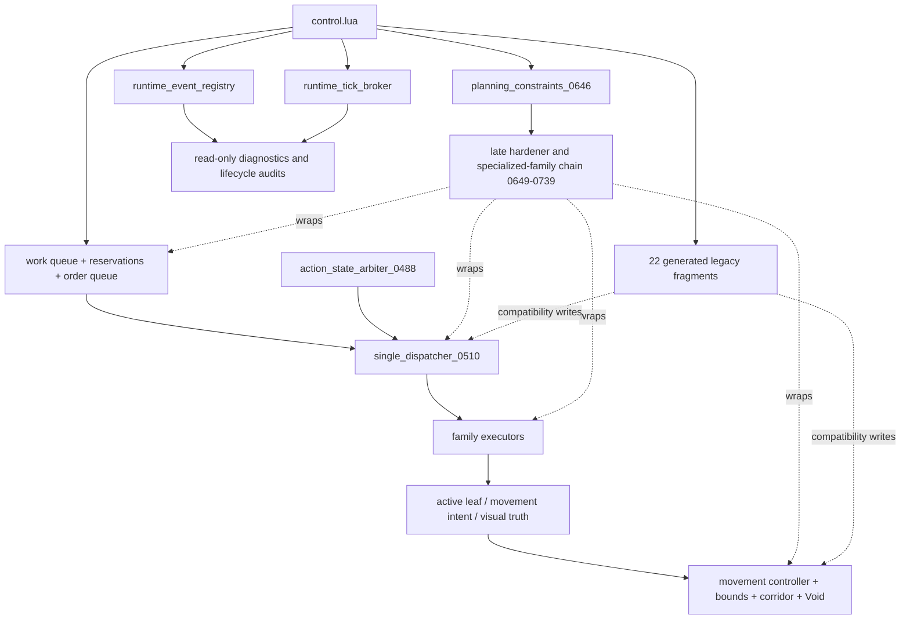
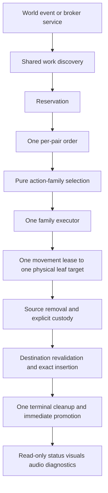
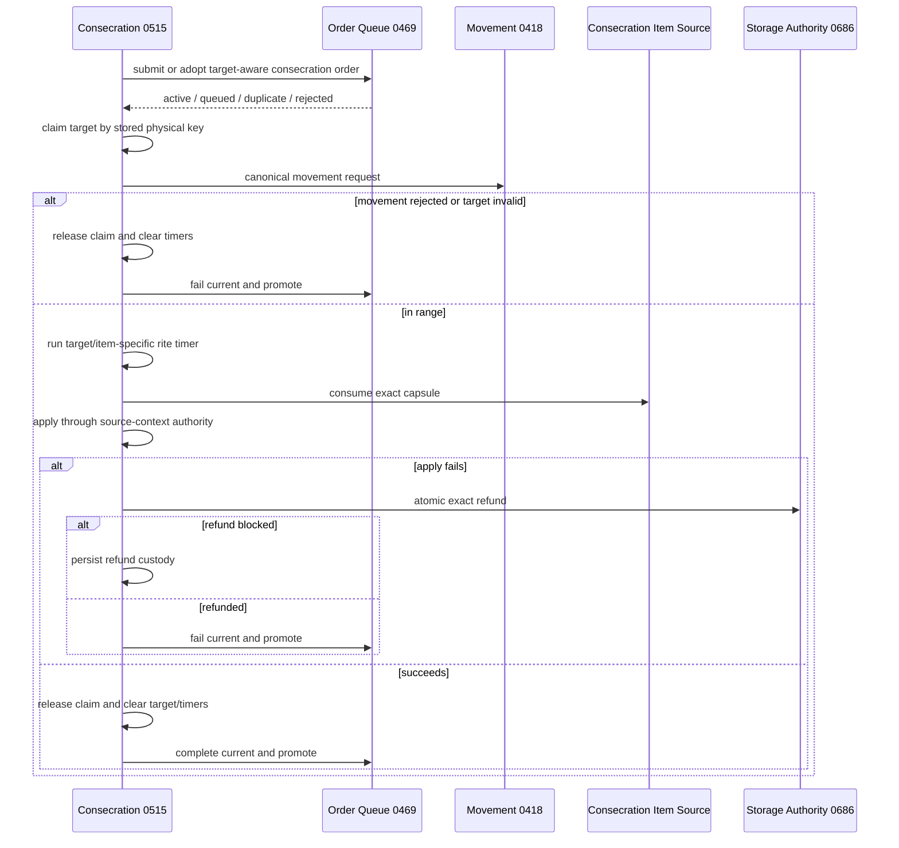
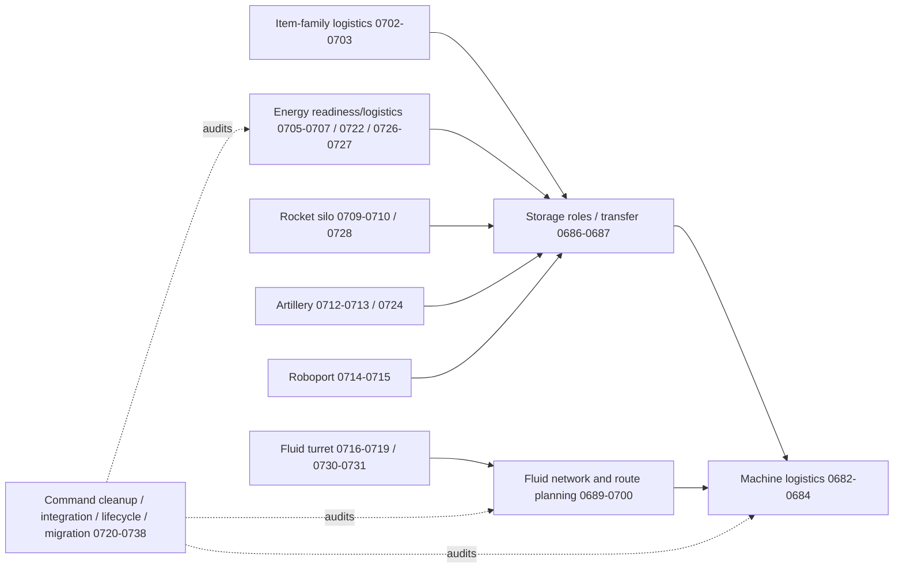
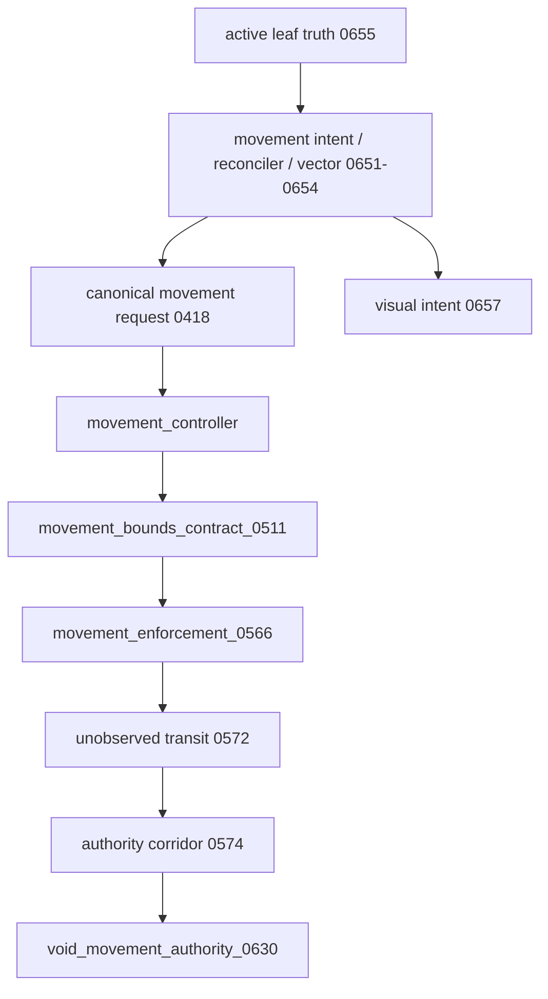
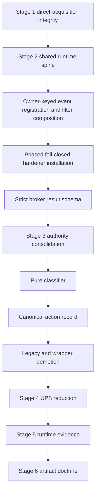
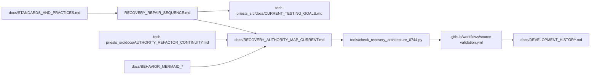

# Tech Priests Current Recovery Authority Map

**Status:** Current architecture map for base-state recovery  
**Authoritative branch:** `main`  
**Packaged baseline:** `0.1.672`  
**Development lane:** `0.1.674-dev`  
**Work-order authority:** `RECOVERY_REPAIR_SEQUENCE.md`  
**Mapped:** 2026-07-17

## Purpose

This map connects the detailed 0659–0675 Mermaid/function drilldowns to the later 0680–0739 authority families, current Void movement recovery, and active base-state repairs. It distinguishes four states that must never be conflated:


## Current Loader and Hardener Shape



Recovery must correct, replace, or demote existing owners rather than add another outer ring.

## Canonical Recovery Target



## Stage 1 Transaction and Scheduler Repair

### Emergency production and order queue

```mermaid
sequenceDiagram
    participant Caller
    participant Q as Order Queue 0469
    participant D as Dispatcher 0510
    participant E as Emergency Production 0514
    participant S as Storage Authority 0686

    Caller->>Q: submit target-aware order
    alt capacity exists
        Q-->>Caller: active / queued / duplicate-merged
    else full
        Q-->>Caller: rejected queue-full
    end
    Q->>D: current intent
    D->>E: service production
    E->>E: require strict recipe metadata
    E->>E: plan all ingredient removals
    E->>E: remove exact ingredients
    alt removal fails
        E->>E: rollback exact removals
        E->>E: persist rollback custody on shortfall
    else succeeds
        E->>E: persist output-held custody
        E->>S: atomic exact deposit
        alt blocked
            S-->>E: rejected; custody retained
        else deposited
            E->>Q: complete current
            Q->>Q: terminal history and immediate promotion
        end
    end
```

### Consecration lifecycle



### Stage 1 invariants represented in source

- Full queues reject truthfully.
- Order identity includes pair, surface, family, item, purpose/role, and physical target when available.
- Duplicates refresh mutable metadata.
- Preemption cannot discard the interrupted order.
- Invalid physical targets fail.
- Terminal transitions immediately promote or exhaust the queue.
- Initial callbacks are caller-owned; promoted callbacks execute once.
- Emergency fallback requires strict ingredients, planned removal, rollback, custody, and atomic deposit.
- Facility output collection excludes assembling-machine input inventories.
- Consecration cooldown happens before target acquisition and cannot retain a claim.
- Claims can be released by stored key after the entity becomes invalid.
- Consecration movement accepts only a truthful canonical movement result.
- Target/item changes and terminal failures clear rite timers.
- Failed application refunds atomically or persists exact refund custody.
- Consecration queue and scheduler admission is verified rather than assumed.

## Specialized Runtime Families Added After the Older Mermaid Series



These families remain runtime-unproven until Stage 5 evidence exists.

## Movement Ownership During Recovery



Void Stage 1 removes ground-leash ownership while preserving corridor authorization. Collision recovery, proxy synchronization, elapsed-time stepping, fairness, serialization, and executor recovery remain open.

## Remaining Recovery Defect Fronts



## Documentation and Evidence Connections



## Evidence Status

- Emergency production, order queue, and consecration repairs are source-implemented on `main`.
- The three replacement Lua modules were parsed locally with a Lua grammar parser before publication.
- No recorded successful Lua 5.2 workflow result exists for the current recovery head.
- No Factorio load, migration, save/reload, behavioral, or performance evidence is claimed.
- Experimental `0.1.674` prerelease artifacts remain distinct from a verified release candidate.
