# Tech Priests Current Recovery Authority Map

**Status:** Current architecture map for base-state recovery  
**Authoritative branch:** `main`  
**Packaged baseline:** `0.1.672`  
**Development lane:** `0.1.674-dev`  
**Work-order authority:** `RECOVERY_REPAIR_SEQUENCE.md`  
**Mapped:** 2026-07-20

## Purpose

This map distinguishes source presence, active installation, runtime authority, and accepted Factorio evidence.

Source presence is not installation. Installation is not behavioral proof.

## Current Loader and Hardener Shape

The canonical broker route exists before prearm. `nil`, `false`, an exception, a missing service, or an incomplete finalizer is an installation failure.

## Retired Parallel Authorities

Twenty files remain in source for historical comparison but are absent from `HARDENERS`:

```mermaid
flowchart TD
    A[direct_acquisition_movement_lock_0650]
    B[movement_vector_enforcer_0651]
    C[movement_target_reconciler_0652]
    D[movement_intent_authority_0654]
    E[active_leaf_task_truth_0655]
    F[construction_placement_authority_0656]
    G[logistics_mineable_source_bridge_0657]
    H[repair_executor_integrity_0673]
    I[combat_repair_integrity_0676]
    J[combat_repair_terminal_cleanup_0677]
    K[machine_logistics_integrity_0682]
    L[machine_logistics_candidate_recovery_0683]
    M[machine_logistics_final_authority_0684]
    N[item_family_integrity_0703]
    O[fusion_reactor_readiness_guard_0727]
    P[energy_readiness_diagnostics_0711]
    Q[energy_item_automation_guard_0722]
    S[energy_automation_guard_install_assertion_0726]
    T[rocket_silo_live_ownership_guard_0728]
    U[artillery_train_validity_guard_0724]
    R[RETIRED source-only authorities]

    A --> R
    B --> R
    C --> R
    D --> R
    E --> R
    F --> R
    G --> R
    H --> R
    I --> R
    J --> R
    K --> R
    L --> R
    M --> R
    N --> R
    O --> R
    P --> R
    Q --> R
    S --> R
    T --> R
    U --> R
```

They were retired because they independently scheduled work, rewrote movement tables, issued commands, cleared queue state, rewrote pair targets or modes, synthesized success, spilled refunds, moved products without canonical custody, wrapped an already recovered executor, or made correctness depend on patch-install order.

## Canonical Recovery Target

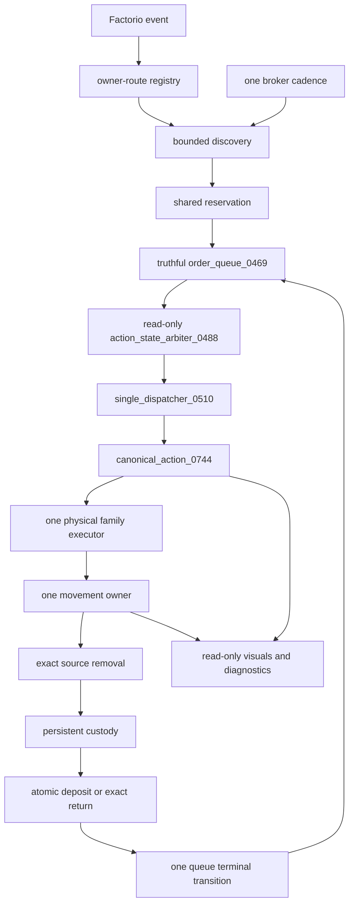

## Stage 1 Transaction and Scheduler Repair

### Emergency production

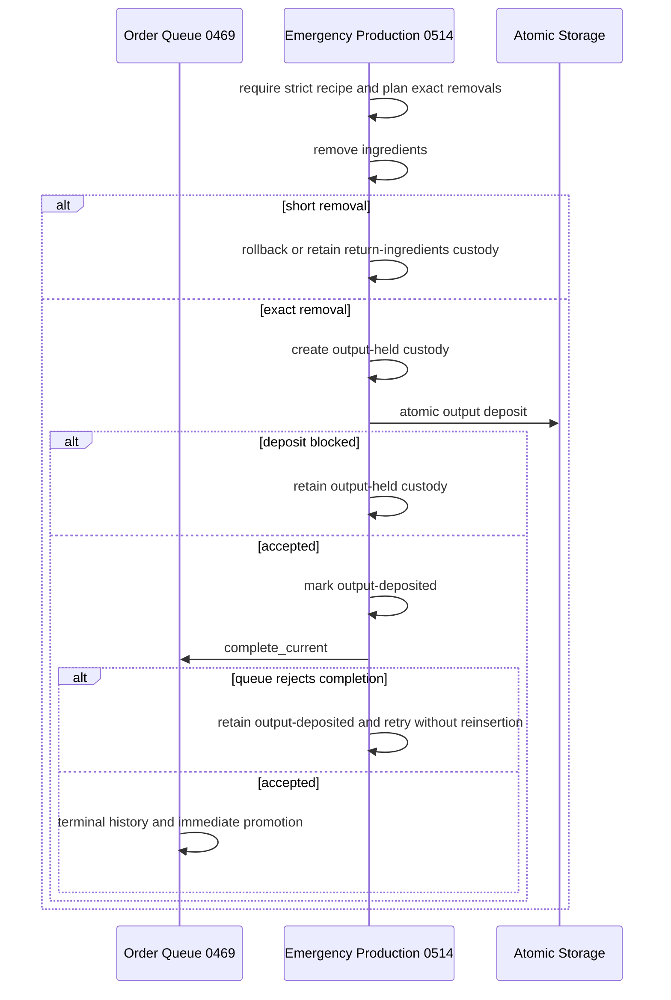

### Direct acquisition, consecration, and repair

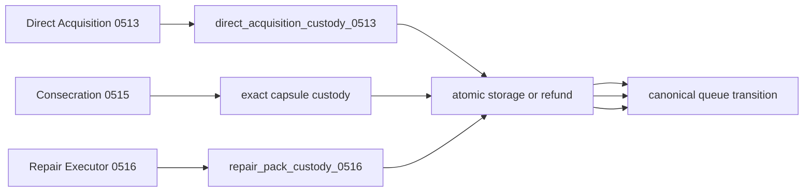

`repair_executor_0516` is the sole physical repair authority. `combat_repair_doctrine_0517` owns only tactical target, cover, and cluster evaluation.

### Machine logistics

```mermaid
flowchart LR
    MachineDiscovery[machine_logistics_discovery_0528]
    MachineCandidate[machine_logistics_candidate_0528]
    Classifier[action_state_arbiter_0488]
    Dispatcher[single_dispatcher_0510]
    Machine[logistics_machine_fulfillment_0528]
    MachineCustody[machine_logistics_custody_0528]
    GenericStorage[container-only storage 0686]

    MachineDiscovery --> MachineCandidate --> Classifier --> Dispatcher --> Machine
    Machine --> MachineCustody --> GenericStorage
```

The retired `0682`, `0683`, and `0684` wrappers may not return to the active graph.

### Proxy ammunition and visible item-family logistics

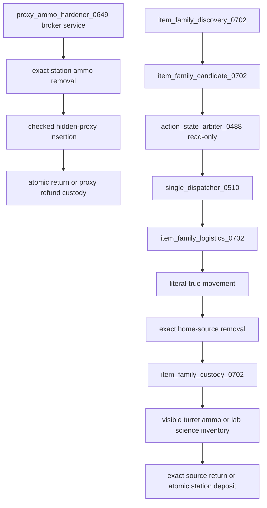

Hidden proxy ammunition remains exclusively owned by `proxy_ammo_hardener_0649`. `item_family_logistics_0702` owns only visible unautomated ammunition turrets and laboratories. It performs broker-budgeted discovery only; the classifier recommends without mutation and the dispatcher alone executes. Ammo compatibility, research-change handling, custody recovery, and terminal cleanup were consolidated from retired `item_family_integrity_0703`.

### Energy readiness and physical fuel logistics

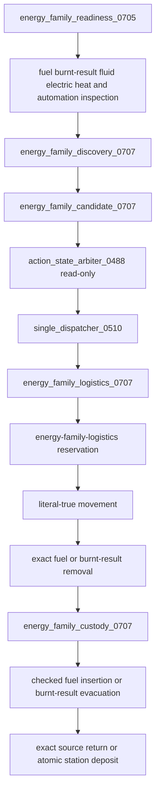

`energy_family_readiness_0705` is read-only. It incorporates fusion-reactor heat semantics, connected inserter/loader ownership, and corrected diagnostic counters. `energy_family_logistics_0707` owns discovery data and all physical fuel or burnt-result work, but its broker service is discovery-only. The dispatcher alone calls `service_pair`. The retired `0727`, `0711`, `0722`, and `0726` wrappers may not return to the active graph.

### Rocket-silo readiness and physical item logistics

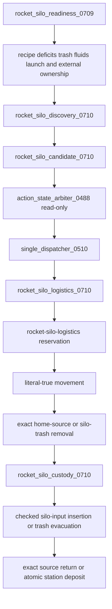

`rocket_silo_readiness_0709` is read-only and reports inspection with `acted=0`. `rocket_silo_logistics_0710` owns candidate data and all physical manual input or trash work, but its broker service is discovery-only. The dispatcher alone calls `service_pair`. Launch activity and external logistics ownership are revalidated before and during execution. The retired `rocket_silo_live_ownership_guard_0728` wrapper may not return to the active graph.

### Artillery readiness and physical ammunition logistics

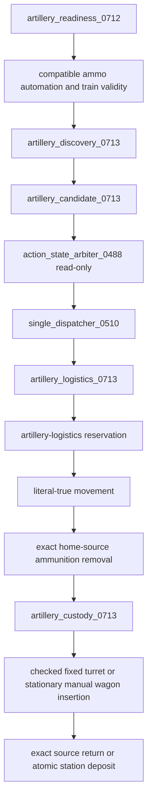

`artillery_readiness_0712` is read-only and reports inspection with `acted=0`. Detached or invalid wagons, moving wagons, automatic-mode trains, and externally automated artillery are not manual service targets. `artillery_logistics_0713` owns candidate data and all physical ammunition work, but its broker service is discovery-only. The dispatcher alone calls `service_pair`. The retired `artillery_train_validity_guard_0724` wrapper may not return to the active graph.

### Generic storage and priest cargo

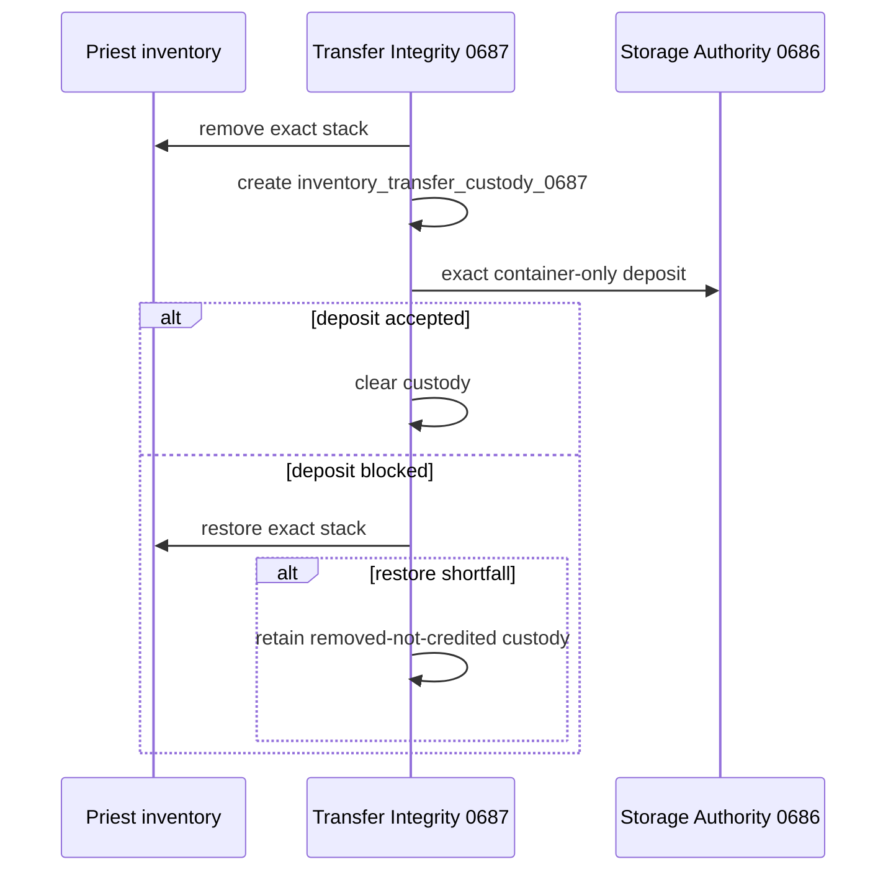

Generic storage cannot address assembler, furnace, laboratory, fuel, or silo work inventories.

## Stage 2 — Shared Runtime Spine

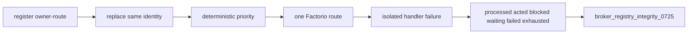

Numeric zero, `nil`, waiting, and blocked results are not actions. The broker audit requires one correctly owned central route.

## Stage 3 — Canonical Behavioral Authority

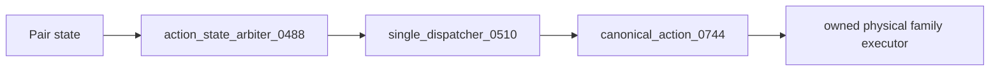

The classifier owns no timer, movement request, task clearing, terminal transition, pair target write, or pair mode write.

## Stage 4 — Static Pressure Protection

`audit_ups_hotspots_0743.py` compares periodic routes, frequent routes, risky scans, direct commands, rewrite sites, and pair mode/target writes against the frozen pre-recovery baseline. Static non-regression is not runtime profiler evidence.

## Stage 5 — Evidence and Release Boundary

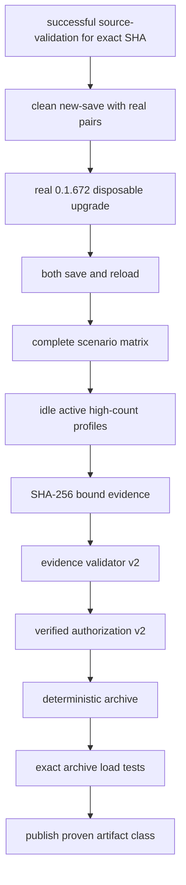

Authorization revalidates the evidence directory and manifest digest at packaging time. Protected `0.1.672`, absent authorization, mixed source identity, or rejected evidence blocks packaging.

## Remaining Recovery Defect Fronts

1. Obtain a successful complete source-validation run for one exact current SHA.
2. Continue auditing the 35 retained hardeners for direct timing fallback, unconditional success, unchecked registration, and physical-accounting defects.
3. Audit roboport, fluid, and fluid-turret specialized families for the recovered discovery/classification/dispatcher/custody pattern.
4. Execute clean new-save, real `0.1.672` upgrade, configuration-change, save/reload, behavioral, and profiler scenarios.
5. Validate the bound evidence directory, authorize a qualified version, package deterministically, and repeat tests against the exact archive.

No runtime, migration, save/load, behavioral, profiler, package, or release success is claimed by this map.
