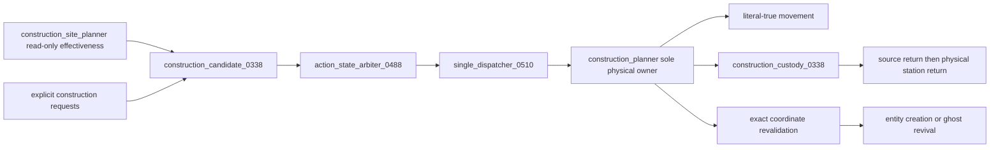
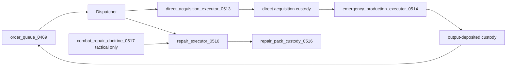
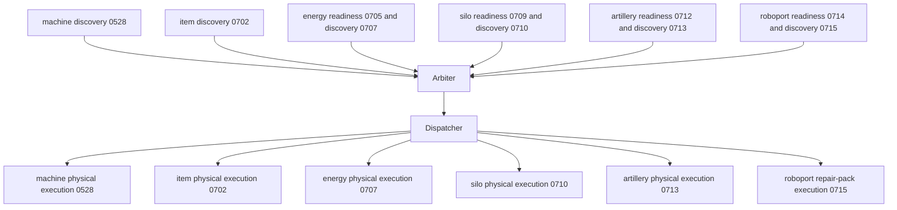
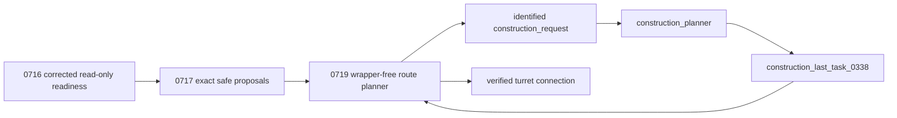
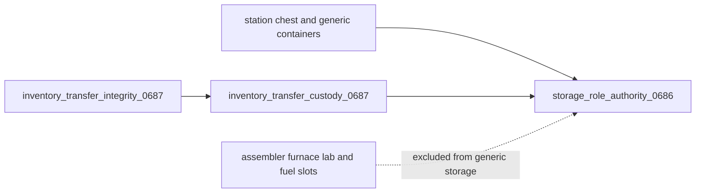

# Current Recovery Authority Map

**Source lane:** `0.1.674-dev`  
**Protected packaged baseline:** `0.1.672`  
**Runtime evidence:** Not yet accepted  
**Declarative graph:** **32 declarative active hardeners** and **23 retired source-only authorities**.

The diagrams below describe source ownership. They do not claim successful GitHub Actions, Factorio loading, migration, save/reload, behavioral validation, profiling, packaging, or release.

## Canonical Loader and Runtime Spine

The registry is the sole event-composition authority. The broker owns the single central cadence. Hardener installation requires literal `true`; failed families are degraded rather than silently treated as installed.

## Construction Placement and Physical Execution

Defensive placement effectiveness belongs to `construction_site_planner.lua`. It scores perimeter position, threat alignment, spacing, support, power, coverage, and role-specific usefulness for walls, turrets, artillery, radar, mines, and roboports. `construction_planner.lua` alone moves the priest, removes the placeable item, retains custody, revalidates the chosen site and direction, and builds the entity.

## Repair, Acquisition, and Production Transactions

Terminal queue mutation remains scheduler-owned. Physical item removal is always paired with persistent custody and exact return or deposit handling.

## Consolidated Specialized Logistics

Readiness and discovery broker services do not execute physical work. The classifier is read-only. The dispatcher is the sole caller of each physical executor. Roboport placement remains a construction concern; `0714/0715` inspect and service existing roboports only.

## Fluid-Turret Authority

`fluid_turret_readiness_0716` owns accepted attack-fluid, pipeline, contamination, and corrected internal-buffer interpretation. `fluid_turret_connection_proposals_0717` owns exact source segment and free-port identity. `fluid_turret_connection_planner_0719` owns route search, route reservations, request identity, retries, and completion. It publishes `fluid_turret_route_discovery_0719` and ordinary fixed-position construction requests; it never wraps construction, moves priests, carries pipe items, or places pipes.

The retired fluid-turret wrappers are:

- `fluid_turret_internal_buffer_guard_0731`
- `fluid_turret_proposal_integrity_0718`
- `fluid_turret_planner_integrity_0730`

Their useful rules are consolidated into `0716`, `0717`, and `0719` respectively.

## Storage and Transfer Boundaries

Generic storage cannot use machine work inventories. Machine-specific executors may access only the exact target inventory required by their family.

## Retired Authority Boundary

Twenty-three files remain source-preserved but cannot install. They include the direct movement and mutable-leaf chain, remote salvage, construction placement wrapper, repair wrappers, machine wrappers, item integrity wrapper, energy wrappers, silo live-ownership wrapper, artillery train-validity wrapper, and the three fluid-turret wrappers listed above.

A retired authority may be read for historical context, but reintroducing its installer, service, direct event route, command ownership, physical mutation, or wrapper hook is a source-validation failure.

## Stage 5 — Evidence and Release Boundary

Source consolidation is not runtime proof. The remaining objective gates are:

1. One successful complete `Source validation` workflow for the exact tested SHA.
2. New-save and protected `0.1.672` migration loads in Factorio 2.x.
3. Configuration-change and save/reload runs for new and migrated saves.
4. The full behavioral scenario matrix, including construction effectiveness and fluid turret route recovery.
5. Idle, active, and high-count profiler evidence.
6. Digest-bound evidence validation and reviewed release authorization.
7. Qualified version advancement, deterministic packaging, and packaged-load testing.

Until those gates are accepted, `tech-priests_src/info.json` remains `0.1.672`, no package is verified, and no release is authorized.
