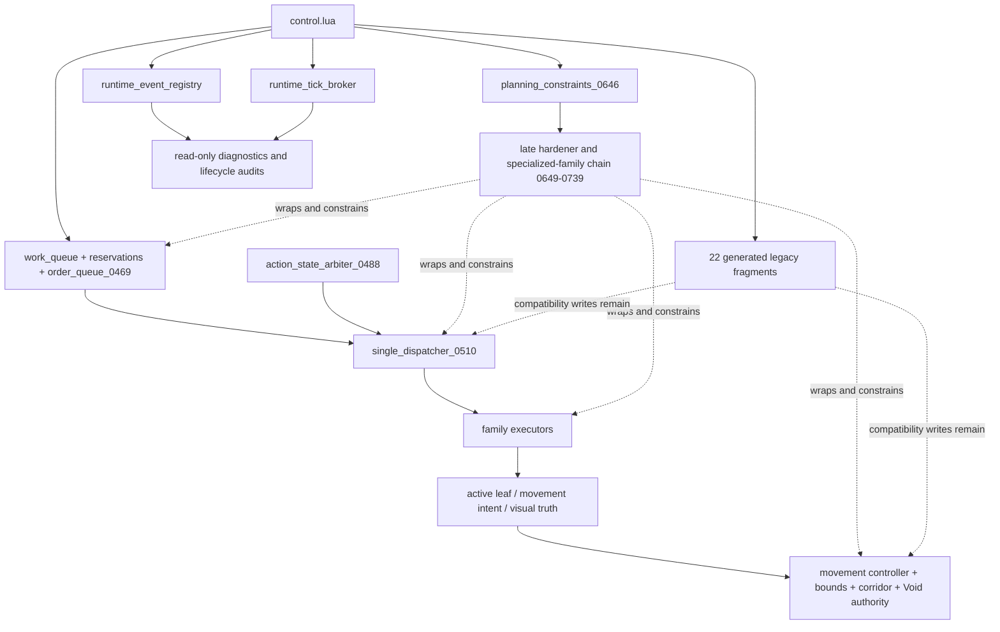
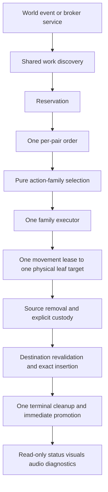
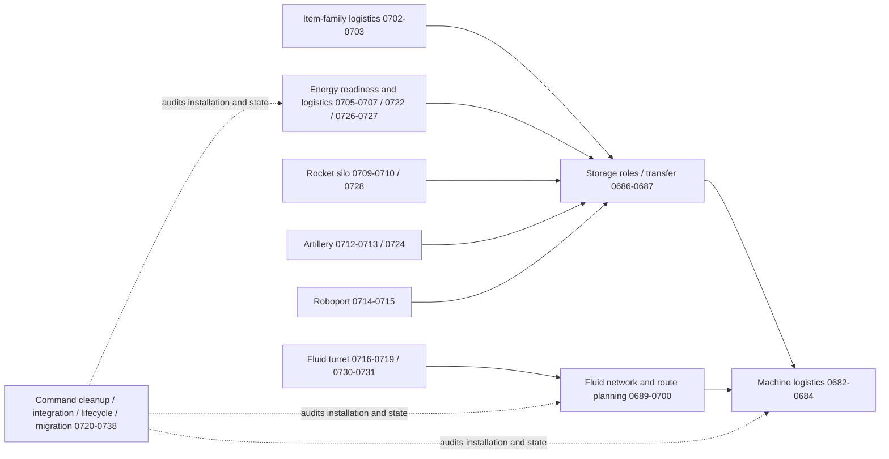
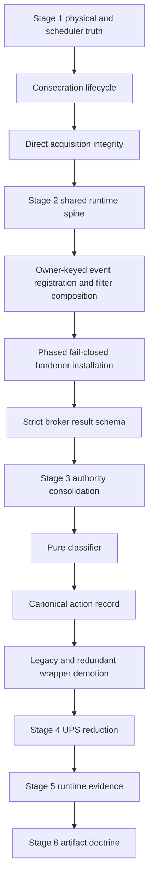
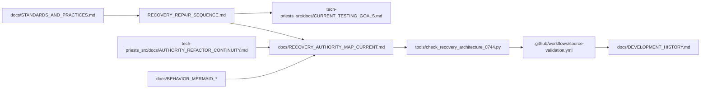

# Tech Priests Current Recovery Authority Map

**Status:** Current architecture map for base-state recovery  
**Authoritative branch:** `main`  
**Packaged baseline:** `0.1.672`  
**Development lane:** `0.1.674-dev`  
**Work-order authority:** `RECOVERY_REPAIR_SEQUENCE.md`  
**Mapped:** 2026-07-17

## Purpose

This map supersedes the older Mermaid series only for the current recovery milestone. The earlier function drilldowns remain detailed historical evidence for the 0659–0675 stack. This document connects that stack to the later 0680–0739 authority families, the current Void movement repair, and the first base-state transaction and scheduler repairs.

It distinguishes four states that must never be conflated:


A module may be present without installing, installed without winning the wrapper chain, or authoritative without runtime proof.

## Current Loader and Hardener Shape



The recovery target is not to add another outer ring. Each stage must correct, replace, or demote an existing owner until the dashed compatibility and hardener edges can be removed.

## Canonical Recovery Target



## Stage 1 Transaction and Scheduler Repair

```mermaid
sequenceDiagram
    participant Caller
    participant Q as Order Queue 0469
    participant D as Dispatcher 0510
    participant E as Emergency Production 0514
    participant S as Storage Authority 0686

    Caller->>Q: submit order
    alt queue has capacity
        Q-->>Caller: active / queued / duplicate-merged
    else queue full
        Q-->>Caller: rejected queue-full
    end
    Q->>D: current intent
    D->>E: service selected production family
    E->>E: require strict recipe metadata
    E->>E: plan all ingredient removals
    E->>E: remove exact ingredients
    alt any removal fails
        E->>E: rollback exact removals
        E->>E: persist rollback custody on shortfall
    else transaction succeeds
        E->>E: persist output-held custody
        E->>S: atomic exact deposit
        alt destination blocked
            S-->>E: rejected; custody retained
        else deposited
            S-->>E: complete exact count
            E->>Q: complete current order
            Q->>Q: terminal history and immediate promotion
        end
    end
```

### Stage 1 invariants now represented in source

- A full pending queue returns `queue-full`; it does not report a discarded order as queued.
- Order identity includes family, pair, surface, item, purpose or role, and physical target identity when available.
- Duplicate submissions refresh mutable order metadata.
- Preemption is refused when the interrupted order cannot be retained.
- Invalid physical targets fail rather than complete.
- Terminal transitions immediately promote or explicitly exhaust the queue.
- Initial submission callbacks are caller-owned and execute once; promoted orders execute their stored callback once.
- Timed emergency production requires strict ingredient metadata.
- Ingredient removals are planned before mutation and rolled back on partial failure.
- Any rollback shortfall or completed output remains in persistent custody.
- Facility collection excludes assembling-machine input inventories.
- Output is deposited only through the exact atomic storage authority.

## Specialized Runtime Families Added After the Older Mermaid Series



These families have strong source-level physical-custody doctrine but remain runtime-unproven until Stage 5 evidence exists.

## Movement Ownership During Recovery


Void Stage 1 removes ground-leash ownership while preserving corridor authorization. Collision recovery, proxy synchronization, elapsed-time stepping, fairness, serialization, and executor recovery remain open under `docs/VOID_PRIEST_MOVEMENT_REPAIR_PLAN.md`.

## Remaining Recovery Defect Fronts



## Documentation and Evidence Connections



## Evidence Status

- Emergency production and order-queue repairs are source-implemented on `main`.
- Both replacement Lua modules were parsed locally with a Lua grammar parser before publication.
- The project Lua 5.2 compiler workflow has not yet produced a recorded successful result for this recovery head.
- No Factorio load, migration, save/reload, behavioral, or performance evidence is claimed by this map.
- Experimental `0.1.674` prerelease artifacts remain distinct from a verified release candidate.
