# Tech Priests Current Recovery Authority Map

**Status:** Current architecture map for base-state recovery  
**Authoritative branch:** `main`  
**Packaged baseline:** `0.1.672`  
**Development lane:** `0.1.674-dev`  
**Work-order authority:** `RECOVERY_REPAIR_SEQUENCE.md`  
**Mapped:** 2026-07-17

## Purpose

This document connects the detailed 0659–0675 Mermaid drilldowns to the later 0680–0739 authority families and the current recovery source. It distinguishes four separate facts:

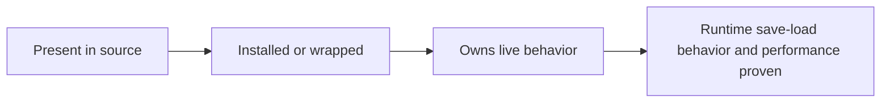

Source implementation is not runtime proof.

## Current Loader and Hardener Shape

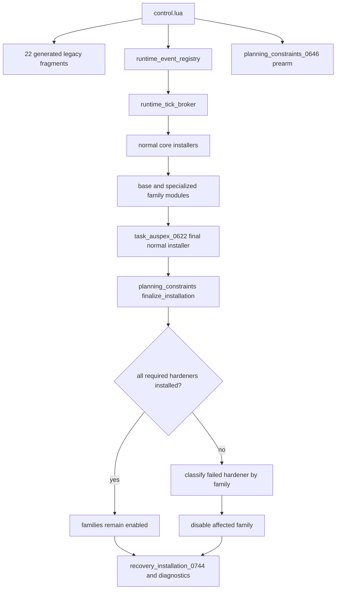

Early hardener failures are provisional. The final pass occurs after ordinary installers have loaded while event registration is still legal. A final failure may not leave the affected family running as though fully protected.

## Canonical Recovery Target

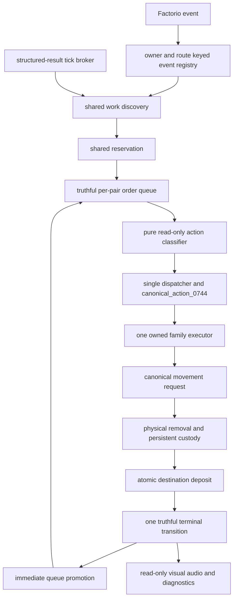

Generated legacy fragments and remaining wrappers are compatibility surfaces beneath this target. They are not authorities to be expanded.

## Stage 1 Transaction and Scheduler Repair

### Emergency production and canonical completion

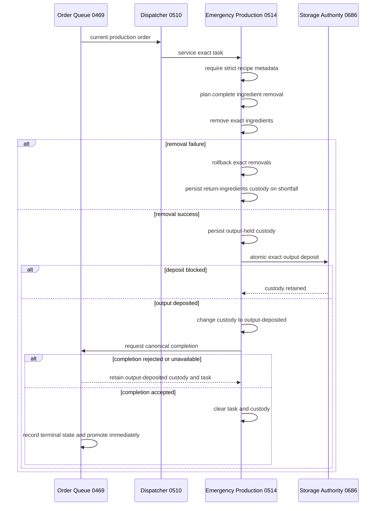

The `output-deposited` phase prevents output duplication when scheduler completion is temporarily blocked. Emergency production may not mutate queue internals directly and may not report a failed legacy service as success.

### Order queue truth

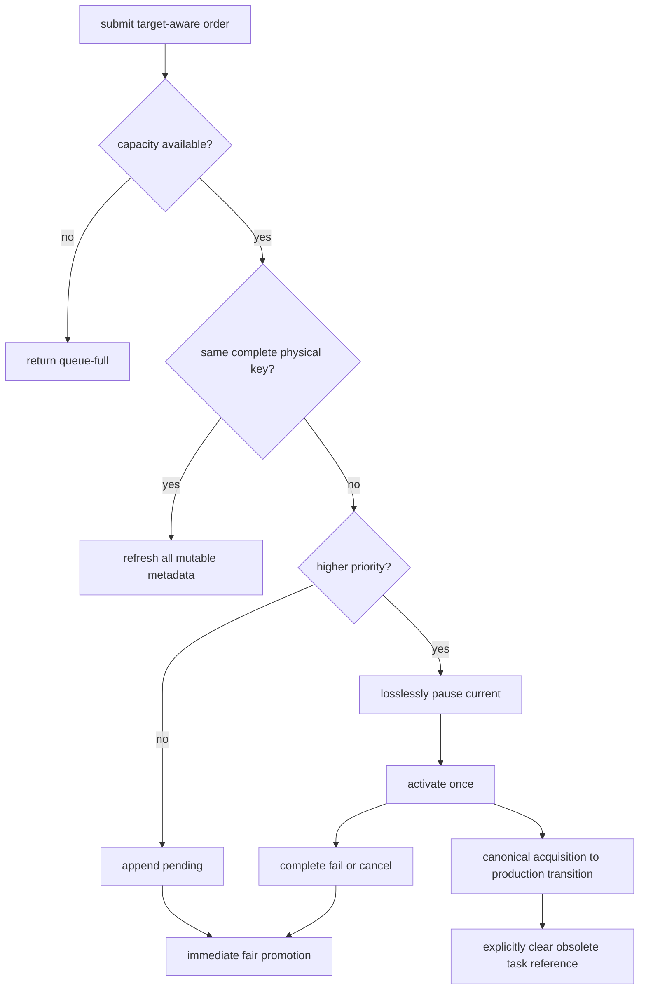

Full queues reject instead of dropping work. Physical target context participates in order identity. Invalid targets fail rather than complete. Initial and promoted callbacks each have exactly one owner.

### Consecration

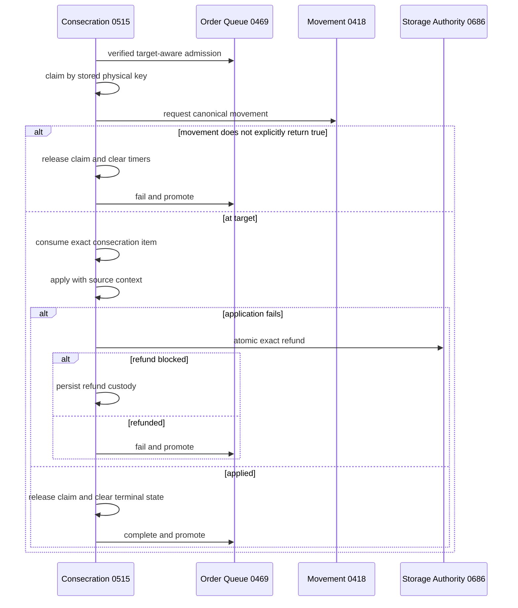

Cooldown is evaluated before target selection. Target or item changes clear rite timers. A protected call is not movement success unless the authority explicitly returns `true`.

### Direct acquisition and production handoff

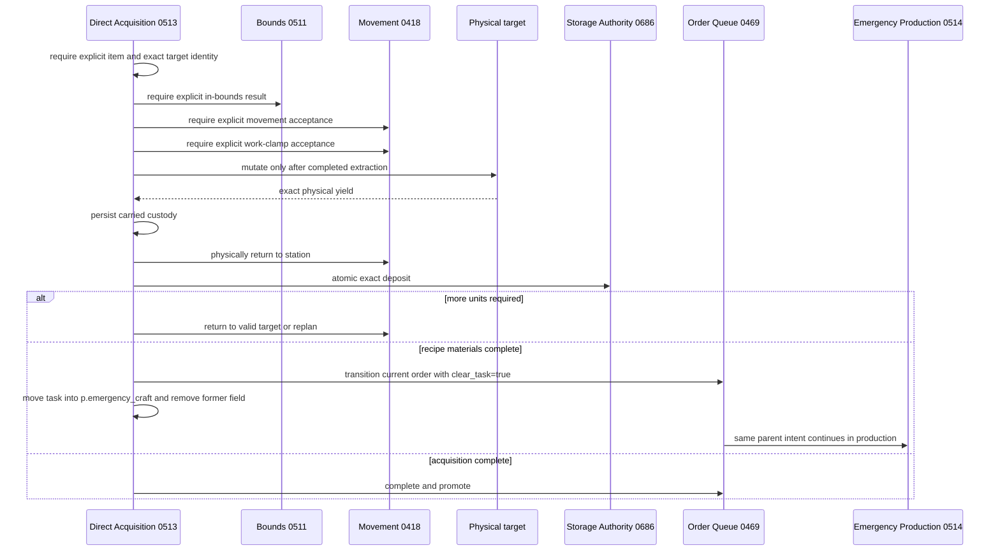

Bounds, movement, and work-clamp authorities fail closed. A failed request is not counted as useful work.

## Stage 2 — Shared Runtime Spine

### Owner-keyed event routes

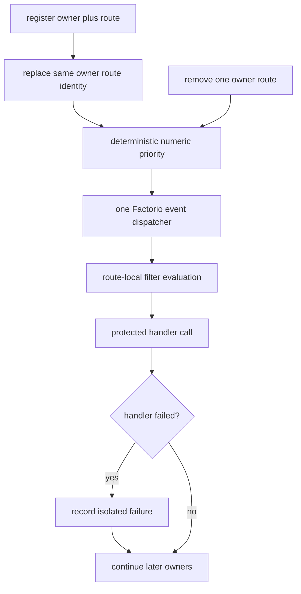

`first/front` and `last/final` are real priorities. Removing one owner no longer clears unrelated handlers.

### Structured broker truth

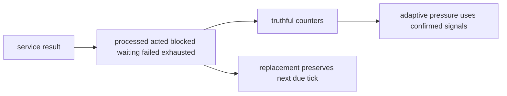

Numeric zero, `nil`, waiting, and blocked results are not actions.

## Stage 3 — Canonical Behavioral Authority

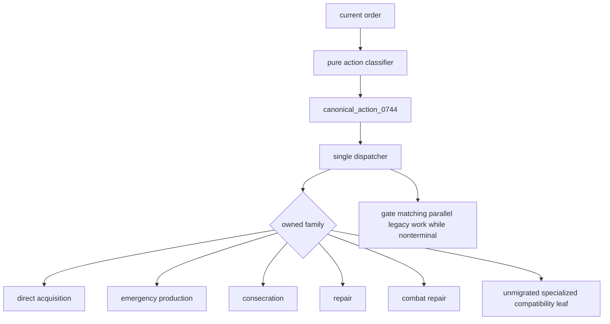

The classifier owns no queue mutation, movement request, executor clearing, pair mode write, pair target write, or periodic service. The dispatcher publishes one serializable action record and counts only executor-confirmed actions.

## Stage 4 — Static UPS Recovery Gate

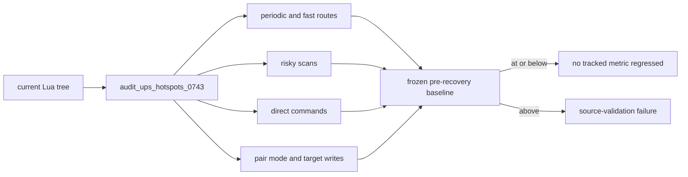

The frozen baseline is 510 periodic routes, 17 active routes at 30 ticks or faster, 68 risky scans, 916 rewrite sites, 72 direct command sites, 352 `pair.mode` writes, and 177 `pair.target` writes. This proves only that the static authority surface did not regress; it is not profiler evidence.

## Later Specialized Families

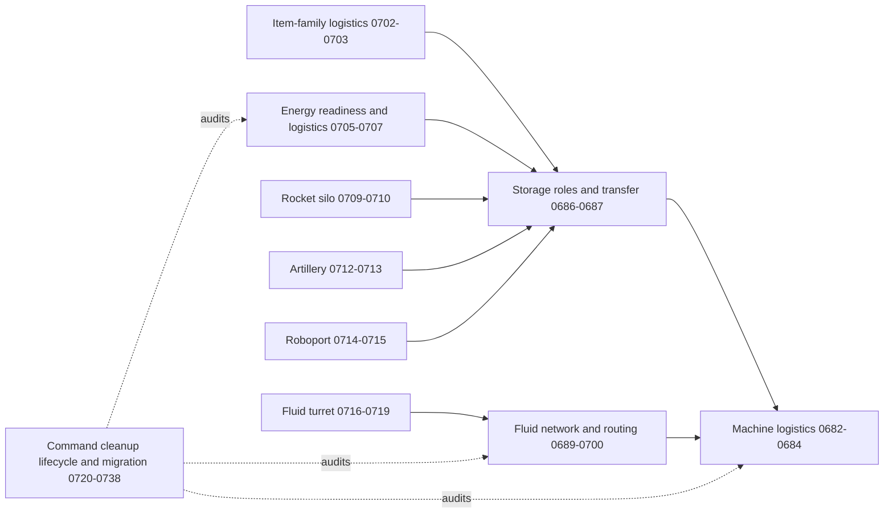

These families contain strong physical-custody source doctrine but remain runtime-unproven.

## Movement Ownership

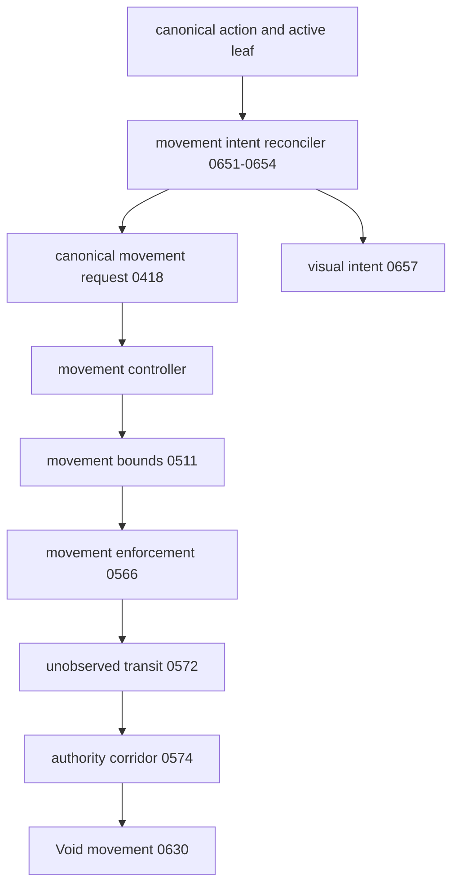

Void movement still requires collision recovery, proxy synchronization, elapsed-time stepping, fair high-count service, save/load proof, and executor recovery tests.

## Remaining Recovery Defect Fronts

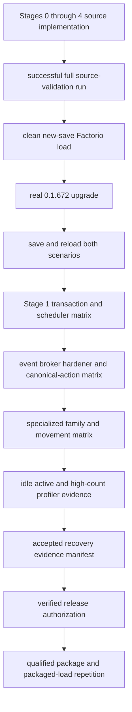

The remaining defects are evidentiary and runtime-specific unless a validation run exposes new source failures. Another speculative outer wrapper is not an acceptable substitute.

## Documentation and Evidence Connections

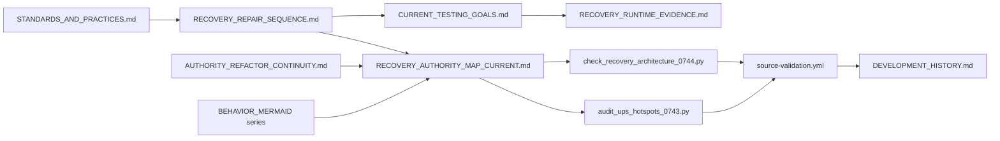

## Evidence Status

- Stages 0 through 4 are source-implemented and regression-gated on `main`.
- The exact modified Stage 1 Lua blobs were reconstructed locally, matched to GitHub blob hashes, and grammar-parsed.
- No successful Lua 5.2 repository-wide workflow result is recorded for the current head.
- GitHub combined status currently exposes no checks for the current head.
- No Factorio load, migration, save/reload, behavioral, high-count, or profiler evidence is claimed.
- `v0.1.674-rc.3` remains an experimental prerelease, not a verified release candidate.
