# Current Recovery Authority Map

**Source lane:** `0.1.674-dev`  
**Protected packaged baseline:** `0.1.672`  
**Source validation evidence:** Passed for `511254d59e76980706921c0a518c7b7f9440d214` in run `29875375384`
**Runtime evidence:** Not yet accepted  
**Declarative graph:** **26 declarative active hardeners** and **47 retired source-only authorities**.

The diagrams below describe source ownership. They do not claim successful GitHub Actions, Factorio loading, migration, save/reload, behavioral validation, profiling, packaging, or release.

## Canonical Loader and Runtime Spine

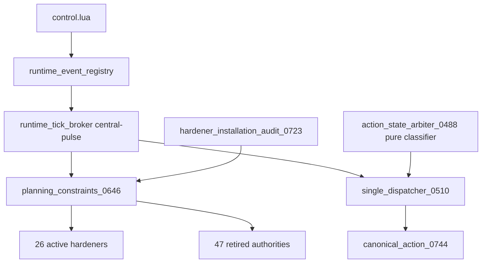

The registry is the sole event-composition authority. The broker owns the single central cadence. Hardener installation requires literal `true`; failed families are degraded rather than silently treated as installed.

## Canonical Movement Cadence

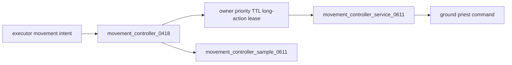

`movement_controller.lua` is the sole ground movement and cadence authority. It owns destination requests, owner/priority replacement rules, TTL, long-action leases, command refresh, active-request servicing, and displacement sampling. Both services require the canonical broker. `movement_cadence_contract_0518.lua` is retired and may not install, wrap the request API, register a cadence, mutate lease state, or add commands.

## Canonical Combat Proxy and Command Territory

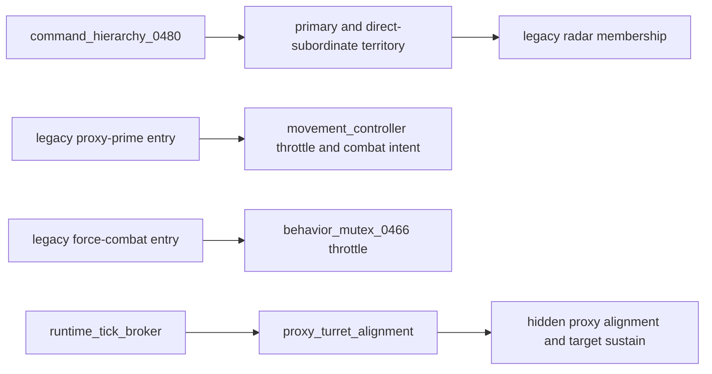

`0472` is retired. Command hierarchy owns subordinate topology and territory; movement owns proxy-prime cadence and visible positioning; the behavior mutex owns force-combat cadence; proxy alignment owns the hidden entity and its two broker services. None of these canonical owners uses a registry or direct-timer fallback.

`combat_safety.lua` is the observer/predicate authority for hostile-target legality. It does not wrap visible commands or proxy-prime functions; `movement_controller.lua` applies those predicates inside its existing command routes.

## Canonical Ground Enforcement and Void Delegation

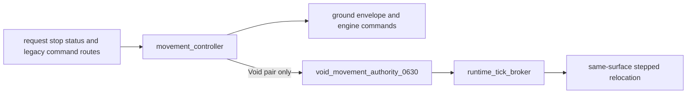

`movement_enforcement_0566` is retired. The Void backend does not patch ground authorities or public globals, and its former child pulse is loaded explicitly.

`authority_corridor_pathing_0574` is a pure planner: it proposes authorization and optional waypoints, while `movement_controller` owns rejection, request state, return movement, and engine commands.

Ground transit is never replaced with offscreen teleportation. Broker service budgets govern executors; the movement controller consumes the shared path budget only at its engine-command boundary.

Visible long-route chunking is native to the movement controller. `0632` and `0633` are retired, and their formerly hidden child repair modules load explicitly.

`0502` is also retired: station-side acquisition, movement quarantine, and anti-slam task mutation are obsolete under the canonical executor and movement controller. `0509` remains only as broker-owned passive reverse-map and UI/cascade maintenance.

`0495` is retired as a parallel pair-link rescue authority. `0499` now owns reverse-map repair, conservative nearby orphan rebinding, and missing-priest observation through the runtime broker. Broad search and direct respawn remain forbidden.

`0500` is retired as a wrapper seal. `0499` exports the fail-closed destruction and replacement policy, while the authoritative generated lifecycle functions establish pair maps on creation and consult `0499` before station cleanup, respawn, mobility, orphan purge, or platform recreation.

`0501` is retired as a late vanish, direct-mining, movement, and recovery wrapper. Canonical `0513` now rejects protected targets and physical-output mismatches; `0490` retains only legacy literal-mining/no-spill safeguards; `0499` owns disappearance evidence.

`0506` and `0508` are retired as overlapping mobility/recovery contracts. Their movement and direct-acquisition behavior was already native to `movement_controller` and `0513`; their pair validation is native to `0499`; their fallback timers and command surfaces are removed.

`0503` remains active only as the broker-owned controlled missing-priest executor. `0499` observes the missing state, delays and rate-limits the attempt, issues a one-shot exact-owner lease, and the generated canonical respawn consumes that lease before creating a replacement. No valid priest is recalled, teleported, swapped, or destroyed by this route.

`0498` is retired as a task/pair quarantine wrapper. `order_queue_0469` holds the active order in an indefinite `missing-priest` pause; `0499` resumes it after conservative rebind or controlled recovery. Its duplicate mining, respawn, event, diagnostics, command, and timer routes are removed.

`0505` is retired as a behavior-execution wrapper. Facility-first emergency production, visible timed station fallback, controller-routed movement, strict recipe transactions, custody, and terminal completion are native to `emergency_production_executor_0514`. Direct-target truth remains in `0513`; lifecycle recovery remains in `0499`/`0503`; the old command, visual, and timer routes are removed.

## Canonical Direct Acquisition Bounds

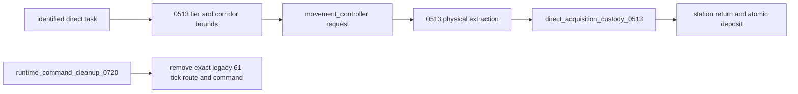

`movement_bounds_contract_0511` is retired. Bounds, overleash recovery, movement, physical work, custody, and terminal state now remain in one executor path.

## Construction Placement and Physical Execution

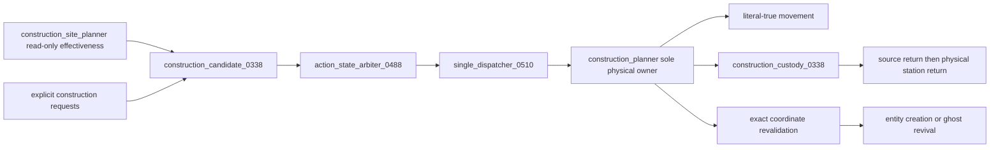

Defensive placement effectiveness belongs to `construction_site_planner.lua`. It scores perimeter position, threat alignment, spacing, support, power, coverage, and role-specific usefulness for walls, turrets, artillery, radar, mines, and roboports. `construction_planner.lua` alone moves the priest, removes the placeable item, retains custody, revalidates the chosen site and direction, and builds the entity.

## Repair, Acquisition, and Production Transactions

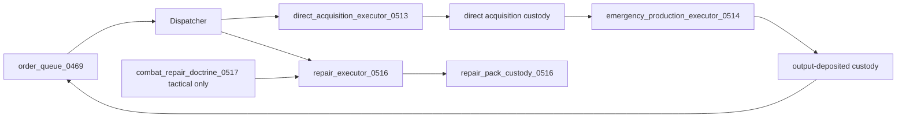

Terminal queue mutation remains scheduler-owned. Physical item removal is always paired with persistent custody and exact return or deposit handling.

## Consolidated Specialized Logistics

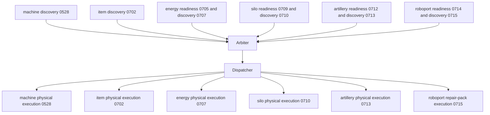

Readiness and discovery broker services do not execute physical work. The classifier is read-only. The dispatcher is the sole caller of each physical executor. Roboport placement remains a construction concern; `0714/0715` inspect and service existing roboports only.

## Standard-Fluid Authority

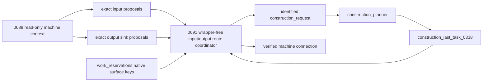

`fluid_network_doctrine_0689` is the sole standard-fluid inspection and proposal authority. It owns exact machine/report context, recipe fluid requirements, fluidbox identity, shared-port collision safety, source and sink discovery, and read-only input/output proposals. `fluid_connection_planner_0691` is the sole standard-fluid route coordinator. It owns route search, surface-scoped route reservations, cooldowns, retries, identified construction requests, and final connection verification. It never wraps construction, moves priests, removes pipe items, or places entities.

The retired standard-fluid wrappers are:

- `fluid_output_sink_doctrine_0694`
- `reservation_position_scope_0697`
- `fluid_connection_execution_guard_0692`
- `fluid_output_connection_planner_0696`
- `fluid_port_collision_validator_0699`
- `fluid_port_context_guard_0700`

Their useful rules are consolidated into `work_reservations`, `0689`, and `0691`. The broker services are `fluid_network_doctrine_0689` and `standard_fluid_route_discovery_0691`.

## Fluid-Turret Authority

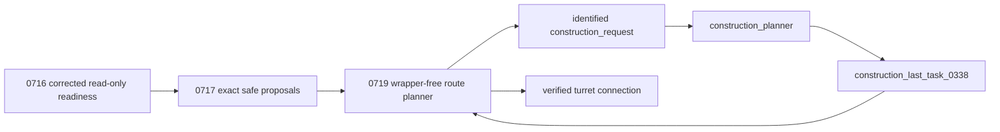

`fluid_turret_readiness_0716` owns accepted attack-fluid, pipeline, contamination, and corrected internal-buffer interpretation. `fluid_turret_connection_proposals_0717` owns exact source segment and free-port identity. `fluid_turret_connection_planner_0719` owns route search, route reservations, request identity, retries, and completion. It publishes `fluid_turret_route_discovery_0719` and ordinary fixed-position construction requests; it never wraps construction, moves priests, carries pipe items, or places pipes.

The retired fluid-turret wrappers are `fluid_turret_internal_buffer_guard_0731`, `fluid_turret_proposal_integrity_0718`, and `fluid_turret_planner_integrity_0730`.

## Storage and Transfer Boundaries

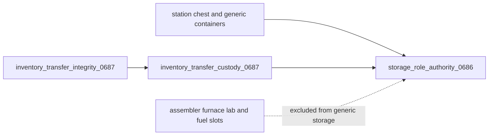

Generic storage cannot use machine work inventories. Machine-specific executors may access only the exact target inventory required by their family.

## Retired Authority Boundary

Forty-seven files remain source-preserved but cannot install. They include the retired `0363` station-pair recovery wrapper, the direct movement and mutable-leaf chain, remote salvage, construction placement wrapper, repair wrappers, machine wrappers, the retired `0505` behavior-execution wrapper, the retired `0426` death/re-imprint wrapper, six standard-fluid wrappers, item integrity wrapper, energy wrappers, silo live-ownership wrapper, artillery train-validity wrapper, and three fluid-turret wrappers.

A retired authority may be read for historical context, but reintroducing its installer, service, direct event route, command ownership, physical mutation, or wrapper hook is a source-validation failure.

## Validation Authority

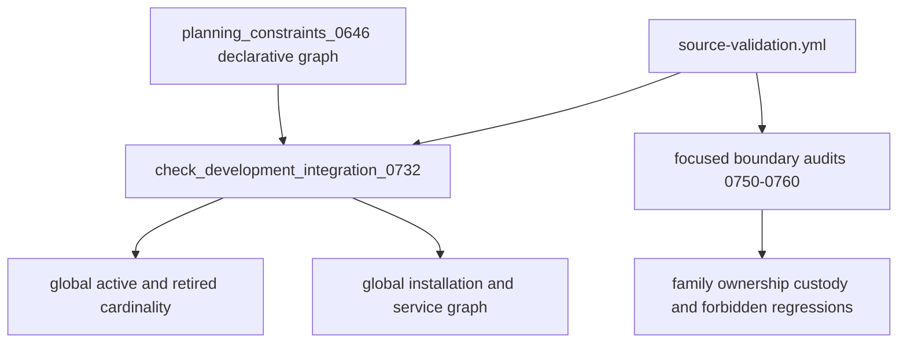

`check_development_integration_0732.py` is the sole static authority for repository-wide hardener cardinality, retired-authority membership, service uniqueness, and installation ordering. Focused family audits enforce only their family’s source contracts. `check_standard_fluid_boundary_0760.py` verifies the consolidated doctrine, route coordinator, native reservation scoping, construction handoff, and six retired standard-fluid wrappers.

## Post-Cleanup Authority Inventory — 2026-07-23

The read-only inventory at `de8630c5307348f812c06edcd08cf85700731244` scanned 306 Lua files. It found 171 unique command registrations with no duplicate command names: 38 in generated fragments, 126 in core modules, and 7 elsewhere. It found 109 direct `script.on_*` routes: 70 `on_nth_tick`, 37 `on_event`, one `on_init`, and one `on_configuration_changed`.

All command names retired by milestones 0779–0790 are absent. Therefore those milestones are closed, but the wider commandless-runtime and owner-keyed-event recovery is not yet closed. The next bounded authority audit begins with generated fragments 015–020 and then classifies each direct route as canonical registry ownership, explicitly authorized bootstrap, or obsolete fallback. Static counts are inventory evidence only; they do not prove runtime installation or behavior.

## Stage 5 — Evidence and Release Boundary

Source consolidation is not runtime proof. The remaining objective gates are:

1. **Completed:** Source validation passed for `511254d59e76980706921c0a518c7b7f9440d214` in run `29875375384`.
2. New-save and protected `0.1.672` migration loads in Factorio 2.x.
3. Configuration-change and save/reload runs for new and migrated saves.
4. The full behavioral scenario matrix, including construction effectiveness, standard-fluid route recovery, and fluid-turret route recovery.
5. Idle, active, and high-count profiler evidence.
6. Digest-bound evidence validation and reviewed release authorization.
7. Qualified version advancement, deterministic packaging, and packaged-load testing.

Until those gates are accepted, `tech-priests_src/info.json` remains `0.1.672`, no package is verified, and no release is authorized.

## Generated Command Closure — 2026-07-23

The 38 generated-fragment command registrations recorded by the post-cleanup inventory are now fully retired through milestones 0792 and 0793. Generated fragments retain 69 registry-owned event/cadence routes and no direct script.on_* routes. Exact historical commands that predate the tp- prefix are removed through explicit KNOWN_COMMANDS ownership before prefix filtering. The next authority audit concerns direct event/timer routes outside generated fragments.

## Consecration Route Ownership — 2026-07-23

The consecration history GUI is a client of scripts.gui.gui_router and no longer binds Factorio GUI events directly or duplicates those routes through the runtime registry. Its periodic refresh, the consecration runtime bridge, and the mining-operation sensor are registry-owned and have no script.on_* fallback. Installers fail closed before publishing installed state when canonical routing is unavailable.

## Startup Provisioning Route Ownership — 2026-07-23

startup_provisioning owns one registry route for player creation, one for player join, and one registry cadence for delayed starter-kit retries. It has no direct script.on_* routes and publishes installed state only after canonical registration succeeds. Physical starter-kit insertion and per-player duplicate protection remain within the existing module.

## Acquisition Route Ownership — 2026-07-23

The acquisition executor owns one 30-tick registry route, acquisition repair owns one 90-tick registry watchdog, and acquisition unstick owns one 120-tick registry watchdog. None retains a direct script.on_nth_tick fallback. All three fail closed and publish installed state only after canonical route acceptance.

## Stable Visual Route Ownership — 2026-07-24

alt_writ_visual_stability_0474 owns one periodic registry cadence and three registry event routes. It retains no direct script.on_* fallback and publishes globals and installed state only after canonical route acceptance.

## Behavior Mutex Route Ownership — 2026-07-24

behavior_mutex_0466 owns one 11-tick registry cadence for combat/acquisition mutual exclusion and invalid combat-target cleanup. It retains no direct script.on_nth_tick fallback and publishes wrappers, commands, globals, and installed state only after canonical route acceptance.

## Behavior Contracts Route Ownership — 2026-07-24

behavior_contracts_0479 owns one registry cadence for movement-before-beam and related behavior contracts. It retains no direct script.on_nth_tick fallback and publishes wrappers, commands, globals, and installed state only after canonical route acceptance.

## Behavior-Tree Monitor Route Ownership — 2026-07-24

behavior_tree_monitor_0642 is broker-owned when runtime_tick_broker accepts its service and uses one named registry cadence only when broker ownership is unavailable. It retains no direct script.on_nth_tick fallback and fails closed when neither canonical owner accepts the route.

## Bootstrap Resource Governor Route Ownership — 2026-07-24

bootstrap_resource_governor_0637 owns one registry cadence while remaining disabled by default. It retains no direct script.on_nth_tick route and publishes its command, global, and installed state after canonical route acceptance.

## Construction Ghost Planner Ownership — 2026-07-24

construction_bootstrap_ghost_planner_0645 is broker-owned when available and uses one named registry cadence only as fallback. It retains no direct script.on_nth_tick route and fails closed when neither owner accepts the service.

## Audio Route Ownership — 2026-07-24

conversation_voice_0530 owns two named audio routes, operational_sounds_0531 owns four, and placeholder_audio_0533 owns four. None retains a direct script.on_* route, and registry owner/category metadata is passed through the canonical options argument.

## Milestone 0804 GUI/visual authority boundary

- `scripts/gui/gui_router.lua` owns Factorio GUI opened/closed/click event bindings.
- `station_work_inventory.lua` is a router client and owns only Work State handling plus its boot-display cadence.
- `alt_writ_visual_stability_0474.lua` owns station overlay, selection, placement, Alt-icon, and command-camera refresh.
- `network_visuals.lua`, `station_network_overlay.lua`, and `workstate_gui_radar_recovery_0465.lua` are route-free compatibility modules.
- `station_catalog.lua` owns catalog scan/destruction routes; Work State owns catalog presentation.
- `task_retention_visual_lease_0476.lua` owns retention scheduling only.

## Milestone 0805 — Frequent route ownership

- `crafting_executor.lua`: one fail-closed 17-tick registry cadence; no direct unit-command escape hatch.
- `overhead_status_governor_0471.lua`: sole periodic overhead display owner through `overhead-status-service`.
- `overhead_text_authority_0473.lua`: route-free late wrapper authority; duplicate pending loop retired.
