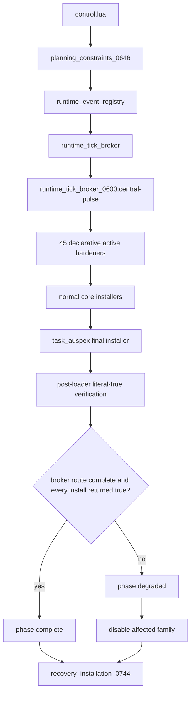
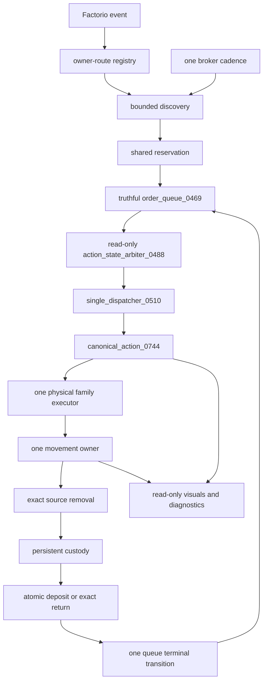
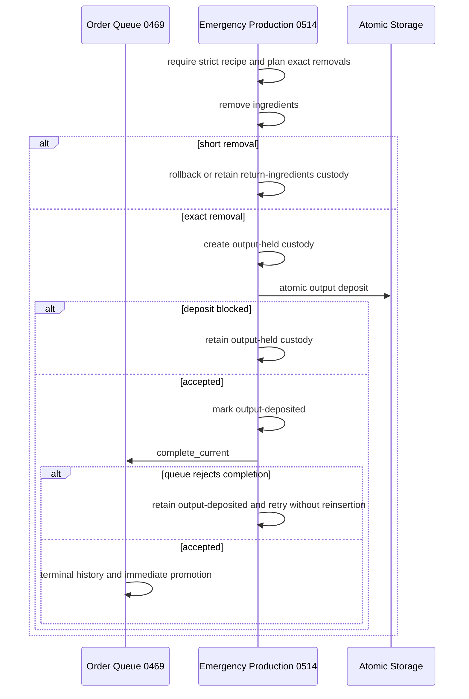
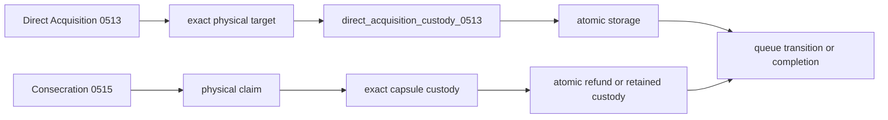
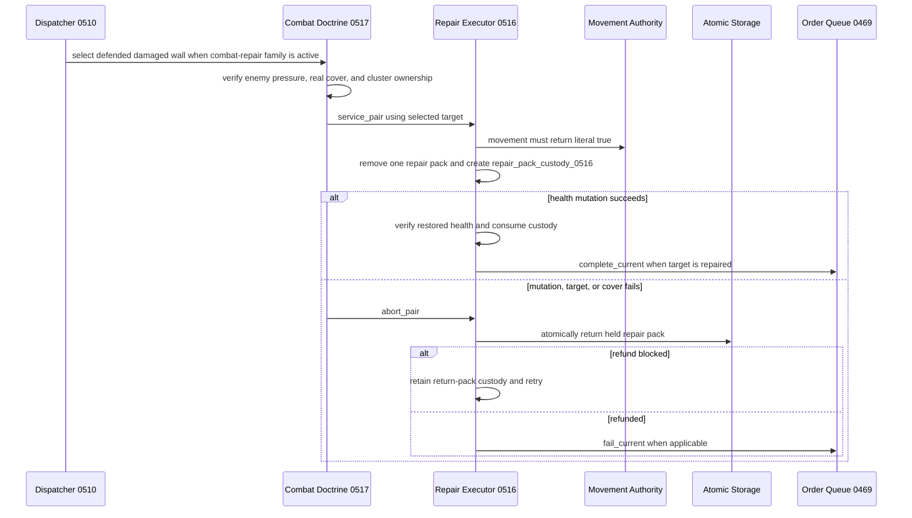
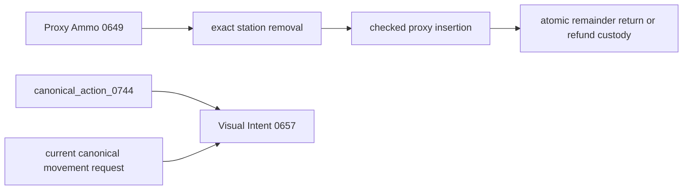
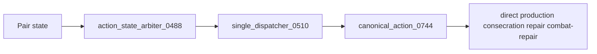
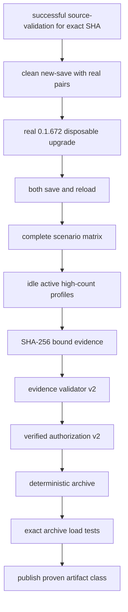

# Tech Priests Current Recovery Authority Map

**Status:** Current architecture map for base-state recovery  
**Authoritative branch:** `main`  
**Packaged baseline:** `0.1.672`  
**Development lane:** `0.1.674-dev`  
**Work-order authority:** `RECOVERY_REPAIR_SEQUENCE.md`  
**Mapped:** 2026-07-18

## Purpose

This map distinguishes source presence, active installation, runtime authority, and accepted Factorio evidence.

Source presence is not installation. Installation is not behavioral proof.

## Current Loader and Hardener Shape

The canonical broker route exists before prearm. `nil`, `false`, an exception, a missing service, or an incomplete finalizer is an installation failure.

## Retired Parallel Authorities

Ten files remain in source for historical comparison but are absent from `HARDENERS`:

```mermaid
flowchart TD
    A[direct_acquisition_movement_lock_0650]
    B[movement_vector_enforcer_0651]
    C[movement_target_reconciler_0652]
    D[movement_intent_authority_0654]
    E[active_leaf_task_truth_0655]
    F[construction_placement_authority_0656]
    G[logistics_mineable_source_bridge_0657]
    H[repair_executor_integrity_0673]
    I[combat_repair_integrity_0676]
    J[combat_repair_terminal_cleanup_0677]
    R[RETIRED source-only authorities]
    A --> R
    B --> R
    C --> R
    D --> R
    E --> R
    F --> R
    G --> R
    H --> R
    I --> R
    J --> R
```

They were retired because they independently scheduled work, rewrote movement tables, issued commands, cleared queue state, rewrote pair targets or modes, synthesized success, spilled refunds, or moved products without canonical custody.

## Canonical Recovery Target

## Stage 1 Transaction and Scheduler Repair

### Emergency production

### Direct acquisition and consecration

### Repair and combat repair

`repair_executor_0516` is the sole physical repair authority. `combat_repair_doctrine_0517` owns only tactical target, cover, and cluster evaluation. The retired `0673`, `0676`, and `0677` wrappers may not return to the active graph.

### Proxy ammunition and visual intent

Proxy ammunition and visual intent are broker-owned. The visual authority is presentation-only.

## Stage 2 — Shared Runtime Spine

Numeric zero, `nil`, waiting, and blocked results are not actions. The broker audit requires one correctly owned central route.

## Stage 3 — Canonical Behavioral Authority

The classifier owns no timer, movement request, task clearing, terminal transition, pair target write, or pair mode write.

## Stage 4 — Static Pressure Protection

`audit_ups_hotspots_0743.py` compares periodic routes, frequent routes, risky scans, direct commands, rewrite sites, and pair mode/target writes against the frozen pre-recovery baseline. Static non-regression is not runtime profiler evidence.

## Stage 5 — Evidence and Release Boundary

Authorization revalidates the evidence directory and manifest digest at packaging time. Protected `0.1.672`, absent authorization, mixed source identity, or rejected evidence blocks packaging.

## Remaining Recovery Defect Fronts

1. Obtain a successful complete source-validation run for one exact current SHA.
2. Audit the 45 retained hardeners for direct timing fallback, unconditional success, unchecked registration, and physical-accounting defects.
3. Repair generic storage access that still treats machine input, output, or furnace inventories as ordinary station storage.
4. Execute clean new-save, real `0.1.672` upgrade, configuration-change, save/reload, behavioral, and profiler scenarios.
5. Validate the bound evidence directory, authorize a qualified version, package deterministically, and repeat tests against the exact archive.

No runtime, migration, save/load, behavioral, profiler, package, or release success is claimed by this map.
