# Tech Priests Current Recovery Authority Map

**Status:** Current architecture map for base-state recovery  
**Authoritative branch:** `main`  
**Packaged baseline:** `0.1.672`  
**Development lane:** `0.1.674-dev`  
**Work-order authority:** `RECOVERY_REPAIR_SEQUENCE.md`  
**Mapped:** 2026-07-17

## Purpose

This map connects the historical 0659–0675 drilldowns to the current recovered runtime spine, retained specialized families, explicitly retired authorities, and Stage 5 evidence boundary.

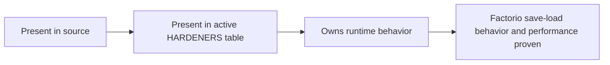

Source presence is not installation. Installation is not behavioral proof.

## Current Loader and Hardener Shape

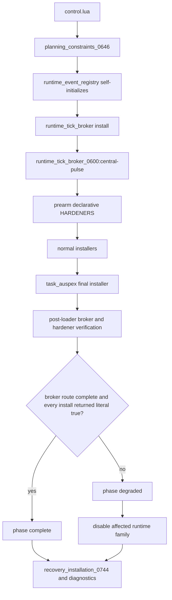

The canonical broker route exists before prearm. A periodic hardener therefore has no valid reason to register a direct `script.on_nth_tick` fallback during normal loading. `nil`, `false`, an error, a missing broker service, or an incomplete finalizer is an installation failure.

## Retired Parallel Authorities

The following files remain in source for history and comparison but are absent from the active `HARDENERS` table:

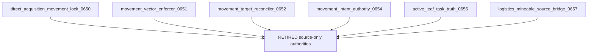

They were retired because they independently wrote movement tables, issued commands, rewrote pair targets and modes, synthesized successful movement, or moved mined output directly into station storage without carried custody.

Their replacement is the canonical chain:

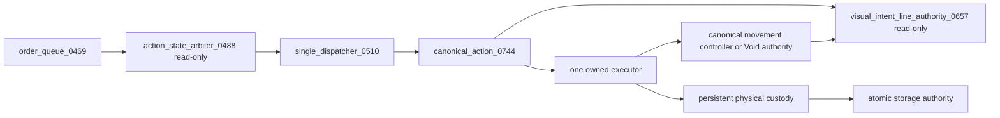

## Canonical Recovery Target

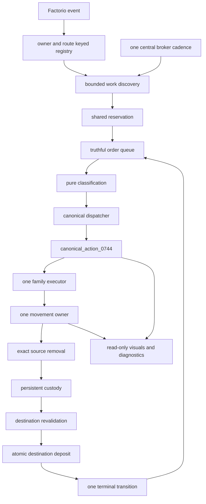

## Stage 1 Transaction and Scheduler Repair

### Emergency production

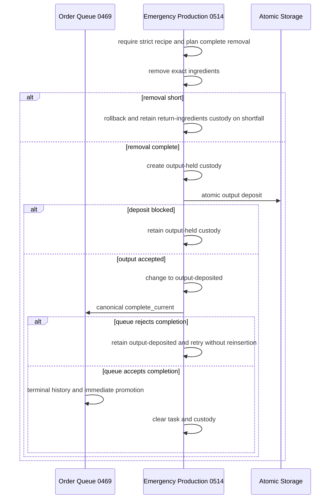

### Direct acquisition and production handoff

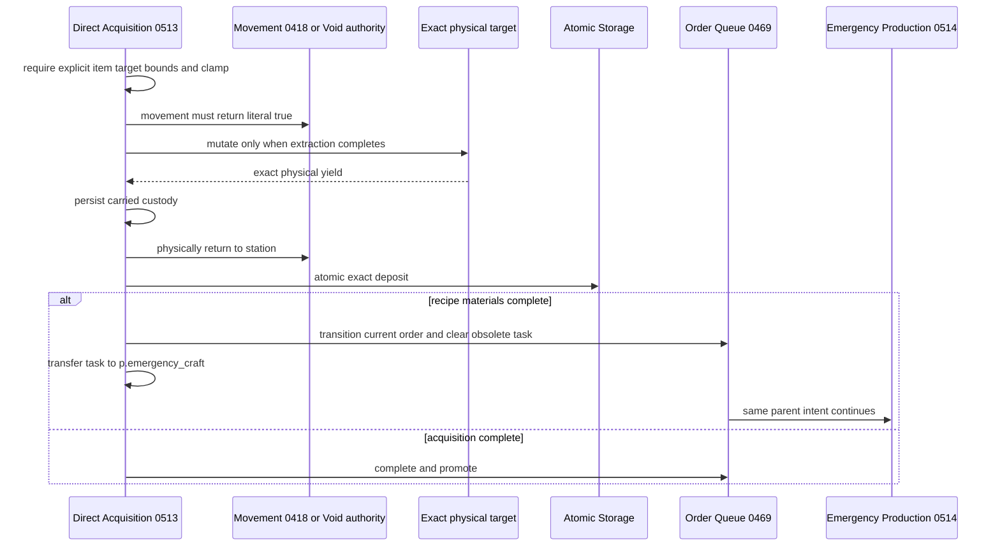

### Consecration and proxy ammunition

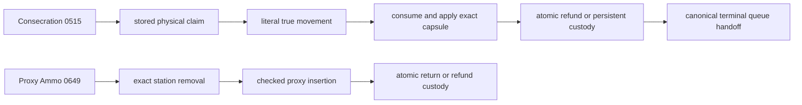

Proxy ammunition and visual intent are broker-owned and have no direct timing fallback. The visual authority reads `canonical_action_0744` or the current movement request and does not mutate work state.

## Stage 2 — Shared Runtime Spine

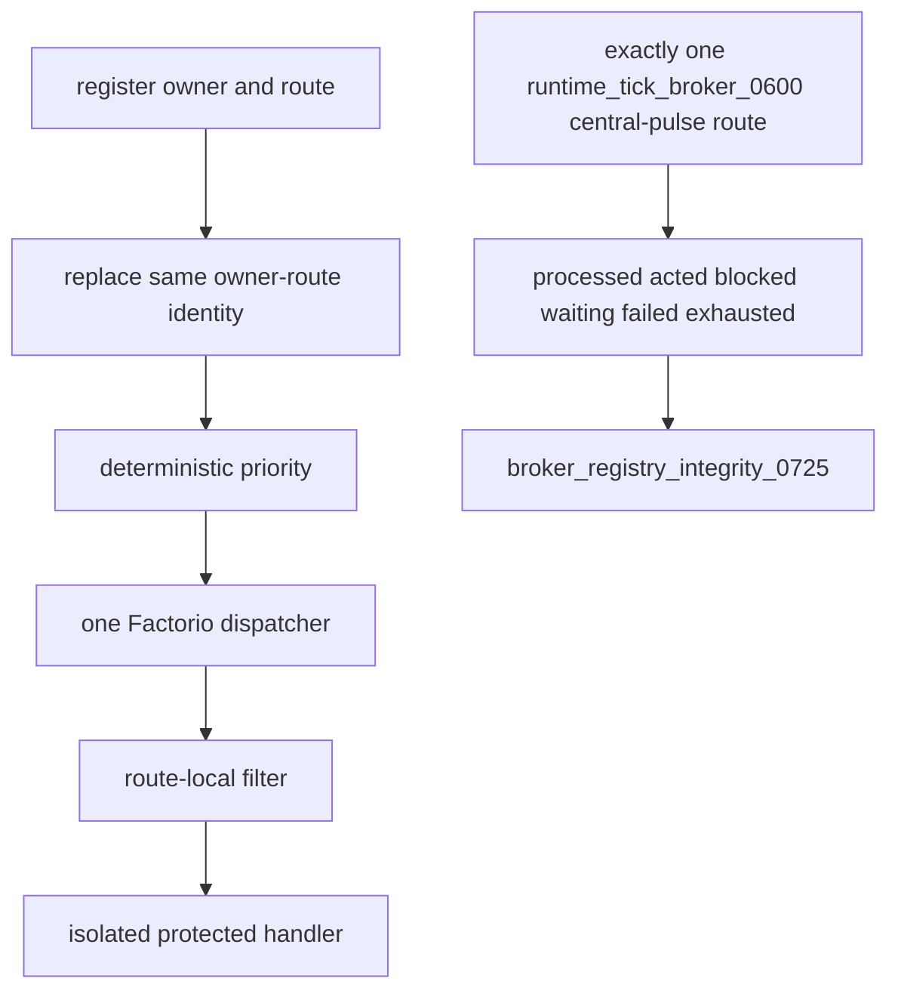

Numeric zero, `nil`, waiting, and blocked results are not actions. Service replacement preserves cadence. The broker audit requires one correctly owned central route and a complete broker installation ledger.

## Stage 3 — Canonical Behavioral Authority

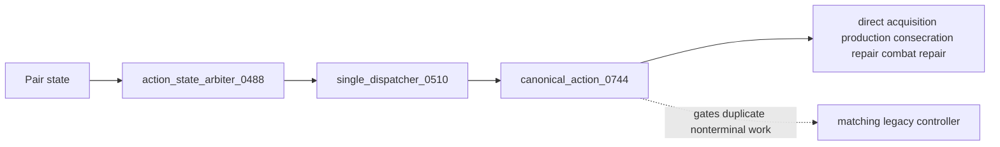

The classifier owns no timer, movement request, task clearing, order mutation, pair target write, or pair mode write.

## Stage 4 — Static Pressure Protection

`audit_ups_hotspots_0743.py` compares periodic routes, fast routes, risky scans, direct commands, rewrite sites, and pair mode/target writes against the frozen pre-recovery baseline. A non-regressing static surface is not runtime profiler evidence.

## Stage 5 — Evidence and Release Boundary

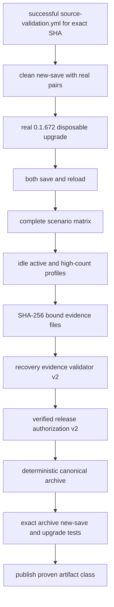

Authorization revalidates the bound evidence directory and manifest digest at packaging time. Protected `0.1.672`, absent authorization, rejected evidence, or mixed source identity blocks packaging.

## Remaining Recovery Defect Fronts

1. Obtain a successful complete source-validation run against one exact current SHA.
2. Repair every retained hardener that fails the literal-true install contract.
3. Remove any remaining direct periodic route or synthetic-success result in retained authorities.
4. Execute new-save, real `0.1.672` upgrade, configuration-change, and both reloads.
5. Execute Stage 1 transaction, queue, consecration, acquisition, and proxy-ammunition scenarios.
6. Prove event ordering, broker ownership, hardener completion, canonical-action agreement, and fairness.
7. Validate specialized machine, storage, item, energy, silo, artillery, roboport, fluid, turret, combat, overlap, ordinary movement, and Void movement behavior.
8. Capture idle, active, and high-count profiler evidence.
9. Validate the digest-bound evidence directory, authorize a qualified version, package deterministically, and repeat tests against the exact archive.

No runtime, migration, save/load, behavioral, profiler, package, or release success is claimed by this map.
